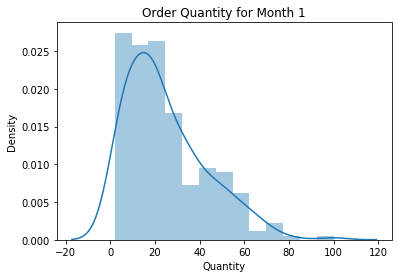

# Mod 3 Final Project

## Student Info

- Name: Steve Newman
- Cohort: 10/7/19 Part Time
- Instructor: James Irving PhD


For this project I will employ hypothesis testing using statistical testing techniques in order to assist the company Norhtwind improve it's marketing and sales initiatives.  


# Questions to Answer

H1 Does discount amount have a statistically significant effect on order quantity? If so, at what level(s) of discount?

H2 Do order quantities of countries differ when discounted?

H3 Does purchase month have an effect on quantity per order?

H4 Does region have an effect on quantity per order?

### Import Libraries


```python
 !pip install -U fsds_100719
 from fsds_100719.imports import *

import pandas as pd
from functions import Cohen_d, find_outliers_IQR,find_outliers_Z
import scipy.stats as stats
from statsmodels.stats.multicomp import pairwise_tukeyhsd
import functions as fn

## Uncomment the line below to see the source code for the imported functions
# fs.ihelp(Cohen_d,False),fs.ihelp(find_outliers_IQR,False), fs.ihelp(find_outliers_Z,False)
```

    Requirement already up-to-date: fsds_100719 in /Users/srn/anaconda3/envs/learn-env/lib/python3.6/site-packages (0.7.16)
    Requirement already satisfied, skipping upgrade: scikit-learn>=0.22.1 in /Users/srn/anaconda3/envs/learn-env/lib/python3.6/site-packages (from fsds_100719) (0.22.1)
    Requirement already satisfied, skipping upgrade: pandas in /Users/srn/anaconda3/envs/learn-env/lib/python3.6/site-packages (from fsds_100719) (0.25.1)
    Requirement already satisfied, skipping upgrade: seaborn in /Users/srn/anaconda3/envs/learn-env/lib/python3.6/site-packages (from fsds_100719) (0.9.0)
    Requirement already satisfied, skipping upgrade: pprint in /Users/srn/anaconda3/envs/learn-env/lib/python3.6/site-packages (from fsds_100719) (0.1)
    Requirement already satisfied, skipping upgrade: fake-useragent in /Users/srn/anaconda3/envs/learn-env/lib/python3.6/site-packages (from fsds_100719) (0.1.11)
    Requirement already satisfied, skipping upgrade: numpy>=1.18 in /Users/srn/anaconda3/envs/learn-env/lib/python3.6/site-packages (from fsds_100719) (1.18.1)
    Requirement already satisfied, skipping upgrade: tzlocal in /Users/srn/anaconda3/envs/learn-env/lib/python3.6/site-packages (from fsds_100719) (2.0.0)
    Requirement already satisfied, skipping upgrade: wordcloud in /Users/srn/anaconda3/envs/learn-env/lib/python3.6/site-packages (from fsds_100719) (1.6.0)
    Requirement already satisfied, skipping upgrade: missingno in /Users/srn/anaconda3/envs/learn-env/lib/python3.6/site-packages (from fsds_100719) (0.4.2)
    Requirement already satisfied, skipping upgrade: matplotlib in /Users/srn/anaconda3/envs/learn-env/lib/python3.6/site-packages (from fsds_100719) (3.1.1)
    Requirement already satisfied, skipping upgrade: pyperclip in /Users/srn/anaconda3/envs/learn-env/lib/python3.6/site-packages (from fsds_100719) (1.7.0)
    Requirement already satisfied, skipping upgrade: scipy in /Users/srn/anaconda3/envs/learn-env/lib/python3.6/site-packages (from fsds_100719) (1.3.1)
    Requirement already satisfied, skipping upgrade: lxml in /Users/srn/anaconda3/envs/learn-env/lib/python3.6/site-packages (from fsds_100719) (4.4.1)
    Requirement already satisfied, skipping upgrade: pandas-profiling in /Users/srn/anaconda3/envs/learn-env/lib/python3.6/site-packages (from fsds_100719) (2.3.0)
    Requirement already satisfied, skipping upgrade: selenium in /Users/srn/anaconda3/envs/learn-env/lib/python3.6/site-packages (from fsds_100719) (3.141.0)
    Requirement already satisfied, skipping upgrade: IPython in /Users/srn/anaconda3/envs/learn-env/lib/python3.6/site-packages (from fsds_100719) (7.8.0)
    Requirement already satisfied, skipping upgrade: cufflinks in /Users/srn/anaconda3/envs/learn-env/lib/python3.6/site-packages (from fsds_100719) (0.17.0)
    Requirement already satisfied, skipping upgrade: ipywidgets in /Users/srn/anaconda3/envs/learn-env/lib/python3.6/site-packages (from fsds_100719) (7.5.1)
    Requirement already satisfied, skipping upgrade: joblib>=0.11 in /Users/srn/anaconda3/envs/learn-env/lib/python3.6/site-packages (from scikit-learn>=0.22.1->fsds_100719) (0.13.2)
    Requirement already satisfied, skipping upgrade: python-dateutil>=2.6.1 in /Users/srn/anaconda3/envs/learn-env/lib/python3.6/site-packages (from pandas->fsds_100719) (2.8.0)
    Requirement already satisfied, skipping upgrade: pytz>=2017.2 in /Users/srn/anaconda3/envs/learn-env/lib/python3.6/site-packages (from pandas->fsds_100719) (2019.2)
    Requirement already satisfied, skipping upgrade: pillow in /Users/srn/anaconda3/envs/learn-env/lib/python3.6/site-packages (from wordcloud->fsds_100719) (6.1.0)
    Requirement already satisfied, skipping upgrade: cycler>=0.10 in /Users/srn/anaconda3/envs/learn-env/lib/python3.6/site-packages (from matplotlib->fsds_100719) (0.10.0)
    Requirement already satisfied, skipping upgrade: kiwisolver>=1.0.1 in /Users/srn/anaconda3/envs/learn-env/lib/python3.6/site-packages (from matplotlib->fsds_100719) (1.1.0)
    Requirement already satisfied, skipping upgrade: pyparsing!=2.0.4,!=2.1.2,!=2.1.6,>=2.0.1 in /Users/srn/anaconda3/envs/learn-env/lib/python3.6/site-packages (from matplotlib->fsds_100719) (2.4.2)
    Requirement already satisfied, skipping upgrade: phik>=0.9.8 in /Users/srn/anaconda3/envs/learn-env/lib/python3.6/site-packages (from pandas-profiling->fsds_100719) (0.9.8)
    Requirement already satisfied, skipping upgrade: confuse>=1.0.0 in /Users/srn/anaconda3/envs/learn-env/lib/python3.6/site-packages (from pandas-profiling->fsds_100719) (1.0.0)
    Requirement already satisfied, skipping upgrade: astropy in /Users/srn/anaconda3/envs/learn-env/lib/python3.6/site-packages (from pandas-profiling->fsds_100719) (3.2.3)
    Requirement already satisfied, skipping upgrade: jinja2>=2.8 in /Users/srn/anaconda3/envs/learn-env/lib/python3.6/site-packages (from pandas-profiling->fsds_100719) (2.10.1)
    Requirement already satisfied, skipping upgrade: htmlmin>=0.1.12 in /Users/srn/anaconda3/envs/learn-env/lib/python3.6/site-packages (from pandas-profiling->fsds_100719) (0.1.12)
    Requirement already satisfied, skipping upgrade: urllib3 in /Users/srn/anaconda3/envs/learn-env/lib/python3.6/site-packages (from selenium->fsds_100719) (1.24.2)
    Requirement already satisfied, skipping upgrade: decorator in /Users/srn/anaconda3/envs/learn-env/lib/python3.6/site-packages (from IPython->fsds_100719) (4.4.0)
    Requirement already satisfied, skipping upgrade: prompt-toolkit<2.1.0,>=2.0.0 in /Users/srn/anaconda3/envs/learn-env/lib/python3.6/site-packages (from IPython->fsds_100719) (2.0.9)
    Requirement already satisfied, skipping upgrade: traitlets>=4.2 in /Users/srn/anaconda3/envs/learn-env/lib/python3.6/site-packages (from IPython->fsds_100719) (4.3.2)
    Requirement already satisfied, skipping upgrade: backcall in /Users/srn/anaconda3/envs/learn-env/lib/python3.6/site-packages (from IPython->fsds_100719) (0.1.0)
    Requirement already satisfied, skipping upgrade: jedi>=0.10 in /Users/srn/anaconda3/envs/learn-env/lib/python3.6/site-packages (from IPython->fsds_100719) (0.15.1)
    Requirement already satisfied, skipping upgrade: setuptools>=18.5 in /Users/srn/anaconda3/envs/learn-env/lib/python3.6/site-packages (from IPython->fsds_100719) (41.2.0)
    Requirement already satisfied, skipping upgrade: pygments in /Users/srn/anaconda3/envs/learn-env/lib/python3.6/site-packages (from IPython->fsds_100719) (2.4.2)
    Requirement already satisfied, skipping upgrade: appnope; sys_platform == "darwin" in /Users/srn/anaconda3/envs/learn-env/lib/python3.6/site-packages (from IPython->fsds_100719) (0.1.0)
    Requirement already satisfied, skipping upgrade: pickleshare in /Users/srn/anaconda3/envs/learn-env/lib/python3.6/site-packages (from IPython->fsds_100719) (0.7.5)
    Requirement already satisfied, skipping upgrade: pexpect; sys_platform != "win32" in /Users/srn/anaconda3/envs/learn-env/lib/python3.6/site-packages (from IPython->fsds_100719) (4.7.0)
    Requirement already satisfied, skipping upgrade: plotly>=4.1.1 in /Users/srn/anaconda3/envs/learn-env/lib/python3.6/site-packages (from cufflinks->fsds_100719) (4.1.1)
    Requirement already satisfied, skipping upgrade: chart-studio>=1.0.0 in /Users/srn/anaconda3/envs/learn-env/lib/python3.6/site-packages (from cufflinks->fsds_100719) (1.0.0)
    Requirement already satisfied, skipping upgrade: six>=1.9.0 in /Users/srn/anaconda3/envs/learn-env/lib/python3.6/site-packages (from cufflinks->fsds_100719) (1.12.0)
    Requirement already satisfied, skipping upgrade: colorlover>=0.2.1 in /Users/srn/anaconda3/envs/learn-env/lib/python3.6/site-packages (from cufflinks->fsds_100719) (0.3.0)
    Requirement already satisfied, skipping upgrade: nbformat>=4.2.0 in /Users/srn/anaconda3/envs/learn-env/lib/python3.6/site-packages (from ipywidgets->fsds_100719) (4.4.0)
    Requirement already satisfied, skipping upgrade: ipykernel>=4.5.1 in /Users/srn/anaconda3/envs/learn-env/lib/python3.6/site-packages (from ipywidgets->fsds_100719) (5.1.2)
    Requirement already satisfied, skipping upgrade: widgetsnbextension~=3.5.0 in /Users/srn/anaconda3/envs/learn-env/lib/python3.6/site-packages (from ipywidgets->fsds_100719) (3.5.1)
    Requirement already satisfied, skipping upgrade: pytest>=4.0.2 in /Users/srn/anaconda3/envs/learn-env/lib/python3.6/site-packages (from phik>=0.9.8->pandas-profiling->fsds_100719) (5.3.0)
    Requirement already satisfied, skipping upgrade: pytest-pylint>=0.13.0 in /Users/srn/anaconda3/envs/learn-env/lib/python3.6/site-packages (from phik>=0.9.8->pandas-profiling->fsds_100719) (0.14.1)
    Requirement already satisfied, skipping upgrade: nbconvert>=5.3.1 in /Users/srn/anaconda3/envs/learn-env/lib/python3.6/site-packages (from phik>=0.9.8->pandas-profiling->fsds_100719) (5.5.0)
    Requirement already satisfied, skipping upgrade: numba>=0.38.1 in /Users/srn/anaconda3/envs/learn-env/lib/python3.6/site-packages (from phik>=0.9.8->pandas-profiling->fsds_100719) (0.46.0)
    Requirement already satisfied, skipping upgrade: jupyter-client>=5.2.3 in /Users/srn/anaconda3/envs/learn-env/lib/python3.6/site-packages (from phik>=0.9.8->pandas-profiling->fsds_100719) (5.3.3)
    Requirement already satisfied, skipping upgrade: pyyaml in /Users/srn/anaconda3/envs/learn-env/lib/python3.6/site-packages (from confuse>=1.0.0->pandas-profiling->fsds_100719) (5.1.2)
    Requirement already satisfied, skipping upgrade: MarkupSafe>=0.23 in /Users/srn/anaconda3/envs/learn-env/lib/python3.6/site-packages (from jinja2>=2.8->pandas-profiling->fsds_100719) (1.1.1)
    Requirement already satisfied, skipping upgrade: wcwidth in /Users/srn/anaconda3/envs/learn-env/lib/python3.6/site-packages (from prompt-toolkit<2.1.0,>=2.0.0->IPython->fsds_100719) (0.1.7)
    Requirement already satisfied, skipping upgrade: ipython_genutils in /Users/srn/anaconda3/envs/learn-env/lib/python3.6/site-packages (from traitlets>=4.2->IPython->fsds_100719) (0.2.0)
    Requirement already satisfied, skipping upgrade: parso>=0.5.0 in /Users/srn/anaconda3/envs/learn-env/lib/python3.6/site-packages (from jedi>=0.10->IPython->fsds_100719) (0.5.1)
    Requirement already satisfied, skipping upgrade: ptyprocess>=0.5 in /Users/srn/anaconda3/envs/learn-env/lib/python3.6/site-packages (from pexpect; sys_platform != "win32"->IPython->fsds_100719) (0.6.0)
    Requirement already satisfied, skipping upgrade: retrying>=1.3.3 in /Users/srn/anaconda3/envs/learn-env/lib/python3.6/site-packages (from plotly>=4.1.1->cufflinks->fsds_100719) (1.3.3)
    Requirement already satisfied, skipping upgrade: requests in /Users/srn/anaconda3/envs/learn-env/lib/python3.6/site-packages (from chart-studio>=1.0.0->cufflinks->fsds_100719) (2.22.0)
    Requirement already satisfied, skipping upgrade: jsonschema!=2.5.0,>=2.4 in /Users/srn/anaconda3/envs/learn-env/lib/python3.6/site-packages (from nbformat>=4.2.0->ipywidgets->fsds_100719) (3.0.2)
    Requirement already satisfied, skipping upgrade: jupyter_core in /Users/srn/anaconda3/envs/learn-env/lib/python3.6/site-packages (from nbformat>=4.2.0->ipywidgets->fsds_100719) (4.5.0)
    Requirement already satisfied, skipping upgrade: tornado>=4.2 in /Users/srn/anaconda3/envs/learn-env/lib/python3.6/site-packages (from ipykernel>=4.5.1->ipywidgets->fsds_100719) (6.0.3)
    Requirement already satisfied, skipping upgrade: notebook>=4.4.1 in /Users/srn/anaconda3/envs/learn-env/lib/python3.6/site-packages (from widgetsnbextension~=3.5.0->ipywidgets->fsds_100719) (5.7.8)
    Requirement already satisfied, skipping upgrade: more-itertools>=4.0.0 in /Users/srn/anaconda3/envs/learn-env/lib/python3.6/site-packages (from pytest>=4.0.2->phik>=0.9.8->pandas-profiling->fsds_100719) (7.0.0)
    Requirement already satisfied, skipping upgrade: py>=1.5.0 in /Users/srn/anaconda3/envs/learn-env/lib/python3.6/site-packages (from pytest>=4.0.2->phik>=0.9.8->pandas-profiling->fsds_100719) (1.8.0)
    Requirement already satisfied, skipping upgrade: packaging in /Users/srn/anaconda3/envs/learn-env/lib/python3.6/site-packages (from pytest>=4.0.2->phik>=0.9.8->pandas-profiling->fsds_100719) (19.2)
    Requirement already satisfied, skipping upgrade: pluggy<1.0,>=0.12 in /Users/srn/anaconda3/envs/learn-env/lib/python3.6/site-packages (from pytest>=4.0.2->phik>=0.9.8->pandas-profiling->fsds_100719) (0.12.0)
    Requirement already satisfied, skipping upgrade: attrs>=17.4.0 in /Users/srn/anaconda3/envs/learn-env/lib/python3.6/site-packages (from pytest>=4.0.2->phik>=0.9.8->pandas-profiling->fsds_100719) (19.1.0)
    Requirement already satisfied, skipping upgrade: importlib-metadata>=0.12; python_version < "3.8" in /Users/srn/anaconda3/envs/learn-env/lib/python3.6/site-packages (from pytest>=4.0.2->phik>=0.9.8->pandas-profiling->fsds_100719) (0.17)
    Requirement already satisfied, skipping upgrade: pylint>=1.4.5 in /Users/srn/anaconda3/envs/learn-env/lib/python3.6/site-packages (from pytest-pylint>=0.13.0->phik>=0.9.8->pandas-profiling->fsds_100719) (2.4.4)
    Requirement already satisfied, skipping upgrade: testpath in /Users/srn/anaconda3/envs/learn-env/lib/python3.6/site-packages (from nbconvert>=5.3.1->phik>=0.9.8->pandas-profiling->fsds_100719) (0.4.2)
    Requirement already satisfied, skipping upgrade: defusedxml in /Users/srn/anaconda3/envs/learn-env/lib/python3.6/site-packages (from nbconvert>=5.3.1->phik>=0.9.8->pandas-profiling->fsds_100719) (0.6.0)
    Requirement already satisfied, skipping upgrade: bleach in /Users/srn/anaconda3/envs/learn-env/lib/python3.6/site-packages (from nbconvert>=5.3.1->phik>=0.9.8->pandas-profiling->fsds_100719) (3.1.0)
    Requirement already satisfied, skipping upgrade: mistune>=0.8.1 in /Users/srn/anaconda3/envs/learn-env/lib/python3.6/site-packages (from nbconvert>=5.3.1->phik>=0.9.8->pandas-profiling->fsds_100719) (0.8.4)
    Requirement already satisfied, skipping upgrade: entrypoints>=0.2.2 in /Users/srn/anaconda3/envs/learn-env/lib/python3.6/site-packages (from nbconvert>=5.3.1->phik>=0.9.8->pandas-profiling->fsds_100719) (0.3)
    Requirement already satisfied, skipping upgrade: pandocfilters>=1.4.1 in /Users/srn/anaconda3/envs/learn-env/lib/python3.6/site-packages (from nbconvert>=5.3.1->phik>=0.9.8->pandas-profiling->fsds_100719) (1.4.2)
    Requirement already satisfied, skipping upgrade: llvmlite>=0.30.0dev0 in /Users/srn/anaconda3/envs/learn-env/lib/python3.6/site-packages (from numba>=0.38.1->phik>=0.9.8->pandas-profiling->fsds_100719) (0.30.0)
    Requirement already satisfied, skipping upgrade: pyzmq>=13 in /Users/srn/anaconda3/envs/learn-env/lib/python3.6/site-packages (from jupyter-client>=5.2.3->phik>=0.9.8->pandas-profiling->fsds_100719) (18.1.0)
    Requirement already satisfied, skipping upgrade: certifi>=2017.4.17 in /Users/srn/anaconda3/envs/learn-env/lib/python3.6/site-packages (from requests->chart-studio>=1.0.0->cufflinks->fsds_100719) (2019.11.28)
    Requirement already satisfied, skipping upgrade: idna<2.9,>=2.5 in /Users/srn/anaconda3/envs/learn-env/lib/python3.6/site-packages (from requests->chart-studio>=1.0.0->cufflinks->fsds_100719) (2.8)
    Requirement already satisfied, skipping upgrade: chardet<3.1.0,>=3.0.2 in /Users/srn/anaconda3/envs/learn-env/lib/python3.6/site-packages (from requests->chart-studio>=1.0.0->cufflinks->fsds_100719) (3.0.4)
    Requirement already satisfied, skipping upgrade: pyrsistent>=0.14.0 in /Users/srn/anaconda3/envs/learn-env/lib/python3.6/site-packages (from jsonschema!=2.5.0,>=2.4->nbformat>=4.2.0->ipywidgets->fsds_100719) (0.14.11)
    Requirement already satisfied, skipping upgrade: terminado>=0.8.1 in /Users/srn/anaconda3/envs/learn-env/lib/python3.6/site-packages (from notebook>=4.4.1->widgetsnbextension~=3.5.0->ipywidgets->fsds_100719) (0.8.2)
    Requirement already satisfied, skipping upgrade: Send2Trash in /Users/srn/anaconda3/envs/learn-env/lib/python3.6/site-packages (from notebook>=4.4.1->widgetsnbextension~=3.5.0->ipywidgets->fsds_100719) (1.5.0)
    Requirement already satisfied, skipping upgrade: prometheus-client in /Users/srn/anaconda3/envs/learn-env/lib/python3.6/site-packages (from notebook>=4.4.1->widgetsnbextension~=3.5.0->ipywidgets->fsds_100719) (0.7.1)
    Requirement already satisfied, skipping upgrade: zipp>=0.5 in /Users/srn/anaconda3/envs/learn-env/lib/python3.6/site-packages (from importlib-metadata>=0.12; python_version < "3.8"->pytest>=4.0.2->phik>=0.9.8->pandas-profiling->fsds_100719) (0.5.1)
    Requirement already satisfied, skipping upgrade: mccabe<0.7,>=0.6 in /Users/srn/anaconda3/envs/learn-env/lib/python3.6/site-packages (from pylint>=1.4.5->pytest-pylint>=0.13.0->phik>=0.9.8->pandas-profiling->fsds_100719) (0.6.1)
    Requirement already satisfied, skipping upgrade: isort<5,>=4.2.5 in /Users/srn/anaconda3/envs/learn-env/lib/python3.6/site-packages (from pylint>=1.4.5->pytest-pylint>=0.13.0->phik>=0.9.8->pandas-profiling->fsds_100719) (4.3.21)
    Requirement already satisfied, skipping upgrade: astroid<2.4,>=2.3.0 in /Users/srn/anaconda3/envs/learn-env/lib/python3.6/site-packages (from pylint>=1.4.5->pytest-pylint>=0.13.0->phik>=0.9.8->pandas-profiling->fsds_100719) (2.3.3)
    Requirement already satisfied, skipping upgrade: webencodings in /Users/srn/anaconda3/envs/learn-env/lib/python3.6/site-packages (from bleach->nbconvert>=5.3.1->phik>=0.9.8->pandas-profiling->fsds_100719) (0.5.1)
    Requirement already satisfied, skipping upgrade: typed-ast<1.5,>=1.4.0; implementation_name == "cpython" and python_version < "3.8" in /Users/srn/anaconda3/envs/learn-env/lib/python3.6/site-packages (from astroid<2.4,>=2.3.0->pylint>=1.4.5->pytest-pylint>=0.13.0->phik>=0.9.8->pandas-profiling->fsds_100719) (1.4.0)
    Requirement already satisfied, skipping upgrade: lazy-object-proxy==1.4.* in /Users/srn/anaconda3/envs/learn-env/lib/python3.6/site-packages (from astroid<2.4,>=2.3.0->pylint>=1.4.5->pytest-pylint>=0.13.0->phik>=0.9.8->pandas-profiling->fsds_100719) (1.4.3)
    Requirement already satisfied, skipping upgrade: wrapt==1.11.* in /Users/srn/anaconda3/envs/learn-env/lib/python3.6/site-packages (from astroid<2.4,>=2.3.0->pylint>=1.4.5->pytest-pylint>=0.13.0->phik>=0.9.8->pandas-profiling->fsds_100719) (1.11.2)


```python
import sqlite3
connect = sqlite3.connect('Northwind_small.sqlite')
cur = connect.cursor()
```


```python
cur.execute("""SELECT name FROM sqlite_master WHERE type='table';""")
df_tables = pd.DataFrame(cur.fetchall(), columns=['Table'])
df_tables
```


<div>
<style scoped>
    .dataframe tbody tr th:only-of-type {
        vertical-align: middle;
    }

    .dataframe tbody tr th {
        vertical-align: top;
    }

    .dataframe thead th {
        text-align: right;
    }
</style>
<table border="1" class="dataframe">
  <thead>
    <tr style="text-align: right;">
      <th></th>
      <th>Table</th>
    </tr>
  </thead>
  <tbody>
    <tr>
      <td>0</td>
      <td>Employee</td>
    </tr>
    <tr>
      <td>1</td>
      <td>Category</td>
    </tr>
    <tr>
      <td>2</td>
      <td>Customer</td>
    </tr>
    <tr>
      <td>3</td>
      <td>Shipper</td>
    </tr>
    <tr>
      <td>4</td>
      <td>Supplier</td>
    </tr>
    <tr>
      <td>5</td>
      <td>Order</td>
    </tr>
    <tr>
      <td>6</td>
      <td>Product</td>
    </tr>
    <tr>
      <td>7</td>
      <td>OrderDetail</td>
    </tr>
    <tr>
      <td>8</td>
      <td>CustomerCustomerDemo</td>
    </tr>
    <tr>
      <td>9</td>
      <td>CustomerDemographic</td>
    </tr>
    <tr>
      <td>10</td>
      <td>Region</td>
    </tr>
    <tr>
      <td>11</td>
      <td>Territory</td>
    </tr>
    <tr>
      <td>12</td>
      <td>EmployeeTerritory</td>
    </tr>
  </tbody>
</table>
</div>


# HYPOTHESIS 1

> ***Does discount amount have a statistically significant effect on the quantity of a product in an order? If so, at what level(s) of discount?***

- $H_0$: A discount does not effect the quantity of a product in an order.
- $H_1$: A discount does effect the quantity of a product in an order.


```python
cur.execute("""SELECT * FROM OrderDetail """)
names = [description[0] for description in cur.description]
df_OrderDetail = pd.DataFrame(cur.fetchall(), columns = names)
df_OrderDetail
```


<div>
<style scoped>
    .dataframe tbody tr th:only-of-type {
        vertical-align: middle;
    }

    .dataframe tbody tr th {
        vertical-align: top;
    }

    .dataframe thead th {
        text-align: right;
    }
</style>
<table border="1" class="dataframe">
  <thead>
    <tr style="text-align: right;">
      <th></th>
      <th>Id</th>
      <th>OrderId</th>
      <th>ProductId</th>
      <th>UnitPrice</th>
      <th>Quantity</th>
      <th>Discount</th>
    </tr>
  </thead>
  <tbody>
    <tr>
      <td>0</td>
      <td>10248/11</td>
      <td>10248</td>
      <td>11</td>
      <td>14.00</td>
      <td>12</td>
      <td>0.00</td>
    </tr>
    <tr>
      <td>1</td>
      <td>10248/42</td>
      <td>10248</td>
      <td>42</td>
      <td>9.80</td>
      <td>10</td>
      <td>0.00</td>
    </tr>
    <tr>
      <td>2</td>
      <td>10248/72</td>
      <td>10248</td>
      <td>72</td>
      <td>34.80</td>
      <td>5</td>
      <td>0.00</td>
    </tr>
    <tr>
      <td>3</td>
      <td>10249/14</td>
      <td>10249</td>
      <td>14</td>
      <td>18.60</td>
      <td>9</td>
      <td>0.00</td>
    </tr>
    <tr>
      <td>4</td>
      <td>10249/51</td>
      <td>10249</td>
      <td>51</td>
      <td>42.40</td>
      <td>40</td>
      <td>0.00</td>
    </tr>
    <tr>
      <td>...</td>
      <td>...</td>
      <td>...</td>
      <td>...</td>
      <td>...</td>
      <td>...</td>
      <td>...</td>
    </tr>
    <tr>
      <td>2150</td>
      <td>11077/64</td>
      <td>11077</td>
      <td>64</td>
      <td>33.25</td>
      <td>2</td>
      <td>0.03</td>
    </tr>
    <tr>
      <td>2151</td>
      <td>11077/66</td>
      <td>11077</td>
      <td>66</td>
      <td>17.00</td>
      <td>1</td>
      <td>0.00</td>
    </tr>
    <tr>
      <td>2152</td>
      <td>11077/73</td>
      <td>11077</td>
      <td>73</td>
      <td>15.00</td>
      <td>2</td>
      <td>0.01</td>
    </tr>
    <tr>
      <td>2153</td>
      <td>11077/75</td>
      <td>11077</td>
      <td>75</td>
      <td>7.75</td>
      <td>4</td>
      <td>0.00</td>
    </tr>
    <tr>
      <td>2154</td>
      <td>11077/77</td>
      <td>11077</td>
      <td>77</td>
      <td>13.00</td>
      <td>2</td>
      <td>0.00</td>
    </tr>
  </tbody>
</table>
<p>2155 rows × 6 columns</p>
</div>


## Determine if data is numerical or categorical


```python
# Data is numerical.
# Find quantity of discounted orders by discount amount.

df_OrderDetail['Discount'].value_counts()
```


    0.00    1317
    0.05     185
    0.10     173
    0.20     161
    0.15     157
    0.25     154
    0.03       3
    0.02       2
    0.01       1
    0.04       1
    0.06       1
    Name: Discount, dtype: int64


## Determine how many groups to compare to establish which test to use.

### Two groups are being compared; use the 2 Sample T-Test.


```python
# Assign 'Discounted' and 'Full Price' to 'groups' column.
# Assign '0' to 'Full Price' and '1' to 'Discounted' in the 'group_num' column.

df_OrderDetail['groups'] = df_OrderDetail['Discount'] >0 
df_OrderDetail['groups'] = df_OrderDetail['groups'].map({True:'Discounted', False:'Full Price'})
df_OrderDetail['group_num'] = df_OrderDetail['groups'].map({'Discounted':1,"Full Price": 0})

df_OrderDetail
```


<div>
<style scoped>
    .dataframe tbody tr th:only-of-type {
        vertical-align: middle;
    }

    .dataframe tbody tr th {
        vertical-align: top;
    }

    .dataframe thead th {
        text-align: right;
    }
</style>
<table border="1" class="dataframe">
  <thead>
    <tr style="text-align: right;">
      <th></th>
      <th>Id</th>
      <th>OrderId</th>
      <th>ProductId</th>
      <th>UnitPrice</th>
      <th>Quantity</th>
      <th>Discount</th>
      <th>groups</th>
      <th>group_num</th>
    </tr>
  </thead>
  <tbody>
    <tr>
      <td>0</td>
      <td>10248/11</td>
      <td>10248</td>
      <td>11</td>
      <td>14.00</td>
      <td>12</td>
      <td>0.00</td>
      <td>Full Price</td>
      <td>0</td>
    </tr>
    <tr>
      <td>1</td>
      <td>10248/42</td>
      <td>10248</td>
      <td>42</td>
      <td>9.80</td>
      <td>10</td>
      <td>0.00</td>
      <td>Full Price</td>
      <td>0</td>
    </tr>
    <tr>
      <td>2</td>
      <td>10248/72</td>
      <td>10248</td>
      <td>72</td>
      <td>34.80</td>
      <td>5</td>
      <td>0.00</td>
      <td>Full Price</td>
      <td>0</td>
    </tr>
    <tr>
      <td>3</td>
      <td>10249/14</td>
      <td>10249</td>
      <td>14</td>
      <td>18.60</td>
      <td>9</td>
      <td>0.00</td>
      <td>Full Price</td>
      <td>0</td>
    </tr>
    <tr>
      <td>4</td>
      <td>10249/51</td>
      <td>10249</td>
      <td>51</td>
      <td>42.40</td>
      <td>40</td>
      <td>0.00</td>
      <td>Full Price</td>
      <td>0</td>
    </tr>
    <tr>
      <td>...</td>
      <td>...</td>
      <td>...</td>
      <td>...</td>
      <td>...</td>
      <td>...</td>
      <td>...</td>
      <td>...</td>
      <td>...</td>
    </tr>
    <tr>
      <td>2150</td>
      <td>11077/64</td>
      <td>11077</td>
      <td>64</td>
      <td>33.25</td>
      <td>2</td>
      <td>0.03</td>
      <td>Discounted</td>
      <td>1</td>
    </tr>
    <tr>
      <td>2151</td>
      <td>11077/66</td>
      <td>11077</td>
      <td>66</td>
      <td>17.00</td>
      <td>1</td>
      <td>0.00</td>
      <td>Full Price</td>
      <td>0</td>
    </tr>
    <tr>
      <td>2152</td>
      <td>11077/73</td>
      <td>11077</td>
      <td>73</td>
      <td>15.00</td>
      <td>2</td>
      <td>0.01</td>
      <td>Discounted</td>
      <td>1</td>
    </tr>
    <tr>
      <td>2153</td>
      <td>11077/75</td>
      <td>11077</td>
      <td>75</td>
      <td>7.75</td>
      <td>4</td>
      <td>0.00</td>
      <td>Full Price</td>
      <td>0</td>
    </tr>
    <tr>
      <td>2154</td>
      <td>11077/77</td>
      <td>11077</td>
      <td>77</td>
      <td>13.00</td>
      <td>2</td>
      <td>0.00</td>
      <td>Full Price</td>
      <td>0</td>
    </tr>
  </tbody>
</table>
<p>2155 rows × 8 columns</p>
</div>


### Check data to see if it meets test assumptions.


```python
# View barplot to see if the categories are statistically different and compare standard error of the mean.
# Discounted products sold in larger quantities.

sns.barplot(data=df_OrderDetail, x='groups', y='Quantity', ci=68 )
```


    <matplotlib.axes._subplots.AxesSubplot at 0x1c21a5cf60>


```python
# Create 'grps' dictionary to seperate 'quantity' into 'Full Price' and 'Discounted' categories.

grps = {}
for grp_name in df_OrderDetail['groups'].unique():
    grps[grp_name] = df_OrderDetail.groupby('groups').get_group(grp_name)['Quantity']
grps
```


    {'Full Price': 0       12
     1       10
     2        5
     3        9
     4       40
             ..
     2147     2
     2148     2
     2151     1
     2153     4
     2154     2
     Name: Quantity, Length: 1317, dtype: int64, 'Discounted': 6        35
     7        15
     8         6
     9        15
     11       40
     12       25
     17       15
     18       21
     29       50
     30       65
     31        6
     34       16
     36       15
     37       21
     40       12
     43       60
     45       60
     46       36
     48       25
     51       12
     53       70
     54       15
     57       60
     58       20
     65       24
     66       15
     68       60
     69       33
     72       12
     73        6
     82       15
     95       15
     97       20
     98        5
     99       45
     100      40
     101      36
     104      40
     106      15
     107      10
     108       3
     115      20
     116      24
     117       2
     135      40
     136      30
     147      40
     148      30
     149      15
     153      25
     154      25
     155      30
     177      40
     178      30
     179      25
     196      21
     197      70
     199      40
     200      80
     209      25
     210      50
     211      35
     212      30
     216      10
     217       8
     218      20
     219      12
     220      50
     221      25
     223      40
     224      10
     225      16
     227      10
     228      40
     231       7
     232      25
     233       6
     234      48
     235      18
     244      70
     246      20
     247      12
     248      40
     250       9
     251      24
     252      56
     253      40
     254      40
     256       4
     259      70
     263      36
     266      50
     268       6
     269      15
     272      15
     273      18
     274      20
     276      77
     277      10
     279      20
     280      12
     281      50
     289      30
     291       8
     292      10
     293      10
     294      20
     295      56
     296      70
     297      80
     303      54
     304      55
     320       5
     321      13
     323      35
     325      18
     326      15
     328      20
     329       6
     330      12
     331      40
     332      70
     333      42
     334      80
     335      50
     340      42
     341      20
     342      20
     344       8
     345      16
     346      20
     347      18
     348      20
     349       6
     362      10
     363      20
     364       8
     371      15
     372      20
     378      60
     379      40
     381      24
     384      25
     385      42
     386       7
     387      70
     391      28
     392      70
     397      10
     398      18
     400     120
     414      21
     415      70
     416      30
     417      40
     418      30
     421      30
     422      42
     423       5
     424       2
     435      25
     436      40
     437       9
     438      20
     442      18
     450       2
     451      36
     457      60
     458      20
     459      20
     460       2
     461       8
     462      20
     463       4
     465      15
     466      10
     470      60
     471      49
     472      30
     473      10
     474      20
     480      35
     481      45
     484      70
     485      50
     486      50
     487      30
     492      18
     497      40
     498      30
     499      24
     501      15
     502      20
     503      15
     508      45
     509      49
     510      24
     511      90
     516       6
     524      12
     525      20
     526       3
     527      15
     536      20
     537       6
     538     120
     539      35
     540      28
     541      55
     543     100
     544      15
     545      25
     546      20
     547      20
     548      10
     553      40
     554      21
     561      16
     562      20
     564      21
     565       4
     566      40
     567      28
     568      60
     573      16
     575      30
     578      18
     580      30
     588      40
     589      35
     590       2
     596      80
     604      35
     605      60
     606      42
     607       2
     610      21
     611      20
     612      20
     622      35
     623      30
     627      20
     628      20
     629      30
     630      60
     636      24
     638      20
     639      15
     644      15
     645       7
     646      60
     647      20
     648      15
     649      10
     650      10
     655      20
     664      12
     665       8
     677      18
     678      14
     679      15
     680      15
     685      36
     686      50
     687      50
     688      10
     689      10
     690       9
     691       6
     692      12
     693      40
     694      50
     695      15
     701      16
     704      16
     705      84
     706      25
     707      80
     715      16
     717      10
     723      40
     725      20
     726      25
     727      25
     728      15
     729      18
     730       6
     736      15
     737       8
     739      30
     740      50
     741      30
     743       8
     755      50
     757      24
     759      10
     760      10
     761      50
     762      10
     763       5
     764      15
     765      15
     768      35
     784      35
     785       4
     786      36
     787       9
     788      15
     789      24
     790      30
     791      70
     798      24
     800      10
     802      55
     803     100
     804      48
     805       8
     807       6
     808      10
     809      40
     810      20
     819      30
     820      20
     821      20
     822      10
     823      30
     824      35
     825      18
     826      20
     827      40
     836      12
     837      18
     839      15
     842      20
     843      10
     846      16
     847       6
     848      25
     849      25
     850      18
     851      35
     852      18
     854      60
     856      40
     858      35
     860      15
     861      60
     862      11
     863      28
     864      12
     865      10
     867      15
     889      15
     890       9
     891      30
     892      50
     896      24
     897      10
     898      50
     900       4
     904      40
     905     100
     908      60
     912      25
     913       5
     914      21
     915      20
     916       4
     919      30
     920     120
     921      65
     922       5
     923      24
     924      30
     925      35
     927      12
     935       5
     937      25
     938       6
     939      10
     940      30
     941      20
     942      70
     943      15
     944      20
     945      20
     946      10
     956      21
     965       8
     971      15
     973      15
     974      15
     975      30
     988      18
     990      15
     991      25
     993      30
     1004     35
     1008     12
     1010      8
     1011     30
     1012     20
     1013     36
     1014     13
     1015     35
     1016     80
     1021     10
     1022     15
     1027     25
     1028     60
     1033     20
     1034     15
     1037     30
     1038     20
     1039     15
     1040     21
     1041      2
     1042      4
     1044     21
     1047     15
     1048     18
     1049     30
     1050     35
     1054     15
     1058     25
     1060     12
     1061     20
     1062      2
     1064     30
     1065     20
     1066     12
     1067     20
     1068      6
     1069     20
     1070      3
     1071     28
     1072      6
     1080     70
     1081     55
     1082     70
     1083     20
     1084     24
     1085     40
     1087      3
     1088     49
     1090     30
     1091     30
     1092     20
     1093     24
     1094     12
     1095     15
     1101     45
     1102     14
     1103      8
     1104      4
     1105     15
     1115     15
     1127     30
     1128      8
     1134     50
     1135     20
     1136     40
     1137     30
     1138     12
     1150     30
     1152     50
     1154      6
     1155     18
     1156     60
     1158     35
     1159     20
     1160     30
     1168     60
     1169     30
     1170     15
     1179      7
     1180      9
     1181     30
     1182     30
     1184      8
     1185     12
     1186     65
     1187      8
     1189      5
     1190     12
     1191     40
     1192     60
     1193     42
     1194     20
     1195     35
     1211     28
     1222      3
     1228     30
     1229     27
     1230     50
     1231     18
     1232     12
     1238     32
     1240     25
     1245     12
     1246      3
     1247     40
     1250     50
     1263     20
     1264     10
     1265     10
     1273     15
     1274      3
     1275     10
     1276     40
     1277     30
     1285     20
     1286      2
     1294      5
     1295     35
     1296     40
     1297     14
     1298     15
     1302     28
     1303     50
     1322      5
     1323     40
     1324     25
     1325     12
     1327     20
     1334     30
     1335     30
     1336     14
     1337     25
     1338     21
     1339     20
     1340      6
     1341     20
     1350     12
     1352     30
     1353     35
     1362     20
     1363    130
     1364     80
     1373     30
     1374     15
     1377     15
     1382     70
     1383      7
     1384      2
     1388     16
     1389     12
     1390     27
     1391    120
     1392     20
     1398      3
     1399     20
     1405      2
     1406     30
     1409     30
     1410     15
     1411     42
     1412     15
     1413     20
     1414     50
     1415     40
     1420      3
     1421     20
     1422     14
     1423     20
     1429     15
     1430      6
     1432     35
     1433     21
     1435     35
     1436     24
     1440     20
     1441     20
     1443     50
     1444     10
     1445      7
     1446     40
     1447     20
     1448     25
     1449     30
     1450     60
     1451      5
     1452     24
     1453     15
     1454     15
     1457      4
     1460     20
     1462     15
     1464     20
     1465     50
     1473     16
     1474     40
     1476     12
     1479     20
     1480      8
     1481     30
     1483     30
     1484     20
     1485     40
     1487     60
     1488     25
     1498     20
     1500     40
     1501     15
     1524      3
     1525     10
     1526     16
     1528     20
     1529      9
     1530      9
     1531      8
     1532     20
     1534      2
     1542     40
     1543     21
     1544      4
     1545     25
     1546     50
     1547     30
     1548     15
     1549      6
     1550     10
     1559      4
     1561     70
     1562     25
     1563     42
     1564     60
     1569     80
     1570     12
     1571     60
     1572     36
     1573     45
     1574     55
     1578     18
     1579     20
     1580      4
     1581     30
     1582      5
     1583     10
     1584     10
     1585     42
     1590    100
     1591     65
     1595     15
     1599     35
     1600     10
     1604     40
     1605     35
     1606     30
     1616     20
     1617     12
     1620     60
     1621     80
     1622     21
     1623      6
     1624     40
     1628     42
     1635     50
     1636     12
     1637     16
     1638     10
     1639     20
     1640     15
     1641     21
     1646     21
     1650     30
     1652     20
     1656     30
     1657     30
     1658     50
     1661     20
     1662     32
     1664     40
     1665     21
     1666     12
     1682     15
     1683     40
     1689     28
     1690     50
     1691    120
     1701      8
     1702      3
     1705     30
     1706      6
     1712     20
     1715     20
     1716     14
     1726     40
     1727     60
     1728     30
     1729     40
     1740     60
     1741     25
     1750     10
     1751     10
     1752     24
     1753     20
     1754     30
     1756     25
     1757     12
     1772     25
     1773     30
     1774     42
     1776     30
     1777     14
     1779     20
     1784      4
     1785      8
     1786     30
     1789     20
     1790     24
     1791     49
     1792     35
     1793     10
     1794     40
     1797     44
     1798     30
     1799     80
     1805      5
     1806     18
     1822     15
     1823      6
     1824     50
     1825     16
     1827     50
     1828     50
     1829     28
     1830     25
     1832     24
     1833     12
     1843     20
     1844     10
     1846      6
     1853      2
     1859     12
     1860     12
     1867     40
     1882     20
     1883     40
     1885      6
     1892     40
     1896     84
     1901     36
     1902      8
     1903     35
     1912     40
     1917     60
     1918     65
     1919     66
     1920     50
     1921     20
     1922     90
     1924     50
     1925     35
     1926     18
     1931     20
     1932     20
     1937     20
     1938     15
     1939     21
     1940     25
     1941     30
     1948     15
     1949     24
     1959      2
     1963     70
     1964     90
     1967     18
     1971     40
     1973     50
     1974     36
     1975     60
     1980     28
     1993     24
     1994     11
     1997     44
     2007     10
     2008     20
     2011     30
     2012     21
     2017    100
     2019     60
     2020    100
     2029     70
     2030     36
     2031     15
     2041      5
     2049     30
     2057     20
     2058     15
     2059     18
     2060     25
     2061     30
     2063     10
     2064      4
     2065     50
     2066     10
     2067     30
     2068     10
     2069     35
     2071     25
     2091     10
     2092     12
     2094     40
     2095     30
     2096     77
     2098     25
     2099      4
     2101      4
     2102     20
     2107      8
     2108     36
     2109     28
     2111     40
     2112     20
     2113     30
     2115     15
     2116     10
     2123     14
     2124     10
     2125     30
     2126      2
     2127     20
     2128     20
     2129     10
     2130     24
     2133      1
     2134      1
     2135      2
     2137      2
     2139      1
     2140      2
     2141      1
     2144      2
     2146      3
     2149      2
     2150      2
     2152      2
     Name: Quantity, dtype: int64}


### Check for outliers.


```python
# Show Distribution Plot of both groups to determine if normailty assumption is met.

for grp_name,grp_data in grps.items():
    sns.distplot(grp_data,label=grp_name)
    
    
ax= plt.gca()
ax.legend()
ax.set(title='Total Ordered by Discounted and Full Price Group', ylabel='Density')
```


    [Text(0, 0.5, 'Density'),
     Text(0.5, 1.0, 'Total Ordered by Discounted and Full Price Group')]


```python
orig_grps = grps.copy()
```


```python
# Identify how many outliers found in each group using Z-Scores and IQR.

for grp_name, grp_data in grps.items():
    idx_outs =find_outliers_Z(grp_data)
    print(f"Found {idx_outs.sum()} outliers in {grp_name} using Z-scores")
    grps[grp_name] = grp_data [~idx_outs]
    idx_outs =find_outliers_IQR(grp_data)

    print(f"Found {idx_outs.sum()} outliers in {grp_name} using IQR")
    print('\n')
```

    Found 20 outliers in Full Price using Z-scores
    Found 34 outliers in Full Price using IQR
    
    
    Found 15 outliers in Discounted using Z-scores
    Found 29 outliers in Discounted using IQR
    
    


```python
# Remove outliers.

grp_data [~idx_outs]
```


    6       35
    7       15
    8        6
    9       15
    11      40
    12      25
    17      15
    18      21
    29      50
    30      65
    31       6
    34      16
    36      15
    37      21
    40      12
    43      60
    45      60
    46      36
    48      25
    51      12
    53      70
    54      15
    57      60
    58      20
    65      24
    66      15
    68      60
    69      33
    72      12
    73       6
    82      15
    95      15
    97      20
    98       5
    99      45
    100     40
    101     36
    104     40
    106     15
    107     10
    108      3
    115     20
    116     24
    117      2
    135     40
    136     30
    147     40
    148     30
    149     15
    153     25
    154     25
    155     30
    177     40
    178     30
    179     25
    196     21
    197     70
    199     40
    209     25
    210     50
    211     35
    212     30
    216     10
    217      8
    218     20
    219     12
    220     50
    221     25
    223     40
    224     10
    225     16
    227     10
    228     40
    231      7
    232     25
    233      6
    234     48
    235     18
    244     70
    246     20
    247     12
    248     40
    250      9
    251     24
    252     56
    253     40
    254     40
    256      4
    259     70
    263     36
    266     50
    268      6
    269     15
    272     15
    273     18
    274     20
    277     10
    279     20
    280     12
    281     50
    289     30
    291      8
    292     10
    293     10
    294     20
    295     56
    296     70
    303     54
    304     55
    320      5
    321     13
    323     35
    325     18
    326     15
    328     20
    329      6
    330     12
    331     40
    332     70
    333     42
    335     50
    340     42
    341     20
    342     20
    344      8
    345     16
    346     20
    347     18
    348     20
    349      6
    362     10
    363     20
    364      8
    371     15
    372     20
    378     60
    379     40
    381     24
    384     25
    385     42
    386      7
    387     70
    391     28
    392     70
    397     10
    398     18
    414     21
    415     70
    416     30
    417     40
    418     30
    421     30
    422     42
    423      5
    424      2
    435     25
    436     40
    437      9
    438     20
    442     18
    450      2
    451     36
    457     60
    458     20
    459     20
    460      2
    461      8
    462     20
    463      4
    465     15
    466     10
    470     60
    471     49
    472     30
    473     10
    474     20
    480     35
    481     45
    484     70
    485     50
    486     50
    487     30
    492     18
    497     40
    498     30
    499     24
    501     15
    502     20
    503     15
    508     45
    509     49
    510     24
    516      6
    524     12
    525     20
    526      3
    527     15
    536     20
    537      6
    539     35
    540     28
    541     55
    544     15
    545     25
    546     20
    547     20
    548     10
    553     40
    554     21
    561     16
    562     20
    564     21
    565      4
    566     40
    567     28
    568     60
    573     16
    575     30
    578     18
    580     30
    588     40
    589     35
    590      2
    604     35
    605     60
    606     42
    607      2
    610     21
    611     20
    612     20
    622     35
    623     30
    627     20
    628     20
    629     30
    630     60
    636     24
    638     20
    639     15
    644     15
    645      7
    646     60
    647     20
    648     15
    649     10
    650     10
    655     20
    664     12
    665      8
    677     18
    678     14
    679     15
    680     15
    685     36
    686     50
    687     50
    688     10
    689     10
    690      9
    691      6
    692     12
    693     40
    694     50
    695     15
    701     16
    704     16
    706     25
    715     16
    717     10
    723     40
    725     20
    726     25
    727     25
    728     15
    729     18
    730      6
    736     15
    737      8
    739     30
    740     50
    741     30
    743      8
    755     50
    757     24
    759     10
    760     10
    761     50
    762     10
    763      5
    764     15
    765     15
    768     35
    784     35
    785      4
    786     36
    787      9
    788     15
    789     24
    790     30
    791     70
    798     24
    800     10
    802     55
    804     48
    805      8
    807      6
    808     10
    809     40
    810     20
    819     30
    820     20
    821     20
    822     10
    823     30
    824     35
    825     18
    826     20
    827     40
    836     12
    837     18
    839     15
    842     20
    843     10
    846     16
    847      6
    848     25
    849     25
    850     18
    851     35
    852     18
    854     60
    856     40
    858     35
    860     15
    861     60
    862     11
    863     28
    864     12
    865     10
    867     15
    889     15
    890      9
    891     30
    892     50
    896     24
    897     10
    898     50
    900      4
    904     40
    908     60
    912     25
    913      5
    914     21
    915     20
    916      4
    919     30
    921     65
    922      5
    923     24
    924     30
    925     35
    927     12
    935      5
    937     25
    938      6
    939     10
    940     30
    941     20
    942     70
    943     15
    944     20
    945     20
    946     10
    956     21
    965      8
    971     15
    973     15
    974     15
    975     30
    988     18
    990     15
    991     25
    993     30
    1004    35
    1008    12
    1010     8
    1011    30
    1012    20
    1013    36
    1014    13
    1015    35
    1021    10
    1022    15
    1027    25
    1028    60
    1033    20
    1034    15
    1037    30
    1038    20
    1039    15
    1040    21
    1041     2
    1042     4
    1044    21
    1047    15
    1048    18
    1049    30
    1050    35
    1054    15
    1058    25
    1060    12
    1061    20
    1062     2
    1064    30
    1065    20
    1066    12
    1067    20
    1068     6
    1069    20
    1070     3
    1071    28
    1072     6
    1080    70
    1081    55
    1082    70
    1083    20
    1084    24
    1085    40
    1087     3
    1088    49
    1090    30
    1091    30
    1092    20
    1093    24
    1094    12
    1095    15
    1101    45
    1102    14
    1103     8
    1104     4
    1105    15
    1115    15
    1127    30
    1128     8
    1134    50
    1135    20
    1136    40
    1137    30
    1138    12
    1150    30
    1152    50
    1154     6
    1155    18
    1156    60
    1158    35
    1159    20
    1160    30
    1168    60
    1169    30
    1170    15
    1179     7
    1180     9
    1181    30
    1182    30
    1184     8
    1185    12
    1186    65
    1187     8
    1189     5
    1190    12
    1191    40
    1192    60
    1193    42
    1194    20
    1195    35
    1211    28
    1222     3
    1228    30
    1229    27
    1230    50
    1231    18
    1232    12
    1238    32
    1240    25
    1245    12
    1246     3
    1247    40
    1250    50
    1263    20
    1264    10
    1265    10
    1273    15
    1274     3
    1275    10
    1276    40
    1277    30
    1285    20
    1286     2
    1294     5
    1295    35
    1296    40
    1297    14
    1298    15
    1302    28
    1303    50
    1322     5
    1323    40
    1324    25
    1325    12
    1327    20
    1334    30
    1335    30
    1336    14
    1337    25
    1338    21
    1339    20
    1340     6
    1341    20
    1350    12
    1352    30
    1353    35
    1362    20
    1373    30
    1374    15
    1377    15
    1382    70
    1383     7
    1384     2
    1388    16
    1389    12
    1390    27
    1392    20
    1398     3
    1399    20
    1405     2
    1406    30
    1409    30
    1410    15
    1411    42
    1412    15
    1413    20
    1414    50
    1415    40
    1420     3
    1421    20
    1422    14
    1423    20
    1429    15
    1430     6
    1432    35
    1433    21
    1435    35
    1436    24
    1440    20
    1441    20
    1443    50
    1444    10
    1445     7
    1446    40
    1447    20
    1448    25
    1449    30
    1450    60
    1451     5
    1452    24
    1453    15
    1454    15
    1457     4
    1460    20
    1462    15
    1464    20
    1465    50
    1473    16
    1474    40
    1476    12
    1479    20
    1480     8
    1481    30
    1483    30
    1484    20
    1485    40
    1487    60
    1488    25
    1498    20
    1500    40
    1501    15
    1524     3
    1525    10
    1526    16
    1528    20
    1529     9
    1530     9
    1531     8
    1532    20
    1534     2
    1542    40
    1543    21
    1544     4
    1545    25
    1546    50
    1547    30
    1548    15
    1549     6
    1550    10
    1559     4
    1561    70
    1562    25
    1563    42
    1564    60
    1570    12
    1571    60
    1572    36
    1573    45
    1574    55
    1578    18
    1579    20
    1580     4
    1581    30
    1582     5
    1583    10
    1584    10
    1585    42
    1591    65
    1595    15
    1599    35
    1600    10
    1604    40
    1605    35
    1606    30
    1616    20
    1617    12
    1620    60
    1622    21
    1623     6
    1624    40
    1628    42
    1635    50
    1636    12
    1637    16
    1638    10
    1639    20
    1640    15
    1641    21
    1646    21
    1650    30
    1652    20
    1656    30
    1657    30
    1658    50
    1661    20
    1662    32
    1664    40
    1665    21
    1666    12
    1682    15
    1683    40
    1689    28
    1690    50
    1701     8
    1702     3
    1705    30
    1706     6
    1712    20
    1715    20
    1716    14
    1726    40
    1727    60
    1728    30
    1729    40
    1740    60
    1741    25
    1750    10
    1751    10
    1752    24
    1753    20
    1754    30
    1756    25
    1757    12
    1772    25
    1773    30
    1774    42
    1776    30
    1777    14
    1779    20
    1784     4
    1785     8
    1786    30
    1789    20
    1790    24
    1791    49
    1792    35
    1793    10
    1794    40
    1797    44
    1798    30
    1805     5
    1806    18
    1822    15
    1823     6
    1824    50
    1825    16
    1827    50
    1828    50
    1829    28
    1830    25
    1832    24
    1833    12
    1843    20
    1844    10
    1846     6
    1853     2
    1859    12
    1860    12
    1867    40
    1882    20
    1883    40
    1885     6
    1892    40
    1901    36
    1902     8
    1903    35
    1912    40
    1917    60
    1918    65
    1919    66
    1920    50
    1921    20
    1924    50
    1925    35
    1926    18
    1931    20
    1932    20
    1937    20
    1938    15
    1939    21
    1940    25
    1941    30
    1948    15
    1949    24
    1959     2
    1963    70
    1967    18
    1971    40
    1973    50
    1974    36
    1975    60
    1980    28
    1993    24
    1994    11
    1997    44
    2007    10
    2008    20
    2011    30
    2012    21
    2019    60
    2029    70
    2030    36
    2031    15
    2041     5
    2049    30
    2057    20
    2058    15
    2059    18
    2060    25
    2061    30
    2063    10
    2064     4
    2065    50
    2066    10
    2067    30
    2068    10
    2069    35
    2071    25
    2091    10
    2092    12
    2094    40
    2095    30
    2098    25
    2099     4
    2101     4
    2102    20
    2107     8
    2108    36
    2109    28
    2111    40
    2112    20
    2113    30
    2115    15
    2116    10
    2123    14
    2124    10
    2125    30
    2126     2
    2127    20
    2128    20
    2129    10
    2130    24
    2133     1
    2134     1
    2135     2
    2137     2
    2139     1
    2140     2
    2141     1
    2144     2
    2146     3
    2149     2
    2150     2
    2152     2
    Name: Quantity, dtype: int64


```python
# Check for normality after removing outliers.

fig,ax=plt.subplots(figsize=(8,4))
for grp_name,grp_data in grps.items():
    sns.distplot(grp_data,label=grp_name, ax=ax)
    
    
ax.legend()
ax.set(title='Total Quantity for Full Price vs Discounted Products', ylabel='Density')
```


    [Text(0, 0.5, 'Density'),
     Text(0.5, 1.0, 'Total Quantity for Full Price vs Discounted Products')]


### Confirm normality with scipy normal test.


```python
for k,v in grps.items():
    stat,p = stats.normaltest(v)
    print(f"Group {k} Normaltest p-value = {round(p,4)}")
    sig = 'is NOT' if p<.05 else 'IS'
    print(f"\t-The data is {sig} normal.")
```

    Group Full Price Normaltest p-value = 0.0
    	-The data is is NOT normal.
    Group Discounted Normaltest p-value = 0.0
    	-The data is is NOT normal.


```python
# Failed normality test; check sample sizes to see if large enough to bypass normality assumption.
```


```python
# Each group is greater than 15; safe to ignore normality assumption.

len(grps['Full Price']), len(grps['Discounted'])
```


    (1297, 823)


## Check for equal variance.


```python
# Prepare data for levene test to check for equal variance.

data = []
for k,v in grps.items():
    data.append(v)
data[0]
```


    0       12
    1       10
    2        5
    3        9
    4       40
            ..
    2147     2
    2148     2
    2151     1
    2153     4
    2154     2
    Name: Quantity, Length: 1297, dtype: int64


```python
# Reject the Levene test null hypothesis that all input samples are from populations with equal variances.

stat, p = stats.levene(*data)
print(f"Levene' Test for Equal Variance p-value={round(p,4)}")
sig = 'do NOT' if p<.05 else 'DO'

print(f"\t- The groups {sig} have equal variance.")
```

    Levene' Test for Equal Variance p-value=0.0
    	- The groups do NOT have equal variance.


```python
# Test using alternative Welch's T-Test for equal variance.
# P value is less than 0.05; reject null hypothesis that the groups have identical average values.

stat,p = stats.ttest_ind(grps['Full Price'], grps['Discounted'], equal_var=False)
print(f"Welch's t-test p value={round(p,4)}")
```

    Welch's t-test p value=0.0


```python
# Check for effect size.
# Effect size is small, indicating the difference in means is trivial.
Cohen_d(grps['Full Price'],grps['Discounted'])
```


    -0.32001140965727837


```python
# Run Tukey test to see which groups are different.
# Tukey result: 0.0 vs 0.05, 0.15, 0.20, and 0.25 are different.

model = pairwise_tukeyhsd(df_OrderDetail['Quantity'],df_OrderDetail['Discount'])
model.summary()
```


<table class="simpletable">
<caption>Multiple Comparison of Means - Tukey HSD, FWER=0.05</caption>
<tr>
  <th>group1</th> <th>group2</th> <th>meandiff</th>  <th>p-adj</th>   <th>lower</th>   <th>upper</th>  <th>reject</th>
</tr>
<tr>
    <td>0.0</td>   <td>0.01</td>  <td>-19.7153</td>   <td>0.9</td>  <td>-80.3306</td> <td>40.9001</td>  <td>False</td>
</tr>
<tr>
    <td>0.0</td>   <td>0.02</td>  <td>-19.7153</td>   <td>0.9</td>   <td>-62.593</td> <td>23.1625</td>  <td>False</td>
</tr>
<tr>
    <td>0.0</td>   <td>0.03</td>  <td>-20.0486</td>  <td>0.725</td> <td>-55.0714</td> <td>14.9742</td>  <td>False</td>
</tr>
<tr>
    <td>0.0</td>   <td>0.04</td>  <td>-20.7153</td>   <td>0.9</td>  <td>-81.3306</td> <td>39.9001</td>  <td>False</td>
</tr>
<tr>
    <td>0.0</td>   <td>0.05</td>   <td>6.2955</td>  <td>0.0011</td>  <td>1.5381</td>  <td>11.053</td>   <td>True</td> 
</tr>
<tr>
    <td>0.0</td>   <td>0.06</td>  <td>-19.7153</td>   <td>0.9</td>  <td>-80.3306</td> <td>40.9001</td>  <td>False</td>
</tr>
<tr>
    <td>0.0</td>    <td>0.1</td>   <td>3.5217</td>  <td>0.4269</td>  <td>-1.3783</td> <td>8.4217</td>   <td>False</td>
</tr>
<tr>
    <td>0.0</td>   <td>0.15</td>   <td>6.6669</td>  <td>0.0014</td>   <td>1.551</td>  <td>11.7828</td>  <td>True</td> 
</tr>
<tr>
    <td>0.0</td>    <td>0.2</td>   <td>5.3096</td>  <td>0.0303</td>  <td>0.2508</td>  <td>10.3684</td>  <td>True</td> 
</tr>
<tr>
    <td>0.0</td>   <td>0.25</td>    <td>6.525</td>  <td>0.0023</td>  <td>1.3647</td>  <td>11.6852</td>  <td>True</td> 
</tr>
<tr>
   <td>0.01</td>   <td>0.02</td>     <td>0.0</td>     <td>0.9</td>  <td>-74.2101</td> <td>74.2101</td>  <td>False</td>
</tr>
<tr>
   <td>0.01</td>   <td>0.03</td>   <td>-0.3333</td>   <td>0.9</td>  <td>-70.2993</td> <td>69.6326</td>  <td>False</td>
</tr>
<tr>
   <td>0.01</td>   <td>0.04</td>    <td>-1.0</td>     <td>0.9</td>  <td>-86.6905</td> <td>84.6905</td>  <td>False</td>
</tr>
<tr>
   <td>0.01</td>   <td>0.05</td>   <td>26.0108</td>   <td>0.9</td>   <td>-34.745</td> <td>86.7667</td>  <td>False</td>
</tr>
<tr>
   <td>0.01</td>   <td>0.06</td>     <td>0.0</td>     <td>0.9</td>  <td>-85.6905</td> <td>85.6905</td>  <td>False</td>
</tr>
<tr>
   <td>0.01</td>    <td>0.1</td>   <td>23.237</td>    <td>0.9</td>  <td>-37.5302</td> <td>84.0042</td>  <td>False</td>
</tr>
<tr>
   <td>0.01</td>   <td>0.15</td>   <td>26.3822</td>   <td>0.9</td>  <td>-34.4028</td> <td>87.1671</td>  <td>False</td>
</tr>
<tr>
   <td>0.01</td>    <td>0.2</td>   <td>25.0248</td>   <td>0.9</td>  <td>-35.7554</td> <td>85.805</td>   <td>False</td>
</tr>
<tr>
   <td>0.01</td>   <td>0.25</td>   <td>26.2403</td>   <td>0.9</td>  <td>-34.5485</td> <td>87.029</td>   <td>False</td>
</tr>
<tr>
   <td>0.02</td>   <td>0.03</td>   <td>-0.3333</td>   <td>0.9</td>  <td>-55.6463</td> <td>54.9796</td>  <td>False</td>
</tr>
<tr>
   <td>0.02</td>   <td>0.04</td>    <td>-1.0</td>     <td>0.9</td>  <td>-75.2101</td> <td>73.2101</td>  <td>False</td>
</tr>
<tr>
   <td>0.02</td>   <td>0.05</td>   <td>26.0108</td> <td>0.6622</td> <td>-17.0654</td> <td>69.087</td>   <td>False</td>
</tr>
<tr>
   <td>0.02</td>   <td>0.06</td>     <td>0.0</td>     <td>0.9</td>  <td>-74.2101</td> <td>74.2101</td>  <td>False</td>
</tr>
<tr>
   <td>0.02</td>    <td>0.1</td>   <td>23.237</td>  <td>0.7914</td> <td>-19.8552</td> <td>66.3292</td>  <td>False</td>
</tr>
<tr>
   <td>0.02</td>   <td>0.15</td>   <td>26.3822</td> <td>0.6461</td> <td>-16.7351</td> <td>69.4994</td>  <td>False</td>
</tr>
<tr>
   <td>0.02</td>    <td>0.2</td>   <td>25.0248</td> <td>0.7089</td> <td>-18.0857</td> <td>68.1354</td>  <td>False</td>
</tr>
<tr>
   <td>0.02</td>   <td>0.25</td>   <td>26.2403</td> <td>0.6528</td> <td>-16.8823</td> <td>69.3628</td>  <td>False</td>
</tr>
<tr>
   <td>0.03</td>   <td>0.04</td>   <td>-0.6667</td>   <td>0.9</td>  <td>-70.6326</td> <td>69.2993</td>  <td>False</td>
</tr>
<tr>
   <td>0.03</td>   <td>0.05</td>   <td>26.3441</td> <td>0.3639</td>  <td>-8.9214</td> <td>61.6096</td>  <td>False</td>
</tr>
<tr>
   <td>0.03</td>   <td>0.06</td>   <td>0.3333</td>    <td>0.9</td>  <td>-69.6326</td> <td>70.2993</td>  <td>False</td>
</tr>
<tr>
   <td>0.03</td>    <td>0.1</td>   <td>23.5703</td> <td>0.5338</td> <td>-11.7147</td> <td>58.8553</td>  <td>False</td>
</tr>
<tr>
   <td>0.03</td>   <td>0.15</td>   <td>26.7155</td> <td>0.3436</td>  <td>-8.6001</td> <td>62.0311</td>  <td>False</td>
</tr>
<tr>
   <td>0.03</td>    <td>0.2</td>   <td>25.3582</td>  <td>0.428</td>  <td>-9.9492</td> <td>60.6656</td>  <td>False</td>
</tr>
<tr>
   <td>0.03</td>   <td>0.25</td>   <td>26.5736</td> <td>0.3525</td>  <td>-8.7485</td> <td>61.8957</td>  <td>False</td>
</tr>
<tr>
   <td>0.04</td>   <td>0.05</td>   <td>27.0108</td>   <td>0.9</td>   <td>-33.745</td> <td>87.7667</td>  <td>False</td>
</tr>
<tr>
   <td>0.04</td>   <td>0.06</td>     <td>1.0</td>     <td>0.9</td>  <td>-84.6905</td> <td>86.6905</td>  <td>False</td>
</tr>
<tr>
   <td>0.04</td>    <td>0.1</td>   <td>24.237</td>    <td>0.9</td>  <td>-36.5302</td> <td>85.0042</td>  <td>False</td>
</tr>
<tr>
   <td>0.04</td>   <td>0.15</td>   <td>27.3822</td>   <td>0.9</td>  <td>-33.4028</td> <td>88.1671</td>  <td>False</td>
</tr>
<tr>
   <td>0.04</td>    <td>0.2</td>   <td>26.0248</td>   <td>0.9</td>  <td>-34.7554</td> <td>86.805</td>   <td>False</td>
</tr>
<tr>
   <td>0.04</td>   <td>0.25</td>   <td>27.2403</td>   <td>0.9</td>  <td>-33.5485</td> <td>88.029</td>   <td>False</td>
</tr>
<tr>
   <td>0.05</td>   <td>0.06</td>  <td>-26.0108</td>   <td>0.9</td>  <td>-86.7667</td> <td>34.745</td>   <td>False</td>
</tr>
<tr>
   <td>0.05</td>    <td>0.1</td>   <td>-2.7738</td>   <td>0.9</td>   <td>-9.1822</td> <td>3.6346</td>   <td>False</td>
</tr>
<tr>
   <td>0.05</td>   <td>0.15</td>   <td>0.3714</td>    <td>0.9</td>   <td>-6.2036</td> <td>6.9463</td>   <td>False</td>
</tr>
<tr>
   <td>0.05</td>    <td>0.2</td>   <td>-0.986</td>    <td>0.9</td>   <td>-7.5166</td> <td>5.5447</td>   <td>False</td>
</tr>
<tr>
   <td>0.05</td>   <td>0.25</td>   <td>0.2294</td>    <td>0.9</td>   <td>-6.3801</td>  <td>6.839</td>   <td>False</td>
</tr>
<tr>
   <td>0.06</td>    <td>0.1</td>   <td>23.237</td>    <td>0.9</td>  <td>-37.5302</td> <td>84.0042</td>  <td>False</td>
</tr>
<tr>
   <td>0.06</td>   <td>0.15</td>   <td>26.3822</td>   <td>0.9</td>  <td>-34.4028</td> <td>87.1671</td>  <td>False</td>
</tr>
<tr>
   <td>0.06</td>    <td>0.2</td>   <td>25.0248</td>   <td>0.9</td>  <td>-35.7554</td> <td>85.805</td>   <td>False</td>
</tr>
<tr>
   <td>0.06</td>   <td>0.25</td>   <td>26.2403</td>   <td>0.9</td>  <td>-34.5485</td> <td>87.029</td>   <td>False</td>
</tr>
<tr>
    <td>0.1</td>   <td>0.15</td>   <td>3.1452</td>    <td>0.9</td>   <td>-3.5337</td>  <td>9.824</td>   <td>False</td>
</tr>
<tr>
    <td>0.1</td>    <td>0.2</td>   <td>1.7879</td>    <td>0.9</td>   <td>-4.8474</td> <td>8.4231</td>   <td>False</td>
</tr>
<tr>
    <td>0.1</td>   <td>0.25</td>   <td>3.0033</td>    <td>0.9</td>   <td>-3.7096</td> <td>9.7161</td>   <td>False</td>
</tr>
<tr>
   <td>0.15</td>    <td>0.2</td>   <td>-1.3573</td>   <td>0.9</td>   <td>-8.1536</td> <td>5.4389</td>   <td>False</td>
</tr>
<tr>
   <td>0.15</td>   <td>0.25</td>   <td>-0.1419</td>   <td>0.9</td>   <td>-7.014</td>  <td>6.7302</td>   <td>False</td>
</tr>
<tr>
    <td>0.2</td>   <td>0.25</td>   <td>1.2154</td>    <td>0.9</td>   <td>-5.6143</td> <td>8.0451</td>   <td>False</td>
</tr>
</table>


```python
ax = sns.barplot(data=df_OrderDetail,x='Discount',y='Quantity',ci=68)
ax.set(title= 'Quantity per Order by Discount Level', xlabel = 'Discount Level', ylabel='Quantity per Order');
```


## Conclusion

The null hypothesis is rejected. A discount does effect the quantity of a product in an order. A 5%, 15%, 20%, and 25% discount all increase order quantity from not offering any discount. Interstingly, a 5% discount appears to match or in some cases increase quantity sold compared to all other discounts. 

It is recommended to offer a 5% discount and not offer the other discounts in order to save revenue.

# HYPOTHESIS 2

> ***Do order quantities of different countries differ when discounted?***

- $H_0$: Order quantities of different countries are the same when discounted.
- $H_1$: Order quantities of different countries are not the same when discounted.


```python
cur.execute("""SELECT * FROM 'Order'""")
names = [description[0] for description in cur.description]
df_order = pd.DataFrame(cur.fetchall(), columns = names)
df_order.head()
```


<div>
<style scoped>
    .dataframe tbody tr th:only-of-type {
        vertical-align: middle;
    }

    .dataframe tbody tr th {
        vertical-align: top;
    }

    .dataframe thead th {
        text-align: right;
    }
</style>
<table border="1" class="dataframe">
  <thead>
    <tr style="text-align: right;">
      <th></th>
      <th>Id</th>
      <th>CustomerId</th>
      <th>EmployeeId</th>
      <th>OrderDate</th>
      <th>RequiredDate</th>
      <th>ShippedDate</th>
      <th>ShipVia</th>
      <th>Freight</th>
      <th>ShipName</th>
      <th>ShipAddress</th>
      <th>ShipCity</th>
      <th>ShipRegion</th>
      <th>ShipPostalCode</th>
      <th>ShipCountry</th>
    </tr>
  </thead>
  <tbody>
    <tr>
      <td>0</td>
      <td>10248</td>
      <td>VINET</td>
      <td>5</td>
      <td>2012-07-04</td>
      <td>2012-08-01</td>
      <td>2012-07-16</td>
      <td>3</td>
      <td>32.38</td>
      <td>Vins et alcools Chevalier</td>
      <td>59 rue de l'Abbaye</td>
      <td>Reims</td>
      <td>Western Europe</td>
      <td>51100</td>
      <td>France</td>
    </tr>
    <tr>
      <td>1</td>
      <td>10249</td>
      <td>TOMSP</td>
      <td>6</td>
      <td>2012-07-05</td>
      <td>2012-08-16</td>
      <td>2012-07-10</td>
      <td>1</td>
      <td>11.61</td>
      <td>Toms Spezialitäten</td>
      <td>Luisenstr. 48</td>
      <td>Münster</td>
      <td>Western Europe</td>
      <td>44087</td>
      <td>Germany</td>
    </tr>
    <tr>
      <td>2</td>
      <td>10250</td>
      <td>HANAR</td>
      <td>4</td>
      <td>2012-07-08</td>
      <td>2012-08-05</td>
      <td>2012-07-12</td>
      <td>2</td>
      <td>65.83</td>
      <td>Hanari Carnes</td>
      <td>Rua do Paço, 67</td>
      <td>Rio de Janeiro</td>
      <td>South America</td>
      <td>05454-876</td>
      <td>Brazil</td>
    </tr>
    <tr>
      <td>3</td>
      <td>10251</td>
      <td>VICTE</td>
      <td>3</td>
      <td>2012-07-08</td>
      <td>2012-08-05</td>
      <td>2012-07-15</td>
      <td>1</td>
      <td>41.34</td>
      <td>Victuailles en stock</td>
      <td>2, rue du Commerce</td>
      <td>Lyon</td>
      <td>Western Europe</td>
      <td>69004</td>
      <td>France</td>
    </tr>
    <tr>
      <td>4</td>
      <td>10252</td>
      <td>SUPRD</td>
      <td>4</td>
      <td>2012-07-09</td>
      <td>2012-08-06</td>
      <td>2012-07-11</td>
      <td>2</td>
      <td>51.30</td>
      <td>Suprêmes délices</td>
      <td>Boulevard Tirou, 255</td>
      <td>Charleroi</td>
      <td>Western Europe</td>
      <td>B-6000</td>
      <td>Belgium</td>
    </tr>
  </tbody>
</table>
</div>


```python
cur.execute("""SELECT * FROM OrderDetail """)
names = [description[0] for description in cur.description]
df_OrderDetail = pd.DataFrame(cur.fetchall(), columns = names)
df_OrderDetail
```


<div>
<style scoped>
    .dataframe tbody tr th:only-of-type {
        vertical-align: middle;
    }

    .dataframe tbody tr th {
        vertical-align: top;
    }

    .dataframe thead th {
        text-align: right;
    }
</style>
<table border="1" class="dataframe">
  <thead>
    <tr style="text-align: right;">
      <th></th>
      <th>Id</th>
      <th>OrderId</th>
      <th>ProductId</th>
      <th>UnitPrice</th>
      <th>Quantity</th>
      <th>Discount</th>
    </tr>
  </thead>
  <tbody>
    <tr>
      <td>0</td>
      <td>10248/11</td>
      <td>10248</td>
      <td>11</td>
      <td>14.00</td>
      <td>12</td>
      <td>0.00</td>
    </tr>
    <tr>
      <td>1</td>
      <td>10248/42</td>
      <td>10248</td>
      <td>42</td>
      <td>9.80</td>
      <td>10</td>
      <td>0.00</td>
    </tr>
    <tr>
      <td>2</td>
      <td>10248/72</td>
      <td>10248</td>
      <td>72</td>
      <td>34.80</td>
      <td>5</td>
      <td>0.00</td>
    </tr>
    <tr>
      <td>3</td>
      <td>10249/14</td>
      <td>10249</td>
      <td>14</td>
      <td>18.60</td>
      <td>9</td>
      <td>0.00</td>
    </tr>
    <tr>
      <td>4</td>
      <td>10249/51</td>
      <td>10249</td>
      <td>51</td>
      <td>42.40</td>
      <td>40</td>
      <td>0.00</td>
    </tr>
    <tr>
      <td>...</td>
      <td>...</td>
      <td>...</td>
      <td>...</td>
      <td>...</td>
      <td>...</td>
      <td>...</td>
    </tr>
    <tr>
      <td>2150</td>
      <td>11077/64</td>
      <td>11077</td>
      <td>64</td>
      <td>33.25</td>
      <td>2</td>
      <td>0.03</td>
    </tr>
    <tr>
      <td>2151</td>
      <td>11077/66</td>
      <td>11077</td>
      <td>66</td>
      <td>17.00</td>
      <td>1</td>
      <td>0.00</td>
    </tr>
    <tr>
      <td>2152</td>
      <td>11077/73</td>
      <td>11077</td>
      <td>73</td>
      <td>15.00</td>
      <td>2</td>
      <td>0.01</td>
    </tr>
    <tr>
      <td>2153</td>
      <td>11077/75</td>
      <td>11077</td>
      <td>75</td>
      <td>7.75</td>
      <td>4</td>
      <td>0.00</td>
    </tr>
    <tr>
      <td>2154</td>
      <td>11077/77</td>
      <td>11077</td>
      <td>77</td>
      <td>13.00</td>
      <td>2</td>
      <td>0.00</td>
    </tr>
  </tbody>
</table>
<p>2155 rows × 6 columns</p>
</div>


```python
# Assign 'Discounted' and 'Full Price' to 'groups' column.
# Assign '0' to 'Full Price' and '1' to 'Discounted' in the 'group_num' column.

df_OrderDetail['groups'] = df_OrderDetail['Discount'] >0 
df_OrderDetail['groups'] = df_OrderDetail['groups'].map({True:'Discounted', False:'Full Price'})
df_OrderDetail['group_num'] = df_OrderDetail['groups'].map({'Discounted':1,"Full Price": 0})

df_OrderDetail
```


<div>
<style scoped>
    .dataframe tbody tr th:only-of-type {
        vertical-align: middle;
    }

    .dataframe tbody tr th {
        vertical-align: top;
    }

    .dataframe thead th {
        text-align: right;
    }
</style>
<table border="1" class="dataframe">
  <thead>
    <tr style="text-align: right;">
      <th></th>
      <th>Id</th>
      <th>OrderId</th>
      <th>ProductId</th>
      <th>UnitPrice</th>
      <th>Quantity</th>
      <th>Discount</th>
      <th>groups</th>
      <th>group_num</th>
    </tr>
  </thead>
  <tbody>
    <tr>
      <td>0</td>
      <td>10248/11</td>
      <td>10248</td>
      <td>11</td>
      <td>14.00</td>
      <td>12</td>
      <td>0.00</td>
      <td>Full Price</td>
      <td>0</td>
    </tr>
    <tr>
      <td>1</td>
      <td>10248/42</td>
      <td>10248</td>
      <td>42</td>
      <td>9.80</td>
      <td>10</td>
      <td>0.00</td>
      <td>Full Price</td>
      <td>0</td>
    </tr>
    <tr>
      <td>2</td>
      <td>10248/72</td>
      <td>10248</td>
      <td>72</td>
      <td>34.80</td>
      <td>5</td>
      <td>0.00</td>
      <td>Full Price</td>
      <td>0</td>
    </tr>
    <tr>
      <td>3</td>
      <td>10249/14</td>
      <td>10249</td>
      <td>14</td>
      <td>18.60</td>
      <td>9</td>
      <td>0.00</td>
      <td>Full Price</td>
      <td>0</td>
    </tr>
    <tr>
      <td>4</td>
      <td>10249/51</td>
      <td>10249</td>
      <td>51</td>
      <td>42.40</td>
      <td>40</td>
      <td>0.00</td>
      <td>Full Price</td>
      <td>0</td>
    </tr>
    <tr>
      <td>...</td>
      <td>...</td>
      <td>...</td>
      <td>...</td>
      <td>...</td>
      <td>...</td>
      <td>...</td>
      <td>...</td>
      <td>...</td>
    </tr>
    <tr>
      <td>2150</td>
      <td>11077/64</td>
      <td>11077</td>
      <td>64</td>
      <td>33.25</td>
      <td>2</td>
      <td>0.03</td>
      <td>Discounted</td>
      <td>1</td>
    </tr>
    <tr>
      <td>2151</td>
      <td>11077/66</td>
      <td>11077</td>
      <td>66</td>
      <td>17.00</td>
      <td>1</td>
      <td>0.00</td>
      <td>Full Price</td>
      <td>0</td>
    </tr>
    <tr>
      <td>2152</td>
      <td>11077/73</td>
      <td>11077</td>
      <td>73</td>
      <td>15.00</td>
      <td>2</td>
      <td>0.01</td>
      <td>Discounted</td>
      <td>1</td>
    </tr>
    <tr>
      <td>2153</td>
      <td>11077/75</td>
      <td>11077</td>
      <td>75</td>
      <td>7.75</td>
      <td>4</td>
      <td>0.00</td>
      <td>Full Price</td>
      <td>0</td>
    </tr>
    <tr>
      <td>2154</td>
      <td>11077/77</td>
      <td>11077</td>
      <td>77</td>
      <td>13.00</td>
      <td>2</td>
      <td>0.00</td>
      <td>Full Price</td>
      <td>0</td>
    </tr>
  </tbody>
</table>
<p>2155 rows × 8 columns</p>
</div>


```python
# Prepare df_order to merge with df_OrderDetail
df_order.rename({'Id':'OrderId'}, axis=1, inplace=True)
df_order.head()
```


<div>
<style scoped>
    .dataframe tbody tr th:only-of-type {
        vertical-align: middle;
    }

    .dataframe tbody tr th {
        vertical-align: top;
    }

    .dataframe thead th {
        text-align: right;
    }
</style>
<table border="1" class="dataframe">
  <thead>
    <tr style="text-align: right;">
      <th></th>
      <th>OrderId</th>
      <th>CustomerId</th>
      <th>EmployeeId</th>
      <th>OrderDate</th>
      <th>RequiredDate</th>
      <th>ShippedDate</th>
      <th>ShipVia</th>
      <th>Freight</th>
      <th>ShipName</th>
      <th>ShipAddress</th>
      <th>ShipCity</th>
      <th>ShipRegion</th>
      <th>ShipPostalCode</th>
      <th>ShipCountry</th>
    </tr>
  </thead>
  <tbody>
    <tr>
      <td>0</td>
      <td>10248</td>
      <td>VINET</td>
      <td>5</td>
      <td>2012-07-04</td>
      <td>2012-08-01</td>
      <td>2012-07-16</td>
      <td>3</td>
      <td>32.38</td>
      <td>Vins et alcools Chevalier</td>
      <td>59 rue de l'Abbaye</td>
      <td>Reims</td>
      <td>Western Europe</td>
      <td>51100</td>
      <td>France</td>
    </tr>
    <tr>
      <td>1</td>
      <td>10249</td>
      <td>TOMSP</td>
      <td>6</td>
      <td>2012-07-05</td>
      <td>2012-08-16</td>
      <td>2012-07-10</td>
      <td>1</td>
      <td>11.61</td>
      <td>Toms Spezialitäten</td>
      <td>Luisenstr. 48</td>
      <td>Münster</td>
      <td>Western Europe</td>
      <td>44087</td>
      <td>Germany</td>
    </tr>
    <tr>
      <td>2</td>
      <td>10250</td>
      <td>HANAR</td>
      <td>4</td>
      <td>2012-07-08</td>
      <td>2012-08-05</td>
      <td>2012-07-12</td>
      <td>2</td>
      <td>65.83</td>
      <td>Hanari Carnes</td>
      <td>Rua do Paço, 67</td>
      <td>Rio de Janeiro</td>
      <td>South America</td>
      <td>05454-876</td>
      <td>Brazil</td>
    </tr>
    <tr>
      <td>3</td>
      <td>10251</td>
      <td>VICTE</td>
      <td>3</td>
      <td>2012-07-08</td>
      <td>2012-08-05</td>
      <td>2012-07-15</td>
      <td>1</td>
      <td>41.34</td>
      <td>Victuailles en stock</td>
      <td>2, rue du Commerce</td>
      <td>Lyon</td>
      <td>Western Europe</td>
      <td>69004</td>
      <td>France</td>
    </tr>
    <tr>
      <td>4</td>
      <td>10252</td>
      <td>SUPRD</td>
      <td>4</td>
      <td>2012-07-09</td>
      <td>2012-08-06</td>
      <td>2012-07-11</td>
      <td>2</td>
      <td>51.30</td>
      <td>Suprêmes délices</td>
      <td>Boulevard Tirou, 255</td>
      <td>Charleroi</td>
      <td>Western Europe</td>
      <td>B-6000</td>
      <td>Belgium</td>
    </tr>
  </tbody>
</table>
</div>


```python
df_merge = df_OrderDetail.merge(df_order, on='OrderId', copy=True)
df_merge.head()
```


<div>
<style scoped>
    .dataframe tbody tr th:only-of-type {
        vertical-align: middle;
    }

    .dataframe tbody tr th {
        vertical-align: top;
    }

    .dataframe thead th {
        text-align: right;
    }
</style>
<table border="1" class="dataframe">
  <thead>
    <tr style="text-align: right;">
      <th></th>
      <th>Id</th>
      <th>OrderId</th>
      <th>ProductId</th>
      <th>UnitPrice</th>
      <th>Quantity</th>
      <th>Discount</th>
      <th>groups</th>
      <th>group_num</th>
      <th>CustomerId</th>
      <th>EmployeeId</th>
      <th>...</th>
      <th>RequiredDate</th>
      <th>ShippedDate</th>
      <th>ShipVia</th>
      <th>Freight</th>
      <th>ShipName</th>
      <th>ShipAddress</th>
      <th>ShipCity</th>
      <th>ShipRegion</th>
      <th>ShipPostalCode</th>
      <th>ShipCountry</th>
    </tr>
  </thead>
  <tbody>
    <tr>
      <td>0</td>
      <td>10248/11</td>
      <td>10248</td>
      <td>11</td>
      <td>14.0</td>
      <td>12</td>
      <td>0.0</td>
      <td>Full Price</td>
      <td>0</td>
      <td>VINET</td>
      <td>5</td>
      <td>...</td>
      <td>2012-08-01</td>
      <td>2012-07-16</td>
      <td>3</td>
      <td>32.38</td>
      <td>Vins et alcools Chevalier</td>
      <td>59 rue de l'Abbaye</td>
      <td>Reims</td>
      <td>Western Europe</td>
      <td>51100</td>
      <td>France</td>
    </tr>
    <tr>
      <td>1</td>
      <td>10248/42</td>
      <td>10248</td>
      <td>42</td>
      <td>9.8</td>
      <td>10</td>
      <td>0.0</td>
      <td>Full Price</td>
      <td>0</td>
      <td>VINET</td>
      <td>5</td>
      <td>...</td>
      <td>2012-08-01</td>
      <td>2012-07-16</td>
      <td>3</td>
      <td>32.38</td>
      <td>Vins et alcools Chevalier</td>
      <td>59 rue de l'Abbaye</td>
      <td>Reims</td>
      <td>Western Europe</td>
      <td>51100</td>
      <td>France</td>
    </tr>
    <tr>
      <td>2</td>
      <td>10248/72</td>
      <td>10248</td>
      <td>72</td>
      <td>34.8</td>
      <td>5</td>
      <td>0.0</td>
      <td>Full Price</td>
      <td>0</td>
      <td>VINET</td>
      <td>5</td>
      <td>...</td>
      <td>2012-08-01</td>
      <td>2012-07-16</td>
      <td>3</td>
      <td>32.38</td>
      <td>Vins et alcools Chevalier</td>
      <td>59 rue de l'Abbaye</td>
      <td>Reims</td>
      <td>Western Europe</td>
      <td>51100</td>
      <td>France</td>
    </tr>
    <tr>
      <td>3</td>
      <td>10249/14</td>
      <td>10249</td>
      <td>14</td>
      <td>18.6</td>
      <td>9</td>
      <td>0.0</td>
      <td>Full Price</td>
      <td>0</td>
      <td>TOMSP</td>
      <td>6</td>
      <td>...</td>
      <td>2012-08-16</td>
      <td>2012-07-10</td>
      <td>1</td>
      <td>11.61</td>
      <td>Toms Spezialitäten</td>
      <td>Luisenstr. 48</td>
      <td>Münster</td>
      <td>Western Europe</td>
      <td>44087</td>
      <td>Germany</td>
    </tr>
    <tr>
      <td>4</td>
      <td>10249/51</td>
      <td>10249</td>
      <td>51</td>
      <td>42.4</td>
      <td>40</td>
      <td>0.0</td>
      <td>Full Price</td>
      <td>0</td>
      <td>TOMSP</td>
      <td>6</td>
      <td>...</td>
      <td>2012-08-16</td>
      <td>2012-07-10</td>
      <td>1</td>
      <td>11.61</td>
      <td>Toms Spezialitäten</td>
      <td>Luisenstr. 48</td>
      <td>Münster</td>
      <td>Western Europe</td>
      <td>44087</td>
      <td>Germany</td>
    </tr>
  </tbody>
</table>
<p>5 rows × 21 columns</p>
</div>


## Determine if data is numerical or categorical


```python
# Data is numerical.
# Comparing the total quantity of orders by country.
```


```python
# Create df_ctry for discounted quantities.

df_ctry = df_merge[df_merge['group_num'] == 1][['ShipCountry', 'Quantity']]
df_ctry.head()
```


<div>
<style scoped>
    .dataframe tbody tr th:only-of-type {
        vertical-align: middle;
    }

    .dataframe tbody tr th {
        vertical-align: top;
    }

    .dataframe thead th {
        text-align: right;
    }
</style>
<table border="1" class="dataframe">
  <thead>
    <tr style="text-align: right;">
      <th></th>
      <th>ShipCountry</th>
      <th>Quantity</th>
    </tr>
  </thead>
  <tbody>
    <tr>
      <td>6</td>
      <td>Brazil</td>
      <td>35</td>
    </tr>
    <tr>
      <td>7</td>
      <td>Brazil</td>
      <td>15</td>
    </tr>
    <tr>
      <td>8</td>
      <td>France</td>
      <td>6</td>
    </tr>
    <tr>
      <td>9</td>
      <td>France</td>
      <td>15</td>
    </tr>
    <tr>
      <td>11</td>
      <td>Belgium</td>
      <td>40</td>
    </tr>
  </tbody>
</table>
</div>


## Determine how many groups to compare to establish which test to use.

### More than two groups are being compared; use a One-Way ANOVA .

### Check data to see if it meets test assumptions.


```python
# View barplot to see if the categories are statistically different and compare standard error of the mean.
# Many countries bought discounted products in different quantities.

sns.barplot(data=df_ctry, x='Quantity', y='ShipCountry', ci=68,)
```


    <matplotlib.axes._subplots.AxesSubplot at 0x1c1f2e5160>


### Check for outliers.


```python
# Create 'grps' dictionary to seperate 'countries' by 'quantity'.

grps = {}
for grp_name in df_ctry['ShipCountry'].unique():
    grps[grp_name] = df_ctry.groupby('ShipCountry').get_group(grp_name)['Quantity']
grps
```


    {'Brazil': 6       35
     7       15
     104     40
     106     15
     115     20
     116     24
     117      2
     266     50
     268      6
     330     12
     331     40
     332     70
     333     42
     344      8
     345     16
     346     20
     421     30
     422     42
     423      5
     424      2
     442     18
     459     20
     460      2
     461      8
     462     20
     463      4
     465     15
     466     10
     636     24
     655     20
     689     10
     690      9
     691      6
     692     12
     784     35
     785      4
     786     36
     787      9
     892     50
     944     20
     945     20
     946     10
     988     18
     1027    25
     1028    60
     1042     4
     1044    21
     1054    15
     1058    25
     1062     2
     1083    20
     1084    24
     1085    40
     1159    20
     1160    30
     1377    15
     1392    20
     1409    30
     1410    15
     1411    42
     1420     3
     1421    20
     1429    15
     1430     6
     1452    24
     1453    15
     1454    15
     1476    12
     1531     8
     1532    20
     1547    30
     1548    15
     1582     5
     1583    10
     1584    10
     1585    42
     1628    42
     1650    30
     1702     3
     1712    20
     1728    30
     1729    40
     1756    25
     1757    12
     1784     4
     1785     8
     1843    20
     1846     6
     2063    10
     2064     4
     2067    30
     2068    10
     2107     8
     2108    36
     2109    28
     Name: Quantity, dtype: int64, 'France': 8        6
     9       15
     246     20
     247     12
     248     40
     272     15
     273     18
     292     10
     293     10
     294     20
     329      6
     473     10
     474     20
     497     40
     498     30
     499     24
     536     20
     537      6
     546     20
     547     20
     548     10
     561     16
     562     20
     612     20
     648     15
     649     10
     650     10
     664     12
     665      8
     686     50
     687     50
     688     10
     736     15
     836     12
     837     18
     851     35
     852     18
     898     50
     956     21
     1010     8
     1090    30
     1091    30
     1092    20
     1273    15
     1274     3
     1275    10
     1334    30
     1335    30
     1336    14
     1337    25
     1412    15
     1413    20
     1460    20
     1462    15
     1479    20
     1480     8
     1481    30
     1524     3
     1525    10
     1526    16
     1559     4
     1579    20
     1580     4
     1581    30
     1635    50
     1636    12
     1637    16
     1750    10
     1751    10
     1752    24
     1776    30
     1777    14
     1779    20
     2066    10
     2127    20
     2128    20
     2129    10
     Name: Quantity, dtype: int64, 'Belgium': 11      40
     12      25
     604     35
     605     60
     606     42
     1350    12
     1352    30
     1683    40
     1772    25
     1773    30
     1882    20
     1883    40
     1885     6
     2041     5
     Name: Quantity, dtype: int64, 'Switzerland': 17      15
     18      21
     326     15
     328     20
     457     60
     458     20
     715     16
     717     10
     1276    40
     1277    30
     1325    12
     1327    20
     1774    42
     1822    15
     1823     6
     1824    50
     1859    12
     1860    12
     2029    70
     2030    36
     2049    30
     2124    10
     2125    30
     2126     2
     Name: Quantity, dtype: int64, 'Austria': 29       50
     30       65
     31        6
     43       60
     45       60
     46       36
     274      20
     276      77
     277      10
     280      12
     281      50
     320       5
     321      13
     323      35
     378      60
     379      40
     381      24
     414      21
     415      70
     481      45
     484      70
     639      15
     862      11
     863      28
     919      30
     920     120
     921      65
     925      35
     927      12
     1013     36
     1014     13
     1015     35
     1016     80
     1101     45
     1102     14
     1150     30
     1184      8
     1185     12
     1186     65
     1187      8
     1362     20
     1363    130
     1382     70
     1383      7
     1388     16
     1389     12
     1390     27
     1391    120
     1432     35
     1590    100
     1591     65
     1917     60
     1918     65
     1919     66
     1963     70
     1964     90
     2069     35
     2071     25
     Name: Quantity, dtype: int64, 'Germany': 34       16
     36       15
     37       21
     53       70
     54       15
     65       24
     66       15
     68       60
     69       33
     82       15
     95       15
     97       20
     98        5
     99       45
     100      40
     101      36
     251      24
     252      56
     253      40
     254      40
     256       4
     269      15
     303      54
     304      55
     501      15
     502      20
     503      15
     524      12
     525      20
     526       3
     527      15
     538     120
     539      35
     540      28
     541      55
     553      40
     554      21
     638      20
     677      18
     678      14
     693      40
     694      50
     695      15
     701      16
     704      16
     705      84
     723      40
     725      20
     726      25
     740      50
     741      30
     759      10
     760      10
     765      15
     768      35
     788      15
     789      24
     800      10
     802      55
     803     100
     804      48
     819      30
     820      20
     821      20
     822      10
     839      15
     889      15
     890       9
     891      30
     904      40
     905     100
     912      25
     913       5
     914      21
     915      20
     916       4
     990      15
     991      25
     993      30
     1008     12
     1011     30
     1012     20
     1033     20
     1034     15
     1039     15
     1040     21
     1041      2
     1060     12
     1061     20
     1064     30
     1065     20
     1080     70
     1081     55
     1082     70
     1103      8
     1104      4
     1105     15
     1238     32
     1240     25
     1250     50
     1364     80
     1414     50
     1415     40
     1422     14
     1423     20
     1440     20
     1441     20
     1485     40
     1487     60
     1488     25
     1528     20
     1529      9
     1530      9
     1534      2
     1561     70
     1562     25
     1563     42
     1564     60
     1578     18
     1604     40
     1605     35
     1606     30
     1620     60
     1621     80
     1652     20
     1682     15
     1789     20
     1790     24
     1791     49
     1792     35
     1825     16
     1920     50
     1921     20
     1922     90
     1937     20
     1938     15
     1939     21
     1971     40
     1973     50
     1974     36
     1975     60
     1993     24
     1994     11
     1997     44
     2057     20
     2058     15
     2059     18
     2111     40
     2112     20
     2113     30
     Name: Quantity, dtype: int64, 'USA': 40       12
     57       60
     58       20
     153      25
     154      25
     155      30
     177      40
     178      30
     179      25
     196      21
     197      70
     199      40
     200      80
     216      10
     217       8
     218      20
     219      12
     259      70
     263      36
     325      18
     362      10
     363      20
     364       8
     384      25
     385      42
     386       7
     387      70
     400     120
     508      45
     509      49
     510      24
     511      90
     543     100
     588      40
     589      35
     590       2
     622      35
     623      30
     685      36
     743       8
     823      30
     824      35
     825      18
     826      20
     827      40
     846      16
     847       6
     848      25
     858      35
     922       5
     923      24
     924      30
     937      25
     971      15
     973      15
     974      15
     975      30
     1004     35
     1070      3
     1071     28
     1072      6
     1134     50
     1135     20
     1136     40
     1137     30
     1138     12
     1168     60
     1169     30
     1170     15
     1189      5
     1190     12
     1191     40
     1192     60
     1228     30
     1229     27
     1230     50
     1231     18
     1232     12
     1245     12
     1246      3
     1247     40
     1285     20
     1286      2
     1294      5
     1295     35
     1296     40
     1297     14
     1338     21
     1339     20
     1340      6
     1341     20
     1353     35
     1464     20
     1465     50
     1483     30
     1484     20
     1569     80
     1570     12
     1571     60
     1572     36
     1573     45
     1574     55
     1595     15
     1661     20
     1662     32
     1664     40
     1665     21
     1666     12
     1689     28
     1690     50
     1691    120
     1786     30
     1797     44
     1798     30
     1799     80
     1896     84
     1912     40
     1940     25
     1941     30
     1948     15
     1949     24
     1959      2
     2017    100
     2019     60
     2020    100
     2031     15
     2096     77
     2098     25
     2099      4
     2130     24
     2133      1
     2134      1
     2135      2
     2137      2
     2139      1
     2140      2
     2141      1
     2144      2
     2146      3
     2149      2
     2150      2
     2152      2
     Name: Quantity, dtype: int64, 'Sweden': 48      25
     209     25
     210     50
     211     35
     212     30
     492     18
     564     21
     565      4
     755     50
     757     24
     864     12
     865     10
     867     15
     1066    12
     1067    20
     1068     6
     1115    15
     1158    35
     1384     2
     1542    40
     1543    21
     1599    35
     1600    10
     1622    21
     1623     6
     1624    40
     1646    21
     1656    30
     1657    30
     1658    50
     1705    30
     1706     6
     1753    20
     1754    30
     1833    12
     1892    40
     1924    50
     1925    35
     2065    50
     Name: Quantity, dtype: int64, 'Finland': 51      12
     227     10
     228     40
     438     20
     737      8
     739     30
     896     24
     897     10
     1322     5
     1323    40
     1324    25
     1398     3
     1399    20
     2007    10
     2008    20
     Name: Quantity, dtype: int64, 'Italy': 72      12
     73       6
     107     10
     108      3
     416     30
     417     40
     418     30
     516      6
     842     20
     843     10
     900      4
     1021    10
     1022    15
     1069    20
     1263    20
     1264    10
     1265    10
     1405     2
     1406    30
     1473    16
     1474    40
     1715    20
     1716    14
     1793    10
     1794    40
     2091    10
     2092    12
     Name: Quantity, dtype: int64, 'Ireland': 135     40
     136     30
     231      7
     232     25
     233      6
     234     48
     334     80
     335     50
     347     18
     348     20
     349      6
     480     35
     706     25
     707     80
     854     60
     856     40
     1047    15
     1048    18
     1049    30
     1050    35
     1087     3
     1088    49
     1152    50
     1154     6
     1193    42
     1194    20
     1195    35
     1222     3
     1726    40
     1727    60
     1901    36
     1902     8
     1903    35
     2094    40
     2095    30
     Name: Quantity, dtype: int64, 'Spain': 147     40
     148     30
     149     15
     805      8
     807      6
     808     10
     1446    40
     1447    20
     1638    10
     1639    20
     1640    15
     1641    21
     1867    40
     1967    18
     Name: Quantity, dtype: int64, 'Venezuela': 220     50
     221     25
     289     30
     291      8
     391     28
     392     70
     566     40
     567     28
     568     60
     607      2
     627     20
     628     20
     629     30
     630     60
     790     30
     791     70
     965      8
     1179     7
     1180     9
     1181    30
     1182    30
     1433    21
     1435    35
     1436    24
     1498    20
     1500    40
     1501    15
     1544     4
     1545    25
     1546    50
     1549     6
     1550    10
     1616    20
     1617    12
     1701     8
     1829    28
     1830    25
     1832    24
     1844    10
     1931    20
     1932    20
     1980    28
     2101     4
     2102    20
     2115    15
     2116    10
     Name: Quantity, dtype: int64, 'Canada': 223     40
     224     10
     225     16
     244     70
     340     42
     435     25
     436     40
     437      9
     470     60
     471     49
     472     30
     485     50
     486     50
     487     30
     646     60
     647     20
     849     25
     850     18
     860     15
     861     60
     908     60
     940     30
     941     20
     942     70
     943     15
     1740    60
     1741    25
     1805     5
     1806    18
     2011    30
     2012    21
     Name: Quantity, dtype: int64, 'Portugal': 235     18
     279     20
     397     10
     398     18
     573     16
     575     30
     610     21
     611     20
     644     15
     645      7
     809     40
     810     20
     938      6
     939     10
     1093    24
     1094    12
     1095    15
     1853     2
     Name: Quantity, dtype: int64, 'Denmark': 250      9
     450      2
     451     36
     578     18
     580     30
     935      5
     1037    30
     1038    20
     1155    18
     1156    60
     1303    50
     1373    30
     1374    15
     1448    25
     1449    30
     1450    60
     1451     5
     1926    18
     2123    14
     Name: Quantity, dtype: int64, 'UK': 295     56
     296     70
     297     80
     341     20
     342     20
     371     15
     372     20
     544     15
     545     25
     596     80
     727     25
     728     15
     729     18
     730      6
     798     24
     1211    28
     1298    15
     1302    28
     1443    50
     1444    10
     1445     7
     1457     4
     1827    50
     1828    50
     2060    25
     2061    30
     Name: Quantity, dtype: int64, 'Mexico': 679     15
     680     15
     761     50
     762     10
     763      5
     764     15
     1127    30
     1128     8
     Name: Quantity, dtype: int64}


```python
# Show distribution plot of 'discounted' group to determine if normality assumption is met.

for grp_name,grp_data in grps.items():
    fig,ax =plt.subplots()
    sns.distplot(grp_data,label=grp_name, ax=ax)
    ax.set(title=f'Discounted Orders Quantity for {grp_name}', ylabel='Density')
```


```python
orig_grps = grps.copy()
```


```python
# Identify how many outliers found in each group using Z-Scores.

for grp_name, grp_data in grps.items():
    idx_outs =find_outliers_Z(grp_data)
    print(f"Found {idx_outs.sum()} outliers in {grp_name} using Z-scores")
    grps[grp_name] = grp_data [~idx_outs]
```

    Found 1 outliers in Brazil using Z-scores
    Found 0 outliers in France using Z-scores
    Found 0 outliers in Belgium using Z-scores
    Found 0 outliers in Switzerland using Z-scores
    Found 0 outliers in Austria using Z-scores
    Found 3 outliers in Germany using Z-scores
    Found 2 outliers in USA using Z-scores
    Found 0 outliers in Sweden using Z-scores
    Found 0 outliers in Finland using Z-scores
    Found 0 outliers in Italy using Z-scores
    Found 0 outliers in Ireland using Z-scores
    Found 0 outliers in Spain using Z-scores
    Found 0 outliers in Venezuela using Z-scores
    Found 0 outliers in Canada using Z-scores
    Found 0 outliers in Portugal using Z-scores
    Found 0 outliers in Denmark using Z-scores
    Found 0 outliers in UK using Z-scores
    Found 0 outliers in Mexico using Z-scores


```python
# Show Distribution Plot of Discounted group to determine if normailty assumption is met.

for grp_name,grp_data in grps.items():
    fig,ax =plt.subplots()
    sns.distplot(grp_data,label=grp_name, ax=ax)
    ax.set(title=f'Discounted Orders Quantity for {grp_name}', ylabel='Density')
```


### Confirm normality with scipy normal test.


```python
for k,v in grps.items():
    stat,p = stats.normaltest(v)
    print(f"Group {k} Normaltest p-value = {round(p,4)}")
    sig = 'is NOT' if p<.05 else 'IS'
    print(f"\t-The data is {sig} normal.")
    print(f"Group {k} sample size = {len(v)}")
    size = 'CAN' if len(v)>20 else 'CAN NOT'
    print(f"\t-Normality assumption {size} be ignored.")
    print('\n')
```

    Group Brazil Normaltest p-value = 0.0112
    	-The data is is NOT normal.
    Group Brazil sample size = 94
    	-Normality assumption CAN be ignored.
    
    
    Group France Normaltest p-value = 0.0001
    	-The data is is NOT normal.
    Group France sample size = 77
    	-Normality assumption CAN be ignored.
    
    
    Group Belgium Normaltest p-value = 0.9793
    	-The data is IS normal.
    Group Belgium sample size = 14
    	-Normality assumption CAN NOT be ignored.
    
    
    Group Switzerland Normaltest p-value = 0.0339
    	-The data is is NOT normal.
    Group Switzerland sample size = 24
    	-Normality assumption CAN be ignored.
    
    
    Group Austria Normaltest p-value = 0.0182
    	-The data is is NOT normal.
    Group Austria sample size = 58
    	-Normality assumption CAN be ignored.
    
    
    Group Germany Normaltest p-value = 0.0
    	-The data is is NOT normal.
    Group Germany sample size = 147
    	-Normality assumption CAN be ignored.
    
    
    Group USA Normaltest p-value = 0.0
    	-The data is is NOT normal.
    Group USA sample size = 140
    	-Normality assumption CAN be ignored.
    
    
    Group Sweden Normaltest p-value = 0.2278
    	-The data is IS normal.
    Group Sweden sample size = 39
    	-Normality assumption CAN be ignored.
    
    
    Group Finland Normaltest p-value = 0.5011
    	-The data is IS normal.
    Group Finland sample size = 15
    	-Normality assumption CAN NOT be ignored.
    
    
    Group Italy Normaltest p-value = 0.1265
    	-The data is IS normal.
    Group Italy sample size = 27
    	-Normality assumption CAN be ignored.
    
    
    Group Ireland Normaltest p-value = 0.3713
    	-The data is IS normal.
    Group Ireland sample size = 35
    	-Normality assumption CAN be ignored.
    
    
    Group Spain Normaltest p-value = 0.3865
    	-The data is IS normal.
    Group Spain sample size = 14
    	-Normality assumption CAN NOT be ignored.
    
    
    Group Venezuela Normaltest p-value = 0.0059
    	-The data is is NOT normal.
    Group Venezuela sample size = 46
    	-Normality assumption CAN be ignored.
    
    
    Group Canada Normaltest p-value = 0.0647
    	-The data is IS normal.
    Group Canada sample size = 31
    	-Normality assumption CAN be ignored.
    
    
    Group Portugal Normaltest p-value = 0.1178
    	-The data is IS normal.
    Group Portugal sample size = 18
    	-Normality assumption CAN NOT be ignored.
    
    
    Group Denmark Normaltest p-value = 0.2548
    	-The data is IS normal.
    Group Denmark sample size = 19
    	-Normality assumption CAN NOT be ignored.
    
    
    Group UK Normaltest p-value = 0.0521
    	-The data is IS normal.
    Group UK sample size = 26
    	-Normality assumption CAN be ignored.
    
    
    Group Mexico Normaltest p-value = 0.023
    	-The data is is NOT normal.
    Group Mexico sample size = 8
    	-Normality assumption CAN NOT be ignored.
    
    


```python
# Failed normality test and sample sizes are not large enough to bypass normality assumption.
# Due to failure to pass normaility test, proceed with Kruskal-Wallis test.
```


```python
# Prepare data for hypothesis testing.

data = []
for k,v in grps.items():
    data.append(v)
data[0]
```


    6       35
    7       15
    104     40
    106     15
    115     20
    116     24
    117      2
    266     50
    268      6
    330     12
    331     40
    333     42
    344      8
    345     16
    346     20
    421     30
    422     42
    423      5
    424      2
    442     18
    459     20
    460      2
    461      8
    462     20
    463      4
    465     15
    466     10
    636     24
    655     20
    689     10
    690      9
    691      6
    692     12
    784     35
    785      4
    786     36
    787      9
    892     50
    944     20
    945     20
    946     10
    988     18
    1027    25
    1028    60
    1042     4
    1044    21
    1054    15
    1058    25
    1062     2
    1083    20
    1084    24
    1085    40
    1159    20
    1160    30
    1377    15
    1392    20
    1409    30
    1410    15
    1411    42
    1420     3
    1421    20
    1429    15
    1430     6
    1452    24
    1453    15
    1454    15
    1476    12
    1531     8
    1532    20
    1547    30
    1548    15
    1582     5
    1583    10
    1584    10
    1585    42
    1628    42
    1650    30
    1702     3
    1712    20
    1728    30
    1729    40
    1756    25
    1757    12
    1784     4
    1785     8
    1843    20
    1846     6
    2063    10
    2064     4
    2067    30
    2068    10
    2107     8
    2108    36
    2109    28
    Name: Quantity, dtype: int64


```python
# Kruskal-Wallis test result is p-value is less than .05.
# The null hypothesis that the population median of all of the groups are equal is rejected.

stats.kruskal(*data)
```


    KruskalResult(statistic=73.94483142717863, pvalue=4.466630803214601e-09)


```python
# Prepare data for Tukey function. Check to see which pairs of groups are different.

data = fn.prep_data_for_tukeys(grps)
data
```


<div>
<style scoped>
    .dataframe tbody tr th:only-of-type {
        vertical-align: middle;
    }

    .dataframe tbody tr th {
        vertical-align: top;
    }

    .dataframe thead th {
        text-align: right;
    }
</style>
<table border="1" class="dataframe">
  <thead>
    <tr style="text-align: right;">
      <th></th>
      <th>data</th>
      <th>group</th>
    </tr>
  </thead>
  <tbody>
    <tr>
      <td>6</td>
      <td>35.0</td>
      <td>Brazil</td>
    </tr>
    <tr>
      <td>7</td>
      <td>15.0</td>
      <td>Brazil</td>
    </tr>
    <tr>
      <td>104</td>
      <td>40.0</td>
      <td>Brazil</td>
    </tr>
    <tr>
      <td>106</td>
      <td>15.0</td>
      <td>Brazil</td>
    </tr>
    <tr>
      <td>115</td>
      <td>20.0</td>
      <td>Brazil</td>
    </tr>
    <tr>
      <td>116</td>
      <td>24.0</td>
      <td>Brazil</td>
    </tr>
    <tr>
      <td>117</td>
      <td>2.0</td>
      <td>Brazil</td>
    </tr>
    <tr>
      <td>266</td>
      <td>50.0</td>
      <td>Brazil</td>
    </tr>
    <tr>
      <td>268</td>
      <td>6.0</td>
      <td>Brazil</td>
    </tr>
    <tr>
      <td>330</td>
      <td>12.0</td>
      <td>Brazil</td>
    </tr>
    <tr>
      <td>331</td>
      <td>40.0</td>
      <td>Brazil</td>
    </tr>
    <tr>
      <td>333</td>
      <td>42.0</td>
      <td>Brazil</td>
    </tr>
    <tr>
      <td>344</td>
      <td>8.0</td>
      <td>Brazil</td>
    </tr>
    <tr>
      <td>345</td>
      <td>16.0</td>
      <td>Brazil</td>
    </tr>
    <tr>
      <td>346</td>
      <td>20.0</td>
      <td>Brazil</td>
    </tr>
    <tr>
      <td>421</td>
      <td>30.0</td>
      <td>Brazil</td>
    </tr>
    <tr>
      <td>422</td>
      <td>42.0</td>
      <td>Brazil</td>
    </tr>
    <tr>
      <td>423</td>
      <td>5.0</td>
      <td>Brazil</td>
    </tr>
    <tr>
      <td>424</td>
      <td>2.0</td>
      <td>Brazil</td>
    </tr>
    <tr>
      <td>442</td>
      <td>18.0</td>
      <td>Brazil</td>
    </tr>
    <tr>
      <td>459</td>
      <td>20.0</td>
      <td>Brazil</td>
    </tr>
    <tr>
      <td>460</td>
      <td>2.0</td>
      <td>Brazil</td>
    </tr>
    <tr>
      <td>461</td>
      <td>8.0</td>
      <td>Brazil</td>
    </tr>
    <tr>
      <td>462</td>
      <td>20.0</td>
      <td>Brazil</td>
    </tr>
    <tr>
      <td>463</td>
      <td>4.0</td>
      <td>Brazil</td>
    </tr>
    <tr>
      <td>465</td>
      <td>15.0</td>
      <td>Brazil</td>
    </tr>
    <tr>
      <td>466</td>
      <td>10.0</td>
      <td>Brazil</td>
    </tr>
    <tr>
      <td>636</td>
      <td>24.0</td>
      <td>Brazil</td>
    </tr>
    <tr>
      <td>655</td>
      <td>20.0</td>
      <td>Brazil</td>
    </tr>
    <tr>
      <td>689</td>
      <td>10.0</td>
      <td>Brazil</td>
    </tr>
    <tr>
      <td>690</td>
      <td>9.0</td>
      <td>Brazil</td>
    </tr>
    <tr>
      <td>691</td>
      <td>6.0</td>
      <td>Brazil</td>
    </tr>
    <tr>
      <td>692</td>
      <td>12.0</td>
      <td>Brazil</td>
    </tr>
    <tr>
      <td>784</td>
      <td>35.0</td>
      <td>Brazil</td>
    </tr>
    <tr>
      <td>785</td>
      <td>4.0</td>
      <td>Brazil</td>
    </tr>
    <tr>
      <td>786</td>
      <td>36.0</td>
      <td>Brazil</td>
    </tr>
    <tr>
      <td>787</td>
      <td>9.0</td>
      <td>Brazil</td>
    </tr>
    <tr>
      <td>892</td>
      <td>50.0</td>
      <td>Brazil</td>
    </tr>
    <tr>
      <td>944</td>
      <td>20.0</td>
      <td>Brazil</td>
    </tr>
    <tr>
      <td>945</td>
      <td>20.0</td>
      <td>Brazil</td>
    </tr>
    <tr>
      <td>946</td>
      <td>10.0</td>
      <td>Brazil</td>
    </tr>
    <tr>
      <td>988</td>
      <td>18.0</td>
      <td>Brazil</td>
    </tr>
    <tr>
      <td>1027</td>
      <td>25.0</td>
      <td>Brazil</td>
    </tr>
    <tr>
      <td>1028</td>
      <td>60.0</td>
      <td>Brazil</td>
    </tr>
    <tr>
      <td>1042</td>
      <td>4.0</td>
      <td>Brazil</td>
    </tr>
    <tr>
      <td>1044</td>
      <td>21.0</td>
      <td>Brazil</td>
    </tr>
    <tr>
      <td>1054</td>
      <td>15.0</td>
      <td>Brazil</td>
    </tr>
    <tr>
      <td>1058</td>
      <td>25.0</td>
      <td>Brazil</td>
    </tr>
    <tr>
      <td>1062</td>
      <td>2.0</td>
      <td>Brazil</td>
    </tr>
    <tr>
      <td>1083</td>
      <td>20.0</td>
      <td>Brazil</td>
    </tr>
    <tr>
      <td>1084</td>
      <td>24.0</td>
      <td>Brazil</td>
    </tr>
    <tr>
      <td>1085</td>
      <td>40.0</td>
      <td>Brazil</td>
    </tr>
    <tr>
      <td>1159</td>
      <td>20.0</td>
      <td>Brazil</td>
    </tr>
    <tr>
      <td>1160</td>
      <td>30.0</td>
      <td>Brazil</td>
    </tr>
    <tr>
      <td>1377</td>
      <td>15.0</td>
      <td>Brazil</td>
    </tr>
    <tr>
      <td>1392</td>
      <td>20.0</td>
      <td>Brazil</td>
    </tr>
    <tr>
      <td>1409</td>
      <td>30.0</td>
      <td>Brazil</td>
    </tr>
    <tr>
      <td>1410</td>
      <td>15.0</td>
      <td>Brazil</td>
    </tr>
    <tr>
      <td>1411</td>
      <td>42.0</td>
      <td>Brazil</td>
    </tr>
    <tr>
      <td>1420</td>
      <td>3.0</td>
      <td>Brazil</td>
    </tr>
    <tr>
      <td>1421</td>
      <td>20.0</td>
      <td>Brazil</td>
    </tr>
    <tr>
      <td>1429</td>
      <td>15.0</td>
      <td>Brazil</td>
    </tr>
    <tr>
      <td>1430</td>
      <td>6.0</td>
      <td>Brazil</td>
    </tr>
    <tr>
      <td>1452</td>
      <td>24.0</td>
      <td>Brazil</td>
    </tr>
    <tr>
      <td>1453</td>
      <td>15.0</td>
      <td>Brazil</td>
    </tr>
    <tr>
      <td>1454</td>
      <td>15.0</td>
      <td>Brazil</td>
    </tr>
    <tr>
      <td>1476</td>
      <td>12.0</td>
      <td>Brazil</td>
    </tr>
    <tr>
      <td>1531</td>
      <td>8.0</td>
      <td>Brazil</td>
    </tr>
    <tr>
      <td>1532</td>
      <td>20.0</td>
      <td>Brazil</td>
    </tr>
    <tr>
      <td>1547</td>
      <td>30.0</td>
      <td>Brazil</td>
    </tr>
    <tr>
      <td>1548</td>
      <td>15.0</td>
      <td>Brazil</td>
    </tr>
    <tr>
      <td>1582</td>
      <td>5.0</td>
      <td>Brazil</td>
    </tr>
    <tr>
      <td>1583</td>
      <td>10.0</td>
      <td>Brazil</td>
    </tr>
    <tr>
      <td>1584</td>
      <td>10.0</td>
      <td>Brazil</td>
    </tr>
    <tr>
      <td>1585</td>
      <td>42.0</td>
      <td>Brazil</td>
    </tr>
    <tr>
      <td>1628</td>
      <td>42.0</td>
      <td>Brazil</td>
    </tr>
    <tr>
      <td>1650</td>
      <td>30.0</td>
      <td>Brazil</td>
    </tr>
    <tr>
      <td>1702</td>
      <td>3.0</td>
      <td>Brazil</td>
    </tr>
    <tr>
      <td>1712</td>
      <td>20.0</td>
      <td>Brazil</td>
    </tr>
    <tr>
      <td>1728</td>
      <td>30.0</td>
      <td>Brazil</td>
    </tr>
    <tr>
      <td>1729</td>
      <td>40.0</td>
      <td>Brazil</td>
    </tr>
    <tr>
      <td>1756</td>
      <td>25.0</td>
      <td>Brazil</td>
    </tr>
    <tr>
      <td>1757</td>
      <td>12.0</td>
      <td>Brazil</td>
    </tr>
    <tr>
      <td>1784</td>
      <td>4.0</td>
      <td>Brazil</td>
    </tr>
    <tr>
      <td>1785</td>
      <td>8.0</td>
      <td>Brazil</td>
    </tr>
    <tr>
      <td>1843</td>
      <td>20.0</td>
      <td>Brazil</td>
    </tr>
    <tr>
      <td>1846</td>
      <td>6.0</td>
      <td>Brazil</td>
    </tr>
    <tr>
      <td>2063</td>
      <td>10.0</td>
      <td>Brazil</td>
    </tr>
    <tr>
      <td>2064</td>
      <td>4.0</td>
      <td>Brazil</td>
    </tr>
    <tr>
      <td>2067</td>
      <td>30.0</td>
      <td>Brazil</td>
    </tr>
    <tr>
      <td>2068</td>
      <td>10.0</td>
      <td>Brazil</td>
    </tr>
    <tr>
      <td>2107</td>
      <td>8.0</td>
      <td>Brazil</td>
    </tr>
    <tr>
      <td>2108</td>
      <td>36.0</td>
      <td>Brazil</td>
    </tr>
    <tr>
      <td>2109</td>
      <td>28.0</td>
      <td>Brazil</td>
    </tr>
    <tr>
      <td>8</td>
      <td>6.0</td>
      <td>France</td>
    </tr>
    <tr>
      <td>9</td>
      <td>15.0</td>
      <td>France</td>
    </tr>
    <tr>
      <td>246</td>
      <td>20.0</td>
      <td>France</td>
    </tr>
    <tr>
      <td>247</td>
      <td>12.0</td>
      <td>France</td>
    </tr>
    <tr>
      <td>248</td>
      <td>40.0</td>
      <td>France</td>
    </tr>
    <tr>
      <td>272</td>
      <td>15.0</td>
      <td>France</td>
    </tr>
    <tr>
      <td>273</td>
      <td>18.0</td>
      <td>France</td>
    </tr>
    <tr>
      <td>292</td>
      <td>10.0</td>
      <td>France</td>
    </tr>
    <tr>
      <td>293</td>
      <td>10.0</td>
      <td>France</td>
    </tr>
    <tr>
      <td>294</td>
      <td>20.0</td>
      <td>France</td>
    </tr>
    <tr>
      <td>329</td>
      <td>6.0</td>
      <td>France</td>
    </tr>
    <tr>
      <td>473</td>
      <td>10.0</td>
      <td>France</td>
    </tr>
    <tr>
      <td>474</td>
      <td>20.0</td>
      <td>France</td>
    </tr>
    <tr>
      <td>497</td>
      <td>40.0</td>
      <td>France</td>
    </tr>
    <tr>
      <td>498</td>
      <td>30.0</td>
      <td>France</td>
    </tr>
    <tr>
      <td>499</td>
      <td>24.0</td>
      <td>France</td>
    </tr>
    <tr>
      <td>536</td>
      <td>20.0</td>
      <td>France</td>
    </tr>
    <tr>
      <td>537</td>
      <td>6.0</td>
      <td>France</td>
    </tr>
    <tr>
      <td>546</td>
      <td>20.0</td>
      <td>France</td>
    </tr>
    <tr>
      <td>547</td>
      <td>20.0</td>
      <td>France</td>
    </tr>
    <tr>
      <td>548</td>
      <td>10.0</td>
      <td>France</td>
    </tr>
    <tr>
      <td>561</td>
      <td>16.0</td>
      <td>France</td>
    </tr>
    <tr>
      <td>562</td>
      <td>20.0</td>
      <td>France</td>
    </tr>
    <tr>
      <td>612</td>
      <td>20.0</td>
      <td>France</td>
    </tr>
    <tr>
      <td>648</td>
      <td>15.0</td>
      <td>France</td>
    </tr>
    <tr>
      <td>649</td>
      <td>10.0</td>
      <td>France</td>
    </tr>
    <tr>
      <td>650</td>
      <td>10.0</td>
      <td>France</td>
    </tr>
    <tr>
      <td>664</td>
      <td>12.0</td>
      <td>France</td>
    </tr>
    <tr>
      <td>665</td>
      <td>8.0</td>
      <td>France</td>
    </tr>
    <tr>
      <td>686</td>
      <td>50.0</td>
      <td>France</td>
    </tr>
    <tr>
      <td>687</td>
      <td>50.0</td>
      <td>France</td>
    </tr>
    <tr>
      <td>688</td>
      <td>10.0</td>
      <td>France</td>
    </tr>
    <tr>
      <td>736</td>
      <td>15.0</td>
      <td>France</td>
    </tr>
    <tr>
      <td>836</td>
      <td>12.0</td>
      <td>France</td>
    </tr>
    <tr>
      <td>837</td>
      <td>18.0</td>
      <td>France</td>
    </tr>
    <tr>
      <td>851</td>
      <td>35.0</td>
      <td>France</td>
    </tr>
    <tr>
      <td>852</td>
      <td>18.0</td>
      <td>France</td>
    </tr>
    <tr>
      <td>898</td>
      <td>50.0</td>
      <td>France</td>
    </tr>
    <tr>
      <td>956</td>
      <td>21.0</td>
      <td>France</td>
    </tr>
    <tr>
      <td>1010</td>
      <td>8.0</td>
      <td>France</td>
    </tr>
    <tr>
      <td>1090</td>
      <td>30.0</td>
      <td>France</td>
    </tr>
    <tr>
      <td>1091</td>
      <td>30.0</td>
      <td>France</td>
    </tr>
    <tr>
      <td>1092</td>
      <td>20.0</td>
      <td>France</td>
    </tr>
    <tr>
      <td>1273</td>
      <td>15.0</td>
      <td>France</td>
    </tr>
    <tr>
      <td>1274</td>
      <td>3.0</td>
      <td>France</td>
    </tr>
    <tr>
      <td>1275</td>
      <td>10.0</td>
      <td>France</td>
    </tr>
    <tr>
      <td>1334</td>
      <td>30.0</td>
      <td>France</td>
    </tr>
    <tr>
      <td>1335</td>
      <td>30.0</td>
      <td>France</td>
    </tr>
    <tr>
      <td>1336</td>
      <td>14.0</td>
      <td>France</td>
    </tr>
    <tr>
      <td>1337</td>
      <td>25.0</td>
      <td>France</td>
    </tr>
    <tr>
      <td>1412</td>
      <td>15.0</td>
      <td>France</td>
    </tr>
    <tr>
      <td>1413</td>
      <td>20.0</td>
      <td>France</td>
    </tr>
    <tr>
      <td>1460</td>
      <td>20.0</td>
      <td>France</td>
    </tr>
    <tr>
      <td>1462</td>
      <td>15.0</td>
      <td>France</td>
    </tr>
    <tr>
      <td>1479</td>
      <td>20.0</td>
      <td>France</td>
    </tr>
    <tr>
      <td>1480</td>
      <td>8.0</td>
      <td>France</td>
    </tr>
    <tr>
      <td>1481</td>
      <td>30.0</td>
      <td>France</td>
    </tr>
    <tr>
      <td>1524</td>
      <td>3.0</td>
      <td>France</td>
    </tr>
    <tr>
      <td>1525</td>
      <td>10.0</td>
      <td>France</td>
    </tr>
    <tr>
      <td>1526</td>
      <td>16.0</td>
      <td>France</td>
    </tr>
    <tr>
      <td>1559</td>
      <td>4.0</td>
      <td>France</td>
    </tr>
    <tr>
      <td>1579</td>
      <td>20.0</td>
      <td>France</td>
    </tr>
    <tr>
      <td>1580</td>
      <td>4.0</td>
      <td>France</td>
    </tr>
    <tr>
      <td>1581</td>
      <td>30.0</td>
      <td>France</td>
    </tr>
    <tr>
      <td>1635</td>
      <td>50.0</td>
      <td>France</td>
    </tr>
    <tr>
      <td>1636</td>
      <td>12.0</td>
      <td>France</td>
    </tr>
    <tr>
      <td>1637</td>
      <td>16.0</td>
      <td>France</td>
    </tr>
    <tr>
      <td>1750</td>
      <td>10.0</td>
      <td>France</td>
    </tr>
    <tr>
      <td>1751</td>
      <td>10.0</td>
      <td>France</td>
    </tr>
    <tr>
      <td>1752</td>
      <td>24.0</td>
      <td>France</td>
    </tr>
    <tr>
      <td>1776</td>
      <td>30.0</td>
      <td>France</td>
    </tr>
    <tr>
      <td>1777</td>
      <td>14.0</td>
      <td>France</td>
    </tr>
    <tr>
      <td>1779</td>
      <td>20.0</td>
      <td>France</td>
    </tr>
    <tr>
      <td>2066</td>
      <td>10.0</td>
      <td>France</td>
    </tr>
    <tr>
      <td>2127</td>
      <td>20.0</td>
      <td>France</td>
    </tr>
    <tr>
      <td>2128</td>
      <td>20.0</td>
      <td>France</td>
    </tr>
    <tr>
      <td>2129</td>
      <td>10.0</td>
      <td>France</td>
    </tr>
    <tr>
      <td>11</td>
      <td>40.0</td>
      <td>Belgium</td>
    </tr>
    <tr>
      <td>12</td>
      <td>25.0</td>
      <td>Belgium</td>
    </tr>
    <tr>
      <td>604</td>
      <td>35.0</td>
      <td>Belgium</td>
    </tr>
    <tr>
      <td>605</td>
      <td>60.0</td>
      <td>Belgium</td>
    </tr>
    <tr>
      <td>606</td>
      <td>42.0</td>
      <td>Belgium</td>
    </tr>
    <tr>
      <td>1350</td>
      <td>12.0</td>
      <td>Belgium</td>
    </tr>
    <tr>
      <td>1352</td>
      <td>30.0</td>
      <td>Belgium</td>
    </tr>
    <tr>
      <td>1683</td>
      <td>40.0</td>
      <td>Belgium</td>
    </tr>
    <tr>
      <td>1772</td>
      <td>25.0</td>
      <td>Belgium</td>
    </tr>
    <tr>
      <td>1773</td>
      <td>30.0</td>
      <td>Belgium</td>
    </tr>
    <tr>
      <td>1882</td>
      <td>20.0</td>
      <td>Belgium</td>
    </tr>
    <tr>
      <td>1883</td>
      <td>40.0</td>
      <td>Belgium</td>
    </tr>
    <tr>
      <td>1885</td>
      <td>6.0</td>
      <td>Belgium</td>
    </tr>
    <tr>
      <td>2041</td>
      <td>5.0</td>
      <td>Belgium</td>
    </tr>
    <tr>
      <td>17</td>
      <td>15.0</td>
      <td>Switzerland</td>
    </tr>
    <tr>
      <td>18</td>
      <td>21.0</td>
      <td>Switzerland</td>
    </tr>
    <tr>
      <td>326</td>
      <td>15.0</td>
      <td>Switzerland</td>
    </tr>
    <tr>
      <td>328</td>
      <td>20.0</td>
      <td>Switzerland</td>
    </tr>
    <tr>
      <td>457</td>
      <td>60.0</td>
      <td>Switzerland</td>
    </tr>
    <tr>
      <td>458</td>
      <td>20.0</td>
      <td>Switzerland</td>
    </tr>
    <tr>
      <td>715</td>
      <td>16.0</td>
      <td>Switzerland</td>
    </tr>
    <tr>
      <td>717</td>
      <td>10.0</td>
      <td>Switzerland</td>
    </tr>
    <tr>
      <td>1276</td>
      <td>40.0</td>
      <td>Switzerland</td>
    </tr>
    <tr>
      <td>1277</td>
      <td>30.0</td>
      <td>Switzerland</td>
    </tr>
    <tr>
      <td>1325</td>
      <td>12.0</td>
      <td>Switzerland</td>
    </tr>
    <tr>
      <td>1327</td>
      <td>20.0</td>
      <td>Switzerland</td>
    </tr>
    <tr>
      <td>1774</td>
      <td>42.0</td>
      <td>Switzerland</td>
    </tr>
    <tr>
      <td>1822</td>
      <td>15.0</td>
      <td>Switzerland</td>
    </tr>
    <tr>
      <td>1823</td>
      <td>6.0</td>
      <td>Switzerland</td>
    </tr>
    <tr>
      <td>1824</td>
      <td>50.0</td>
      <td>Switzerland</td>
    </tr>
    <tr>
      <td>1859</td>
      <td>12.0</td>
      <td>Switzerland</td>
    </tr>
    <tr>
      <td>1860</td>
      <td>12.0</td>
      <td>Switzerland</td>
    </tr>
    <tr>
      <td>2029</td>
      <td>70.0</td>
      <td>Switzerland</td>
    </tr>
    <tr>
      <td>2030</td>
      <td>36.0</td>
      <td>Switzerland</td>
    </tr>
    <tr>
      <td>2049</td>
      <td>30.0</td>
      <td>Switzerland</td>
    </tr>
    <tr>
      <td>2124</td>
      <td>10.0</td>
      <td>Switzerland</td>
    </tr>
    <tr>
      <td>2125</td>
      <td>30.0</td>
      <td>Switzerland</td>
    </tr>
    <tr>
      <td>2126</td>
      <td>2.0</td>
      <td>Switzerland</td>
    </tr>
    <tr>
      <td>29</td>
      <td>50.0</td>
      <td>Austria</td>
    </tr>
    <tr>
      <td>30</td>
      <td>65.0</td>
      <td>Austria</td>
    </tr>
    <tr>
      <td>31</td>
      <td>6.0</td>
      <td>Austria</td>
    </tr>
    <tr>
      <td>43</td>
      <td>60.0</td>
      <td>Austria</td>
    </tr>
    <tr>
      <td>45</td>
      <td>60.0</td>
      <td>Austria</td>
    </tr>
    <tr>
      <td>46</td>
      <td>36.0</td>
      <td>Austria</td>
    </tr>
    <tr>
      <td>274</td>
      <td>20.0</td>
      <td>Austria</td>
    </tr>
    <tr>
      <td>276</td>
      <td>77.0</td>
      <td>Austria</td>
    </tr>
    <tr>
      <td>277</td>
      <td>10.0</td>
      <td>Austria</td>
    </tr>
    <tr>
      <td>280</td>
      <td>12.0</td>
      <td>Austria</td>
    </tr>
    <tr>
      <td>281</td>
      <td>50.0</td>
      <td>Austria</td>
    </tr>
    <tr>
      <td>320</td>
      <td>5.0</td>
      <td>Austria</td>
    </tr>
    <tr>
      <td>321</td>
      <td>13.0</td>
      <td>Austria</td>
    </tr>
    <tr>
      <td>323</td>
      <td>35.0</td>
      <td>Austria</td>
    </tr>
    <tr>
      <td>378</td>
      <td>60.0</td>
      <td>Austria</td>
    </tr>
    <tr>
      <td>379</td>
      <td>40.0</td>
      <td>Austria</td>
    </tr>
    <tr>
      <td>381</td>
      <td>24.0</td>
      <td>Austria</td>
    </tr>
    <tr>
      <td>414</td>
      <td>21.0</td>
      <td>Austria</td>
    </tr>
    <tr>
      <td>415</td>
      <td>70.0</td>
      <td>Austria</td>
    </tr>
    <tr>
      <td>481</td>
      <td>45.0</td>
      <td>Austria</td>
    </tr>
    <tr>
      <td>484</td>
      <td>70.0</td>
      <td>Austria</td>
    </tr>
    <tr>
      <td>639</td>
      <td>15.0</td>
      <td>Austria</td>
    </tr>
    <tr>
      <td>862</td>
      <td>11.0</td>
      <td>Austria</td>
    </tr>
    <tr>
      <td>863</td>
      <td>28.0</td>
      <td>Austria</td>
    </tr>
    <tr>
      <td>919</td>
      <td>30.0</td>
      <td>Austria</td>
    </tr>
    <tr>
      <td>920</td>
      <td>120.0</td>
      <td>Austria</td>
    </tr>
    <tr>
      <td>921</td>
      <td>65.0</td>
      <td>Austria</td>
    </tr>
    <tr>
      <td>925</td>
      <td>35.0</td>
      <td>Austria</td>
    </tr>
    <tr>
      <td>927</td>
      <td>12.0</td>
      <td>Austria</td>
    </tr>
    <tr>
      <td>1013</td>
      <td>36.0</td>
      <td>Austria</td>
    </tr>
    <tr>
      <td>1014</td>
      <td>13.0</td>
      <td>Austria</td>
    </tr>
    <tr>
      <td>1015</td>
      <td>35.0</td>
      <td>Austria</td>
    </tr>
    <tr>
      <td>1016</td>
      <td>80.0</td>
      <td>Austria</td>
    </tr>
    <tr>
      <td>1101</td>
      <td>45.0</td>
      <td>Austria</td>
    </tr>
    <tr>
      <td>1102</td>
      <td>14.0</td>
      <td>Austria</td>
    </tr>
    <tr>
      <td>1150</td>
      <td>30.0</td>
      <td>Austria</td>
    </tr>
    <tr>
      <td>1184</td>
      <td>8.0</td>
      <td>Austria</td>
    </tr>
    <tr>
      <td>1185</td>
      <td>12.0</td>
      <td>Austria</td>
    </tr>
    <tr>
      <td>1186</td>
      <td>65.0</td>
      <td>Austria</td>
    </tr>
    <tr>
      <td>1187</td>
      <td>8.0</td>
      <td>Austria</td>
    </tr>
    <tr>
      <td>1362</td>
      <td>20.0</td>
      <td>Austria</td>
    </tr>
    <tr>
      <td>1363</td>
      <td>130.0</td>
      <td>Austria</td>
    </tr>
    <tr>
      <td>1382</td>
      <td>70.0</td>
      <td>Austria</td>
    </tr>
    <tr>
      <td>1383</td>
      <td>7.0</td>
      <td>Austria</td>
    </tr>
    <tr>
      <td>1388</td>
      <td>16.0</td>
      <td>Austria</td>
    </tr>
    <tr>
      <td>1389</td>
      <td>12.0</td>
      <td>Austria</td>
    </tr>
    <tr>
      <td>1390</td>
      <td>27.0</td>
      <td>Austria</td>
    </tr>
    <tr>
      <td>1391</td>
      <td>120.0</td>
      <td>Austria</td>
    </tr>
    <tr>
      <td>1432</td>
      <td>35.0</td>
      <td>Austria</td>
    </tr>
    <tr>
      <td>1590</td>
      <td>100.0</td>
      <td>Austria</td>
    </tr>
    <tr>
      <td>1591</td>
      <td>65.0</td>
      <td>Austria</td>
    </tr>
    <tr>
      <td>1917</td>
      <td>60.0</td>
      <td>Austria</td>
    </tr>
    <tr>
      <td>1918</td>
      <td>65.0</td>
      <td>Austria</td>
    </tr>
    <tr>
      <td>1919</td>
      <td>66.0</td>
      <td>Austria</td>
    </tr>
    <tr>
      <td>1963</td>
      <td>70.0</td>
      <td>Austria</td>
    </tr>
    <tr>
      <td>1964</td>
      <td>90.0</td>
      <td>Austria</td>
    </tr>
    <tr>
      <td>2069</td>
      <td>35.0</td>
      <td>Austria</td>
    </tr>
    <tr>
      <td>2071</td>
      <td>25.0</td>
      <td>Austria</td>
    </tr>
    <tr>
      <td>34</td>
      <td>16.0</td>
      <td>Germany</td>
    </tr>
    <tr>
      <td>36</td>
      <td>15.0</td>
      <td>Germany</td>
    </tr>
    <tr>
      <td>37</td>
      <td>21.0</td>
      <td>Germany</td>
    </tr>
    <tr>
      <td>53</td>
      <td>70.0</td>
      <td>Germany</td>
    </tr>
    <tr>
      <td>54</td>
      <td>15.0</td>
      <td>Germany</td>
    </tr>
    <tr>
      <td>65</td>
      <td>24.0</td>
      <td>Germany</td>
    </tr>
    <tr>
      <td>66</td>
      <td>15.0</td>
      <td>Germany</td>
    </tr>
    <tr>
      <td>68</td>
      <td>60.0</td>
      <td>Germany</td>
    </tr>
    <tr>
      <td>69</td>
      <td>33.0</td>
      <td>Germany</td>
    </tr>
    <tr>
      <td>82</td>
      <td>15.0</td>
      <td>Germany</td>
    </tr>
    <tr>
      <td>95</td>
      <td>15.0</td>
      <td>Germany</td>
    </tr>
    <tr>
      <td>97</td>
      <td>20.0</td>
      <td>Germany</td>
    </tr>
    <tr>
      <td>98</td>
      <td>5.0</td>
      <td>Germany</td>
    </tr>
    <tr>
      <td>99</td>
      <td>45.0</td>
      <td>Germany</td>
    </tr>
    <tr>
      <td>100</td>
      <td>40.0</td>
      <td>Germany</td>
    </tr>
    <tr>
      <td>101</td>
      <td>36.0</td>
      <td>Germany</td>
    </tr>
    <tr>
      <td>251</td>
      <td>24.0</td>
      <td>Germany</td>
    </tr>
    <tr>
      <td>252</td>
      <td>56.0</td>
      <td>Germany</td>
    </tr>
    <tr>
      <td>253</td>
      <td>40.0</td>
      <td>Germany</td>
    </tr>
    <tr>
      <td>254</td>
      <td>40.0</td>
      <td>Germany</td>
    </tr>
    <tr>
      <td>256</td>
      <td>4.0</td>
      <td>Germany</td>
    </tr>
    <tr>
      <td>269</td>
      <td>15.0</td>
      <td>Germany</td>
    </tr>
    <tr>
      <td>303</td>
      <td>54.0</td>
      <td>Germany</td>
    </tr>
    <tr>
      <td>304</td>
      <td>55.0</td>
      <td>Germany</td>
    </tr>
    <tr>
      <td>501</td>
      <td>15.0</td>
      <td>Germany</td>
    </tr>
    <tr>
      <td>502</td>
      <td>20.0</td>
      <td>Germany</td>
    </tr>
    <tr>
      <td>503</td>
      <td>15.0</td>
      <td>Germany</td>
    </tr>
    <tr>
      <td>524</td>
      <td>12.0</td>
      <td>Germany</td>
    </tr>
    <tr>
      <td>525</td>
      <td>20.0</td>
      <td>Germany</td>
    </tr>
    <tr>
      <td>526</td>
      <td>3.0</td>
      <td>Germany</td>
    </tr>
    <tr>
      <td>527</td>
      <td>15.0</td>
      <td>Germany</td>
    </tr>
    <tr>
      <td>539</td>
      <td>35.0</td>
      <td>Germany</td>
    </tr>
    <tr>
      <td>540</td>
      <td>28.0</td>
      <td>Germany</td>
    </tr>
    <tr>
      <td>541</td>
      <td>55.0</td>
      <td>Germany</td>
    </tr>
    <tr>
      <td>553</td>
      <td>40.0</td>
      <td>Germany</td>
    </tr>
    <tr>
      <td>554</td>
      <td>21.0</td>
      <td>Germany</td>
    </tr>
    <tr>
      <td>638</td>
      <td>20.0</td>
      <td>Germany</td>
    </tr>
    <tr>
      <td>677</td>
      <td>18.0</td>
      <td>Germany</td>
    </tr>
    <tr>
      <td>678</td>
      <td>14.0</td>
      <td>Germany</td>
    </tr>
    <tr>
      <td>693</td>
      <td>40.0</td>
      <td>Germany</td>
    </tr>
    <tr>
      <td>694</td>
      <td>50.0</td>
      <td>Germany</td>
    </tr>
    <tr>
      <td>695</td>
      <td>15.0</td>
      <td>Germany</td>
    </tr>
    <tr>
      <td>701</td>
      <td>16.0</td>
      <td>Germany</td>
    </tr>
    <tr>
      <td>704</td>
      <td>16.0</td>
      <td>Germany</td>
    </tr>
    <tr>
      <td>705</td>
      <td>84.0</td>
      <td>Germany</td>
    </tr>
    <tr>
      <td>723</td>
      <td>40.0</td>
      <td>Germany</td>
    </tr>
    <tr>
      <td>725</td>
      <td>20.0</td>
      <td>Germany</td>
    </tr>
    <tr>
      <td>726</td>
      <td>25.0</td>
      <td>Germany</td>
    </tr>
    <tr>
      <td>740</td>
      <td>50.0</td>
      <td>Germany</td>
    </tr>
    <tr>
      <td>741</td>
      <td>30.0</td>
      <td>Germany</td>
    </tr>
    <tr>
      <td>759</td>
      <td>10.0</td>
      <td>Germany</td>
    </tr>
    <tr>
      <td>760</td>
      <td>10.0</td>
      <td>Germany</td>
    </tr>
    <tr>
      <td>765</td>
      <td>15.0</td>
      <td>Germany</td>
    </tr>
    <tr>
      <td>768</td>
      <td>35.0</td>
      <td>Germany</td>
    </tr>
    <tr>
      <td>788</td>
      <td>15.0</td>
      <td>Germany</td>
    </tr>
    <tr>
      <td>789</td>
      <td>24.0</td>
      <td>Germany</td>
    </tr>
    <tr>
      <td>800</td>
      <td>10.0</td>
      <td>Germany</td>
    </tr>
    <tr>
      <td>802</td>
      <td>55.0</td>
      <td>Germany</td>
    </tr>
    <tr>
      <td>804</td>
      <td>48.0</td>
      <td>Germany</td>
    </tr>
    <tr>
      <td>819</td>
      <td>30.0</td>
      <td>Germany</td>
    </tr>
    <tr>
      <td>820</td>
      <td>20.0</td>
      <td>Germany</td>
    </tr>
    <tr>
      <td>821</td>
      <td>20.0</td>
      <td>Germany</td>
    </tr>
    <tr>
      <td>822</td>
      <td>10.0</td>
      <td>Germany</td>
    </tr>
    <tr>
      <td>839</td>
      <td>15.0</td>
      <td>Germany</td>
    </tr>
    <tr>
      <td>889</td>
      <td>15.0</td>
      <td>Germany</td>
    </tr>
    <tr>
      <td>890</td>
      <td>9.0</td>
      <td>Germany</td>
    </tr>
    <tr>
      <td>891</td>
      <td>30.0</td>
      <td>Germany</td>
    </tr>
    <tr>
      <td>904</td>
      <td>40.0</td>
      <td>Germany</td>
    </tr>
    <tr>
      <td>912</td>
      <td>25.0</td>
      <td>Germany</td>
    </tr>
    <tr>
      <td>913</td>
      <td>5.0</td>
      <td>Germany</td>
    </tr>
    <tr>
      <td>914</td>
      <td>21.0</td>
      <td>Germany</td>
    </tr>
    <tr>
      <td>915</td>
      <td>20.0</td>
      <td>Germany</td>
    </tr>
    <tr>
      <td>916</td>
      <td>4.0</td>
      <td>Germany</td>
    </tr>
    <tr>
      <td>990</td>
      <td>15.0</td>
      <td>Germany</td>
    </tr>
    <tr>
      <td>991</td>
      <td>25.0</td>
      <td>Germany</td>
    </tr>
    <tr>
      <td>993</td>
      <td>30.0</td>
      <td>Germany</td>
    </tr>
    <tr>
      <td>1008</td>
      <td>12.0</td>
      <td>Germany</td>
    </tr>
    <tr>
      <td>1011</td>
      <td>30.0</td>
      <td>Germany</td>
    </tr>
    <tr>
      <td>1012</td>
      <td>20.0</td>
      <td>Germany</td>
    </tr>
    <tr>
      <td>1033</td>
      <td>20.0</td>
      <td>Germany</td>
    </tr>
    <tr>
      <td>1034</td>
      <td>15.0</td>
      <td>Germany</td>
    </tr>
    <tr>
      <td>1039</td>
      <td>15.0</td>
      <td>Germany</td>
    </tr>
    <tr>
      <td>1040</td>
      <td>21.0</td>
      <td>Germany</td>
    </tr>
    <tr>
      <td>1041</td>
      <td>2.0</td>
      <td>Germany</td>
    </tr>
    <tr>
      <td>1060</td>
      <td>12.0</td>
      <td>Germany</td>
    </tr>
    <tr>
      <td>1061</td>
      <td>20.0</td>
      <td>Germany</td>
    </tr>
    <tr>
      <td>1064</td>
      <td>30.0</td>
      <td>Germany</td>
    </tr>
    <tr>
      <td>1065</td>
      <td>20.0</td>
      <td>Germany</td>
    </tr>
    <tr>
      <td>1080</td>
      <td>70.0</td>
      <td>Germany</td>
    </tr>
    <tr>
      <td>1081</td>
      <td>55.0</td>
      <td>Germany</td>
    </tr>
    <tr>
      <td>1082</td>
      <td>70.0</td>
      <td>Germany</td>
    </tr>
    <tr>
      <td>1103</td>
      <td>8.0</td>
      <td>Germany</td>
    </tr>
    <tr>
      <td>1104</td>
      <td>4.0</td>
      <td>Germany</td>
    </tr>
    <tr>
      <td>1105</td>
      <td>15.0</td>
      <td>Germany</td>
    </tr>
    <tr>
      <td>1238</td>
      <td>32.0</td>
      <td>Germany</td>
    </tr>
    <tr>
      <td>1240</td>
      <td>25.0</td>
      <td>Germany</td>
    </tr>
    <tr>
      <td>1250</td>
      <td>50.0</td>
      <td>Germany</td>
    </tr>
    <tr>
      <td>1364</td>
      <td>80.0</td>
      <td>Germany</td>
    </tr>
    <tr>
      <td>1414</td>
      <td>50.0</td>
      <td>Germany</td>
    </tr>
    <tr>
      <td>1415</td>
      <td>40.0</td>
      <td>Germany</td>
    </tr>
    <tr>
      <td>1422</td>
      <td>14.0</td>
      <td>Germany</td>
    </tr>
    <tr>
      <td>1423</td>
      <td>20.0</td>
      <td>Germany</td>
    </tr>
    <tr>
      <td>1440</td>
      <td>20.0</td>
      <td>Germany</td>
    </tr>
    <tr>
      <td>1441</td>
      <td>20.0</td>
      <td>Germany</td>
    </tr>
    <tr>
      <td>1485</td>
      <td>40.0</td>
      <td>Germany</td>
    </tr>
    <tr>
      <td>1487</td>
      <td>60.0</td>
      <td>Germany</td>
    </tr>
    <tr>
      <td>1488</td>
      <td>25.0</td>
      <td>Germany</td>
    </tr>
    <tr>
      <td>1528</td>
      <td>20.0</td>
      <td>Germany</td>
    </tr>
    <tr>
      <td>1529</td>
      <td>9.0</td>
      <td>Germany</td>
    </tr>
    <tr>
      <td>1530</td>
      <td>9.0</td>
      <td>Germany</td>
    </tr>
    <tr>
      <td>1534</td>
      <td>2.0</td>
      <td>Germany</td>
    </tr>
    <tr>
      <td>1561</td>
      <td>70.0</td>
      <td>Germany</td>
    </tr>
    <tr>
      <td>1562</td>
      <td>25.0</td>
      <td>Germany</td>
    </tr>
    <tr>
      <td>1563</td>
      <td>42.0</td>
      <td>Germany</td>
    </tr>
    <tr>
      <td>1564</td>
      <td>60.0</td>
      <td>Germany</td>
    </tr>
    <tr>
      <td>1578</td>
      <td>18.0</td>
      <td>Germany</td>
    </tr>
    <tr>
      <td>1604</td>
      <td>40.0</td>
      <td>Germany</td>
    </tr>
    <tr>
      <td>1605</td>
      <td>35.0</td>
      <td>Germany</td>
    </tr>
    <tr>
      <td>1606</td>
      <td>30.0</td>
      <td>Germany</td>
    </tr>
    <tr>
      <td>1620</td>
      <td>60.0</td>
      <td>Germany</td>
    </tr>
    <tr>
      <td>1621</td>
      <td>80.0</td>
      <td>Germany</td>
    </tr>
    <tr>
      <td>1652</td>
      <td>20.0</td>
      <td>Germany</td>
    </tr>
    <tr>
      <td>1682</td>
      <td>15.0</td>
      <td>Germany</td>
    </tr>
    <tr>
      <td>1789</td>
      <td>20.0</td>
      <td>Germany</td>
    </tr>
    <tr>
      <td>1790</td>
      <td>24.0</td>
      <td>Germany</td>
    </tr>
    <tr>
      <td>1791</td>
      <td>49.0</td>
      <td>Germany</td>
    </tr>
    <tr>
      <td>1792</td>
      <td>35.0</td>
      <td>Germany</td>
    </tr>
    <tr>
      <td>1825</td>
      <td>16.0</td>
      <td>Germany</td>
    </tr>
    <tr>
      <td>1920</td>
      <td>50.0</td>
      <td>Germany</td>
    </tr>
    <tr>
      <td>1921</td>
      <td>20.0</td>
      <td>Germany</td>
    </tr>
    <tr>
      <td>1922</td>
      <td>90.0</td>
      <td>Germany</td>
    </tr>
    <tr>
      <td>1937</td>
      <td>20.0</td>
      <td>Germany</td>
    </tr>
    <tr>
      <td>1938</td>
      <td>15.0</td>
      <td>Germany</td>
    </tr>
    <tr>
      <td>1939</td>
      <td>21.0</td>
      <td>Germany</td>
    </tr>
    <tr>
      <td>1971</td>
      <td>40.0</td>
      <td>Germany</td>
    </tr>
    <tr>
      <td>1973</td>
      <td>50.0</td>
      <td>Germany</td>
    </tr>
    <tr>
      <td>1974</td>
      <td>36.0</td>
      <td>Germany</td>
    </tr>
    <tr>
      <td>1975</td>
      <td>60.0</td>
      <td>Germany</td>
    </tr>
    <tr>
      <td>1993</td>
      <td>24.0</td>
      <td>Germany</td>
    </tr>
    <tr>
      <td>1994</td>
      <td>11.0</td>
      <td>Germany</td>
    </tr>
    <tr>
      <td>1997</td>
      <td>44.0</td>
      <td>Germany</td>
    </tr>
    <tr>
      <td>2057</td>
      <td>20.0</td>
      <td>Germany</td>
    </tr>
    <tr>
      <td>2058</td>
      <td>15.0</td>
      <td>Germany</td>
    </tr>
    <tr>
      <td>2059</td>
      <td>18.0</td>
      <td>Germany</td>
    </tr>
    <tr>
      <td>2111</td>
      <td>40.0</td>
      <td>Germany</td>
    </tr>
    <tr>
      <td>2112</td>
      <td>20.0</td>
      <td>Germany</td>
    </tr>
    <tr>
      <td>2113</td>
      <td>30.0</td>
      <td>Germany</td>
    </tr>
    <tr>
      <td>40</td>
      <td>12.0</td>
      <td>USA</td>
    </tr>
    <tr>
      <td>57</td>
      <td>60.0</td>
      <td>USA</td>
    </tr>
    <tr>
      <td>58</td>
      <td>20.0</td>
      <td>USA</td>
    </tr>
    <tr>
      <td>153</td>
      <td>25.0</td>
      <td>USA</td>
    </tr>
    <tr>
      <td>154</td>
      <td>25.0</td>
      <td>USA</td>
    </tr>
    <tr>
      <td>155</td>
      <td>30.0</td>
      <td>USA</td>
    </tr>
    <tr>
      <td>177</td>
      <td>40.0</td>
      <td>USA</td>
    </tr>
    <tr>
      <td>178</td>
      <td>30.0</td>
      <td>USA</td>
    </tr>
    <tr>
      <td>179</td>
      <td>25.0</td>
      <td>USA</td>
    </tr>
    <tr>
      <td>196</td>
      <td>21.0</td>
      <td>USA</td>
    </tr>
    <tr>
      <td>197</td>
      <td>70.0</td>
      <td>USA</td>
    </tr>
    <tr>
      <td>199</td>
      <td>40.0</td>
      <td>USA</td>
    </tr>
    <tr>
      <td>200</td>
      <td>80.0</td>
      <td>USA</td>
    </tr>
    <tr>
      <td>216</td>
      <td>10.0</td>
      <td>USA</td>
    </tr>
    <tr>
      <td>217</td>
      <td>8.0</td>
      <td>USA</td>
    </tr>
    <tr>
      <td>218</td>
      <td>20.0</td>
      <td>USA</td>
    </tr>
    <tr>
      <td>219</td>
      <td>12.0</td>
      <td>USA</td>
    </tr>
    <tr>
      <td>259</td>
      <td>70.0</td>
      <td>USA</td>
    </tr>
    <tr>
      <td>263</td>
      <td>36.0</td>
      <td>USA</td>
    </tr>
    <tr>
      <td>325</td>
      <td>18.0</td>
      <td>USA</td>
    </tr>
    <tr>
      <td>362</td>
      <td>10.0</td>
      <td>USA</td>
    </tr>
    <tr>
      <td>363</td>
      <td>20.0</td>
      <td>USA</td>
    </tr>
    <tr>
      <td>364</td>
      <td>8.0</td>
      <td>USA</td>
    </tr>
    <tr>
      <td>384</td>
      <td>25.0</td>
      <td>USA</td>
    </tr>
    <tr>
      <td>385</td>
      <td>42.0</td>
      <td>USA</td>
    </tr>
    <tr>
      <td>386</td>
      <td>7.0</td>
      <td>USA</td>
    </tr>
    <tr>
      <td>387</td>
      <td>70.0</td>
      <td>USA</td>
    </tr>
    <tr>
      <td>508</td>
      <td>45.0</td>
      <td>USA</td>
    </tr>
    <tr>
      <td>509</td>
      <td>49.0</td>
      <td>USA</td>
    </tr>
    <tr>
      <td>510</td>
      <td>24.0</td>
      <td>USA</td>
    </tr>
    <tr>
      <td>511</td>
      <td>90.0</td>
      <td>USA</td>
    </tr>
    <tr>
      <td>543</td>
      <td>100.0</td>
      <td>USA</td>
    </tr>
    <tr>
      <td>588</td>
      <td>40.0</td>
      <td>USA</td>
    </tr>
    <tr>
      <td>589</td>
      <td>35.0</td>
      <td>USA</td>
    </tr>
    <tr>
      <td>590</td>
      <td>2.0</td>
      <td>USA</td>
    </tr>
    <tr>
      <td>622</td>
      <td>35.0</td>
      <td>USA</td>
    </tr>
    <tr>
      <td>623</td>
      <td>30.0</td>
      <td>USA</td>
    </tr>
    <tr>
      <td>685</td>
      <td>36.0</td>
      <td>USA</td>
    </tr>
    <tr>
      <td>743</td>
      <td>8.0</td>
      <td>USA</td>
    </tr>
    <tr>
      <td>823</td>
      <td>30.0</td>
      <td>USA</td>
    </tr>
    <tr>
      <td>824</td>
      <td>35.0</td>
      <td>USA</td>
    </tr>
    <tr>
      <td>825</td>
      <td>18.0</td>
      <td>USA</td>
    </tr>
    <tr>
      <td>826</td>
      <td>20.0</td>
      <td>USA</td>
    </tr>
    <tr>
      <td>827</td>
      <td>40.0</td>
      <td>USA</td>
    </tr>
    <tr>
      <td>846</td>
      <td>16.0</td>
      <td>USA</td>
    </tr>
    <tr>
      <td>847</td>
      <td>6.0</td>
      <td>USA</td>
    </tr>
    <tr>
      <td>848</td>
      <td>25.0</td>
      <td>USA</td>
    </tr>
    <tr>
      <td>858</td>
      <td>35.0</td>
      <td>USA</td>
    </tr>
    <tr>
      <td>922</td>
      <td>5.0</td>
      <td>USA</td>
    </tr>
    <tr>
      <td>923</td>
      <td>24.0</td>
      <td>USA</td>
    </tr>
    <tr>
      <td>924</td>
      <td>30.0</td>
      <td>USA</td>
    </tr>
    <tr>
      <td>937</td>
      <td>25.0</td>
      <td>USA</td>
    </tr>
    <tr>
      <td>971</td>
      <td>15.0</td>
      <td>USA</td>
    </tr>
    <tr>
      <td>973</td>
      <td>15.0</td>
      <td>USA</td>
    </tr>
    <tr>
      <td>974</td>
      <td>15.0</td>
      <td>USA</td>
    </tr>
    <tr>
      <td>975</td>
      <td>30.0</td>
      <td>USA</td>
    </tr>
    <tr>
      <td>1004</td>
      <td>35.0</td>
      <td>USA</td>
    </tr>
    <tr>
      <td>1070</td>
      <td>3.0</td>
      <td>USA</td>
    </tr>
    <tr>
      <td>1071</td>
      <td>28.0</td>
      <td>USA</td>
    </tr>
    <tr>
      <td>1072</td>
      <td>6.0</td>
      <td>USA</td>
    </tr>
    <tr>
      <td>1134</td>
      <td>50.0</td>
      <td>USA</td>
    </tr>
    <tr>
      <td>1135</td>
      <td>20.0</td>
      <td>USA</td>
    </tr>
    <tr>
      <td>1136</td>
      <td>40.0</td>
      <td>USA</td>
    </tr>
    <tr>
      <td>1137</td>
      <td>30.0</td>
      <td>USA</td>
    </tr>
    <tr>
      <td>1138</td>
      <td>12.0</td>
      <td>USA</td>
    </tr>
    <tr>
      <td>1168</td>
      <td>60.0</td>
      <td>USA</td>
    </tr>
    <tr>
      <td>1169</td>
      <td>30.0</td>
      <td>USA</td>
    </tr>
    <tr>
      <td>1170</td>
      <td>15.0</td>
      <td>USA</td>
    </tr>
    <tr>
      <td>1189</td>
      <td>5.0</td>
      <td>USA</td>
    </tr>
    <tr>
      <td>1190</td>
      <td>12.0</td>
      <td>USA</td>
    </tr>
    <tr>
      <td>1191</td>
      <td>40.0</td>
      <td>USA</td>
    </tr>
    <tr>
      <td>1192</td>
      <td>60.0</td>
      <td>USA</td>
    </tr>
    <tr>
      <td>1228</td>
      <td>30.0</td>
      <td>USA</td>
    </tr>
    <tr>
      <td>1229</td>
      <td>27.0</td>
      <td>USA</td>
    </tr>
    <tr>
      <td>1230</td>
      <td>50.0</td>
      <td>USA</td>
    </tr>
    <tr>
      <td>1231</td>
      <td>18.0</td>
      <td>USA</td>
    </tr>
    <tr>
      <td>1232</td>
      <td>12.0</td>
      <td>USA</td>
    </tr>
    <tr>
      <td>1245</td>
      <td>12.0</td>
      <td>USA</td>
    </tr>
    <tr>
      <td>1246</td>
      <td>3.0</td>
      <td>USA</td>
    </tr>
    <tr>
      <td>1247</td>
      <td>40.0</td>
      <td>USA</td>
    </tr>
    <tr>
      <td>1285</td>
      <td>20.0</td>
      <td>USA</td>
    </tr>
    <tr>
      <td>1286</td>
      <td>2.0</td>
      <td>USA</td>
    </tr>
    <tr>
      <td>1294</td>
      <td>5.0</td>
      <td>USA</td>
    </tr>
    <tr>
      <td>1295</td>
      <td>35.0</td>
      <td>USA</td>
    </tr>
    <tr>
      <td>1296</td>
      <td>40.0</td>
      <td>USA</td>
    </tr>
    <tr>
      <td>1297</td>
      <td>14.0</td>
      <td>USA</td>
    </tr>
    <tr>
      <td>1338</td>
      <td>21.0</td>
      <td>USA</td>
    </tr>
    <tr>
      <td>1339</td>
      <td>20.0</td>
      <td>USA</td>
    </tr>
    <tr>
      <td>1340</td>
      <td>6.0</td>
      <td>USA</td>
    </tr>
    <tr>
      <td>1341</td>
      <td>20.0</td>
      <td>USA</td>
    </tr>
    <tr>
      <td>1353</td>
      <td>35.0</td>
      <td>USA</td>
    </tr>
    <tr>
      <td>1464</td>
      <td>20.0</td>
      <td>USA</td>
    </tr>
    <tr>
      <td>1465</td>
      <td>50.0</td>
      <td>USA</td>
    </tr>
    <tr>
      <td>1483</td>
      <td>30.0</td>
      <td>USA</td>
    </tr>
    <tr>
      <td>1484</td>
      <td>20.0</td>
      <td>USA</td>
    </tr>
    <tr>
      <td>1569</td>
      <td>80.0</td>
      <td>USA</td>
    </tr>
    <tr>
      <td>1570</td>
      <td>12.0</td>
      <td>USA</td>
    </tr>
    <tr>
      <td>1571</td>
      <td>60.0</td>
      <td>USA</td>
    </tr>
    <tr>
      <td>1572</td>
      <td>36.0</td>
      <td>USA</td>
    </tr>
    <tr>
      <td>1573</td>
      <td>45.0</td>
      <td>USA</td>
    </tr>
    <tr>
      <td>1574</td>
      <td>55.0</td>
      <td>USA</td>
    </tr>
    <tr>
      <td>1595</td>
      <td>15.0</td>
      <td>USA</td>
    </tr>
    <tr>
      <td>1661</td>
      <td>20.0</td>
      <td>USA</td>
    </tr>
    <tr>
      <td>1662</td>
      <td>32.0</td>
      <td>USA</td>
    </tr>
    <tr>
      <td>1664</td>
      <td>40.0</td>
      <td>USA</td>
    </tr>
    <tr>
      <td>1665</td>
      <td>21.0</td>
      <td>USA</td>
    </tr>
    <tr>
      <td>1666</td>
      <td>12.0</td>
      <td>USA</td>
    </tr>
    <tr>
      <td>1689</td>
      <td>28.0</td>
      <td>USA</td>
    </tr>
    <tr>
      <td>1690</td>
      <td>50.0</td>
      <td>USA</td>
    </tr>
    <tr>
      <td>1786</td>
      <td>30.0</td>
      <td>USA</td>
    </tr>
    <tr>
      <td>1797</td>
      <td>44.0</td>
      <td>USA</td>
    </tr>
    <tr>
      <td>1798</td>
      <td>30.0</td>
      <td>USA</td>
    </tr>
    <tr>
      <td>1799</td>
      <td>80.0</td>
      <td>USA</td>
    </tr>
    <tr>
      <td>1896</td>
      <td>84.0</td>
      <td>USA</td>
    </tr>
    <tr>
      <td>1912</td>
      <td>40.0</td>
      <td>USA</td>
    </tr>
    <tr>
      <td>1940</td>
      <td>25.0</td>
      <td>USA</td>
    </tr>
    <tr>
      <td>1941</td>
      <td>30.0</td>
      <td>USA</td>
    </tr>
    <tr>
      <td>1948</td>
      <td>15.0</td>
      <td>USA</td>
    </tr>
    <tr>
      <td>1949</td>
      <td>24.0</td>
      <td>USA</td>
    </tr>
    <tr>
      <td>1959</td>
      <td>2.0</td>
      <td>USA</td>
    </tr>
    <tr>
      <td>2017</td>
      <td>100.0</td>
      <td>USA</td>
    </tr>
    <tr>
      <td>2019</td>
      <td>60.0</td>
      <td>USA</td>
    </tr>
    <tr>
      <td>2020</td>
      <td>100.0</td>
      <td>USA</td>
    </tr>
    <tr>
      <td>2031</td>
      <td>15.0</td>
      <td>USA</td>
    </tr>
    <tr>
      <td>2096</td>
      <td>77.0</td>
      <td>USA</td>
    </tr>
    <tr>
      <td>2098</td>
      <td>25.0</td>
      <td>USA</td>
    </tr>
    <tr>
      <td>2099</td>
      <td>4.0</td>
      <td>USA</td>
    </tr>
    <tr>
      <td>2130</td>
      <td>24.0</td>
      <td>USA</td>
    </tr>
    <tr>
      <td>2133</td>
      <td>1.0</td>
      <td>USA</td>
    </tr>
    <tr>
      <td>2134</td>
      <td>1.0</td>
      <td>USA</td>
    </tr>
    <tr>
      <td>2135</td>
      <td>2.0</td>
      <td>USA</td>
    </tr>
    <tr>
      <td>2137</td>
      <td>2.0</td>
      <td>USA</td>
    </tr>
    <tr>
      <td>2139</td>
      <td>1.0</td>
      <td>USA</td>
    </tr>
    <tr>
      <td>2140</td>
      <td>2.0</td>
      <td>USA</td>
    </tr>
    <tr>
      <td>2141</td>
      <td>1.0</td>
      <td>USA</td>
    </tr>
    <tr>
      <td>2144</td>
      <td>2.0</td>
      <td>USA</td>
    </tr>
    <tr>
      <td>2146</td>
      <td>3.0</td>
      <td>USA</td>
    </tr>
    <tr>
      <td>2149</td>
      <td>2.0</td>
      <td>USA</td>
    </tr>
    <tr>
      <td>2150</td>
      <td>2.0</td>
      <td>USA</td>
    </tr>
    <tr>
      <td>2152</td>
      <td>2.0</td>
      <td>USA</td>
    </tr>
    <tr>
      <td>48</td>
      <td>25.0</td>
      <td>Sweden</td>
    </tr>
    <tr>
      <td>209</td>
      <td>25.0</td>
      <td>Sweden</td>
    </tr>
    <tr>
      <td>210</td>
      <td>50.0</td>
      <td>Sweden</td>
    </tr>
    <tr>
      <td>211</td>
      <td>35.0</td>
      <td>Sweden</td>
    </tr>
    <tr>
      <td>212</td>
      <td>30.0</td>
      <td>Sweden</td>
    </tr>
    <tr>
      <td>492</td>
      <td>18.0</td>
      <td>Sweden</td>
    </tr>
    <tr>
      <td>564</td>
      <td>21.0</td>
      <td>Sweden</td>
    </tr>
    <tr>
      <td>565</td>
      <td>4.0</td>
      <td>Sweden</td>
    </tr>
    <tr>
      <td>755</td>
      <td>50.0</td>
      <td>Sweden</td>
    </tr>
    <tr>
      <td>757</td>
      <td>24.0</td>
      <td>Sweden</td>
    </tr>
    <tr>
      <td>864</td>
      <td>12.0</td>
      <td>Sweden</td>
    </tr>
    <tr>
      <td>865</td>
      <td>10.0</td>
      <td>Sweden</td>
    </tr>
    <tr>
      <td>867</td>
      <td>15.0</td>
      <td>Sweden</td>
    </tr>
    <tr>
      <td>1066</td>
      <td>12.0</td>
      <td>Sweden</td>
    </tr>
    <tr>
      <td>1067</td>
      <td>20.0</td>
      <td>Sweden</td>
    </tr>
    <tr>
      <td>1068</td>
      <td>6.0</td>
      <td>Sweden</td>
    </tr>
    <tr>
      <td>1115</td>
      <td>15.0</td>
      <td>Sweden</td>
    </tr>
    <tr>
      <td>1158</td>
      <td>35.0</td>
      <td>Sweden</td>
    </tr>
    <tr>
      <td>1384</td>
      <td>2.0</td>
      <td>Sweden</td>
    </tr>
    <tr>
      <td>1542</td>
      <td>40.0</td>
      <td>Sweden</td>
    </tr>
    <tr>
      <td>1543</td>
      <td>21.0</td>
      <td>Sweden</td>
    </tr>
    <tr>
      <td>1599</td>
      <td>35.0</td>
      <td>Sweden</td>
    </tr>
    <tr>
      <td>1600</td>
      <td>10.0</td>
      <td>Sweden</td>
    </tr>
    <tr>
      <td>1622</td>
      <td>21.0</td>
      <td>Sweden</td>
    </tr>
    <tr>
      <td>1623</td>
      <td>6.0</td>
      <td>Sweden</td>
    </tr>
    <tr>
      <td>1624</td>
      <td>40.0</td>
      <td>Sweden</td>
    </tr>
    <tr>
      <td>1646</td>
      <td>21.0</td>
      <td>Sweden</td>
    </tr>
    <tr>
      <td>1656</td>
      <td>30.0</td>
      <td>Sweden</td>
    </tr>
    <tr>
      <td>1657</td>
      <td>30.0</td>
      <td>Sweden</td>
    </tr>
    <tr>
      <td>1658</td>
      <td>50.0</td>
      <td>Sweden</td>
    </tr>
    <tr>
      <td>1705</td>
      <td>30.0</td>
      <td>Sweden</td>
    </tr>
    <tr>
      <td>1706</td>
      <td>6.0</td>
      <td>Sweden</td>
    </tr>
    <tr>
      <td>1753</td>
      <td>20.0</td>
      <td>Sweden</td>
    </tr>
    <tr>
      <td>1754</td>
      <td>30.0</td>
      <td>Sweden</td>
    </tr>
    <tr>
      <td>1833</td>
      <td>12.0</td>
      <td>Sweden</td>
    </tr>
    <tr>
      <td>1892</td>
      <td>40.0</td>
      <td>Sweden</td>
    </tr>
    <tr>
      <td>1924</td>
      <td>50.0</td>
      <td>Sweden</td>
    </tr>
    <tr>
      <td>1925</td>
      <td>35.0</td>
      <td>Sweden</td>
    </tr>
    <tr>
      <td>2065</td>
      <td>50.0</td>
      <td>Sweden</td>
    </tr>
    <tr>
      <td>51</td>
      <td>12.0</td>
      <td>Finland</td>
    </tr>
    <tr>
      <td>227</td>
      <td>10.0</td>
      <td>Finland</td>
    </tr>
    <tr>
      <td>228</td>
      <td>40.0</td>
      <td>Finland</td>
    </tr>
    <tr>
      <td>438</td>
      <td>20.0</td>
      <td>Finland</td>
    </tr>
    <tr>
      <td>737</td>
      <td>8.0</td>
      <td>Finland</td>
    </tr>
    <tr>
      <td>739</td>
      <td>30.0</td>
      <td>Finland</td>
    </tr>
    <tr>
      <td>896</td>
      <td>24.0</td>
      <td>Finland</td>
    </tr>
    <tr>
      <td>897</td>
      <td>10.0</td>
      <td>Finland</td>
    </tr>
    <tr>
      <td>1322</td>
      <td>5.0</td>
      <td>Finland</td>
    </tr>
    <tr>
      <td>1323</td>
      <td>40.0</td>
      <td>Finland</td>
    </tr>
    <tr>
      <td>1324</td>
      <td>25.0</td>
      <td>Finland</td>
    </tr>
    <tr>
      <td>1398</td>
      <td>3.0</td>
      <td>Finland</td>
    </tr>
    <tr>
      <td>1399</td>
      <td>20.0</td>
      <td>Finland</td>
    </tr>
    <tr>
      <td>2007</td>
      <td>10.0</td>
      <td>Finland</td>
    </tr>
    <tr>
      <td>2008</td>
      <td>20.0</td>
      <td>Finland</td>
    </tr>
    <tr>
      <td>72</td>
      <td>12.0</td>
      <td>Italy</td>
    </tr>
    <tr>
      <td>73</td>
      <td>6.0</td>
      <td>Italy</td>
    </tr>
    <tr>
      <td>107</td>
      <td>10.0</td>
      <td>Italy</td>
    </tr>
    <tr>
      <td>108</td>
      <td>3.0</td>
      <td>Italy</td>
    </tr>
    <tr>
      <td>416</td>
      <td>30.0</td>
      <td>Italy</td>
    </tr>
    <tr>
      <td>417</td>
      <td>40.0</td>
      <td>Italy</td>
    </tr>
    <tr>
      <td>418</td>
      <td>30.0</td>
      <td>Italy</td>
    </tr>
    <tr>
      <td>516</td>
      <td>6.0</td>
      <td>Italy</td>
    </tr>
    <tr>
      <td>842</td>
      <td>20.0</td>
      <td>Italy</td>
    </tr>
    <tr>
      <td>843</td>
      <td>10.0</td>
      <td>Italy</td>
    </tr>
    <tr>
      <td>900</td>
      <td>4.0</td>
      <td>Italy</td>
    </tr>
    <tr>
      <td>1021</td>
      <td>10.0</td>
      <td>Italy</td>
    </tr>
    <tr>
      <td>1022</td>
      <td>15.0</td>
      <td>Italy</td>
    </tr>
    <tr>
      <td>1069</td>
      <td>20.0</td>
      <td>Italy</td>
    </tr>
    <tr>
      <td>1263</td>
      <td>20.0</td>
      <td>Italy</td>
    </tr>
    <tr>
      <td>1264</td>
      <td>10.0</td>
      <td>Italy</td>
    </tr>
    <tr>
      <td>1265</td>
      <td>10.0</td>
      <td>Italy</td>
    </tr>
    <tr>
      <td>1405</td>
      <td>2.0</td>
      <td>Italy</td>
    </tr>
    <tr>
      <td>1406</td>
      <td>30.0</td>
      <td>Italy</td>
    </tr>
    <tr>
      <td>1473</td>
      <td>16.0</td>
      <td>Italy</td>
    </tr>
    <tr>
      <td>1474</td>
      <td>40.0</td>
      <td>Italy</td>
    </tr>
    <tr>
      <td>1715</td>
      <td>20.0</td>
      <td>Italy</td>
    </tr>
    <tr>
      <td>1716</td>
      <td>14.0</td>
      <td>Italy</td>
    </tr>
    <tr>
      <td>1793</td>
      <td>10.0</td>
      <td>Italy</td>
    </tr>
    <tr>
      <td>1794</td>
      <td>40.0</td>
      <td>Italy</td>
    </tr>
    <tr>
      <td>2091</td>
      <td>10.0</td>
      <td>Italy</td>
    </tr>
    <tr>
      <td>2092</td>
      <td>12.0</td>
      <td>Italy</td>
    </tr>
    <tr>
      <td>135</td>
      <td>40.0</td>
      <td>Ireland</td>
    </tr>
    <tr>
      <td>136</td>
      <td>30.0</td>
      <td>Ireland</td>
    </tr>
    <tr>
      <td>231</td>
      <td>7.0</td>
      <td>Ireland</td>
    </tr>
    <tr>
      <td>232</td>
      <td>25.0</td>
      <td>Ireland</td>
    </tr>
    <tr>
      <td>233</td>
      <td>6.0</td>
      <td>Ireland</td>
    </tr>
    <tr>
      <td>234</td>
      <td>48.0</td>
      <td>Ireland</td>
    </tr>
    <tr>
      <td>334</td>
      <td>80.0</td>
      <td>Ireland</td>
    </tr>
    <tr>
      <td>335</td>
      <td>50.0</td>
      <td>Ireland</td>
    </tr>
    <tr>
      <td>347</td>
      <td>18.0</td>
      <td>Ireland</td>
    </tr>
    <tr>
      <td>348</td>
      <td>20.0</td>
      <td>Ireland</td>
    </tr>
    <tr>
      <td>349</td>
      <td>6.0</td>
      <td>Ireland</td>
    </tr>
    <tr>
      <td>480</td>
      <td>35.0</td>
      <td>Ireland</td>
    </tr>
    <tr>
      <td>706</td>
      <td>25.0</td>
      <td>Ireland</td>
    </tr>
    <tr>
      <td>707</td>
      <td>80.0</td>
      <td>Ireland</td>
    </tr>
    <tr>
      <td>854</td>
      <td>60.0</td>
      <td>Ireland</td>
    </tr>
    <tr>
      <td>856</td>
      <td>40.0</td>
      <td>Ireland</td>
    </tr>
    <tr>
      <td>1047</td>
      <td>15.0</td>
      <td>Ireland</td>
    </tr>
    <tr>
      <td>1048</td>
      <td>18.0</td>
      <td>Ireland</td>
    </tr>
    <tr>
      <td>1049</td>
      <td>30.0</td>
      <td>Ireland</td>
    </tr>
    <tr>
      <td>1050</td>
      <td>35.0</td>
      <td>Ireland</td>
    </tr>
    <tr>
      <td>1087</td>
      <td>3.0</td>
      <td>Ireland</td>
    </tr>
    <tr>
      <td>1088</td>
      <td>49.0</td>
      <td>Ireland</td>
    </tr>
    <tr>
      <td>1152</td>
      <td>50.0</td>
      <td>Ireland</td>
    </tr>
    <tr>
      <td>1154</td>
      <td>6.0</td>
      <td>Ireland</td>
    </tr>
    <tr>
      <td>1193</td>
      <td>42.0</td>
      <td>Ireland</td>
    </tr>
    <tr>
      <td>1194</td>
      <td>20.0</td>
      <td>Ireland</td>
    </tr>
    <tr>
      <td>1195</td>
      <td>35.0</td>
      <td>Ireland</td>
    </tr>
    <tr>
      <td>1222</td>
      <td>3.0</td>
      <td>Ireland</td>
    </tr>
    <tr>
      <td>1726</td>
      <td>40.0</td>
      <td>Ireland</td>
    </tr>
    <tr>
      <td>1727</td>
      <td>60.0</td>
      <td>Ireland</td>
    </tr>
    <tr>
      <td>1901</td>
      <td>36.0</td>
      <td>Ireland</td>
    </tr>
    <tr>
      <td>1902</td>
      <td>8.0</td>
      <td>Ireland</td>
    </tr>
    <tr>
      <td>1903</td>
      <td>35.0</td>
      <td>Ireland</td>
    </tr>
    <tr>
      <td>2094</td>
      <td>40.0</td>
      <td>Ireland</td>
    </tr>
    <tr>
      <td>2095</td>
      <td>30.0</td>
      <td>Ireland</td>
    </tr>
    <tr>
      <td>147</td>
      <td>40.0</td>
      <td>Spain</td>
    </tr>
    <tr>
      <td>148</td>
      <td>30.0</td>
      <td>Spain</td>
    </tr>
    <tr>
      <td>149</td>
      <td>15.0</td>
      <td>Spain</td>
    </tr>
    <tr>
      <td>805</td>
      <td>8.0</td>
      <td>Spain</td>
    </tr>
    <tr>
      <td>807</td>
      <td>6.0</td>
      <td>Spain</td>
    </tr>
    <tr>
      <td>808</td>
      <td>10.0</td>
      <td>Spain</td>
    </tr>
    <tr>
      <td>1446</td>
      <td>40.0</td>
      <td>Spain</td>
    </tr>
    <tr>
      <td>1447</td>
      <td>20.0</td>
      <td>Spain</td>
    </tr>
    <tr>
      <td>1638</td>
      <td>10.0</td>
      <td>Spain</td>
    </tr>
    <tr>
      <td>1639</td>
      <td>20.0</td>
      <td>Spain</td>
    </tr>
    <tr>
      <td>1640</td>
      <td>15.0</td>
      <td>Spain</td>
    </tr>
    <tr>
      <td>1641</td>
      <td>21.0</td>
      <td>Spain</td>
    </tr>
    <tr>
      <td>1867</td>
      <td>40.0</td>
      <td>Spain</td>
    </tr>
    <tr>
      <td>1967</td>
      <td>18.0</td>
      <td>Spain</td>
    </tr>
    <tr>
      <td>220</td>
      <td>50.0</td>
      <td>Venezuela</td>
    </tr>
    <tr>
      <td>221</td>
      <td>25.0</td>
      <td>Venezuela</td>
    </tr>
    <tr>
      <td>289</td>
      <td>30.0</td>
      <td>Venezuela</td>
    </tr>
    <tr>
      <td>291</td>
      <td>8.0</td>
      <td>Venezuela</td>
    </tr>
    <tr>
      <td>391</td>
      <td>28.0</td>
      <td>Venezuela</td>
    </tr>
    <tr>
      <td>392</td>
      <td>70.0</td>
      <td>Venezuela</td>
    </tr>
    <tr>
      <td>566</td>
      <td>40.0</td>
      <td>Venezuela</td>
    </tr>
    <tr>
      <td>567</td>
      <td>28.0</td>
      <td>Venezuela</td>
    </tr>
    <tr>
      <td>568</td>
      <td>60.0</td>
      <td>Venezuela</td>
    </tr>
    <tr>
      <td>607</td>
      <td>2.0</td>
      <td>Venezuela</td>
    </tr>
    <tr>
      <td>627</td>
      <td>20.0</td>
      <td>Venezuela</td>
    </tr>
    <tr>
      <td>628</td>
      <td>20.0</td>
      <td>Venezuela</td>
    </tr>
    <tr>
      <td>629</td>
      <td>30.0</td>
      <td>Venezuela</td>
    </tr>
    <tr>
      <td>630</td>
      <td>60.0</td>
      <td>Venezuela</td>
    </tr>
    <tr>
      <td>790</td>
      <td>30.0</td>
      <td>Venezuela</td>
    </tr>
    <tr>
      <td>791</td>
      <td>70.0</td>
      <td>Venezuela</td>
    </tr>
    <tr>
      <td>965</td>
      <td>8.0</td>
      <td>Venezuela</td>
    </tr>
    <tr>
      <td>1179</td>
      <td>7.0</td>
      <td>Venezuela</td>
    </tr>
    <tr>
      <td>1180</td>
      <td>9.0</td>
      <td>Venezuela</td>
    </tr>
    <tr>
      <td>1181</td>
      <td>30.0</td>
      <td>Venezuela</td>
    </tr>
    <tr>
      <td>1182</td>
      <td>30.0</td>
      <td>Venezuela</td>
    </tr>
    <tr>
      <td>1433</td>
      <td>21.0</td>
      <td>Venezuela</td>
    </tr>
    <tr>
      <td>1435</td>
      <td>35.0</td>
      <td>Venezuela</td>
    </tr>
    <tr>
      <td>1436</td>
      <td>24.0</td>
      <td>Venezuela</td>
    </tr>
    <tr>
      <td>1498</td>
      <td>20.0</td>
      <td>Venezuela</td>
    </tr>
    <tr>
      <td>1500</td>
      <td>40.0</td>
      <td>Venezuela</td>
    </tr>
    <tr>
      <td>1501</td>
      <td>15.0</td>
      <td>Venezuela</td>
    </tr>
    <tr>
      <td>1544</td>
      <td>4.0</td>
      <td>Venezuela</td>
    </tr>
    <tr>
      <td>1545</td>
      <td>25.0</td>
      <td>Venezuela</td>
    </tr>
    <tr>
      <td>1546</td>
      <td>50.0</td>
      <td>Venezuela</td>
    </tr>
    <tr>
      <td>1549</td>
      <td>6.0</td>
      <td>Venezuela</td>
    </tr>
    <tr>
      <td>1550</td>
      <td>10.0</td>
      <td>Venezuela</td>
    </tr>
    <tr>
      <td>1616</td>
      <td>20.0</td>
      <td>Venezuela</td>
    </tr>
    <tr>
      <td>1617</td>
      <td>12.0</td>
      <td>Venezuela</td>
    </tr>
    <tr>
      <td>1701</td>
      <td>8.0</td>
      <td>Venezuela</td>
    </tr>
    <tr>
      <td>1829</td>
      <td>28.0</td>
      <td>Venezuela</td>
    </tr>
    <tr>
      <td>1830</td>
      <td>25.0</td>
      <td>Venezuela</td>
    </tr>
    <tr>
      <td>1832</td>
      <td>24.0</td>
      <td>Venezuela</td>
    </tr>
    <tr>
      <td>1844</td>
      <td>10.0</td>
      <td>Venezuela</td>
    </tr>
    <tr>
      <td>1931</td>
      <td>20.0</td>
      <td>Venezuela</td>
    </tr>
    <tr>
      <td>1932</td>
      <td>20.0</td>
      <td>Venezuela</td>
    </tr>
    <tr>
      <td>1980</td>
      <td>28.0</td>
      <td>Venezuela</td>
    </tr>
    <tr>
      <td>2101</td>
      <td>4.0</td>
      <td>Venezuela</td>
    </tr>
    <tr>
      <td>2102</td>
      <td>20.0</td>
      <td>Venezuela</td>
    </tr>
    <tr>
      <td>2115</td>
      <td>15.0</td>
      <td>Venezuela</td>
    </tr>
    <tr>
      <td>2116</td>
      <td>10.0</td>
      <td>Venezuela</td>
    </tr>
    <tr>
      <td>223</td>
      <td>40.0</td>
      <td>Canada</td>
    </tr>
    <tr>
      <td>224</td>
      <td>10.0</td>
      <td>Canada</td>
    </tr>
    <tr>
      <td>225</td>
      <td>16.0</td>
      <td>Canada</td>
    </tr>
    <tr>
      <td>244</td>
      <td>70.0</td>
      <td>Canada</td>
    </tr>
    <tr>
      <td>340</td>
      <td>42.0</td>
      <td>Canada</td>
    </tr>
    <tr>
      <td>435</td>
      <td>25.0</td>
      <td>Canada</td>
    </tr>
    <tr>
      <td>436</td>
      <td>40.0</td>
      <td>Canada</td>
    </tr>
    <tr>
      <td>437</td>
      <td>9.0</td>
      <td>Canada</td>
    </tr>
    <tr>
      <td>470</td>
      <td>60.0</td>
      <td>Canada</td>
    </tr>
    <tr>
      <td>471</td>
      <td>49.0</td>
      <td>Canada</td>
    </tr>
    <tr>
      <td>472</td>
      <td>30.0</td>
      <td>Canada</td>
    </tr>
    <tr>
      <td>485</td>
      <td>50.0</td>
      <td>Canada</td>
    </tr>
    <tr>
      <td>486</td>
      <td>50.0</td>
      <td>Canada</td>
    </tr>
    <tr>
      <td>487</td>
      <td>30.0</td>
      <td>Canada</td>
    </tr>
    <tr>
      <td>646</td>
      <td>60.0</td>
      <td>Canada</td>
    </tr>
    <tr>
      <td>647</td>
      <td>20.0</td>
      <td>Canada</td>
    </tr>
    <tr>
      <td>849</td>
      <td>25.0</td>
      <td>Canada</td>
    </tr>
    <tr>
      <td>850</td>
      <td>18.0</td>
      <td>Canada</td>
    </tr>
    <tr>
      <td>860</td>
      <td>15.0</td>
      <td>Canada</td>
    </tr>
    <tr>
      <td>861</td>
      <td>60.0</td>
      <td>Canada</td>
    </tr>
    <tr>
      <td>908</td>
      <td>60.0</td>
      <td>Canada</td>
    </tr>
    <tr>
      <td>940</td>
      <td>30.0</td>
      <td>Canada</td>
    </tr>
    <tr>
      <td>941</td>
      <td>20.0</td>
      <td>Canada</td>
    </tr>
    <tr>
      <td>942</td>
      <td>70.0</td>
      <td>Canada</td>
    </tr>
    <tr>
      <td>943</td>
      <td>15.0</td>
      <td>Canada</td>
    </tr>
    <tr>
      <td>1740</td>
      <td>60.0</td>
      <td>Canada</td>
    </tr>
    <tr>
      <td>1741</td>
      <td>25.0</td>
      <td>Canada</td>
    </tr>
    <tr>
      <td>1805</td>
      <td>5.0</td>
      <td>Canada</td>
    </tr>
    <tr>
      <td>1806</td>
      <td>18.0</td>
      <td>Canada</td>
    </tr>
    <tr>
      <td>2011</td>
      <td>30.0</td>
      <td>Canada</td>
    </tr>
    <tr>
      <td>2012</td>
      <td>21.0</td>
      <td>Canada</td>
    </tr>
    <tr>
      <td>235</td>
      <td>18.0</td>
      <td>Portugal</td>
    </tr>
    <tr>
      <td>279</td>
      <td>20.0</td>
      <td>Portugal</td>
    </tr>
    <tr>
      <td>397</td>
      <td>10.0</td>
      <td>Portugal</td>
    </tr>
    <tr>
      <td>398</td>
      <td>18.0</td>
      <td>Portugal</td>
    </tr>
    <tr>
      <td>573</td>
      <td>16.0</td>
      <td>Portugal</td>
    </tr>
    <tr>
      <td>575</td>
      <td>30.0</td>
      <td>Portugal</td>
    </tr>
    <tr>
      <td>610</td>
      <td>21.0</td>
      <td>Portugal</td>
    </tr>
    <tr>
      <td>611</td>
      <td>20.0</td>
      <td>Portugal</td>
    </tr>
    <tr>
      <td>644</td>
      <td>15.0</td>
      <td>Portugal</td>
    </tr>
    <tr>
      <td>645</td>
      <td>7.0</td>
      <td>Portugal</td>
    </tr>
    <tr>
      <td>809</td>
      <td>40.0</td>
      <td>Portugal</td>
    </tr>
    <tr>
      <td>810</td>
      <td>20.0</td>
      <td>Portugal</td>
    </tr>
    <tr>
      <td>938</td>
      <td>6.0</td>
      <td>Portugal</td>
    </tr>
    <tr>
      <td>939</td>
      <td>10.0</td>
      <td>Portugal</td>
    </tr>
    <tr>
      <td>1093</td>
      <td>24.0</td>
      <td>Portugal</td>
    </tr>
    <tr>
      <td>1094</td>
      <td>12.0</td>
      <td>Portugal</td>
    </tr>
    <tr>
      <td>1095</td>
      <td>15.0</td>
      <td>Portugal</td>
    </tr>
    <tr>
      <td>1853</td>
      <td>2.0</td>
      <td>Portugal</td>
    </tr>
    <tr>
      <td>250</td>
      <td>9.0</td>
      <td>Denmark</td>
    </tr>
    <tr>
      <td>450</td>
      <td>2.0</td>
      <td>Denmark</td>
    </tr>
    <tr>
      <td>451</td>
      <td>36.0</td>
      <td>Denmark</td>
    </tr>
    <tr>
      <td>578</td>
      <td>18.0</td>
      <td>Denmark</td>
    </tr>
    <tr>
      <td>580</td>
      <td>30.0</td>
      <td>Denmark</td>
    </tr>
    <tr>
      <td>935</td>
      <td>5.0</td>
      <td>Denmark</td>
    </tr>
    <tr>
      <td>1037</td>
      <td>30.0</td>
      <td>Denmark</td>
    </tr>
    <tr>
      <td>1038</td>
      <td>20.0</td>
      <td>Denmark</td>
    </tr>
    <tr>
      <td>1155</td>
      <td>18.0</td>
      <td>Denmark</td>
    </tr>
    <tr>
      <td>1156</td>
      <td>60.0</td>
      <td>Denmark</td>
    </tr>
    <tr>
      <td>1303</td>
      <td>50.0</td>
      <td>Denmark</td>
    </tr>
    <tr>
      <td>1373</td>
      <td>30.0</td>
      <td>Denmark</td>
    </tr>
    <tr>
      <td>1374</td>
      <td>15.0</td>
      <td>Denmark</td>
    </tr>
    <tr>
      <td>1448</td>
      <td>25.0</td>
      <td>Denmark</td>
    </tr>
    <tr>
      <td>1449</td>
      <td>30.0</td>
      <td>Denmark</td>
    </tr>
    <tr>
      <td>1450</td>
      <td>60.0</td>
      <td>Denmark</td>
    </tr>
    <tr>
      <td>1451</td>
      <td>5.0</td>
      <td>Denmark</td>
    </tr>
    <tr>
      <td>1926</td>
      <td>18.0</td>
      <td>Denmark</td>
    </tr>
    <tr>
      <td>2123</td>
      <td>14.0</td>
      <td>Denmark</td>
    </tr>
    <tr>
      <td>295</td>
      <td>56.0</td>
      <td>UK</td>
    </tr>
    <tr>
      <td>296</td>
      <td>70.0</td>
      <td>UK</td>
    </tr>
    <tr>
      <td>297</td>
      <td>80.0</td>
      <td>UK</td>
    </tr>
    <tr>
      <td>341</td>
      <td>20.0</td>
      <td>UK</td>
    </tr>
    <tr>
      <td>342</td>
      <td>20.0</td>
      <td>UK</td>
    </tr>
    <tr>
      <td>371</td>
      <td>15.0</td>
      <td>UK</td>
    </tr>
    <tr>
      <td>372</td>
      <td>20.0</td>
      <td>UK</td>
    </tr>
    <tr>
      <td>544</td>
      <td>15.0</td>
      <td>UK</td>
    </tr>
    <tr>
      <td>545</td>
      <td>25.0</td>
      <td>UK</td>
    </tr>
    <tr>
      <td>596</td>
      <td>80.0</td>
      <td>UK</td>
    </tr>
    <tr>
      <td>727</td>
      <td>25.0</td>
      <td>UK</td>
    </tr>
    <tr>
      <td>728</td>
      <td>15.0</td>
      <td>UK</td>
    </tr>
    <tr>
      <td>729</td>
      <td>18.0</td>
      <td>UK</td>
    </tr>
    <tr>
      <td>730</td>
      <td>6.0</td>
      <td>UK</td>
    </tr>
    <tr>
      <td>798</td>
      <td>24.0</td>
      <td>UK</td>
    </tr>
    <tr>
      <td>1211</td>
      <td>28.0</td>
      <td>UK</td>
    </tr>
    <tr>
      <td>1298</td>
      <td>15.0</td>
      <td>UK</td>
    </tr>
    <tr>
      <td>1302</td>
      <td>28.0</td>
      <td>UK</td>
    </tr>
    <tr>
      <td>1443</td>
      <td>50.0</td>
      <td>UK</td>
    </tr>
    <tr>
      <td>1444</td>
      <td>10.0</td>
      <td>UK</td>
    </tr>
    <tr>
      <td>1445</td>
      <td>7.0</td>
      <td>UK</td>
    </tr>
    <tr>
      <td>1457</td>
      <td>4.0</td>
      <td>UK</td>
    </tr>
    <tr>
      <td>1827</td>
      <td>50.0</td>
      <td>UK</td>
    </tr>
    <tr>
      <td>1828</td>
      <td>50.0</td>
      <td>UK</td>
    </tr>
    <tr>
      <td>2060</td>
      <td>25.0</td>
      <td>UK</td>
    </tr>
    <tr>
      <td>2061</td>
      <td>30.0</td>
      <td>UK</td>
    </tr>
    <tr>
      <td>679</td>
      <td>15.0</td>
      <td>Mexico</td>
    </tr>
    <tr>
      <td>680</td>
      <td>15.0</td>
      <td>Mexico</td>
    </tr>
    <tr>
      <td>761</td>
      <td>50.0</td>
      <td>Mexico</td>
    </tr>
    <tr>
      <td>762</td>
      <td>10.0</td>
      <td>Mexico</td>
    </tr>
    <tr>
      <td>763</td>
      <td>5.0</td>
      <td>Mexico</td>
    </tr>
    <tr>
      <td>764</td>
      <td>15.0</td>
      <td>Mexico</td>
    </tr>
    <tr>
      <td>1127</td>
      <td>30.0</td>
      <td>Mexico</td>
    </tr>
    <tr>
      <td>1128</td>
      <td>8.0</td>
      <td>Mexico</td>
    </tr>
  </tbody>
</table>
</div>


```python
model = pairwise_tukeyhsd(data['data'],data['group'])
model.summary()
```


<table class="simpletable">
<caption>Multiple Comparison of Means - Tukey HSD, FWER=0.05</caption>
<tr>
    <th>group1</th>      <th>group2</th>    <th>meandiff</th>  <th>p-adj</th>   <th>lower</th>    <th>upper</th>  <th>reject</th>
</tr>
<tr>
    <td>Austria</td>     <td>Belgium</td>   <td>-13.8867</td> <td>0.5329</td> <td>-33.4055</td>  <td>5.6321</td>   <td>False</td>
</tr>
<tr>
    <td>Austria</td>     <td>Brazil</td>    <td>-23.7256</td>  <td>0.001</td> <td>-34.6704</td> <td>-12.7808</td>  <td>True</td> 
</tr>
<tr>
    <td>Austria</td>     <td>Canada</td>     <td>-8.5595</td> <td>0.8166</td> <td>-23.1431</td>  <td>6.0241</td>   <td>False</td>
</tr>
<tr>
    <td>Austria</td>     <td>Denmark</td>   <td>-18.1724</td> <td>0.0285</td> <td>-35.4993</td>  <td>-0.8456</td>  <td>True</td> 
</tr>
<tr>
    <td>Austria</td>     <td>Finland</td>   <td>-24.7057</td>  <td>0.001</td> <td>-43.6932</td>  <td>-5.7183</td>  <td>True</td> 
</tr>
<tr>
    <td>Austria</td>     <td>France</td>    <td>-24.4971</td>  <td>0.001</td> <td>-35.8936</td> <td>-13.1006</td>  <td>True</td> 
</tr>
<tr>
    <td>Austria</td>     <td>Germany</td>   <td>-14.4377</td>  <td>0.001</td> <td>-24.6018</td>  <td>-4.2736</td>  <td>True</td> 
</tr>
<tr>
    <td>Austria</td>     <td>Ireland</td>   <td>-11.0296</td>  <td>0.348</td> <td>-25.0596</td>  <td>3.0005</td>   <td>False</td>
</tr>
<tr>
    <td>Austria</td>      <td>Italy</td>    <td>-26.5057</td>  <td>0.001</td> <td>-41.7771</td> <td>-11.2343</td>  <td>True</td> 
</tr>
<tr>
    <td>Austria</td>     <td>Mexico</td>    <td>-24.6724</td> <td>0.0511</td> <td>-49.3941</td>  <td>0.0493</td>   <td>False</td>
</tr>
<tr>
    <td>Austria</td>    <td>Portugal</td>   <td>-26.2835</td>  <td>0.001</td> <td>-43.9692</td>  <td>-8.5978</td>  <td>True</td> 
</tr>
<tr>
    <td>Austria</td>      <td>Spain</td>    <td>-22.2438</td> <td>0.0089</td> <td>-41.7627</td>  <td>-2.725</td>   <td>True</td> 
</tr>
<tr>
    <td>Austria</td>     <td>Sweden</td>    <td>-17.8904</td>  <td>0.001</td> <td>-31.4643</td>  <td>-4.3165</td>  <td>True</td> 
</tr>
<tr>
    <td>Austria</td>   <td>Switzerland</td> <td>-18.4224</td>  <td>0.007</td> <td>-34.3318</td>  <td>-2.5131</td>  <td>True</td> 
</tr>
<tr>
    <td>Austria</td>       <td>UK</td>      <td>-12.9416</td> <td>0.2393</td> <td>-28.4121</td>  <td>2.5289</td>   <td>False</td>
</tr>
<tr>
    <td>Austria</td>       <td>USA</td>     <td>-14.4296</td>  <td>0.001</td> <td>-24.6653</td>  <td>-4.1938</td>  <td>True</td> 
</tr>
<tr>
    <td>Austria</td>    <td>Venezuela</td>  <td>-18.1942</td>  <td>0.001</td> <td>-31.1358</td>  <td>-5.2525</td>  <td>True</td> 
</tr>
<tr>
    <td>Belgium</td>     <td>Brazil</td>     <td>-9.8389</td>   <td>0.9</td>  <td>-28.6169</td>  <td>8.9391</td>   <td>False</td>
</tr>
<tr>
    <td>Belgium</td>     <td>Canada</td>     <td>5.3272</td>    <td>0.9</td>  <td>-15.7798</td>  <td>26.4342</td>  <td>False</td>
</tr>
<tr>
    <td>Belgium</td>     <td>Denmark</td>    <td>-4.2857</td>   <td>0.9</td>  <td>-27.3735</td>  <td>18.802</td>   <td>False</td>
</tr>
<tr>
    <td>Belgium</td>     <td>Finland</td>    <td>-10.819</td>   <td>0.9</td>  <td>-35.1778</td>  <td>13.5397</td>  <td>False</td>
</tr>
<tr>
    <td>Belgium</td>     <td>France</td>    <td>-10.6104</td> <td>0.8844</td> <td>-29.6552</td>  <td>8.4344</td>   <td>False</td>
</tr>
<tr>
    <td>Belgium</td>     <td>Germany</td>    <td>-0.551</td>    <td>0.9</td>  <td>-18.8849</td>  <td>17.7829</td>  <td>False</td>
</tr>
<tr>
    <td>Belgium</td>     <td>Ireland</td>    <td>2.8571</td>    <td>0.9</td>  <td>-17.8712</td>  <td>23.5855</td>  <td>False</td>
</tr>
<tr>
    <td>Belgium</td>      <td>Italy</td>     <td>-12.619</td>  <td>0.822</td>  <td>-34.207</td>  <td>8.9689</td>   <td>False</td>
</tr>
<tr>
    <td>Belgium</td>     <td>Mexico</td>    <td>-10.7857</td>   <td>0.9</td>  <td>-39.8372</td>  <td>18.2657</td>  <td>False</td>
</tr>
<tr>
    <td>Belgium</td>    <td>Portugal</td>   <td>-12.3968</td>   <td>0.9</td>  <td>-35.7551</td>  <td>10.9614</td>  <td>False</td>
</tr>
<tr>
    <td>Belgium</td>      <td>Spain</td>     <td>-8.3571</td>   <td>0.9</td>  <td>-33.1323</td>  <td>16.418</td>   <td>False</td>
</tr>
<tr>
    <td>Belgium</td>     <td>Sweden</td>     <td>-4.0037</td>   <td>0.9</td>  <td>-24.4261</td>  <td>16.4187</td>  <td>False</td>
</tr>
<tr>
    <td>Belgium</td>   <td>Switzerland</td>  <td>-4.5357</td>   <td>0.9</td>  <td>-26.5796</td>  <td>17.5081</td>  <td>False</td>
</tr>
<tr>
    <td>Belgium</td>       <td>UK</td>       <td>0.9451</td>    <td>0.9</td>  <td>-20.7842</td>  <td>22.6743</td>  <td>False</td>
</tr>
<tr>
    <td>Belgium</td>       <td>USA</td>      <td>-0.5429</td>   <td>0.9</td>  <td>-18.9166</td>  <td>17.8309</td>  <td>False</td>
</tr>
<tr>
    <td>Belgium</td>    <td>Venezuela</td>   <td>-4.3075</td>   <td>0.9</td>  <td>-24.3152</td>  <td>15.7003</td>  <td>False</td>
</tr>
<tr>
    <td>Brazil</td>      <td>Canada</td>     <td>15.1661</td> <td>0.0121</td>   <td>1.59</td>    <td>28.7422</td>  <td>True</td> 
</tr>
<tr>
    <td>Brazil</td>      <td>Denmark</td>    <td>5.5532</td>    <td>0.9</td>  <td>-10.9346</td>  <td>22.041</td>   <td>False</td>
</tr>
<tr>
    <td>Brazil</td>      <td>Finland</td>    <td>-0.9801</td>   <td>0.9</td>  <td>-19.2052</td>  <td>17.2449</td>  <td>False</td>
</tr>
<tr>
    <td>Brazil</td>      <td>France</td>     <td>-0.7715</td>   <td>0.9</td>  <td>-10.8467</td>  <td>9.3037</td>   <td>False</td>
</tr>
<tr>
    <td>Brazil</td>      <td>Germany</td>    <td>9.2879</td>  <td>0.0212</td>  <td>0.6312</td>   <td>17.9446</td>  <td>True</td> 
</tr>
<tr>
    <td>Brazil</td>      <td>Ireland</td>    <td>12.696</td>  <td>0.0639</td>  <td>-0.2836</td>  <td>25.6757</td>  <td>False</td>
</tr>
<tr>
    <td>Brazil</td>       <td>Italy</td>     <td>-2.7801</td>   <td>0.9</td>  <td>-17.0925</td>  <td>11.5322</td>  <td>False</td>
</tr>
<tr>
    <td>Brazil</td>      <td>Mexico</td>     <td>-0.9468</td>   <td>0.9</td>  <td>-25.0879</td>  <td>23.1943</td>  <td>False</td>
</tr>
<tr>
    <td>Brazil</td>     <td>Portugal</td>    <td>-2.5579</td>   <td>0.9</td>  <td>-19.4224</td>  <td>14.3066</td>  <td>False</td>
</tr>
<tr>
    <td>Brazil</td>       <td>Spain</td>     <td>1.4818</td>    <td>0.9</td>  <td>-17.2962</td>  <td>20.2598</td>  <td>False</td>
</tr>
<tr>
    <td>Brazil</td>      <td>Sweden</td>     <td>5.8352</td>    <td>0.9</td>   <td>-6.6499</td>  <td>18.3204</td>  <td>False</td>
</tr>
<tr>
    <td>Brazil</td>    <td>Switzerland</td>  <td>5.3032</td>    <td>0.9</td>   <td>-9.688</td>   <td>20.2944</td>  <td>False</td>
</tr>
<tr>
    <td>Brazil</td>        <td>UK</td>       <td>10.784</td>  <td>0.4603</td>  <td>-3.7407</td>  <td>25.3086</td>  <td>False</td>
</tr>
<tr>
    <td>Brazil</td>        <td>USA</td>       <td>9.296</td>  <td>0.0238</td>  <td>0.5554</td>   <td>18.0367</td>  <td>True</td> 
</tr>
<tr>
    <td>Brazil</td>     <td>Venezuela</td>   <td>5.5315</td>    <td>0.9</td>   <td>-6.2632</td>  <td>17.3261</td>  <td>False</td>
</tr>
<tr>
    <td>Canada</td>      <td>Denmark</td>    <td>-9.6129</td>   <td>0.9</td>  <td>-28.7111</td>  <td>9.4853</td>   <td>False</td>
</tr>
<tr>
    <td>Canada</td>      <td>Finland</td>   <td>-16.1462</td> <td>0.3554</td> <td>-36.7629</td>  <td>4.4704</td>   <td>False</td>
</tr>
<tr>
    <td>Canada</td>      <td>France</td>    <td>-15.9376</td> <td>0.0085</td> <td>-29.8804</td>  <td>-1.9947</td>  <td>True</td> 
</tr>
<tr>
    <td>Canada</td>      <td>Germany</td>    <td>-5.8782</td>   <td>0.9</td>  <td>-18.8332</td>  <td>7.0767</td>   <td>False</td>
</tr>
<tr>
    <td>Canada</td>      <td>Ireland</td>     <td>-2.47</td>    <td>0.9</td>  <td>-18.6368</td>  <td>13.6967</td>  <td>False</td>
</tr>
<tr>
    <td>Canada</td>       <td>Italy</td>    <td>-17.9462</td> <td>0.0316</td> <td>-35.2013</td>  <td>-0.6912</td>  <td>True</td> 
</tr>
<tr>
    <td>Canada</td>      <td>Mexico</td>    <td>-16.1129</td> <td>0.7415</td> <td>-42.1068</td>   <td>9.881</td>   <td>False</td>
</tr>
<tr>
    <td>Canada</td>     <td>Portugal</td>    <td>-17.724</td> <td>0.1244</td> <td>-37.1484</td>  <td>1.7003</td>   <td>False</td>
</tr>
<tr>
    <td>Canada</td>       <td>Spain</td>    <td>-13.6843</td> <td>0.6767</td> <td>-34.7913</td>  <td>7.4227</td>   <td>False</td>
</tr>
<tr>
    <td>Canada</td>      <td>Sweden</td>     <td>-9.3309</td> <td>0.8059</td> <td>-25.1034</td>  <td>6.4417</td>   <td>False</td>
</tr>
<tr>
    <td>Canada</td>    <td>Switzerland</td>  <td>-9.8629</td> <td>0.8929</td> <td>-27.6851</td>  <td>7.9593</td>   <td>False</td>
</tr>
<tr>
    <td>Canada</td>        <td>UK</td>       <td>-4.3821</td>   <td>0.9</td>  <td>-21.8137</td>  <td>13.0494</td>  <td>False</td>
</tr>
<tr>
    <td>Canada</td>        <td>USA</td>       <td>-5.87</td>    <td>0.9</td>  <td>-18.8813</td>  <td>7.1412</td>   <td>False</td>
</tr>
<tr>
    <td>Canada</td>     <td>Venezuela</td>   <td>-9.6346</td> <td>0.7127</td> <td>-24.8664</td>  <td>5.5971</td>   <td>False</td>
</tr>
<tr>
    <td>Denmark</td>     <td>Finland</td>    <td>-6.5333</td>   <td>0.9</td>  <td>-29.1736</td>  <td>16.107</td>   <td>False</td>
</tr>
<tr>
    <td>Denmark</td>     <td>France</td>     <td>-6.3247</td>   <td>0.9</td>  <td>-23.1158</td>  <td>10.4664</td>  <td>False</td>
</tr>
<tr>
    <td>Denmark</td>     <td>Germany</td>    <td>3.7347</td>    <td>0.9</td>  <td>-12.2456</td>  <td>19.715</td>   <td>False</td>
</tr>
<tr>
    <td>Denmark</td>     <td>Ireland</td>    <td>7.1429</td>    <td>0.9</td>   <td>-11.536</td>  <td>25.8218</td>  <td>False</td>
</tr>
<tr>
    <td>Denmark</td>      <td>Italy</td>     <td>-8.3333</td>   <td>0.9</td>  <td>-27.9618</td>  <td>11.2951</td>  <td>False</td>
</tr>
<tr>
    <td>Denmark</td>     <td>Mexico</td>      <td>-6.5</td>     <td>0.9</td>  <td>-34.1265</td>  <td>21.1265</td>  <td>False</td>
</tr>
<tr>
    <td>Denmark</td>    <td>Portugal</td>    <td>-8.1111</td>   <td>0.9</td>  <td>-29.6713</td>  <td>13.4491</td>  <td>False</td>
</tr>
<tr>
    <td>Denmark</td>      <td>Spain</td>     <td>-4.0714</td>   <td>0.9</td>  <td>-27.1592</td>  <td>19.0163</td>  <td>False</td>
</tr>
<tr>
    <td>Denmark</td>     <td>Sweden</td>     <td>0.2821</td>    <td>0.9</td>  <td>-18.0567</td>  <td>18.6208</td>  <td>False</td>
</tr>
<tr>
    <td>Denmark</td>   <td>Switzerland</td>   <td>-0.25</td>    <td>0.9</td>  <td>-20.3788</td>  <td>19.8788</td>  <td>False</td>
</tr>
<tr>
    <td>Denmark</td>       <td>UK</td>       <td>5.2308</td>    <td>0.9</td>   <td>-14.553</td>  <td>25.0145</td>  <td>False</td>
</tr>
<tr>
    <td>Denmark</td>       <td>USA</td>      <td>3.7429</td>    <td>0.9</td>  <td>-12.2831</td>  <td>19.7688</td>  <td>False</td>
</tr>
<tr>
    <td>Denmark</td>    <td>Venezuela</td>   <td>-0.0217</td>   <td>0.9</td>  <td>-17.8976</td>  <td>17.8541</td>  <td>False</td>
</tr>
<tr>
    <td>Finland</td>     <td>France</td>     <td>0.2087</td>    <td>0.9</td>  <td>-18.2912</td>  <td>18.7085</td>  <td>False</td>
</tr>
<tr>
    <td>Finland</td>     <td>Germany</td>    <td>10.268</td>  <td>0.8371</td>  <td>-7.4992</td>  <td>28.0352</td>  <td>False</td>
</tr>
<tr>
    <td>Finland</td>     <td>Ireland</td>    <td>13.6762</td> <td>0.6135</td>  <td>-6.5526</td>  <td>33.905</td>   <td>False</td>
</tr>
<tr>
    <td>Finland</td>      <td>Italy</td>      <td>-1.8</td>     <td>0.9</td>  <td>-22.9087</td>  <td>19.3087</td>  <td>False</td>
</tr>
<tr>
    <td>Finland</td>     <td>Mexico</td>     <td>0.0333</td>    <td>0.9</td>  <td>-28.6638</td>  <td>28.7305</td>  <td>False</td>
</tr>
<tr>
    <td>Finland</td>    <td>Portugal</td>    <td>-1.5778</td>   <td>0.9</td>  <td>-24.4939</td>  <td>21.3383</td>  <td>False</td>
</tr>
<tr>
    <td>Finland</td>      <td>Spain</td>     <td>2.4619</td>    <td>0.9</td>  <td>-21.8968</td>  <td>26.8206</td>  <td>False</td>
</tr>
<tr>
    <td>Finland</td>     <td>Sweden</td>     <td>6.8154</td>    <td>0.9</td>  <td>-13.0998</td>  <td>26.7306</td>  <td>False</td>
</tr>
<tr>
    <td>Finland</td>   <td>Switzerland</td>  <td>6.2833</td>    <td>0.9</td>  <td>-15.2914</td>  <td>27.8581</td>  <td>False</td>
</tr>
<tr>
    <td>Finland</td>       <td>UK</td>       <td>11.7641</td> <td>0.8927</td>  <td>-9.4891</td>  <td>33.0173</td>  <td>False</td>
</tr>
<tr>
    <td>Finland</td>       <td>USA</td>      <td>10.2762</td> <td>0.8391</td>  <td>-7.5321</td>  <td>28.0845</td>  <td>False</td>
</tr>
<tr>
    <td>Finland</td>    <td>Venezuela</td>   <td>6.5116</td>    <td>0.9</td>  <td>-12.9781</td>  <td>26.0013</td>  <td>False</td>
</tr>
<tr>
    <td>France</td>      <td>Germany</td>    <td>10.0594</td> <td>0.0169</td>  <td>0.8382</td>   <td>19.2805</td>  <td>True</td> 
</tr>
<tr>
    <td>France</td>      <td>Ireland</td>    <td>13.4675</td> <td>0.0459</td>  <td>0.1048</td>   <td>26.8303</td>  <td>True</td> 
</tr>
<tr>
    <td>France</td>       <td>Italy</td>     <td>-2.0087</td>   <td>0.9</td>  <td>-16.6694</td>  <td>12.652</td>   <td>False</td>
</tr>
<tr>
    <td>France</td>      <td>Mexico</td>     <td>-0.1753</td>   <td>0.9</td>  <td>-24.5245</td>  <td>24.1739</td>  <td>False</td>
</tr>
<tr>
    <td>France</td>     <td>Portugal</td>    <td>-1.7864</td>   <td>0.9</td>  <td>-18.9476</td>  <td>15.3747</td>  <td>False</td>
</tr>
<tr>
    <td>France</td>       <td>Spain</td>     <td>2.2532</td>    <td>0.9</td>  <td>-16.7916</td>  <td>21.2981</td>  <td>False</td>
</tr>
<tr>
    <td>France</td>      <td>Sweden</td>     <td>6.6067</td>    <td>0.9</td>   <td>-6.2763</td>  <td>19.4897</td>  <td>False</td>
</tr>
<tr>
    <td>France</td>    <td>Switzerland</td>  <td>6.0747</td>    <td>0.9</td>   <td>-9.2494</td>  <td>21.3988</td>  <td>False</td>
</tr>
<tr>
    <td>France</td>        <td>UK</td>       <td>11.5554</td> <td>0.3706</td>  <td>-3.3125</td>  <td>26.4234</td>  <td>False</td>
</tr>
<tr>
    <td>France</td>        <td>USA</td>      <td>10.0675</td> <td>0.0188</td>  <td>0.7675</td>   <td>19.3676</td>  <td>True</td> 
</tr>
<tr>
    <td>France</td>     <td>Venezuela</td>   <td>6.3029</td>    <td>0.9</td>   <td>-5.9121</td>  <td>18.5179</td>  <td>False</td>
</tr>
<tr>
    <td>Germany</td>     <td>Ireland</td>    <td>3.4082</td>    <td>0.9</td>   <td>-8.9203</td>  <td>15.7366</td>  <td>False</td>
</tr>
<tr>
    <td>Germany</td>      <td>Italy</td>     <td>-12.068</td> <td>0.1678</td> <td>-25.7926</td>  <td>1.6566</td>   <td>False</td>
</tr>
<tr>
    <td>Germany</td>     <td>Mexico</td>    <td>-10.2347</td>   <td>0.9</td>   <td>-34.032</td>  <td>13.5626</td>  <td>False</td>
</tr>
<tr>
    <td>Germany</td>    <td>Portugal</td>   <td>-11.8458</td>  <td>0.505</td> <td>-28.2144</td>  <td>4.5228</td>   <td>False</td>
</tr>
<tr>
    <td>Germany</td>      <td>Spain</td>     <td>-7.8061</td>   <td>0.9</td>  <td>-26.1401</td>  <td>10.5278</td>  <td>False</td>
</tr>
<tr>
    <td>Germany</td>     <td>Sweden</td>     <td>-3.4526</td>   <td>0.9</td>  <td>-15.2594</td>  <td>8.3541</td>   <td>False</td>
</tr>
<tr>
    <td>Germany</td>   <td>Switzerland</td>  <td>-3.9847</td>   <td>0.9</td>  <td>-18.4158</td>  <td>10.4464</td>  <td>False</td>
</tr>
<tr>
    <td>Germany</td>       <td>UK</td>       <td>1.4961</td>    <td>0.9</td>  <td>-12.4497</td>  <td>15.4419</td>  <td>False</td>
</tr>
<tr>
    <td>Germany</td>       <td>USA</td>      <td>0.0082</td>    <td>0.9</td>   <td>-7.7326</td>  <td>7.7489</td>   <td>False</td>
</tr>
<tr>
    <td>Germany</td>    <td>Venezuela</td>   <td>-3.7564</td>   <td>0.9</td>  <td>-14.8305</td>  <td>7.3176</td>   <td>False</td>
</tr>
<tr>
    <td>Ireland</td>      <td>Italy</td>    <td>-15.4762</td> <td>0.1135</td>  <td>-32.266</td>  <td>1.3136</td>   <td>False</td>
</tr>
<tr>
    <td>Ireland</td>     <td>Mexico</td>    <td>-13.6429</td>   <td>0.9</td>  <td>-39.3303</td>  <td>12.0446</td>  <td>False</td>
</tr>
<tr>
    <td>Ireland</td>    <td>Portugal</td>    <td>-15.254</td> <td>0.3102</td> <td>-34.2662</td>  <td>3.7583</td>   <td>False</td>
</tr>
<tr>
    <td>Ireland</td>      <td>Spain</td>    <td>-11.2143</td>   <td>0.9</td>  <td>-31.9427</td>  <td>9.5141</td>   <td>False</td>
</tr>
<tr>
    <td>Ireland</td>     <td>Sweden</td>     <td>-6.8608</td>   <td>0.9</td>  <td>-22.1229</td>  <td>8.4013</td>   <td>False</td>
</tr>
<tr>
    <td>Ireland</td>   <td>Switzerland</td>  <td>-7.3929</td>   <td>0.9</td>  <td>-24.7649</td>  <td>9.9792</td>   <td>False</td>
</tr>
<tr>
    <td>Ireland</td>       <td>UK</td>       <td>-1.9121</td>   <td>0.9</td>  <td>-18.8832</td>  <td>15.059</td>   <td>False</td>
</tr>
<tr>
    <td>Ireland</td>       <td>USA</td>       <td>-3.4</td>     <td>0.9</td>  <td>-15.7876</td>  <td>8.9876</td>   <td>False</td>
</tr>
<tr>
    <td>Ireland</td>    <td>Venezuela</td>   <td>-7.1646</td>   <td>0.9</td>  <td>-21.8672</td>   <td>7.538</td>   <td>False</td>
</tr>
<tr>
     <td>Italy</td>      <td>Mexico</td>     <td>1.8333</td>    <td>0.9</td>  <td>-24.5526</td>  <td>28.2193</td>  <td>False</td>
</tr>
<tr>
     <td>Italy</td>     <td>Portugal</td>    <td>0.2222</td>    <td>0.9</td>  <td>-19.7237</td>  <td>20.1681</td>  <td>False</td>
</tr>
<tr>
     <td>Italy</td>       <td>Spain</td>     <td>4.2619</td>    <td>0.9</td>   <td>-17.326</td>  <td>25.8499</td>  <td>False</td>
</tr>
<tr>
     <td>Italy</td>      <td>Sweden</td>     <td>8.6154</td>    <td>0.9</td>   <td>-7.7952</td>  <td>25.0259</td>  <td>False</td>
</tr>
<tr>
     <td>Italy</td>    <td>Switzerland</td>  <td>8.0833</td>    <td>0.9</td>  <td>-10.3059</td>  <td>26.4725</td>  <td>False</td>
</tr>
<tr>
     <td>Italy</td>        <td>UK</td>       <td>13.5641</td> <td>0.4333</td>  <td>-4.4468</td>  <td>31.575</td>   <td>False</td>
</tr>
<tr>
     <td>Italy</td>        <td>USA</td>      <td>12.0762</td> <td>0.1721</td>  <td>-1.7015</td>  <td>25.8539</td>  <td>False</td>
</tr>
<tr>
     <td>Italy</td>     <td>Venezuela</td>   <td>8.3116</td>    <td>0.9</td>   <td>-7.5799</td>  <td>24.2031</td>  <td>False</td>
</tr>
<tr>
    <td>Mexico</td>     <td>Portugal</td>    <td>-1.6111</td>   <td>0.9</td>   <td>-29.464</td>  <td>26.2418</td>  <td>False</td>
</tr>
<tr>
    <td>Mexico</td>       <td>Spain</td>     <td>2.4286</td>    <td>0.9</td>  <td>-26.6229</td>   <td>31.48</td>   <td>False</td>
</tr>
<tr>
    <td>Mexico</td>      <td>Sweden</td>     <td>6.7821</td>    <td>0.9</td>  <td>-18.6591</td>  <td>32.2232</td>  <td>False</td>
</tr>
<tr>
    <td>Mexico</td>    <td>Switzerland</td>   <td>6.25</td>     <td>0.9</td>  <td>-20.5102</td>  <td>33.0102</td>  <td>False</td>
</tr>
<tr>
    <td>Mexico</td>        <td>UK</td>       <td>11.7308</td>   <td>0.9</td>  <td>-14.7709</td>  <td>38.2324</td>  <td>False</td>
</tr>
<tr>
    <td>Mexico</td>        <td>USA</td>      <td>10.2429</td>   <td>0.9</td>  <td>-13.5851</td>  <td>34.0708</td>  <td>False</td>
</tr>
<tr>
    <td>Mexico</td>     <td>Venezuela</td>   <td>6.4783</td>    <td>0.9</td>  <td>-18.6313</td>  <td>31.5878</td>  <td>False</td>
</tr>
<tr>
   <td>Portugal</td>      <td>Spain</td>     <td>4.0397</td>    <td>0.9</td>  <td>-19.3186</td>  <td>27.3979</td>  <td>False</td>
</tr>
<tr>
   <td>Portugal</td>     <td>Sweden</td>     <td>8.3932</td>    <td>0.9</td>   <td>-10.285</td>  <td>27.0713</td>  <td>False</td>
</tr>
<tr>
   <td>Portugal</td>   <td>Switzerland</td>  <td>7.8611</td>    <td>0.9</td>  <td>-12.5773</td>  <td>28.2996</td>  <td>False</td>
</tr>
<tr>
   <td>Portugal</td>       <td>UK</td>       <td>13.3419</td> <td>0.6414</td>  <td>-6.7569</td>  <td>33.4406</td>  <td>False</td>
</tr>
<tr>
   <td>Portugal</td>       <td>USA</td>      <td>11.854</td>  <td>0.5084</td>  <td>-4.5592</td>  <td>28.2672</td>  <td>False</td>
</tr>
<tr>
   <td>Portugal</td>    <td>Venezuela</td>   <td>8.0894</td>    <td>0.9</td>  <td>-10.1345</td>  <td>26.3132</td>  <td>False</td>
</tr>
<tr>
     <td>Spain</td>      <td>Sweden</td>     <td>4.3535</td>    <td>0.9</td>  <td>-16.0689</td>  <td>24.7759</td>  <td>False</td>
</tr>
<tr>
     <td>Spain</td>    <td>Switzerland</td>  <td>3.8214</td>    <td>0.9</td>  <td>-18.2224</td>  <td>25.8653</td>  <td>False</td>
</tr>
<tr>
     <td>Spain</td>        <td>UK</td>       <td>9.3022</td>    <td>0.9</td>   <td>-12.427</td>  <td>31.0314</td>  <td>False</td>
</tr>
<tr>
     <td>Spain</td>        <td>USA</td>      <td>7.8143</td>    <td>0.9</td>  <td>-10.5595</td>  <td>26.188</td>   <td>False</td>
</tr>
<tr>
     <td>Spain</td>     <td>Venezuela</td>   <td>4.0497</td>    <td>0.9</td>   <td>-15.958</td>  <td>24.0574</td>  <td>False</td>
</tr>
<tr>
    <td>Sweden</td>    <td>Switzerland</td>  <td>-0.5321</td>   <td>0.9</td>  <td>-17.5379</td>  <td>16.4738</td>  <td>False</td>
</tr>
<tr>
    <td>Sweden</td>        <td>UK</td>       <td>4.9487</td>    <td>0.9</td>  <td>-11.6473</td>  <td>21.5447</td>  <td>False</td>
</tr>
<tr>
    <td>Sweden</td>        <td>USA</td>      <td>3.4608</td>    <td>0.9</td>   <td>-8.4077</td>  <td>15.3293</td>  <td>False</td>
</tr>
<tr>
    <td>Sweden</td>     <td>Venezuela</td>   <td>-0.3038</td>   <td>0.9</td>  <td>-14.5718</td>  <td>13.9642</td>  <td>False</td>
</tr>
<tr>
  <td>Switzerland</td>     <td>UK</td>       <td>5.4808</td>    <td>0.9</td>  <td>-13.0741</td>  <td>24.0356</td>  <td>False</td>
</tr>
<tr>
  <td>Switzerland</td>     <td>USA</td>      <td>3.9929</td>    <td>0.9</td>  <td>-10.4888</td>  <td>18.4745</td>  <td>False</td>
</tr>
<tr>
  <td>Switzerland</td>  <td>Venezuela</td>   <td>0.2283</td>    <td>0.9</td>  <td>-16.2773</td>  <td>16.7338</td>  <td>False</td>
</tr>
<tr>
      <td>UK</td>          <td>USA</td>      <td>-1.4879</td>   <td>0.9</td>   <td>-15.486</td>  <td>12.5102</td>  <td>False</td>
</tr>
<tr>
      <td>UK</td>       <td>Venezuela</td>   <td>-5.2525</td>   <td>0.9</td>  <td>-21.3355</td>  <td>10.8305</td>  <td>False</td>
</tr>
<tr>
      <td>USA</td>      <td>Venezuela</td>   <td>-3.7646</td>   <td>0.9</td>  <td>-14.9044</td>  <td>7.3752</td>   <td>False</td>
</tr>
</table>


```python
df = pd.DataFrame(data=model._results_table.data[1:], columns=model._results_table.data[0])
df
```


<div>
<style scoped>
    .dataframe tbody tr th:only-of-type {
        vertical-align: middle;
    }

    .dataframe tbody tr th {
        vertical-align: top;
    }

    .dataframe thead th {
        text-align: right;
    }
</style>
<table border="1" class="dataframe">
  <thead>
    <tr style="text-align: right;">
      <th></th>
      <th>group1</th>
      <th>group2</th>
      <th>meandiff</th>
      <th>p-adj</th>
      <th>lower</th>
      <th>upper</th>
      <th>reject</th>
    </tr>
  </thead>
  <tbody>
    <tr>
      <td>0</td>
      <td>Austria</td>
      <td>Belgium</td>
      <td>-13.8867</td>
      <td>0.5329</td>
      <td>-33.4055</td>
      <td>5.6321</td>
      <td>False</td>
    </tr>
    <tr>
      <td>1</td>
      <td>Austria</td>
      <td>Brazil</td>
      <td>-23.7256</td>
      <td>0.0010</td>
      <td>-34.6704</td>
      <td>-12.7808</td>
      <td>True</td>
    </tr>
    <tr>
      <td>2</td>
      <td>Austria</td>
      <td>Canada</td>
      <td>-8.5595</td>
      <td>0.8166</td>
      <td>-23.1431</td>
      <td>6.0241</td>
      <td>False</td>
    </tr>
    <tr>
      <td>3</td>
      <td>Austria</td>
      <td>Denmark</td>
      <td>-18.1724</td>
      <td>0.0285</td>
      <td>-35.4993</td>
      <td>-0.8456</td>
      <td>True</td>
    </tr>
    <tr>
      <td>4</td>
      <td>Austria</td>
      <td>Finland</td>
      <td>-24.7057</td>
      <td>0.0010</td>
      <td>-43.6932</td>
      <td>-5.7183</td>
      <td>True</td>
    </tr>
    <tr>
      <td>5</td>
      <td>Austria</td>
      <td>France</td>
      <td>-24.4971</td>
      <td>0.0010</td>
      <td>-35.8936</td>
      <td>-13.1006</td>
      <td>True</td>
    </tr>
    <tr>
      <td>6</td>
      <td>Austria</td>
      <td>Germany</td>
      <td>-14.4377</td>
      <td>0.0010</td>
      <td>-24.6018</td>
      <td>-4.2736</td>
      <td>True</td>
    </tr>
    <tr>
      <td>7</td>
      <td>Austria</td>
      <td>Ireland</td>
      <td>-11.0296</td>
      <td>0.3480</td>
      <td>-25.0596</td>
      <td>3.0005</td>
      <td>False</td>
    </tr>
    <tr>
      <td>8</td>
      <td>Austria</td>
      <td>Italy</td>
      <td>-26.5057</td>
      <td>0.0010</td>
      <td>-41.7771</td>
      <td>-11.2343</td>
      <td>True</td>
    </tr>
    <tr>
      <td>9</td>
      <td>Austria</td>
      <td>Mexico</td>
      <td>-24.6724</td>
      <td>0.0511</td>
      <td>-49.3941</td>
      <td>0.0493</td>
      <td>False</td>
    </tr>
    <tr>
      <td>10</td>
      <td>Austria</td>
      <td>Portugal</td>
      <td>-26.2835</td>
      <td>0.0010</td>
      <td>-43.9692</td>
      <td>-8.5978</td>
      <td>True</td>
    </tr>
    <tr>
      <td>11</td>
      <td>Austria</td>
      <td>Spain</td>
      <td>-22.2438</td>
      <td>0.0089</td>
      <td>-41.7627</td>
      <td>-2.7250</td>
      <td>True</td>
    </tr>
    <tr>
      <td>12</td>
      <td>Austria</td>
      <td>Sweden</td>
      <td>-17.8904</td>
      <td>0.0010</td>
      <td>-31.4643</td>
      <td>-4.3165</td>
      <td>True</td>
    </tr>
    <tr>
      <td>13</td>
      <td>Austria</td>
      <td>Switzerland</td>
      <td>-18.4224</td>
      <td>0.0070</td>
      <td>-34.3318</td>
      <td>-2.5131</td>
      <td>True</td>
    </tr>
    <tr>
      <td>14</td>
      <td>Austria</td>
      <td>UK</td>
      <td>-12.9416</td>
      <td>0.2393</td>
      <td>-28.4121</td>
      <td>2.5289</td>
      <td>False</td>
    </tr>
    <tr>
      <td>15</td>
      <td>Austria</td>
      <td>USA</td>
      <td>-14.4296</td>
      <td>0.0010</td>
      <td>-24.6653</td>
      <td>-4.1938</td>
      <td>True</td>
    </tr>
    <tr>
      <td>16</td>
      <td>Austria</td>
      <td>Venezuela</td>
      <td>-18.1942</td>
      <td>0.0010</td>
      <td>-31.1358</td>
      <td>-5.2525</td>
      <td>True</td>
    </tr>
    <tr>
      <td>17</td>
      <td>Belgium</td>
      <td>Brazil</td>
      <td>-9.8389</td>
      <td>0.9000</td>
      <td>-28.6169</td>
      <td>8.9391</td>
      <td>False</td>
    </tr>
    <tr>
      <td>18</td>
      <td>Belgium</td>
      <td>Canada</td>
      <td>5.3272</td>
      <td>0.9000</td>
      <td>-15.7798</td>
      <td>26.4342</td>
      <td>False</td>
    </tr>
    <tr>
      <td>19</td>
      <td>Belgium</td>
      <td>Denmark</td>
      <td>-4.2857</td>
      <td>0.9000</td>
      <td>-27.3735</td>
      <td>18.8020</td>
      <td>False</td>
    </tr>
    <tr>
      <td>20</td>
      <td>Belgium</td>
      <td>Finland</td>
      <td>-10.8190</td>
      <td>0.9000</td>
      <td>-35.1778</td>
      <td>13.5397</td>
      <td>False</td>
    </tr>
    <tr>
      <td>21</td>
      <td>Belgium</td>
      <td>France</td>
      <td>-10.6104</td>
      <td>0.8844</td>
      <td>-29.6552</td>
      <td>8.4344</td>
      <td>False</td>
    </tr>
    <tr>
      <td>22</td>
      <td>Belgium</td>
      <td>Germany</td>
      <td>-0.5510</td>
      <td>0.9000</td>
      <td>-18.8849</td>
      <td>17.7829</td>
      <td>False</td>
    </tr>
    <tr>
      <td>23</td>
      <td>Belgium</td>
      <td>Ireland</td>
      <td>2.8571</td>
      <td>0.9000</td>
      <td>-17.8712</td>
      <td>23.5855</td>
      <td>False</td>
    </tr>
    <tr>
      <td>24</td>
      <td>Belgium</td>
      <td>Italy</td>
      <td>-12.6190</td>
      <td>0.8220</td>
      <td>-34.2070</td>
      <td>8.9689</td>
      <td>False</td>
    </tr>
    <tr>
      <td>25</td>
      <td>Belgium</td>
      <td>Mexico</td>
      <td>-10.7857</td>
      <td>0.9000</td>
      <td>-39.8372</td>
      <td>18.2657</td>
      <td>False</td>
    </tr>
    <tr>
      <td>26</td>
      <td>Belgium</td>
      <td>Portugal</td>
      <td>-12.3968</td>
      <td>0.9000</td>
      <td>-35.7551</td>
      <td>10.9614</td>
      <td>False</td>
    </tr>
    <tr>
      <td>27</td>
      <td>Belgium</td>
      <td>Spain</td>
      <td>-8.3571</td>
      <td>0.9000</td>
      <td>-33.1323</td>
      <td>16.4180</td>
      <td>False</td>
    </tr>
    <tr>
      <td>28</td>
      <td>Belgium</td>
      <td>Sweden</td>
      <td>-4.0037</td>
      <td>0.9000</td>
      <td>-24.4261</td>
      <td>16.4187</td>
      <td>False</td>
    </tr>
    <tr>
      <td>29</td>
      <td>Belgium</td>
      <td>Switzerland</td>
      <td>-4.5357</td>
      <td>0.9000</td>
      <td>-26.5796</td>
      <td>17.5081</td>
      <td>False</td>
    </tr>
    <tr>
      <td>30</td>
      <td>Belgium</td>
      <td>UK</td>
      <td>0.9451</td>
      <td>0.9000</td>
      <td>-20.7842</td>
      <td>22.6743</td>
      <td>False</td>
    </tr>
    <tr>
      <td>31</td>
      <td>Belgium</td>
      <td>USA</td>
      <td>-0.5429</td>
      <td>0.9000</td>
      <td>-18.9166</td>
      <td>17.8309</td>
      <td>False</td>
    </tr>
    <tr>
      <td>32</td>
      <td>Belgium</td>
      <td>Venezuela</td>
      <td>-4.3075</td>
      <td>0.9000</td>
      <td>-24.3152</td>
      <td>15.7003</td>
      <td>False</td>
    </tr>
    <tr>
      <td>33</td>
      <td>Brazil</td>
      <td>Canada</td>
      <td>15.1661</td>
      <td>0.0121</td>
      <td>1.5900</td>
      <td>28.7422</td>
      <td>True</td>
    </tr>
    <tr>
      <td>34</td>
      <td>Brazil</td>
      <td>Denmark</td>
      <td>5.5532</td>
      <td>0.9000</td>
      <td>-10.9346</td>
      <td>22.0410</td>
      <td>False</td>
    </tr>
    <tr>
      <td>35</td>
      <td>Brazil</td>
      <td>Finland</td>
      <td>-0.9801</td>
      <td>0.9000</td>
      <td>-19.2052</td>
      <td>17.2449</td>
      <td>False</td>
    </tr>
    <tr>
      <td>36</td>
      <td>Brazil</td>
      <td>France</td>
      <td>-0.7715</td>
      <td>0.9000</td>
      <td>-10.8467</td>
      <td>9.3037</td>
      <td>False</td>
    </tr>
    <tr>
      <td>37</td>
      <td>Brazil</td>
      <td>Germany</td>
      <td>9.2879</td>
      <td>0.0212</td>
      <td>0.6312</td>
      <td>17.9446</td>
      <td>True</td>
    </tr>
    <tr>
      <td>38</td>
      <td>Brazil</td>
      <td>Ireland</td>
      <td>12.6960</td>
      <td>0.0639</td>
      <td>-0.2836</td>
      <td>25.6757</td>
      <td>False</td>
    </tr>
    <tr>
      <td>39</td>
      <td>Brazil</td>
      <td>Italy</td>
      <td>-2.7801</td>
      <td>0.9000</td>
      <td>-17.0925</td>
      <td>11.5322</td>
      <td>False</td>
    </tr>
    <tr>
      <td>40</td>
      <td>Brazil</td>
      <td>Mexico</td>
      <td>-0.9468</td>
      <td>0.9000</td>
      <td>-25.0879</td>
      <td>23.1943</td>
      <td>False</td>
    </tr>
    <tr>
      <td>41</td>
      <td>Brazil</td>
      <td>Portugal</td>
      <td>-2.5579</td>
      <td>0.9000</td>
      <td>-19.4224</td>
      <td>14.3066</td>
      <td>False</td>
    </tr>
    <tr>
      <td>42</td>
      <td>Brazil</td>
      <td>Spain</td>
      <td>1.4818</td>
      <td>0.9000</td>
      <td>-17.2962</td>
      <td>20.2598</td>
      <td>False</td>
    </tr>
    <tr>
      <td>43</td>
      <td>Brazil</td>
      <td>Sweden</td>
      <td>5.8352</td>
      <td>0.9000</td>
      <td>-6.6499</td>
      <td>18.3204</td>
      <td>False</td>
    </tr>
    <tr>
      <td>44</td>
      <td>Brazil</td>
      <td>Switzerland</td>
      <td>5.3032</td>
      <td>0.9000</td>
      <td>-9.6880</td>
      <td>20.2944</td>
      <td>False</td>
    </tr>
    <tr>
      <td>45</td>
      <td>Brazil</td>
      <td>UK</td>
      <td>10.7840</td>
      <td>0.4603</td>
      <td>-3.7407</td>
      <td>25.3086</td>
      <td>False</td>
    </tr>
    <tr>
      <td>46</td>
      <td>Brazil</td>
      <td>USA</td>
      <td>9.2960</td>
      <td>0.0238</td>
      <td>0.5554</td>
      <td>18.0367</td>
      <td>True</td>
    </tr>
    <tr>
      <td>47</td>
      <td>Brazil</td>
      <td>Venezuela</td>
      <td>5.5315</td>
      <td>0.9000</td>
      <td>-6.2632</td>
      <td>17.3261</td>
      <td>False</td>
    </tr>
    <tr>
      <td>48</td>
      <td>Canada</td>
      <td>Denmark</td>
      <td>-9.6129</td>
      <td>0.9000</td>
      <td>-28.7111</td>
      <td>9.4853</td>
      <td>False</td>
    </tr>
    <tr>
      <td>49</td>
      <td>Canada</td>
      <td>Finland</td>
      <td>-16.1462</td>
      <td>0.3554</td>
      <td>-36.7629</td>
      <td>4.4704</td>
      <td>False</td>
    </tr>
    <tr>
      <td>50</td>
      <td>Canada</td>
      <td>France</td>
      <td>-15.9376</td>
      <td>0.0085</td>
      <td>-29.8804</td>
      <td>-1.9947</td>
      <td>True</td>
    </tr>
    <tr>
      <td>51</td>
      <td>Canada</td>
      <td>Germany</td>
      <td>-5.8782</td>
      <td>0.9000</td>
      <td>-18.8332</td>
      <td>7.0767</td>
      <td>False</td>
    </tr>
    <tr>
      <td>52</td>
      <td>Canada</td>
      <td>Ireland</td>
      <td>-2.4700</td>
      <td>0.9000</td>
      <td>-18.6368</td>
      <td>13.6967</td>
      <td>False</td>
    </tr>
    <tr>
      <td>53</td>
      <td>Canada</td>
      <td>Italy</td>
      <td>-17.9462</td>
      <td>0.0316</td>
      <td>-35.2013</td>
      <td>-0.6912</td>
      <td>True</td>
    </tr>
    <tr>
      <td>54</td>
      <td>Canada</td>
      <td>Mexico</td>
      <td>-16.1129</td>
      <td>0.7415</td>
      <td>-42.1068</td>
      <td>9.8810</td>
      <td>False</td>
    </tr>
    <tr>
      <td>55</td>
      <td>Canada</td>
      <td>Portugal</td>
      <td>-17.7240</td>
      <td>0.1244</td>
      <td>-37.1484</td>
      <td>1.7003</td>
      <td>False</td>
    </tr>
    <tr>
      <td>56</td>
      <td>Canada</td>
      <td>Spain</td>
      <td>-13.6843</td>
      <td>0.6767</td>
      <td>-34.7913</td>
      <td>7.4227</td>
      <td>False</td>
    </tr>
    <tr>
      <td>57</td>
      <td>Canada</td>
      <td>Sweden</td>
      <td>-9.3309</td>
      <td>0.8059</td>
      <td>-25.1034</td>
      <td>6.4417</td>
      <td>False</td>
    </tr>
    <tr>
      <td>58</td>
      <td>Canada</td>
      <td>Switzerland</td>
      <td>-9.8629</td>
      <td>0.8929</td>
      <td>-27.6851</td>
      <td>7.9593</td>
      <td>False</td>
    </tr>
    <tr>
      <td>59</td>
      <td>Canada</td>
      <td>UK</td>
      <td>-4.3821</td>
      <td>0.9000</td>
      <td>-21.8137</td>
      <td>13.0494</td>
      <td>False</td>
    </tr>
    <tr>
      <td>60</td>
      <td>Canada</td>
      <td>USA</td>
      <td>-5.8700</td>
      <td>0.9000</td>
      <td>-18.8813</td>
      <td>7.1412</td>
      <td>False</td>
    </tr>
    <tr>
      <td>61</td>
      <td>Canada</td>
      <td>Venezuela</td>
      <td>-9.6346</td>
      <td>0.7127</td>
      <td>-24.8664</td>
      <td>5.5971</td>
      <td>False</td>
    </tr>
    <tr>
      <td>62</td>
      <td>Denmark</td>
      <td>Finland</td>
      <td>-6.5333</td>
      <td>0.9000</td>
      <td>-29.1736</td>
      <td>16.1070</td>
      <td>False</td>
    </tr>
    <tr>
      <td>63</td>
      <td>Denmark</td>
      <td>France</td>
      <td>-6.3247</td>
      <td>0.9000</td>
      <td>-23.1158</td>
      <td>10.4664</td>
      <td>False</td>
    </tr>
    <tr>
      <td>64</td>
      <td>Denmark</td>
      <td>Germany</td>
      <td>3.7347</td>
      <td>0.9000</td>
      <td>-12.2456</td>
      <td>19.7150</td>
      <td>False</td>
    </tr>
    <tr>
      <td>65</td>
      <td>Denmark</td>
      <td>Ireland</td>
      <td>7.1429</td>
      <td>0.9000</td>
      <td>-11.5360</td>
      <td>25.8218</td>
      <td>False</td>
    </tr>
    <tr>
      <td>66</td>
      <td>Denmark</td>
      <td>Italy</td>
      <td>-8.3333</td>
      <td>0.9000</td>
      <td>-27.9618</td>
      <td>11.2951</td>
      <td>False</td>
    </tr>
    <tr>
      <td>67</td>
      <td>Denmark</td>
      <td>Mexico</td>
      <td>-6.5000</td>
      <td>0.9000</td>
      <td>-34.1265</td>
      <td>21.1265</td>
      <td>False</td>
    </tr>
    <tr>
      <td>68</td>
      <td>Denmark</td>
      <td>Portugal</td>
      <td>-8.1111</td>
      <td>0.9000</td>
      <td>-29.6713</td>
      <td>13.4491</td>
      <td>False</td>
    </tr>
    <tr>
      <td>69</td>
      <td>Denmark</td>
      <td>Spain</td>
      <td>-4.0714</td>
      <td>0.9000</td>
      <td>-27.1592</td>
      <td>19.0163</td>
      <td>False</td>
    </tr>
    <tr>
      <td>70</td>
      <td>Denmark</td>
      <td>Sweden</td>
      <td>0.2821</td>
      <td>0.9000</td>
      <td>-18.0567</td>
      <td>18.6208</td>
      <td>False</td>
    </tr>
    <tr>
      <td>71</td>
      <td>Denmark</td>
      <td>Switzerland</td>
      <td>-0.2500</td>
      <td>0.9000</td>
      <td>-20.3788</td>
      <td>19.8788</td>
      <td>False</td>
    </tr>
    <tr>
      <td>72</td>
      <td>Denmark</td>
      <td>UK</td>
      <td>5.2308</td>
      <td>0.9000</td>
      <td>-14.5530</td>
      <td>25.0145</td>
      <td>False</td>
    </tr>
    <tr>
      <td>73</td>
      <td>Denmark</td>
      <td>USA</td>
      <td>3.7429</td>
      <td>0.9000</td>
      <td>-12.2831</td>
      <td>19.7688</td>
      <td>False</td>
    </tr>
    <tr>
      <td>74</td>
      <td>Denmark</td>
      <td>Venezuela</td>
      <td>-0.0217</td>
      <td>0.9000</td>
      <td>-17.8976</td>
      <td>17.8541</td>
      <td>False</td>
    </tr>
    <tr>
      <td>75</td>
      <td>Finland</td>
      <td>France</td>
      <td>0.2087</td>
      <td>0.9000</td>
      <td>-18.2912</td>
      <td>18.7085</td>
      <td>False</td>
    </tr>
    <tr>
      <td>76</td>
      <td>Finland</td>
      <td>Germany</td>
      <td>10.2680</td>
      <td>0.8371</td>
      <td>-7.4992</td>
      <td>28.0352</td>
      <td>False</td>
    </tr>
    <tr>
      <td>77</td>
      <td>Finland</td>
      <td>Ireland</td>
      <td>13.6762</td>
      <td>0.6135</td>
      <td>-6.5526</td>
      <td>33.9050</td>
      <td>False</td>
    </tr>
    <tr>
      <td>78</td>
      <td>Finland</td>
      <td>Italy</td>
      <td>-1.8000</td>
      <td>0.9000</td>
      <td>-22.9087</td>
      <td>19.3087</td>
      <td>False</td>
    </tr>
    <tr>
      <td>79</td>
      <td>Finland</td>
      <td>Mexico</td>
      <td>0.0333</td>
      <td>0.9000</td>
      <td>-28.6638</td>
      <td>28.7305</td>
      <td>False</td>
    </tr>
    <tr>
      <td>80</td>
      <td>Finland</td>
      <td>Portugal</td>
      <td>-1.5778</td>
      <td>0.9000</td>
      <td>-24.4939</td>
      <td>21.3383</td>
      <td>False</td>
    </tr>
    <tr>
      <td>81</td>
      <td>Finland</td>
      <td>Spain</td>
      <td>2.4619</td>
      <td>0.9000</td>
      <td>-21.8968</td>
      <td>26.8206</td>
      <td>False</td>
    </tr>
    <tr>
      <td>82</td>
      <td>Finland</td>
      <td>Sweden</td>
      <td>6.8154</td>
      <td>0.9000</td>
      <td>-13.0998</td>
      <td>26.7306</td>
      <td>False</td>
    </tr>
    <tr>
      <td>83</td>
      <td>Finland</td>
      <td>Switzerland</td>
      <td>6.2833</td>
      <td>0.9000</td>
      <td>-15.2914</td>
      <td>27.8581</td>
      <td>False</td>
    </tr>
    <tr>
      <td>84</td>
      <td>Finland</td>
      <td>UK</td>
      <td>11.7641</td>
      <td>0.8927</td>
      <td>-9.4891</td>
      <td>33.0173</td>
      <td>False</td>
    </tr>
    <tr>
      <td>85</td>
      <td>Finland</td>
      <td>USA</td>
      <td>10.2762</td>
      <td>0.8391</td>
      <td>-7.5321</td>
      <td>28.0845</td>
      <td>False</td>
    </tr>
    <tr>
      <td>86</td>
      <td>Finland</td>
      <td>Venezuela</td>
      <td>6.5116</td>
      <td>0.9000</td>
      <td>-12.9781</td>
      <td>26.0013</td>
      <td>False</td>
    </tr>
    <tr>
      <td>87</td>
      <td>France</td>
      <td>Germany</td>
      <td>10.0594</td>
      <td>0.0169</td>
      <td>0.8382</td>
      <td>19.2805</td>
      <td>True</td>
    </tr>
    <tr>
      <td>88</td>
      <td>France</td>
      <td>Ireland</td>
      <td>13.4675</td>
      <td>0.0459</td>
      <td>0.1048</td>
      <td>26.8303</td>
      <td>True</td>
    </tr>
    <tr>
      <td>89</td>
      <td>France</td>
      <td>Italy</td>
      <td>-2.0087</td>
      <td>0.9000</td>
      <td>-16.6694</td>
      <td>12.6520</td>
      <td>False</td>
    </tr>
    <tr>
      <td>90</td>
      <td>France</td>
      <td>Mexico</td>
      <td>-0.1753</td>
      <td>0.9000</td>
      <td>-24.5245</td>
      <td>24.1739</td>
      <td>False</td>
    </tr>
    <tr>
      <td>91</td>
      <td>France</td>
      <td>Portugal</td>
      <td>-1.7864</td>
      <td>0.9000</td>
      <td>-18.9476</td>
      <td>15.3747</td>
      <td>False</td>
    </tr>
    <tr>
      <td>92</td>
      <td>France</td>
      <td>Spain</td>
      <td>2.2532</td>
      <td>0.9000</td>
      <td>-16.7916</td>
      <td>21.2981</td>
      <td>False</td>
    </tr>
    <tr>
      <td>93</td>
      <td>France</td>
      <td>Sweden</td>
      <td>6.6067</td>
      <td>0.9000</td>
      <td>-6.2763</td>
      <td>19.4897</td>
      <td>False</td>
    </tr>
    <tr>
      <td>94</td>
      <td>France</td>
      <td>Switzerland</td>
      <td>6.0747</td>
      <td>0.9000</td>
      <td>-9.2494</td>
      <td>21.3988</td>
      <td>False</td>
    </tr>
    <tr>
      <td>95</td>
      <td>France</td>
      <td>UK</td>
      <td>11.5554</td>
      <td>0.3706</td>
      <td>-3.3125</td>
      <td>26.4234</td>
      <td>False</td>
    </tr>
    <tr>
      <td>96</td>
      <td>France</td>
      <td>USA</td>
      <td>10.0675</td>
      <td>0.0188</td>
      <td>0.7675</td>
      <td>19.3676</td>
      <td>True</td>
    </tr>
    <tr>
      <td>97</td>
      <td>France</td>
      <td>Venezuela</td>
      <td>6.3029</td>
      <td>0.9000</td>
      <td>-5.9121</td>
      <td>18.5179</td>
      <td>False</td>
    </tr>
    <tr>
      <td>98</td>
      <td>Germany</td>
      <td>Ireland</td>
      <td>3.4082</td>
      <td>0.9000</td>
      <td>-8.9203</td>
      <td>15.7366</td>
      <td>False</td>
    </tr>
    <tr>
      <td>99</td>
      <td>Germany</td>
      <td>Italy</td>
      <td>-12.0680</td>
      <td>0.1678</td>
      <td>-25.7926</td>
      <td>1.6566</td>
      <td>False</td>
    </tr>
    <tr>
      <td>100</td>
      <td>Germany</td>
      <td>Mexico</td>
      <td>-10.2347</td>
      <td>0.9000</td>
      <td>-34.0320</td>
      <td>13.5626</td>
      <td>False</td>
    </tr>
    <tr>
      <td>101</td>
      <td>Germany</td>
      <td>Portugal</td>
      <td>-11.8458</td>
      <td>0.5050</td>
      <td>-28.2144</td>
      <td>4.5228</td>
      <td>False</td>
    </tr>
    <tr>
      <td>102</td>
      <td>Germany</td>
      <td>Spain</td>
      <td>-7.8061</td>
      <td>0.9000</td>
      <td>-26.1401</td>
      <td>10.5278</td>
      <td>False</td>
    </tr>
    <tr>
      <td>103</td>
      <td>Germany</td>
      <td>Sweden</td>
      <td>-3.4526</td>
      <td>0.9000</td>
      <td>-15.2594</td>
      <td>8.3541</td>
      <td>False</td>
    </tr>
    <tr>
      <td>104</td>
      <td>Germany</td>
      <td>Switzerland</td>
      <td>-3.9847</td>
      <td>0.9000</td>
      <td>-18.4158</td>
      <td>10.4464</td>
      <td>False</td>
    </tr>
    <tr>
      <td>105</td>
      <td>Germany</td>
      <td>UK</td>
      <td>1.4961</td>
      <td>0.9000</td>
      <td>-12.4497</td>
      <td>15.4419</td>
      <td>False</td>
    </tr>
    <tr>
      <td>106</td>
      <td>Germany</td>
      <td>USA</td>
      <td>0.0082</td>
      <td>0.9000</td>
      <td>-7.7326</td>
      <td>7.7489</td>
      <td>False</td>
    </tr>
    <tr>
      <td>107</td>
      <td>Germany</td>
      <td>Venezuela</td>
      <td>-3.7564</td>
      <td>0.9000</td>
      <td>-14.8305</td>
      <td>7.3176</td>
      <td>False</td>
    </tr>
    <tr>
      <td>108</td>
      <td>Ireland</td>
      <td>Italy</td>
      <td>-15.4762</td>
      <td>0.1135</td>
      <td>-32.2660</td>
      <td>1.3136</td>
      <td>False</td>
    </tr>
    <tr>
      <td>109</td>
      <td>Ireland</td>
      <td>Mexico</td>
      <td>-13.6429</td>
      <td>0.9000</td>
      <td>-39.3303</td>
      <td>12.0446</td>
      <td>False</td>
    </tr>
    <tr>
      <td>110</td>
      <td>Ireland</td>
      <td>Portugal</td>
      <td>-15.2540</td>
      <td>0.3102</td>
      <td>-34.2662</td>
      <td>3.7583</td>
      <td>False</td>
    </tr>
    <tr>
      <td>111</td>
      <td>Ireland</td>
      <td>Spain</td>
      <td>-11.2143</td>
      <td>0.9000</td>
      <td>-31.9427</td>
      <td>9.5141</td>
      <td>False</td>
    </tr>
    <tr>
      <td>112</td>
      <td>Ireland</td>
      <td>Sweden</td>
      <td>-6.8608</td>
      <td>0.9000</td>
      <td>-22.1229</td>
      <td>8.4013</td>
      <td>False</td>
    </tr>
    <tr>
      <td>113</td>
      <td>Ireland</td>
      <td>Switzerland</td>
      <td>-7.3929</td>
      <td>0.9000</td>
      <td>-24.7649</td>
      <td>9.9792</td>
      <td>False</td>
    </tr>
    <tr>
      <td>114</td>
      <td>Ireland</td>
      <td>UK</td>
      <td>-1.9121</td>
      <td>0.9000</td>
      <td>-18.8832</td>
      <td>15.0590</td>
      <td>False</td>
    </tr>
    <tr>
      <td>115</td>
      <td>Ireland</td>
      <td>USA</td>
      <td>-3.4000</td>
      <td>0.9000</td>
      <td>-15.7876</td>
      <td>8.9876</td>
      <td>False</td>
    </tr>
    <tr>
      <td>116</td>
      <td>Ireland</td>
      <td>Venezuela</td>
      <td>-7.1646</td>
      <td>0.9000</td>
      <td>-21.8672</td>
      <td>7.5380</td>
      <td>False</td>
    </tr>
    <tr>
      <td>117</td>
      <td>Italy</td>
      <td>Mexico</td>
      <td>1.8333</td>
      <td>0.9000</td>
      <td>-24.5526</td>
      <td>28.2193</td>
      <td>False</td>
    </tr>
    <tr>
      <td>118</td>
      <td>Italy</td>
      <td>Portugal</td>
      <td>0.2222</td>
      <td>0.9000</td>
      <td>-19.7237</td>
      <td>20.1681</td>
      <td>False</td>
    </tr>
    <tr>
      <td>119</td>
      <td>Italy</td>
      <td>Spain</td>
      <td>4.2619</td>
      <td>0.9000</td>
      <td>-17.3260</td>
      <td>25.8499</td>
      <td>False</td>
    </tr>
    <tr>
      <td>120</td>
      <td>Italy</td>
      <td>Sweden</td>
      <td>8.6154</td>
      <td>0.9000</td>
      <td>-7.7952</td>
      <td>25.0259</td>
      <td>False</td>
    </tr>
    <tr>
      <td>121</td>
      <td>Italy</td>
      <td>Switzerland</td>
      <td>8.0833</td>
      <td>0.9000</td>
      <td>-10.3059</td>
      <td>26.4725</td>
      <td>False</td>
    </tr>
    <tr>
      <td>122</td>
      <td>Italy</td>
      <td>UK</td>
      <td>13.5641</td>
      <td>0.4333</td>
      <td>-4.4468</td>
      <td>31.5750</td>
      <td>False</td>
    </tr>
    <tr>
      <td>123</td>
      <td>Italy</td>
      <td>USA</td>
      <td>12.0762</td>
      <td>0.1721</td>
      <td>-1.7015</td>
      <td>25.8539</td>
      <td>False</td>
    </tr>
    <tr>
      <td>124</td>
      <td>Italy</td>
      <td>Venezuela</td>
      <td>8.3116</td>
      <td>0.9000</td>
      <td>-7.5799</td>
      <td>24.2031</td>
      <td>False</td>
    </tr>
    <tr>
      <td>125</td>
      <td>Mexico</td>
      <td>Portugal</td>
      <td>-1.6111</td>
      <td>0.9000</td>
      <td>-29.4640</td>
      <td>26.2418</td>
      <td>False</td>
    </tr>
    <tr>
      <td>126</td>
      <td>Mexico</td>
      <td>Spain</td>
      <td>2.4286</td>
      <td>0.9000</td>
      <td>-26.6229</td>
      <td>31.4800</td>
      <td>False</td>
    </tr>
    <tr>
      <td>127</td>
      <td>Mexico</td>
      <td>Sweden</td>
      <td>6.7821</td>
      <td>0.9000</td>
      <td>-18.6591</td>
      <td>32.2232</td>
      <td>False</td>
    </tr>
    <tr>
      <td>128</td>
      <td>Mexico</td>
      <td>Switzerland</td>
      <td>6.2500</td>
      <td>0.9000</td>
      <td>-20.5102</td>
      <td>33.0102</td>
      <td>False</td>
    </tr>
    <tr>
      <td>129</td>
      <td>Mexico</td>
      <td>UK</td>
      <td>11.7308</td>
      <td>0.9000</td>
      <td>-14.7709</td>
      <td>38.2324</td>
      <td>False</td>
    </tr>
    <tr>
      <td>130</td>
      <td>Mexico</td>
      <td>USA</td>
      <td>10.2429</td>
      <td>0.9000</td>
      <td>-13.5851</td>
      <td>34.0708</td>
      <td>False</td>
    </tr>
    <tr>
      <td>131</td>
      <td>Mexico</td>
      <td>Venezuela</td>
      <td>6.4783</td>
      <td>0.9000</td>
      <td>-18.6313</td>
      <td>31.5878</td>
      <td>False</td>
    </tr>
    <tr>
      <td>132</td>
      <td>Portugal</td>
      <td>Spain</td>
      <td>4.0397</td>
      <td>0.9000</td>
      <td>-19.3186</td>
      <td>27.3979</td>
      <td>False</td>
    </tr>
    <tr>
      <td>133</td>
      <td>Portugal</td>
      <td>Sweden</td>
      <td>8.3932</td>
      <td>0.9000</td>
      <td>-10.2850</td>
      <td>27.0713</td>
      <td>False</td>
    </tr>
    <tr>
      <td>134</td>
      <td>Portugal</td>
      <td>Switzerland</td>
      <td>7.8611</td>
      <td>0.9000</td>
      <td>-12.5773</td>
      <td>28.2996</td>
      <td>False</td>
    </tr>
    <tr>
      <td>135</td>
      <td>Portugal</td>
      <td>UK</td>
      <td>13.3419</td>
      <td>0.6414</td>
      <td>-6.7569</td>
      <td>33.4406</td>
      <td>False</td>
    </tr>
    <tr>
      <td>136</td>
      <td>Portugal</td>
      <td>USA</td>
      <td>11.8540</td>
      <td>0.5084</td>
      <td>-4.5592</td>
      <td>28.2672</td>
      <td>False</td>
    </tr>
    <tr>
      <td>137</td>
      <td>Portugal</td>
      <td>Venezuela</td>
      <td>8.0894</td>
      <td>0.9000</td>
      <td>-10.1345</td>
      <td>26.3132</td>
      <td>False</td>
    </tr>
    <tr>
      <td>138</td>
      <td>Spain</td>
      <td>Sweden</td>
      <td>4.3535</td>
      <td>0.9000</td>
      <td>-16.0689</td>
      <td>24.7759</td>
      <td>False</td>
    </tr>
    <tr>
      <td>139</td>
      <td>Spain</td>
      <td>Switzerland</td>
      <td>3.8214</td>
      <td>0.9000</td>
      <td>-18.2224</td>
      <td>25.8653</td>
      <td>False</td>
    </tr>
    <tr>
      <td>140</td>
      <td>Spain</td>
      <td>UK</td>
      <td>9.3022</td>
      <td>0.9000</td>
      <td>-12.4270</td>
      <td>31.0314</td>
      <td>False</td>
    </tr>
    <tr>
      <td>141</td>
      <td>Spain</td>
      <td>USA</td>
      <td>7.8143</td>
      <td>0.9000</td>
      <td>-10.5595</td>
      <td>26.1880</td>
      <td>False</td>
    </tr>
    <tr>
      <td>142</td>
      <td>Spain</td>
      <td>Venezuela</td>
      <td>4.0497</td>
      <td>0.9000</td>
      <td>-15.9580</td>
      <td>24.0574</td>
      <td>False</td>
    </tr>
    <tr>
      <td>143</td>
      <td>Sweden</td>
      <td>Switzerland</td>
      <td>-0.5321</td>
      <td>0.9000</td>
      <td>-17.5379</td>
      <td>16.4738</td>
      <td>False</td>
    </tr>
    <tr>
      <td>144</td>
      <td>Sweden</td>
      <td>UK</td>
      <td>4.9487</td>
      <td>0.9000</td>
      <td>-11.6473</td>
      <td>21.5447</td>
      <td>False</td>
    </tr>
    <tr>
      <td>145</td>
      <td>Sweden</td>
      <td>USA</td>
      <td>3.4608</td>
      <td>0.9000</td>
      <td>-8.4077</td>
      <td>15.3293</td>
      <td>False</td>
    </tr>
    <tr>
      <td>146</td>
      <td>Sweden</td>
      <td>Venezuela</td>
      <td>-0.3038</td>
      <td>0.9000</td>
      <td>-14.5718</td>
      <td>13.9642</td>
      <td>False</td>
    </tr>
    <tr>
      <td>147</td>
      <td>Switzerland</td>
      <td>UK</td>
      <td>5.4808</td>
      <td>0.9000</td>
      <td>-13.0741</td>
      <td>24.0356</td>
      <td>False</td>
    </tr>
    <tr>
      <td>148</td>
      <td>Switzerland</td>
      <td>USA</td>
      <td>3.9929</td>
      <td>0.9000</td>
      <td>-10.4888</td>
      <td>18.4745</td>
      <td>False</td>
    </tr>
    <tr>
      <td>149</td>
      <td>Switzerland</td>
      <td>Venezuela</td>
      <td>0.2283</td>
      <td>0.9000</td>
      <td>-16.2773</td>
      <td>16.7338</td>
      <td>False</td>
    </tr>
    <tr>
      <td>150</td>
      <td>UK</td>
      <td>USA</td>
      <td>-1.4879</td>
      <td>0.9000</td>
      <td>-15.4860</td>
      <td>12.5102</td>
      <td>False</td>
    </tr>
    <tr>
      <td>151</td>
      <td>UK</td>
      <td>Venezuela</td>
      <td>-5.2525</td>
      <td>0.9000</td>
      <td>-21.3355</td>
      <td>10.8305</td>
      <td>False</td>
    </tr>
    <tr>
      <td>152</td>
      <td>USA</td>
      <td>Venezuela</td>
      <td>-3.7646</td>
      <td>0.9000</td>
      <td>-14.9044</td>
      <td>7.3752</td>
      <td>False</td>
    </tr>
  </tbody>
</table>
</div>


```python
# Isolate significant p-values.

df_grp12p = df[df['reject'] == True][['group1', 'group2','p-adj']]
df_grp12p.reset_index(drop=True, inplace= True)
df_grp12p
```


<div>
<style scoped>
    .dataframe tbody tr th:only-of-type {
        vertical-align: middle;
    }

    .dataframe tbody tr th {
        vertical-align: top;
    }

    .dataframe thead th {
        text-align: right;
    }
</style>
<table border="1" class="dataframe">
  <thead>
    <tr style="text-align: right;">
      <th></th>
      <th>group1</th>
      <th>group2</th>
      <th>p-adj</th>
    </tr>
  </thead>
  <tbody>
    <tr>
      <td>0</td>
      <td>Austria</td>
      <td>Brazil</td>
      <td>0.0010</td>
    </tr>
    <tr>
      <td>1</td>
      <td>Austria</td>
      <td>Denmark</td>
      <td>0.0285</td>
    </tr>
    <tr>
      <td>2</td>
      <td>Austria</td>
      <td>Finland</td>
      <td>0.0010</td>
    </tr>
    <tr>
      <td>3</td>
      <td>Austria</td>
      <td>France</td>
      <td>0.0010</td>
    </tr>
    <tr>
      <td>4</td>
      <td>Austria</td>
      <td>Germany</td>
      <td>0.0010</td>
    </tr>
    <tr>
      <td>5</td>
      <td>Austria</td>
      <td>Italy</td>
      <td>0.0010</td>
    </tr>
    <tr>
      <td>6</td>
      <td>Austria</td>
      <td>Portugal</td>
      <td>0.0010</td>
    </tr>
    <tr>
      <td>7</td>
      <td>Austria</td>
      <td>Spain</td>
      <td>0.0089</td>
    </tr>
    <tr>
      <td>8</td>
      <td>Austria</td>
      <td>Sweden</td>
      <td>0.0010</td>
    </tr>
    <tr>
      <td>9</td>
      <td>Austria</td>
      <td>Switzerland</td>
      <td>0.0070</td>
    </tr>
    <tr>
      <td>10</td>
      <td>Austria</td>
      <td>USA</td>
      <td>0.0010</td>
    </tr>
    <tr>
      <td>11</td>
      <td>Austria</td>
      <td>Venezuela</td>
      <td>0.0010</td>
    </tr>
    <tr>
      <td>12</td>
      <td>Brazil</td>
      <td>Canada</td>
      <td>0.0121</td>
    </tr>
    <tr>
      <td>13</td>
      <td>Brazil</td>
      <td>Germany</td>
      <td>0.0212</td>
    </tr>
    <tr>
      <td>14</td>
      <td>Brazil</td>
      <td>USA</td>
      <td>0.0238</td>
    </tr>
    <tr>
      <td>15</td>
      <td>Canada</td>
      <td>France</td>
      <td>0.0085</td>
    </tr>
    <tr>
      <td>16</td>
      <td>Canada</td>
      <td>Italy</td>
      <td>0.0316</td>
    </tr>
    <tr>
      <td>17</td>
      <td>France</td>
      <td>Germany</td>
      <td>0.0169</td>
    </tr>
    <tr>
      <td>18</td>
      <td>France</td>
      <td>Ireland</td>
      <td>0.0459</td>
    </tr>
    <tr>
      <td>19</td>
      <td>France</td>
      <td>USA</td>
      <td>0.0188</td>
    </tr>
  </tbody>
</table>
</div>


```python
df_grp12p.to_csv("pvalues2.csv")
```


```python
pd.set_option("display.max_rows",999)
```


```python
ax = sns.barplot(data=data ,x='data',y='group',ci=68)
ax.set(title= 'Quantity per Order when Discounted by Country', xlabel = 'Quantity per Order', ylabel='Country');
```


# Conclusion

The null hypothesis is rejected. Order quantities of different countries are not the same when discounted. It appears that Austria's order quantity is greater than 11 countries. Brazil is different from Canada, Germany, and USA. Canada is different from France and Italy and France is different from Germany, Ireland, and USA. 

It is recommended that Northwind evaluate which discounts it offers the countries with lower quantity orders and try to emulate the results seen in Austria.

# HYPOTHESIS 3

> ***Does purchase month have an effect on quantity per order?***

- $H_0$: Purchase month does not have an effect on quantity per an order.
- $H_1$: Purchase month does have an effect on quantity per an order.

## Determine if data is numerical or categorical


```python
# Analyzing quantity per an order determines that the data is numerical.
```


```python
cur.execute("""SELECT * FROM 'Order'""")
names = [description[0] for description in cur.description]
df_order = pd.DataFrame(cur.fetchall(), columns = names)
df_order.head()
```


<div>
<style scoped>
    .dataframe tbody tr th:only-of-type {
        vertical-align: middle;
    }

    .dataframe tbody tr th {
        vertical-align: top;
    }

    .dataframe thead th {
        text-align: right;
    }
</style>
<table border="1" class="dataframe">
  <thead>
    <tr style="text-align: right;">
      <th></th>
      <th>Id</th>
      <th>CustomerId</th>
      <th>EmployeeId</th>
      <th>OrderDate</th>
      <th>RequiredDate</th>
      <th>ShippedDate</th>
      <th>ShipVia</th>
      <th>Freight</th>
      <th>ShipName</th>
      <th>ShipAddress</th>
      <th>ShipCity</th>
      <th>ShipRegion</th>
      <th>ShipPostalCode</th>
      <th>ShipCountry</th>
    </tr>
  </thead>
  <tbody>
    <tr>
      <td>0</td>
      <td>10248</td>
      <td>VINET</td>
      <td>5</td>
      <td>2012-07-04</td>
      <td>2012-08-01</td>
      <td>2012-07-16</td>
      <td>3</td>
      <td>32.38</td>
      <td>Vins et alcools Chevalier</td>
      <td>59 rue de l'Abbaye</td>
      <td>Reims</td>
      <td>Western Europe</td>
      <td>51100</td>
      <td>France</td>
    </tr>
    <tr>
      <td>1</td>
      <td>10249</td>
      <td>TOMSP</td>
      <td>6</td>
      <td>2012-07-05</td>
      <td>2012-08-16</td>
      <td>2012-07-10</td>
      <td>1</td>
      <td>11.61</td>
      <td>Toms Spezialitäten</td>
      <td>Luisenstr. 48</td>
      <td>Münster</td>
      <td>Western Europe</td>
      <td>44087</td>
      <td>Germany</td>
    </tr>
    <tr>
      <td>2</td>
      <td>10250</td>
      <td>HANAR</td>
      <td>4</td>
      <td>2012-07-08</td>
      <td>2012-08-05</td>
      <td>2012-07-12</td>
      <td>2</td>
      <td>65.83</td>
      <td>Hanari Carnes</td>
      <td>Rua do Paço, 67</td>
      <td>Rio de Janeiro</td>
      <td>South America</td>
      <td>05454-876</td>
      <td>Brazil</td>
    </tr>
    <tr>
      <td>3</td>
      <td>10251</td>
      <td>VICTE</td>
      <td>3</td>
      <td>2012-07-08</td>
      <td>2012-08-05</td>
      <td>2012-07-15</td>
      <td>1</td>
      <td>41.34</td>
      <td>Victuailles en stock</td>
      <td>2, rue du Commerce</td>
      <td>Lyon</td>
      <td>Western Europe</td>
      <td>69004</td>
      <td>France</td>
    </tr>
    <tr>
      <td>4</td>
      <td>10252</td>
      <td>SUPRD</td>
      <td>4</td>
      <td>2012-07-09</td>
      <td>2012-08-06</td>
      <td>2012-07-11</td>
      <td>2</td>
      <td>51.30</td>
      <td>Suprêmes délices</td>
      <td>Boulevard Tirou, 255</td>
      <td>Charleroi</td>
      <td>Western Europe</td>
      <td>B-6000</td>
      <td>Belgium</td>
    </tr>
  </tbody>
</table>
</div>


```python
cur.execute("""SELECT * FROM OrderDetail """)
names = [description[0] for description in cur.description]
df_OrderDetail = pd.DataFrame(cur.fetchall(), columns = names)
df_OrderDetail
```


<div>
<style scoped>
    .dataframe tbody tr th:only-of-type {
        vertical-align: middle;
    }

    .dataframe tbody tr th {
        vertical-align: top;
    }

    .dataframe thead th {
        text-align: right;
    }
</style>
<table border="1" class="dataframe">
  <thead>
    <tr style="text-align: right;">
      <th></th>
      <th>Id</th>
      <th>OrderId</th>
      <th>ProductId</th>
      <th>UnitPrice</th>
      <th>Quantity</th>
      <th>Discount</th>
    </tr>
  </thead>
  <tbody>
    <tr>
      <td>0</td>
      <td>10248/11</td>
      <td>10248</td>
      <td>11</td>
      <td>14.00</td>
      <td>12</td>
      <td>0.00</td>
    </tr>
    <tr>
      <td>1</td>
      <td>10248/42</td>
      <td>10248</td>
      <td>42</td>
      <td>9.80</td>
      <td>10</td>
      <td>0.00</td>
    </tr>
    <tr>
      <td>2</td>
      <td>10248/72</td>
      <td>10248</td>
      <td>72</td>
      <td>34.80</td>
      <td>5</td>
      <td>0.00</td>
    </tr>
    <tr>
      <td>3</td>
      <td>10249/14</td>
      <td>10249</td>
      <td>14</td>
      <td>18.60</td>
      <td>9</td>
      <td>0.00</td>
    </tr>
    <tr>
      <td>4</td>
      <td>10249/51</td>
      <td>10249</td>
      <td>51</td>
      <td>42.40</td>
      <td>40</td>
      <td>0.00</td>
    </tr>
    <tr>
      <td>...</td>
      <td>...</td>
      <td>...</td>
      <td>...</td>
      <td>...</td>
      <td>...</td>
      <td>...</td>
    </tr>
    <tr>
      <td>2150</td>
      <td>11077/64</td>
      <td>11077</td>
      <td>64</td>
      <td>33.25</td>
      <td>2</td>
      <td>0.03</td>
    </tr>
    <tr>
      <td>2151</td>
      <td>11077/66</td>
      <td>11077</td>
      <td>66</td>
      <td>17.00</td>
      <td>1</td>
      <td>0.00</td>
    </tr>
    <tr>
      <td>2152</td>
      <td>11077/73</td>
      <td>11077</td>
      <td>73</td>
      <td>15.00</td>
      <td>2</td>
      <td>0.01</td>
    </tr>
    <tr>
      <td>2153</td>
      <td>11077/75</td>
      <td>11077</td>
      <td>75</td>
      <td>7.75</td>
      <td>4</td>
      <td>0.00</td>
    </tr>
    <tr>
      <td>2154</td>
      <td>11077/77</td>
      <td>11077</td>
      <td>77</td>
      <td>13.00</td>
      <td>2</td>
      <td>0.00</td>
    </tr>
  </tbody>
</table>
<p>2155 rows × 6 columns</p>
</div>


```python
# Prepare df_order to merge with df_OrderDetail

df_order.rename({'Id':'OrderId'}, axis=1, inplace=True)
df_order.head()
```


<div>
<style scoped>
    .dataframe tbody tr th:only-of-type {
        vertical-align: middle;
    }

    .dataframe tbody tr th {
        vertical-align: top;
    }

    .dataframe thead th {
        text-align: right;
    }
</style>
<table border="1" class="dataframe">
  <thead>
    <tr style="text-align: right;">
      <th></th>
      <th>OrderId</th>
      <th>CustomerId</th>
      <th>EmployeeId</th>
      <th>OrderDate</th>
      <th>RequiredDate</th>
      <th>ShippedDate</th>
      <th>ShipVia</th>
      <th>Freight</th>
      <th>ShipName</th>
      <th>ShipAddress</th>
      <th>ShipCity</th>
      <th>ShipRegion</th>
      <th>ShipPostalCode</th>
      <th>ShipCountry</th>
    </tr>
  </thead>
  <tbody>
    <tr>
      <td>0</td>
      <td>10248</td>
      <td>VINET</td>
      <td>5</td>
      <td>2012-07-04</td>
      <td>2012-08-01</td>
      <td>2012-07-16</td>
      <td>3</td>
      <td>32.38</td>
      <td>Vins et alcools Chevalier</td>
      <td>59 rue de l'Abbaye</td>
      <td>Reims</td>
      <td>Western Europe</td>
      <td>51100</td>
      <td>France</td>
    </tr>
    <tr>
      <td>1</td>
      <td>10249</td>
      <td>TOMSP</td>
      <td>6</td>
      <td>2012-07-05</td>
      <td>2012-08-16</td>
      <td>2012-07-10</td>
      <td>1</td>
      <td>11.61</td>
      <td>Toms Spezialitäten</td>
      <td>Luisenstr. 48</td>
      <td>Münster</td>
      <td>Western Europe</td>
      <td>44087</td>
      <td>Germany</td>
    </tr>
    <tr>
      <td>2</td>
      <td>10250</td>
      <td>HANAR</td>
      <td>4</td>
      <td>2012-07-08</td>
      <td>2012-08-05</td>
      <td>2012-07-12</td>
      <td>2</td>
      <td>65.83</td>
      <td>Hanari Carnes</td>
      <td>Rua do Paço, 67</td>
      <td>Rio de Janeiro</td>
      <td>South America</td>
      <td>05454-876</td>
      <td>Brazil</td>
    </tr>
    <tr>
      <td>3</td>
      <td>10251</td>
      <td>VICTE</td>
      <td>3</td>
      <td>2012-07-08</td>
      <td>2012-08-05</td>
      <td>2012-07-15</td>
      <td>1</td>
      <td>41.34</td>
      <td>Victuailles en stock</td>
      <td>2, rue du Commerce</td>
      <td>Lyon</td>
      <td>Western Europe</td>
      <td>69004</td>
      <td>France</td>
    </tr>
    <tr>
      <td>4</td>
      <td>10252</td>
      <td>SUPRD</td>
      <td>4</td>
      <td>2012-07-09</td>
      <td>2012-08-06</td>
      <td>2012-07-11</td>
      <td>2</td>
      <td>51.30</td>
      <td>Suprêmes délices</td>
      <td>Boulevard Tirou, 255</td>
      <td>Charleroi</td>
      <td>Western Europe</td>
      <td>B-6000</td>
      <td>Belgium</td>
    </tr>
  </tbody>
</table>
</div>


```python
df_merge = df_OrderDetail.merge(df_order, on='OrderId', copy=True)
df_merge.head()
```


<div>
<style scoped>
    .dataframe tbody tr th:only-of-type {
        vertical-align: middle;
    }

    .dataframe tbody tr th {
        vertical-align: top;
    }

    .dataframe thead th {
        text-align: right;
    }
</style>
<table border="1" class="dataframe">
  <thead>
    <tr style="text-align: right;">
      <th></th>
      <th>Id</th>
      <th>OrderId</th>
      <th>ProductId</th>
      <th>UnitPrice</th>
      <th>Quantity</th>
      <th>Discount</th>
      <th>CustomerId</th>
      <th>EmployeeId</th>
      <th>OrderDate</th>
      <th>RequiredDate</th>
      <th>ShippedDate</th>
      <th>ShipVia</th>
      <th>Freight</th>
      <th>ShipName</th>
      <th>ShipAddress</th>
      <th>ShipCity</th>
      <th>ShipRegion</th>
      <th>ShipPostalCode</th>
      <th>ShipCountry</th>
    </tr>
  </thead>
  <tbody>
    <tr>
      <td>0</td>
      <td>10248/11</td>
      <td>10248</td>
      <td>11</td>
      <td>14.0</td>
      <td>12</td>
      <td>0.0</td>
      <td>VINET</td>
      <td>5</td>
      <td>2012-07-04</td>
      <td>2012-08-01</td>
      <td>2012-07-16</td>
      <td>3</td>
      <td>32.38</td>
      <td>Vins et alcools Chevalier</td>
      <td>59 rue de l'Abbaye</td>
      <td>Reims</td>
      <td>Western Europe</td>
      <td>51100</td>
      <td>France</td>
    </tr>
    <tr>
      <td>1</td>
      <td>10248/42</td>
      <td>10248</td>
      <td>42</td>
      <td>9.8</td>
      <td>10</td>
      <td>0.0</td>
      <td>VINET</td>
      <td>5</td>
      <td>2012-07-04</td>
      <td>2012-08-01</td>
      <td>2012-07-16</td>
      <td>3</td>
      <td>32.38</td>
      <td>Vins et alcools Chevalier</td>
      <td>59 rue de l'Abbaye</td>
      <td>Reims</td>
      <td>Western Europe</td>
      <td>51100</td>
      <td>France</td>
    </tr>
    <tr>
      <td>2</td>
      <td>10248/72</td>
      <td>10248</td>
      <td>72</td>
      <td>34.8</td>
      <td>5</td>
      <td>0.0</td>
      <td>VINET</td>
      <td>5</td>
      <td>2012-07-04</td>
      <td>2012-08-01</td>
      <td>2012-07-16</td>
      <td>3</td>
      <td>32.38</td>
      <td>Vins et alcools Chevalier</td>
      <td>59 rue de l'Abbaye</td>
      <td>Reims</td>
      <td>Western Europe</td>
      <td>51100</td>
      <td>France</td>
    </tr>
    <tr>
      <td>3</td>
      <td>10249/14</td>
      <td>10249</td>
      <td>14</td>
      <td>18.6</td>
      <td>9</td>
      <td>0.0</td>
      <td>TOMSP</td>
      <td>6</td>
      <td>2012-07-05</td>
      <td>2012-08-16</td>
      <td>2012-07-10</td>
      <td>1</td>
      <td>11.61</td>
      <td>Toms Spezialitäten</td>
      <td>Luisenstr. 48</td>
      <td>Münster</td>
      <td>Western Europe</td>
      <td>44087</td>
      <td>Germany</td>
    </tr>
    <tr>
      <td>4</td>
      <td>10249/51</td>
      <td>10249</td>
      <td>51</td>
      <td>42.4</td>
      <td>40</td>
      <td>0.0</td>
      <td>TOMSP</td>
      <td>6</td>
      <td>2012-07-05</td>
      <td>2012-08-16</td>
      <td>2012-07-10</td>
      <td>1</td>
      <td>11.61</td>
      <td>Toms Spezialitäten</td>
      <td>Luisenstr. 48</td>
      <td>Münster</td>
      <td>Western Europe</td>
      <td>44087</td>
      <td>Germany</td>
    </tr>
  </tbody>
</table>
</div>


```python
# Convert date to standardized format.

pd.to_datetime(df_merge['OrderDate'], format='%Y/%m/%d').head()
```


    0   2012-07-04
    1   2012-07-04
    2   2012-07-04
    3   2012-07-05
    4   2012-07-05
    Name: OrderDate, dtype: datetime64[ns]


```python
df_merge['OrderMonth'] = pd.DatetimeIndex(df_merge['OrderDate']).month
df_merge['OrderYear'] = pd.DatetimeIndex(df_merge['OrderDate']).year
df_merge.head()
```


<div>
<style scoped>
    .dataframe tbody tr th:only-of-type {
        vertical-align: middle;
    }

    .dataframe tbody tr th {
        vertical-align: top;
    }

    .dataframe thead th {
        text-align: right;
    }
</style>
<table border="1" class="dataframe">
  <thead>
    <tr style="text-align: right;">
      <th></th>
      <th>Id</th>
      <th>OrderId</th>
      <th>ProductId</th>
      <th>UnitPrice</th>
      <th>Quantity</th>
      <th>Discount</th>
      <th>CustomerId</th>
      <th>EmployeeId</th>
      <th>OrderDate</th>
      <th>RequiredDate</th>
      <th>...</th>
      <th>ShipVia</th>
      <th>Freight</th>
      <th>ShipName</th>
      <th>ShipAddress</th>
      <th>ShipCity</th>
      <th>ShipRegion</th>
      <th>ShipPostalCode</th>
      <th>ShipCountry</th>
      <th>OrderMonth</th>
      <th>OrderYear</th>
    </tr>
  </thead>
  <tbody>
    <tr>
      <td>0</td>
      <td>10248/11</td>
      <td>10248</td>
      <td>11</td>
      <td>14.0</td>
      <td>12</td>
      <td>0.0</td>
      <td>VINET</td>
      <td>5</td>
      <td>2012-07-04</td>
      <td>2012-08-01</td>
      <td>...</td>
      <td>3</td>
      <td>32.38</td>
      <td>Vins et alcools Chevalier</td>
      <td>59 rue de l'Abbaye</td>
      <td>Reims</td>
      <td>Western Europe</td>
      <td>51100</td>
      <td>France</td>
      <td>7</td>
      <td>2012</td>
    </tr>
    <tr>
      <td>1</td>
      <td>10248/42</td>
      <td>10248</td>
      <td>42</td>
      <td>9.8</td>
      <td>10</td>
      <td>0.0</td>
      <td>VINET</td>
      <td>5</td>
      <td>2012-07-04</td>
      <td>2012-08-01</td>
      <td>...</td>
      <td>3</td>
      <td>32.38</td>
      <td>Vins et alcools Chevalier</td>
      <td>59 rue de l'Abbaye</td>
      <td>Reims</td>
      <td>Western Europe</td>
      <td>51100</td>
      <td>France</td>
      <td>7</td>
      <td>2012</td>
    </tr>
    <tr>
      <td>2</td>
      <td>10248/72</td>
      <td>10248</td>
      <td>72</td>
      <td>34.8</td>
      <td>5</td>
      <td>0.0</td>
      <td>VINET</td>
      <td>5</td>
      <td>2012-07-04</td>
      <td>2012-08-01</td>
      <td>...</td>
      <td>3</td>
      <td>32.38</td>
      <td>Vins et alcools Chevalier</td>
      <td>59 rue de l'Abbaye</td>
      <td>Reims</td>
      <td>Western Europe</td>
      <td>51100</td>
      <td>France</td>
      <td>7</td>
      <td>2012</td>
    </tr>
    <tr>
      <td>3</td>
      <td>10249/14</td>
      <td>10249</td>
      <td>14</td>
      <td>18.6</td>
      <td>9</td>
      <td>0.0</td>
      <td>TOMSP</td>
      <td>6</td>
      <td>2012-07-05</td>
      <td>2012-08-16</td>
      <td>...</td>
      <td>1</td>
      <td>11.61</td>
      <td>Toms Spezialitäten</td>
      <td>Luisenstr. 48</td>
      <td>Münster</td>
      <td>Western Europe</td>
      <td>44087</td>
      <td>Germany</td>
      <td>7</td>
      <td>2012</td>
    </tr>
    <tr>
      <td>4</td>
      <td>10249/51</td>
      <td>10249</td>
      <td>51</td>
      <td>42.4</td>
      <td>40</td>
      <td>0.0</td>
      <td>TOMSP</td>
      <td>6</td>
      <td>2012-07-05</td>
      <td>2012-08-16</td>
      <td>...</td>
      <td>1</td>
      <td>11.61</td>
      <td>Toms Spezialitäten</td>
      <td>Luisenstr. 48</td>
      <td>Münster</td>
      <td>Western Europe</td>
      <td>44087</td>
      <td>Germany</td>
      <td>7</td>
      <td>2012</td>
    </tr>
  </tbody>
</table>
<p>5 rows × 21 columns</p>
</div>


## Determine how many groups to compare to establish which test to use.

### More than two groups are being compared; use the ANOVA test.

### Check data to see if it meets test assumptions.


```python
# View barplot to see if the categories are statistically different and compare standard error of the mean.

sns.barplot(data=df_merge, x='OrderMonth', y='Quantity', ci=68 )
```


    <matplotlib.axes._subplots.AxesSubplot at 0x1c1bd430f0>


```python
# Create 'grps' dictionary to seperate 'quantity' into 'OrderMonth' categories.

grps = {}
for grp_name in df_merge['OrderMonth'].unique():
    grps[grp_name] = df_merge.groupby('OrderMonth').get_group(grp_name)['Quantity']
grps
```


    {7: 0       12
     1       10
     2        5
     3        9
     4       40
     5       10
     6       35
     7       15
     8        6
     9       15
     10      20
     11      40
     12      25
     13      40
     14      20
     15      42
     16      40
     17      15
     18      21
     19      21
     20      20
     21      35
     22      25
     23      30
     24      15
     25      12
     26      25
     27       6
     28      15
     29      50
     30      65
     31       6
     32      10
     33       1
     34      16
     35      50
     36      15
     37      21
     38      20
     39      20
     40      12
     41      15
     42       2
     43      60
     44      28
     45      60
     46      36
     47      35
     48      25
     49      30
     50      20
     51      12
     52      50
     53      70
     54      15
     55      10
     56       4
     57      60
     58      20
     899     15
     900      4
     901      6
     902     20
     903     20
     904     40
     905    100
     906      4
     907     20
     908     60
     909     14
     910     10
     911     50
     912     25
     913      5
     914     21
     915     20
     916      4
     917     24
     918     30
     919     30
     920    120
     921     65
     922      5
     923     24
     924     30
     925     35
     926     20
     927     12
     928     50
     929      9
     930     10
     931      4
     932     30
     933     60
     934     35
     935      5
     936     48
     937     25
     938      6
     939     10
     940     30
     941     20
     942     70
     943     15
     944     20
     945     20
     946     10
     947     45
     948    100
     949     14
     950     42
     951     12
     952     28
     953      3
     954     10
     955      6
     956     21
     957      6
     958     10
     959     15
     960     70
     961     55
     962     18
     963     40
     964     80
     965      8
     966     40
     967     14
     968      8
     969      5
     970      5
     971     15
     972     14
     973     15
     974     15
     975     30
     Name: Quantity, dtype: int64, 8: 59       30
     60       25
     61       24
     62        6
     63       40
     64       24
     65       24
     66       15
     67       20
     68       60
     69       33
     70       20
     71        7
     72       12
     73        6
     74       15
     75       10
     76       20
     77       12
     78       16
     79       15
     80        8
     81       25
     82       15
     83       12
     84       20
     85       30
     86        1
     87        6
     88        4
     89        6
     90        2
     91       20
     92       18
     93       35
     94        3
     95       15
     96       21
     97       20
     98        5
     99       45
     100      40
     101      36
     102     100
     103      40
     104      40
     105      20
     106      15
     107      10
     108       3
     109      30
     110       9
     111      20
     112      15
     113      15
     114      10
     115      20
     116      24
     117       2
     118      20
     119      12
     120      10
     121       5
     122       6
     123      18
     124      15
     125      15
     126      21
     127       6
     976      70
     977      20
     978      15
     979      42
     980      40
     981       5
     982       5
     983       5
     984      10
     985      20
     986      15
     987      20
     988      18
     989      21
     990      15
     991      25
     992       3
     993      30
     994      10
     995       6
     996      10
     997       3
     998       5
     999      10
     1000     12
     1001     20
     1002     20
     1003     15
     1004     35
     1005     25
     1006     20
     1007      9
     1008     12
     1009     35
     1010      8
     1011     30
     1012     20
     1013     36
     1014     13
     1015     35
     1016     80
     1017     35
     1018     50
     1019     15
     1020      2
     1021     10
     1022     15
     1023     40
     1024     25
     1025      6
     1026     10
     1027     25
     1028     60
     1029     20
     1030     21
     1031     60
     1032      8
     1033     20
     1034     15
     1035     50
     1036     60
     1037     30
     1038     20
     1039     15
     1040     21
     1041      2
     1042      4
     1043     20
     1044     21
     1045     20
     1046     15
     1047     15
     1048     18
     1049     30
     1050     35
     1051     30
     1052     20
     1053     15
     1054     15
     1055     20
     1056     15
     1057     30
     1058     25
     1059     30
     Name: Quantity, dtype: int64, 9: 128       4
     129      12
     130      30
     131      15
     132      60
     133      20
     134      40
     135      40
     136      30
     137      15
     138      15
     139      20
     140      30
     141      20
     142      10
     143      20
     144      40
     145      28
     146      12
     147      40
     148      30
     149      15
     150      30
     151      10
     152       2
     153      25
     154      25
     155      30
     156      10
     157      10
     158       5
     159      10
     160       3
     161       1
     162       5
     163      20
     164      30
     165       2
     166      20
     167       3
     168      10
     169       5
     170       6
     171       7
     172       4
     173      24
     174      20
     175      10
     176      12
     177      40
     178      30
     179      25
     180      14
     181      30
     182      10
     183      70
     184      20
     1060     12
     1061     20
     1062      2
     1063     20
     1064     30
     1065     20
     1066     12
     1067     20
     1068      6
     1069     20
     1070      3
     1071     28
     1072      6
     1073     50
     1074     24
     1075     45
     1076     10
     1077     45
     1078     30
     1079     60
     1080     70
     1081     55
     1082     70
     1083     20
     1084     24
     1085     40
     1086     21
     1087      3
     1088     49
     1089     10
     1090     30
     1091     30
     1092     20
     1093     24
     1094     12
     1095     15
     1096     20
     1097      1
     1098     10
     1099     36
     1100     10
     1101     45
     1102     14
     1103      8
     1104      4
     1105     15
     1106     30
     1107     32
     1108     60
     1109     25
     1110     50
     1111     25
     1112     10
     1113     10
     1114     12
     1115     15
     1116     12
     1117      3
     1118      6
     1119      6
     1120      5
     1121     30
     1122     10
     1123     30
     1124      2
     1125      7
     1126     21
     1127     30
     1128      8
     1129    100
     1130     30
     1131    120
     1132     30
     1133     12
     1134     50
     1135     20
     1136     40
     1137     30
     1138     12
     1139     28
     1140     30
     1141      4
     1142     30
     1143      9
     1144     20
     1145     40
     1146     30
     1147     20
     1148      4
     1149     15
     1150     30
     1151     15
     1152     50
     1153     10
     1154      6
     Name: Quantity, dtype: int64, 10: 185      20
     186       6
     187       8
     188      14
     189      30
     190      30
     191      10
     192      20
     193       5
     194       4
     195       4
     196      21
     197      70
     198      30
     199      40
     200      80
     201       6
     202      12
     203       9
     204       4
     205      40
     206      24
     207      16
     208      50
     209      25
     210      50
     211      35
     212      30
     213       9
     214      40
     215      10
     216      10
     217       8
     218      20
     219      12
     220      50
     221      25
     222      15
     223      40
     224      10
     225      16
     226      10
     227      10
     228      40
     229       8
     230      10
     231       7
     232      25
     233       6
     234      48
     235      18
     236      40
     237      24
     238      20
     239      28
     240      25
     241      20
     242      15
     243      10
     244      70
     245      28
     246      20
     247      12
     248      40
     249       8
     250       9
     251      24
     252      56
     253      40
     254      40
     255      50
     256       4
     257      15
     1155     18
     1156     60
     1157     14
     1158     35
     1159     20
     1160     30
     1161     30
     1162     40
     1163     40
     1164     24
     1165     48
     1166     20
     1167      6
     1168     60
     1169     30
     1170     15
     1171     90
     1172     25
     1173     50
     1174     10
     1175      4
     1176     20
     1177     20
     1178     18
     1179      7
     1180      9
     1181     30
     1182     30
     1183     15
     1184      8
     1185     12
     1186     65
     1187      8
     1188     12
     1189      5
     1190     12
     1191     40
     1192     60
     1193     42
     1194     20
     1195     35
     1196      6
     1197     15
     1198      5
     1199     35
     1200     35
     1201      6
     1202     35
     1203     24
     1204     20
     1205      4
     1206     20
     1207     24
     1208      8
     1209     21
     1210     40
     1211     28
     1212      4
     1213      5
     1214     40
     1215     28
     1216     10
     1217      5
     1218      5
     1219     12
     1220     42
     1221    120
     1222      3
     1223     30
     1224     18
     1225     30
     1226    110
     1227     24
     1228     30
     1229     27
     1230     50
     1231     18
     1232     12
     1233     21
     1234     30
     1235      5
     1236      7
     1237     10
     1238     32
     1239     15
     1240     25
     1241     36
     1242     20
     1243     40
     1244     20
     1245     12
     1246      3
     1247     40
     1248     21
     1249      8
     1250     50
     1251      3
     1252     50
     1253     45
     1254     42
     1255     15
     1256     16
     1257      5
     1258     12
     1259      4
     1260      6
     Name: Quantity, dtype: int64, 11: 258     35
     259     70
     260     70
     261     80
     262      9
     263     36
     264     20
     265     10
     266     50
     267      4
     268      6
     269     15
     270     25
     271     24
     272     15
     273     18
     274     20
     275     13
     276     77
     277     10
     278     10
     279     20
     280     12
     281     50
     282     12
     283      4
     284     25
     285     25
     286     30
     287     12
     288     20
     289     30
     290     16
     291      8
     292     10
     293     10
     294     20
     295     56
     296     70
     297     80
     298     30
     299     35
     300     10
     301     35
     302     28
     303     54
     304     55
     305     50
     306     20
     307     24
     308     20
     309     12
     310     12
     311     30
     312      5
     313     24
     314      5
     315      5
     316     36
     317     18
     318     15
     319      7
     320      5
     321     13
     322     25
     323     35
     1261    25
     1262     5
     1263    20
     1264    10
     1265    10
     1266    15
     1267     6
     1268    12
     1269    15
     1270    50
     1271    30
     1272    40
     1273    15
     1274     3
     1275    10
     1276    40
     1277    30
     1278    20
     1279    16
     1280    20
     1281    25
     1282    30
     1283    15
     1284    20
     1285    20
     1286     2
     1287    40
     1288    20
     1289     4
     1290    12
     1291     3
     1292     6
     1293    18
     1294     5
     1295    35
     1296    40
     1297    14
     1298    15
     1299    20
     1300    50
     1301    35
     1302    28
     1303    50
     1304    24
     1305    16
     1306    45
     1307     7
     1308     6
     1309    28
     1310     9
     1311    40
     1312     8
     1313    35
     1314     9
     1315    30
     1316    44
     1317    40
     1318    28
     1319    15
     1320     6
     1321    10
     1322     5
     1323    40
     1324    25
     1325    12
     1326    30
     1327    20
     1328    15
     1329     8
     1330     3
     1331     4
     1332     5
     1333     3
     1334    30
     1335    30
     1336    14
     1337    25
     1338    21
     1339    20
     1340     6
     1341    20
     1342    30
     1343     7
     1344    30
     1345    24
     1346    20
     1347    60
     1348    40
     1349    10
     Name: Quantity, dtype: int64, 12: 324      20
     325      18
     326      15
     327      30
     328      20
     329       6
     330      12
     331      40
     332      70
     333      42
     334      80
     335      50
     336      30
     337      15
     338      15
     339      10
     340      42
     341      20
     342      20
     343       6
     344       8
     345      16
     346      20
     347      18
     348      20
     349       6
     350      30
     351      14
     352      32
     353       9
     354      14
     355      60
     356      50
     357      20
     358      15
     359      20
     360      28
     361      15
     362      10
     363      20
     364       8
     365      15
     366      10
     367      15
     368       6
     369      12
     370      15
     371      15
     372      20
     373      40
     374      16
     375      15
     376      20
     377      30
     378      60
     379      40
     380      45
     381      24
     382      18
     383      50
     384      25
     385      42
     386       7
     387      70
     388      32
     389      10
     390      10
     391      28
     392      70
     393       8
     394      40
     395      60
     396      21
     397      10
     398      18
     399      30
     400     120
     401      60
     402      30
     403      35
     404      14
     1350     12
     1351     40
     1352     30
     1353     35
     1354     18
     1355     16
     1356     30
     1357     28
     1358     60
     1359     40
     1360      6
     1361     20
     1362     20
     1363    130
     1364     80
     1365     40
     1366     35
     1367     40
     1368      2
     1369      4
     1370     50
     1371     15
     1372     12
     1373     30
     1374     15
     1375     20
     1376     15
     1377     15
     1378     16
     1379     18
     1380     25
     1381     33
     1382     70
     1383      7
     1384      2
     1385     50
     1386      6
     1387      3
     1388     16
     1389     12
     1390     27
     1391    120
     1392     20
     1393     10
     1394     20
     1395     20
     1396     35
     1397     15
     1398      3
     1399     20
     1400     35
     1401      1
     1402     10
     1403      5
     1404     30
     1405      2
     1406     30
     1407     10
     1408     10
     1409     30
     1410     15
     1411     42
     1412     15
     1413     20
     1414     50
     1415     40
     1416     30
     1417     15
     1418     30
     1419     18
     1420      3
     1421     20
     1422     14
     1423     20
     1424     10
     1425      3
     1426     15
     1427     14
     1428      8
     1429     15
     1430      6
     1431     65
     1432     35
     1433     21
     1434     10
     1435     35
     1436     24
     1437     20
     1438      2
     1439     10
     1440     20
     1441     20
     1442     25
     1443     50
     1444     10
     1445      7
     1446     40
     1447     20
     1448     25
     1449     30
     1450     60
     1451      5
     1452     24
     1453     15
     1454     15
     1455     36
     1456     24
     1457      4
     1458     10
     1459     10
     1460     20
     1461      2
     1462     15
     1463      1
     Name: Quantity, dtype: int64, 1: 405      21
     406      35
     407      30
     408      18
     409      70
     410      20
     411      60
     412      60
     413      65
     414      21
     415      70
     416      30
     417      40
     418      30
     419      50
     420      10
     421      30
     422      42
     423       5
     424       2
     425      30
     426      15
     427      15
     428      10
     429       6
     430      35
     431      12
     432      12
     433      49
     434      16
     435      25
     436      40
     437       9
     438      20
     439      24
     440      40
     441      14
     442      18
     443      50
     444       2
     445      20
     446      20
     447      10
     448      20
     449      50
     450       2
     451      36
     452      35
     453      60
     454      55
     455      16
     456      15
     457      60
     458      20
     459      20
     460       2
     461       8
     462      20
     463       4
     464      30
     465      15
     466      10
     467       2
     468      14
     469      20
     470      60
     471      49
     472      30
     473      10
     474      20
     475       5
     476       7
     477      35
     478      20
     479      40
     480      35
     481      45
     482      50
     483      30
     484      70
     485      50
     486      50
     487      30
     488      10
     489      40
     1464     20
     1465     50
     1466     20
     1467      7
     1468      5
     1469      5
     1470     15
     1471     18
     1472     30
     1473     16
     1474     40
     1475     20
     1476     12
     1477     35
     1478     20
     1479     20
     1480      8
     1481     30
     1482     16
     1483     30
     1484     20
     1485     40
     1486     30
     1487     60
     1488     25
     1489     20
     1490     20
     1491      7
     1492     20
     1493     30
     1494     20
     1495      6
     1496      3
     1497      6
     1498     20
     1499     15
     1500     40
     1501     15
     1502     12
     1503      9
     1504     12
     1505     20
     1506     35
     1507     15
     1508     15
     1509     21
     1510      5
     1511      2
     1512     10
     1513     20
     1514     10
     1515     21
     1516      6
     1517     28
     1518     30
     1519     24
     1520      2
     1521      8
     1522      8
     1523      9
     1524      3
     1525     10
     1526     16
     1527      3
     1528     20
     1529      9
     1530      9
     1531      8
     1532     20
     1533     15
     1534      2
     1535     52
     1536      6
     1537     24
     1538     60
     1539     30
     1540      6
     1541     25
     1542     40
     1543     21
     1544      4
     1545     25
     1546     50
     1547     30
     1548     15
     1549      6
     1550     10
     1551     16
     1552     30
     1553     50
     1554     15
     1555     15
     1556      5
     1557     20
     1558     12
     1559      4
     1560     35
     1561     70
     1562     25
     1563     42
     1564     60
     1565     48
     1566     21
     1567     30
     1568     20
     1569     80
     1570     12
     1571     60
     1572     36
     1573     45
     1574     55
     1575     30
     1576      3
     1577     49
     1578     18
     1579     20
     1580      4
     1581     30
     1582      5
     1583     10
     1584     10
     1585     42
     1586     15
     1587      6
     1588     50
     1589     10
     1590    100
     1591     65
     1592     50
     1593     14
     1594     24
     1595     15
     1596     20
     1597     20
     1598     30
     1599     35
     1600     10
     1601      5
     1602     10
     1603      4
     1604     40
     1605     35
     1606     30
     1607      3
     1608     20
     1609     42
     1610     20
     1611     40
     1612     35
     1613      3
     1614     25
     1615      8
     Name: Quantity, dtype: int64, 2: 490      28
     491       6
     492      18
     493      10
     494      12
     495      10
     496       5
     497      40
     498      30
     499      24
     500      15
     501      15
     502      20
     503      15
     504      15
     505      16
     506       6
     507      30
     508      45
     509      49
     510      24
     511      90
     512      50
     513      30
     514      80
     515      60
     516       6
     517      12
     518      10
     519      15
     520       8
     521      30
     522       6
     523      15
     524      12
     525      20
     526       3
     527      15
     528      40
     529      35
     530       2
     531       6
     532      20
     533      14
     534      20
     535      35
     536      20
     537       6
     538     120
     539      35
     540      28
     541      55
     542      15
     543     100
     544      15
     545      25
     546      20
     547      20
     548      10
     549      20
     550      50
     551      25
     552      30
     553      40
     554      21
     555      36
     556      30
     557      30
     558      20
     559      15
     560      50
     561      16
     562      20
     563      40
     564      21
     565       4
     566      40
     567      28
     568      60
     1616     20
     1617     12
     1618      4
     1619     15
     1620     60
     1621     80
     1622     21
     1623      6
     1624     40
     1625      3
     1626     20
     1627     30
     1628     42
     1629     40
     1630     10
     1631     50
     1632     20
     1633      3
     1634      2
     1635     50
     1636     12
     1637     16
     1638     10
     1639     20
     1640     15
     1641     21
     1642     20
     1643      3
     1644     10
     1645     25
     1646     21
     1647     15
     1648     21
     1649     20
     1650     30
     1651     25
     1652     20
     1653     12
     1654     10
     1655     10
     1656     30
     1657     30
     1658     50
     1659     10
     1660     25
     1661     20
     1662     32
     1663      8
     1664     40
     1665     21
     1666     12
     1667     20
     1668     12
     1669     30
     1670     25
     1671     70
     1672     35
     1673     40
     1674      5
     1675     20
     1676     18
     1677     40
     1678     40
     1679     15
     1680     10
     1681     14
     1682     15
     1683     40
     1684     30
     1685     10
     1686     24
     1687     35
     1688     20
     1689     28
     1690     50
     1691    120
     1692    110
     1693     45
     1694     91
     1695    100
     1696     15
     1697     16
     1698     80
     1699     36
     1700      5
     1701      8
     1702      3
     1703     30
     1704     30
     1705     30
     1706      6
     1707     40
     1708     21
     1709     20
     1710     15
     1711     35
     1712     20
     1713     15
     1714     14
     1715     20
     1716     14
     1717     12
     1718     15
     1719      5
     1720     12
     1721     10
     1722      5
     1723     10
     1724     12
     1725     15
     1726     40
     1727     60
     1728     30
     1729     40
     1730     15
     1731     25
     1732     10
     1733     30
     1734     10
     1735      6
     1736      6
     1737     20
     Name: Quantity, dtype: int64, 3: 569      1
     570     21
     571     21
     572     50
     573     16
     574      3
     575     30
     576     20
     577     25
     578     18
     579     20
     580     30
     581     25
     582     10
     583      5
     584     28
     585     12
     586      8
     587     15
     588     40
     589     35
     590      2
     591     30
     592     15
     593      8
     594     30
     595     20
     596     80
     597     18
     598     12
     599     12
     600     12
     601     18
     602     21
     603     10
     604     35
     605     60
     606     42
     607      2
     608     12
     609     15
     610     21
     611     20
     612     20
     613     30
     614     28
     615     60
     616     30
     617     30
     618     12
     619     24
     620     40
     621     10
     622     35
     623     30
     624     14
     625     10
     626      3
     627     20
     628     20
     629     30
     630     60
     631      5
     632     25
     633     16
     634      5
     635     30
     636     24
     637     30
     638     20
     639     15
     640     18
     641     60
     642     30
     643     36
     644     15
     645      7
     1738     1
     1739    10
     1740    60
     1741    25
     1742    24
     1743    24
     1744    20
     1745    24
     1746    10
     1747    40
     1748    15
     1749    35
     1750    10
     1751    10
     1752    24
     1753    20
     1754    30
     1755     6
     1756    25
     1757    12
     1758     2
     1759    10
     1760     7
     1761    10
     1762     5
     1763     5
     1764    20
     1765     5
     1766     5
     1767    60
     1768    49
     1769    15
     1770    36
     1771    25
     1772    25
     1773    30
     1774    42
     1775    30
     1776    30
     1777    14
     1778    16
     1779    20
     1780     2
     1781    30
     1782    20
     1783    21
     1784     4
     1785     8
     1786    30
     1787     8
     1788    20
     1789    20
     1790    24
     1791    49
     1792    35
     1793    10
     1794    40
     1795     8
     1796    20
     1797    44
     1798    30
     1799    80
     1800    50
     1801    28
     1802    15
     1803    21
     1804    15
     1805     5
     1806    18
     1807    18
     1808    20
     1809    10
     1810    25
     1811    25
     1812    40
     1813     4
     1814     9
     1815    40
     1816     4
     1817    12
     1818    30
     1819     6
     1820    60
     1821     5
     1822    15
     1823     6
     1824    50
     1825    16
     1826     2
     1827    50
     1828    50
     1829    28
     1830    25
     1831    30
     1832    24
     1833    12
     1834    12
     1835    14
     1836     8
     1837    30
     1838    40
     1839     8
     1840    20
     1841     6
     1842     5
     1843    20
     1844    10
     1845    24
     1846     6
     1847    60
     1848    45
     1849    77
     1850    20
     1851     9
     1852    44
     1853     2
     1854     6
     1855     5
     1856    10
     1857    16
     1858     8
     1859    12
     1860    12
     1861    12
     1862    40
     1863    30
     1864    30
     1865     4
     1866     9
     1867    40
     1868    14
     1869     6
     1870     7
     1871     5
     1872     6
     1873    10
     1874    10
     1875    16
     1876    10
     1877    20
     1878    30
     1879    30
     1880    10
     1881    20
     1882    20
     1883    40
     1884    10
     1885     6
     1886    18
     1887    20
     1888    80
     1889    30
     1890    24
     1891    35
     1892    40
     1893    60
     1894    20
     1895     9
     1896    84
     1897    15
     1898    55
     1899    20
     1900    40
     1901    36
     1902     8
     1903    35
     1904    30
     1905    15
     1906    10
     1907    15
     1908    60
     1909     6
     1910    20
     1911    60
     1912    40
     1913    40
     1914    15
     1915     4
     Name: Quantity, dtype: int64, 4: 646      60
     647      20
     648      15
     649      10
     650      10
     651      30
     652      10
     653      20
     654       5
     655      20
     656      14
     657      25
     658      25
     659      14
     660       5
     661      30
     662      20
     663      25
     664      12
     665       8
     666      20
     667      21
     668       6
     669      30
     670      70
     671      20
     672      12
     673      12
     674      10
     675      25
     676       3
     677      18
     678      14
     679      15
     680      15
     681      10
     682      10
     683       3
     684      36
     685      36
     686      50
     687      50
     688      10
     689      10
     690       9
     691       6
     692      12
     693      40
     694      50
     695      15
     696      39
     697      35
     698      70
     699      39
     700      50
     701      16
     702      50
     703     120
     704      16
     705      84
     706      25
     707      80
     708      20
     709       6
     710       4
     711       6
     712       5
     713      15
     714       9
     715      16
     716      40
     717      10
     718       8
     719       5
     720       3
     721      10
     722       6
     723      40
     724      24
     725      20
     726      25
     1916     65
     1917     60
     1918     65
     1919     66
     1920     50
     1921     20
     1922     90
     1923      2
     1924     50
     1925     35
     1926     18
     1927     20
     1928      4
     1929     40
     1930     50
     1931     20
     1932     20
     1933     12
     1934      7
     1935     20
     1936     30
     1937     20
     1938     15
     1939     21
     1940     25
     1941     30
     1942     30
     1943     60
     1944     25
     1945     25
     1946      6
     1947     56
     1948     15
     1949     24
     1950     40
     1951      4
     1952     10
     1953     10
     1954      6
     1955      6
     1956      2
     1957     10
     1958      8
     1959      2
     1960     30
     1961     10
     1962     14
     1963     70
     1964     90
     1965     21
     1966     12
     1967     18
     1968      9
     1969     20
     1970     10
     1971     40
     1972     20
     1973     50
     1974     36
     1975     60
     1976     10
     1977      4
     1978     20
     1979      2
     1980     28
     1981     15
     1982     18
     1983     15
     1984     16
     1985     25
     1986    110
     1987     30
     1988     20
     1989     10
     1990      5
     1991      3
     1992      2
     1993     24
     1994     11
     1995     15
     1996     63
     1997     44
     1998     35
     1999     35
     2000     30
     2001      4
     2002     30
     2003     12
     2004     30
     2005     21
     2006     50
     2007     10
     2008     20
     2009      8
     2010     10
     2011     30
     2012     21
     2013     35
     2014     24
     2015     20
     2016     12
     2017    100
     2018     70
     2019     60
     2020    100
     2021     45
     2022     80
     2023     21
     2024     20
     2025     16
     2026     35
     2027     25
     2028     30
     2029     70
     2030     36
     2031     15
     2032     12
     2033      6
     2034     10
     2035     60
     2036     30
     2037     10
     2038      7
     2039     30
     2040      4
     2041      5
     2042      2
     2043     30
     2044     20
     2045     24
     2046     60
     2047     28
     2048     20
     2049     30
     2050     30
     2051     15
     2052      4
     2053     10
     2054     12
     2055     15
     2056     24
     2057     20
     2058     15
     2059     18
     2060     25
     2061     30
     2062     42
     2063     10
     2064      4
     2065     50
     2066     10
     2067     30
     2068     10
     2069     35
     2070     20
     2071     25
     2072     10
     2073     20
     2074     15
     2075     15
     2076     20
     2077     20
     2078     40
     2079     35
     2080     50
     2081      3
     2082      3
     2083     21
     2084      4
     2085     30
     2086     12
     2087     35
     2088      4
     2089     10
     2090     15
     2091     10
     2092     12
     2093     30
     2094     40
     2095     30
     Name: Quantity, dtype: int64, 5: 727      25
     728      15
     729      18
     730       6
     731       2
     732      10
     733      60
     734      15
     735      30
     736      15
     737       8
     738      10
     739      30
     740      50
     741      30
     742       3
     743       8
     744       9
     745      14
     746      20
     747      10
     748      40
     749      25
     750      20
     751      50
     752       2
     753      15
     754      24
     755      50
     756      24
     757      24
     758      10
     759      10
     760      10
     761      50
     762      10
     763       5
     764      15
     765      15
     766      20
     767      30
     768      35
     769      30
     770       6
     771      20
     772      21
     773       9
     774       7
     775       1
     776       8
     777      15
     778      15
     779       6
     780      60
     781      40
     782      30
     783      35
     784      35
     785       4
     786      36
     787       9
     788      15
     789      24
     790      30
     791      70
     792       7
     793       7
     794      10
     795      10
     796      30
     797      40
     798      24
     799      60
     800      10
     801      14
     802      55
     803     100
     804      48
     805       8
     806      10
     807       6
     808      10
     809      40
     810      20
     811      40
     812      18
     813      30
     814      15
     815      14
     816      24
     817      30
     818       6
     819      30
     820      20
     821      20
     822      10
     2096     77
     2097     12
     2098     25
     2099      4
     2100     55
     2101      4
     2102     20
     2103      3
     2104     42
     2105     35
     2106      9
     2107      8
     2108     36
     2109     28
     2110     20
     2111     40
     2112     20
     2113     30
     2114     20
     2115     15
     2116     10
     2117      8
     2118     40
     2119     22
     2120    130
     2121     10
     2122     20
     2123     14
     2124     10
     2125     30
     2126      2
     2127     20
     2128     20
     2129     10
     2130     24
     2131      4
     2132      1
     2133      1
     2134      1
     2135      2
     2136      1
     2137      2
     2138      4
     2139      1
     2140      2
     2141      1
     2142      2
     2143      1
     2144      2
     2145      3
     2146      3
     2147      2
     2148      2
     2149      2
     2150      2
     2151      1
     2152      2
     2153      4
     2154      2
     Name: Quantity, dtype: int64, 6: 823    30
     824    35
     825    18
     826    20
     827    40
     828    24
     829    30
     830    20
     831    25
     832    20
     833    30
     834    18
     835     3
     836    12
     837    18
     838    20
     839    15
     840    10
     841    50
     842    20
     843    10
     844    25
     845    70
     846    16
     847     6
     848    25
     849    25
     850    18
     851    35
     852    18
     853    10
     854    60
     855     3
     856    40
     857     5
     858    35
     859    30
     860    15
     861    60
     862    11
     863    28
     864    12
     865    10
     866    50
     867    15
     868    18
     869    40
     870    25
     871    14
     872     2
     873    10
     874     6
     875    12
     876     6
     877    30
     878    10
     879    10
     880    20
     881    21
     882    10
     883    20
     884    18
     885    20
     886     6
     887    10
     888    21
     889    15
     890     9
     891    30
     892    50
     893     4
     894    14
     895    10
     896    24
     897    10
     898    50
     Name: Quantity, dtype: int64}


### Check for outliers.


```python
# Show distribution plot of 'month' groups to determine if normailty assumption is met.

for grp_name,grp_data in grps.items():
    fig,ax =plt.subplots()
    sns.distplot(grp_data,label=grp_name, ax=ax)
    ax.set(title=f'Order Quantity for Month {grp_name}', ylabel='Density')
```





```python
orig_grps = grps.copy()
```


```python
# Identify how many outliers found in each group using Z-Scores.

for grp_name, grp_data in grps.items():
    idx_outs = find_outliers_Z(grp_data)
    print(f"Found {idx_outs.sum()} outliers in {grp_name} using Z-scores")
    grps[grp_name] = grp_data [~idx_outs]
```

    Found 3 outliers in 7 using Z-scores
    Found 3 outliers in 8 using Z-scores
    Found 2 outliers in 9 using Z-scores
    Found 3 outliers in 10 using Z-scores
    Found 3 outliers in 11 using Z-scores
    Found 3 outliers in 12 using Z-scores
    Found 2 outliers in 1 using Z-scores
    Found 6 outliers in 2 using Z-scores
    Found 5 outliers in 3 using Z-scores
    Found 6 outliers in 4 using Z-scores
    Found 2 outliers in 5 using Z-scores
    Found 1 outliers in 6 using Z-scores


```python
# Remove outliers.

grp_data[~idx_outs]
```


    823    30
    824    35
    825    18
    826    20
    827    40
    828    24
    829    30
    830    20
    831    25
    832    20
    833    30
    834    18
    835     3
    836    12
    837    18
    838    20
    839    15
    840    10
    841    50
    842    20
    843    10
    844    25
    846    16
    847     6
    848    25
    849    25
    850    18
    851    35
    852    18
    853    10
    854    60
    855     3
    856    40
    857     5
    858    35
    859    30
    860    15
    861    60
    862    11
    863    28
    864    12
    865    10
    866    50
    867    15
    868    18
    869    40
    870    25
    871    14
    872     2
    873    10
    874     6
    875    12
    876     6
    877    30
    878    10
    879    10
    880    20
    881    21
    882    10
    883    20
    884    18
    885    20
    886     6
    887    10
    888    21
    889    15
    890     9
    891    30
    892    50
    893     4
    894    14
    895    10
    896    24
    897    10
    898    50
    Name: Quantity, dtype: int64


```python
# Check for normality after removing outliers.

for grp_name,grp_data in grps.items():
    fig,ax =plt.subplots()
    sns.distplot(grp_data,label=grp_name, ax=ax)
    ax.set(title=f'Order Quantity for Month {grp_name}', ylabel='Density')
```


### Confirm normality with scipy normal test.


```python
# Failed normality test; check sample sizes to see if large enough to bypass normality assumption.
# Each group is greater than 15; safe to ignore normality assumption.
```


```python
for k,v in grps.items():
    stat,p = stats.normaltest(v)
    print(f"Group {k} Normaltest p-value = {round(p,4)}")
    sig = 'is NOT' if p<.05 else 'IS'
    print(f"\t-The data is {sig} normal.")
    print(f"Group {k} sample size = {len(v)}")
    size = 'CAN' if len(v)>20 else 'CAN NOT'
    print(f"\t-Normality assumption {size} be ignored.")
    print('\n')
```

    Group 7 Normaltest p-value = 0.0
    	-The data is is NOT normal.
    Group 7 sample size = 133
    	-Normality assumption CAN be ignored.
    
    
    Group 8 Normaltest p-value = 0.0
    	-The data is is NOT normal.
    Group 8 sample size = 150
    	-Normality assumption CAN be ignored.
    
    
    Group 9 Normaltest p-value = 0.0
    	-The data is is NOT normal.
    Group 9 sample size = 150
    	-Normality assumption CAN be ignored.
    
    
    Group 10 Normaltest p-value = 0.0
    	-The data is is NOT normal.
    Group 10 sample size = 176
    	-Normality assumption CAN be ignored.
    
    
    Group 11 Normaltest p-value = 0.0
    	-The data is is NOT normal.
    Group 11 sample size = 152
    	-Normality assumption CAN be ignored.
    
    
    Group 12 Normaltest p-value = 0.0
    	-The data is is NOT normal.
    Group 12 sample size = 192
    	-Normality assumption CAN be ignored.
    
    
    Group 1 Normaltest p-value = 0.0
    	-The data is is NOT normal.
    Group 1 sample size = 235
    	-Normality assumption CAN be ignored.
    
    
    Group 2 Normaltest p-value = 0.0
    	-The data is is NOT normal.
    Group 2 sample size = 195
    	-Normality assumption CAN be ignored.
    
    
    Group 3 Normaltest p-value = 0.0
    	-The data is is NOT normal.
    Group 3 sample size = 250
    	-Normality assumption CAN be ignored.
    
    
    Group 4 Normaltest p-value = 0.0
    	-The data is is NOT normal.
    Group 4 sample size = 255
    	-Normality assumption CAN be ignored.
    
    
    Group 5 Normaltest p-value = 0.0
    	-The data is is NOT normal.
    Group 5 sample size = 153
    	-Normality assumption CAN be ignored.
    
    
    Group 6 Normaltest p-value = 0.0005
    	-The data is is NOT normal.
    Group 6 sample size = 75
    	-Normality assumption CAN be ignored.
    
    


## Check for equal variance.


```python
# Prepare data for Levene test to check for equal variance.

data = []
for k,v in grps.items():
    data.append(v)
data[0]
```


    0      12
    1      10
    2       5
    3       9
    4      40
    5      10
    6      35
    7      15
    8       6
    9      15
    10     20
    11     40
    12     25
    13     40
    14     20
    15     42
    16     40
    17     15
    18     21
    19     21
    20     20
    21     35
    22     25
    23     30
    24     15
    25     12
    26     25
    27      6
    28     15
    29     50
    30     65
    31      6
    32     10
    33      1
    34     16
    35     50
    36     15
    37     21
    38     20
    39     20
    40     12
    41     15
    42      2
    43     60
    44     28
    45     60
    46     36
    47     35
    48     25
    49     30
    50     20
    51     12
    52     50
    53     70
    54     15
    55     10
    56      4
    57     60
    58     20
    899    15
    900     4
    901     6
    902    20
    903    20
    904    40
    906     4
    907    20
    908    60
    909    14
    910    10
    911    50
    912    25
    913     5
    914    21
    915    20
    916     4
    917    24
    918    30
    919    30
    921    65
    922     5
    923    24
    924    30
    925    35
    926    20
    927    12
    928    50
    929     9
    930    10
    931     4
    932    30
    933    60
    934    35
    935     5
    936    48
    937    25
    938     6
    939    10
    940    30
    941    20
    942    70
    943    15
    944    20
    945    20
    946    10
    947    45
    949    14
    950    42
    951    12
    952    28
    953     3
    954    10
    955     6
    956    21
    957     6
    958    10
    959    15
    960    70
    961    55
    962    18
    963    40
    964    80
    965     8
    966    40
    967    14
    968     8
    969     5
    970     5
    971    15
    972    14
    973    15
    974    15
    975    30
    Name: Quantity, dtype: int64


```python
# Does pass Levene test, the null hypothesis that all input samples are from populations with equal variances is true. 

stat, p = stats.levene(*data)
print(f"Levene Test for Equal Variance p-value= {round(p,4)}")
sig = 'do NOT' if p<.05 else 'DO'

print(f"\t- The groups {sig} have equal variance.")
```

    Levene Test for Equal Variance p-value= 0.0521
    	- The groups DO have equal variance.


```python
# Check One-Way ANOVA to test the null hypothesis that two or more groups have the same population mean.
# P-value is less than 0.05; reject null hypothesis that month does not have an effect on quantity per an order.

stat,p = stats.f_oneway(*data)
print(f"One-Way ANOVA p-value={round(p,4)}")
```

    One-Way ANOVA p-value=0.0204


```python
# Prepare data for Tukey function.

data = fn.prep_data_for_tukeys(grps)
data
```


<div>
<style scoped>
    .dataframe tbody tr th:only-of-type {
        vertical-align: middle;
    }

    .dataframe tbody tr th {
        vertical-align: top;
    }

    .dataframe thead th {
        text-align: right;
    }
</style>
<table border="1" class="dataframe">
  <thead>
    <tr style="text-align: right;">
      <th></th>
      <th>data</th>
      <th>group</th>
    </tr>
  </thead>
  <tbody>
    <tr>
      <td>0</td>
      <td>12.0</td>
      <td>7</td>
    </tr>
    <tr>
      <td>1</td>
      <td>10.0</td>
      <td>7</td>
    </tr>
    <tr>
      <td>2</td>
      <td>5.0</td>
      <td>7</td>
    </tr>
    <tr>
      <td>3</td>
      <td>9.0</td>
      <td>7</td>
    </tr>
    <tr>
      <td>4</td>
      <td>40.0</td>
      <td>7</td>
    </tr>
    <tr>
      <td>...</td>
      <td>...</td>
      <td>...</td>
    </tr>
    <tr>
      <td>894</td>
      <td>14.0</td>
      <td>6</td>
    </tr>
    <tr>
      <td>895</td>
      <td>10.0</td>
      <td>6</td>
    </tr>
    <tr>
      <td>896</td>
      <td>24.0</td>
      <td>6</td>
    </tr>
    <tr>
      <td>897</td>
      <td>10.0</td>
      <td>6</td>
    </tr>
    <tr>
      <td>898</td>
      <td>50.0</td>
      <td>6</td>
    </tr>
  </tbody>
</table>
<p>2116 rows × 2 columns</p>
</div>


```python
model = pairwise_tukeyhsd(data['data'],data['group'])
model.summary()
```


<table class="simpletable">
<caption>Multiple Comparison of Means - Tukey HSD, FWER=0.05</caption>
<tr>
  <th>group1</th> <th>group2</th> <th>meandiff</th>  <th>p-adj</th>   <th>lower</th>   <th>upper</th>  <th>reject</th>
</tr>
<tr>
     <td>1</td>     <td>10</td>    <td>-0.9216</td>   <td>0.9</td>   <td>-6.1436</td> <td>4.3004</td>   <td>False</td>
</tr>
<tr>
     <td>1</td>     <td>11</td>    <td>-2.1342</td>   <td>0.9</td>   <td>-7.5869</td> <td>3.3184</td>   <td>False</td>
</tr>
<tr>
     <td>1</td>     <td>12</td>     <td>-0.7</td>     <td>0.9</td>   <td>-5.7961</td> <td>4.3961</td>   <td>False</td>
</tr>
<tr>
     <td>1</td>      <td>2</td>    <td>-0.5795</td>   <td>0.9</td>   <td>-5.654</td>   <td>4.495</td>   <td>False</td>
</tr>
<tr>
     <td>1</td>      <td>3</td>    <td>-2.464</td>  <td>0.8602</td>  <td>-7.2236</td> <td>2.2956</td>   <td>False</td>
</tr>
<tr>
     <td>1</td>      <td>4</td>    <td>-0.7412</td>   <td>0.9</td>   <td>-5.4782</td> <td>3.9958</td>   <td>False</td>
</tr>
<tr>
     <td>1</td>      <td>5</td>    <td>-5.5399</td> <td>0.0417</td> <td>-10.9817</td> <td>-0.098</td>   <td>True</td> 
</tr>
<tr>
     <td>1</td>      <td>6</td>    <td>-3.3333</td>   <td>0.9</td>  <td>-10.2808</td> <td>3.6141</td>   <td>False</td>
</tr>
<tr>
     <td>1</td>      <td>7</td>    <td>-0.1699</td>   <td>0.9</td>   <td>-5.8542</td> <td>5.5143</td>   <td>False</td>
</tr>
<tr>
     <td>1</td>      <td>8</td>    <td>-4.6467</td> <td>0.1904</td> <td>-10.1213</td>  <td>0.828</td>   <td>False</td>
</tr>
<tr>
     <td>1</td>      <td>9</td>    <td>-2.5533</td>   <td>0.9</td>   <td>-8.028</td>  <td>2.9213</td>   <td>False</td>
</tr>
<tr>
    <td>10</td>     <td>11</td>    <td>-1.2126</td>   <td>0.9</td>   <td>-7.0131</td> <td>4.5879</td>   <td>False</td>
</tr>
<tr>
    <td>10</td>     <td>12</td>    <td>0.2216</td>    <td>0.9</td>   <td>-5.2451</td> <td>5.6883</td>   <td>False</td>
</tr>
<tr>
    <td>10</td>      <td>2</td>    <td>0.3421</td>    <td>0.9</td>   <td>-5.1044</td> <td>5.7887</td>   <td>False</td>
</tr>
<tr>
    <td>10</td>      <td>3</td>    <td>-1.5424</td>   <td>0.9</td>   <td>-6.6969</td> <td>3.6121</td>   <td>False</td>
</tr>
<tr>
    <td>10</td>      <td>4</td>    <td>0.1804</td>    <td>0.9</td>   <td>-4.9532</td>  <td>5.314</td>   <td>False</td>
</tr>
<tr>
    <td>10</td>      <td>5</td>    <td>-4.6183</td> <td>0.2751</td> <td>-10.4086</td> <td>1.1721</td>   <td>False</td>
</tr>
<tr>
    <td>10</td>      <td>6</td>    <td>-2.4117</td>   <td>0.9</td>   <td>-9.6354</td> <td>4.8119</td>   <td>False</td>
</tr>
<tr>
    <td>10</td>      <td>7</td>    <td>0.7517</td>    <td>0.9</td>   <td>-5.2671</td> <td>6.7704</td>   <td>False</td>
</tr>
<tr>
    <td>10</td>      <td>8</td>    <td>-3.7251</td> <td>0.6094</td>  <td>-9.5463</td> <td>2.0962</td>   <td>False</td>
</tr>
<tr>
    <td>10</td>      <td>9</td>    <td>-1.6317</td>   <td>0.9</td>   <td>-7.453</td>  <td>4.1895</td>   <td>False</td>
</tr>
<tr>
    <td>11</td>     <td>12</td>    <td>1.4342</td>    <td>0.9</td>   <td>-4.2532</td> <td>7.1216</td>   <td>False</td>
</tr>
<tr>
    <td>11</td>      <td>2</td>    <td>1.5547</td>    <td>0.9</td>   <td>-4.1133</td> <td>7.2228</td>   <td>False</td>
</tr>
<tr>
    <td>11</td>      <td>3</td>    <td>-0.3298</td>   <td>0.9</td>   <td>-5.7178</td> <td>5.0582</td>   <td>False</td>
</tr>
<tr>
    <td>11</td>      <td>4</td>     <td>1.393</td>    <td>0.9</td>   <td>-3.975</td>   <td>6.761</td>   <td>False</td>
</tr>
<tr>
    <td>11</td>      <td>5</td>    <td>-3.4057</td> <td>0.7576</td>  <td>-9.4048</td> <td>2.5935</td>   <td>False</td>
</tr>
<tr>
    <td>11</td>      <td>6</td>    <td>-1.1991</td>   <td>0.9</td>   <td>-8.5912</td>  <td>6.193</td>   <td>False</td>
</tr>
<tr>
    <td>11</td>      <td>7</td>    <td>1.9643</td>    <td>0.9</td>   <td>-4.2556</td> <td>8.1842</td>   <td>False</td>
</tr>
<tr>
    <td>11</td>      <td>8</td>    <td>-2.5125</td>   <td>0.9</td>   <td>-8.5414</td> <td>3.5165</td>   <td>False</td>
</tr>
<tr>
    <td>11</td>      <td>9</td>    <td>-0.4191</td>   <td>0.9</td>   <td>-6.4481</td> <td>5.6099</td>   <td>False</td>
</tr>
<tr>
    <td>12</td>      <td>2</td>    <td>0.1205</td>    <td>0.9</td>   <td>-5.2054</td> <td>5.4464</td>   <td>False</td>
</tr>
<tr>
    <td>12</td>      <td>3</td>    <td>-1.764</td>    <td>0.9</td>   <td>-6.7909</td> <td>3.2629</td>   <td>False</td>
</tr>
<tr>
    <td>12</td>      <td>4</td>    <td>-0.0412</td>   <td>0.9</td>   <td>-5.0466</td> <td>4.9642</td>   <td>False</td>
</tr>
<tr>
    <td>12</td>      <td>5</td>    <td>-4.8399</td>  <td>0.185</td> <td>-10.5169</td> <td>0.8372</td>   <td>False</td>
</tr>
<tr>
    <td>12</td>      <td>6</td>    <td>-2.6333</td>   <td>0.9</td>   <td>-9.7665</td> <td>4.4998</td>   <td>False</td>
</tr>
<tr>
    <td>12</td>      <td>7</td>    <td>0.5301</td>    <td>0.9</td>   <td>-5.3797</td> <td>6.4399</td>   <td>False</td>
</tr>
<tr>
    <td>12</td>      <td>8</td>    <td>-3.9467</td> <td>0.5038</td>  <td>-9.6552</td> <td>1.7619</td>   <td>False</td>
</tr>
<tr>
    <td>12</td>      <td>9</td>    <td>-1.8533</td>   <td>0.9</td>   <td>-7.5619</td> <td>3.8552</td>   <td>False</td>
</tr>
<tr>
     <td>2</td>      <td>3</td>    <td>-1.8845</td>   <td>0.9</td>   <td>-6.8895</td> <td>3.1204</td>   <td>False</td>
</tr>
<tr>
     <td>2</td>      <td>4</td>    <td>-0.1617</td>   <td>0.9</td>   <td>-5.1451</td> <td>4.8217</td>   <td>False</td>
</tr>
<tr>
     <td>2</td>      <td>5</td>    <td>-4.9604</td> <td>0.1531</td>  <td>-10.618</td> <td>0.6972</td>   <td>False</td>
</tr>
<tr>
     <td>2</td>      <td>6</td>    <td>-2.7538</td>   <td>0.9</td>   <td>-9.8716</td> <td>4.3639</td>   <td>False</td>
</tr>
<tr>
     <td>2</td>      <td>7</td>    <td>0.4096</td>    <td>0.9</td>   <td>-5.4816</td> <td>6.3007</td>   <td>False</td>
</tr>
<tr>
     <td>2</td>      <td>8</td>    <td>-4.0672</td> <td>0.4527</td>  <td>-9.7564</td> <td>1.6221</td>   <td>False</td>
</tr>
<tr>
     <td>2</td>      <td>9</td>    <td>-1.9738</td>   <td>0.9</td>   <td>-7.6631</td> <td>3.7154</td>   <td>False</td>
</tr>
<tr>
     <td>3</td>      <td>4</td>    <td>1.7228</td>    <td>0.9</td>   <td>-2.9396</td> <td>6.3853</td>   <td>False</td>
</tr>
<tr>
     <td>3</td>      <td>5</td>    <td>-3.0759</td> <td>0.7487</td>  <td>-8.4529</td> <td>2.3012</td>   <td>False</td>
</tr>
<tr>
     <td>3</td>      <td>6</td>    <td>-0.8693</td>   <td>0.9</td>   <td>-7.7662</td> <td>6.0275</td>   <td>False</td>
</tr>
<tr>
     <td>3</td>      <td>7</td>    <td>2.2941</td>    <td>0.9</td>   <td>-3.3282</td> <td>7.9163</td>   <td>False</td>
</tr>
<tr>
     <td>3</td>      <td>8</td>    <td>-2.1827</td>   <td>0.9</td>   <td>-7.593</td>  <td>3.2276</td>   <td>False</td>
</tr>
<tr>
     <td>3</td>      <td>9</td>    <td>-0.0893</td>   <td>0.9</td>   <td>-5.4996</td>  <td>5.321</td>   <td>False</td>
</tr>
<tr>
     <td>4</td>      <td>5</td>    <td>-4.7987</td> <td>0.1303</td> <td>-10.1557</td> <td>0.5583</td>   <td>False</td>
</tr>
<tr>
     <td>4</td>      <td>6</td>    <td>-2.5922</td>   <td>0.9</td>   <td>-9.4734</td>  <td>4.289</td>   <td>False</td>
</tr>
<tr>
     <td>4</td>      <td>7</td>    <td>0.5713</td>    <td>0.9</td>   <td>-5.0318</td> <td>6.1743</td>   <td>False</td>
</tr>
<tr>
     <td>4</td>      <td>8</td>    <td>-3.9055</td> <td>0.4307</td>  <td>-9.2959</td> <td>1.4849</td>   <td>False</td>
</tr>
<tr>
     <td>4</td>      <td>9</td>    <td>-1.8122</td>   <td>0.9</td>   <td>-7.2025</td> <td>3.5782</td>   <td>False</td>
</tr>
<tr>
     <td>5</td>      <td>6</td>    <td>2.2065</td>    <td>0.9</td>   <td>-5.1776</td> <td>9.5907</td>   <td>False</td>
</tr>
<tr>
     <td>5</td>      <td>7</td>    <td>5.3699</td>  <td>0.1688</td>  <td>-0.8405</td> <td>11.5803</td>  <td>False</td>
</tr>
<tr>
     <td>5</td>      <td>8</td>    <td>0.8932</td>    <td>0.9</td>   <td>-5.126</td>  <td>6.9124</td>   <td>False</td>
</tr>
<tr>
     <td>5</td>      <td>9</td>    <td>2.9865</td>    <td>0.9</td>   <td>-3.0327</td> <td>9.0057</td>   <td>False</td>
</tr>
<tr>
     <td>6</td>      <td>7</td>    <td>3.1634</td>    <td>0.9</td>   <td>-4.4011</td> <td>10.728</td>   <td>False</td>
</tr>
<tr>
     <td>6</td>      <td>8</td>    <td>-1.3133</td>   <td>0.9</td>   <td>-8.7217</td>  <td>6.095</td>   <td>False</td>
</tr>
<tr>
     <td>6</td>      <td>9</td>     <td>0.78</td>     <td>0.9</td>   <td>-6.6284</td> <td>8.1884</td>   <td>False</td>
</tr>
<tr>
     <td>7</td>      <td>8</td>    <td>-4.4767</td> <td>0.4467</td>  <td>-10.716</td> <td>1.7625</td>   <td>False</td>
</tr>
<tr>
     <td>7</td>      <td>9</td>    <td>-2.3834</td>   <td>0.9</td>   <td>-8.6226</td> <td>3.8558</td>   <td>False</td>
</tr>
<tr>
     <td>8</td>      <td>9</td>    <td>2.0933</td>    <td>0.9</td>   <td>-3.9556</td> <td>8.1422</td>   <td>False</td>
</tr>
</table>


```python
ax = sns.barplot(data=df_merge,x='OrderMonth',y='Quantity',ci=68)
ax.set(title= 'Quantity per Order by Month', xlabel = 'Order Month', ylabel='Quantity per Order');
```


```python
sns.swarmplot(data=df_merge,x='OrderMonth',y='Quantity')
```


    <matplotlib.axes._subplots.AxesSubplot at 0x1c2165d518>


# Conclusion

In conclusion, the null hypothesis is rejected, purchase month does have an effect on quantity per an order. While most months didn't appear to show a difference in quantity ordered, May stood out where order quantitites were lower than January. 

It is recommended that Northwind offer increased discount for May or other promotions.

# HYPOTHESIS 4

> ***Does region have an effect on quantity per order?***

- $H_0$: Region does not effect the quantity of a product in an order.
- $H_1$: Region does effect the quantity of a product in an order.


```python
cur.execute("""SELECT * FROM 'Order'""")
names = [description[0] for description in cur.description]
df_order = pd.DataFrame(cur.fetchall(), columns = names)
df_order.head()
```


<div>
<style scoped>
    .dataframe tbody tr th:only-of-type {
        vertical-align: middle;
    }

    .dataframe tbody tr th {
        vertical-align: top;
    }

    .dataframe thead th {
        text-align: right;
    }
</style>
<table border="1" class="dataframe">
  <thead>
    <tr style="text-align: right;">
      <th></th>
      <th>Id</th>
      <th>CustomerId</th>
      <th>EmployeeId</th>
      <th>OrderDate</th>
      <th>RequiredDate</th>
      <th>ShippedDate</th>
      <th>ShipVia</th>
      <th>Freight</th>
      <th>ShipName</th>
      <th>ShipAddress</th>
      <th>ShipCity</th>
      <th>ShipRegion</th>
      <th>ShipPostalCode</th>
      <th>ShipCountry</th>
    </tr>
  </thead>
  <tbody>
    <tr>
      <td>0</td>
      <td>10248</td>
      <td>VINET</td>
      <td>5</td>
      <td>2012-07-04</td>
      <td>2012-08-01</td>
      <td>2012-07-16</td>
      <td>3</td>
      <td>32.38</td>
      <td>Vins et alcools Chevalier</td>
      <td>59 rue de l'Abbaye</td>
      <td>Reims</td>
      <td>Western Europe</td>
      <td>51100</td>
      <td>France</td>
    </tr>
    <tr>
      <td>1</td>
      <td>10249</td>
      <td>TOMSP</td>
      <td>6</td>
      <td>2012-07-05</td>
      <td>2012-08-16</td>
      <td>2012-07-10</td>
      <td>1</td>
      <td>11.61</td>
      <td>Toms Spezialitäten</td>
      <td>Luisenstr. 48</td>
      <td>Münster</td>
      <td>Western Europe</td>
      <td>44087</td>
      <td>Germany</td>
    </tr>
    <tr>
      <td>2</td>
      <td>10250</td>
      <td>HANAR</td>
      <td>4</td>
      <td>2012-07-08</td>
      <td>2012-08-05</td>
      <td>2012-07-12</td>
      <td>2</td>
      <td>65.83</td>
      <td>Hanari Carnes</td>
      <td>Rua do Paço, 67</td>
      <td>Rio de Janeiro</td>
      <td>South America</td>
      <td>05454-876</td>
      <td>Brazil</td>
    </tr>
    <tr>
      <td>3</td>
      <td>10251</td>
      <td>VICTE</td>
      <td>3</td>
      <td>2012-07-08</td>
      <td>2012-08-05</td>
      <td>2012-07-15</td>
      <td>1</td>
      <td>41.34</td>
      <td>Victuailles en stock</td>
      <td>2, rue du Commerce</td>
      <td>Lyon</td>
      <td>Western Europe</td>
      <td>69004</td>
      <td>France</td>
    </tr>
    <tr>
      <td>4</td>
      <td>10252</td>
      <td>SUPRD</td>
      <td>4</td>
      <td>2012-07-09</td>
      <td>2012-08-06</td>
      <td>2012-07-11</td>
      <td>2</td>
      <td>51.30</td>
      <td>Suprêmes délices</td>
      <td>Boulevard Tirou, 255</td>
      <td>Charleroi</td>
      <td>Western Europe</td>
      <td>B-6000</td>
      <td>Belgium</td>
    </tr>
  </tbody>
</table>
</div>


```python
cur.execute("""SELECT * FROM OrderDetail """)
names = [description[0] for description in cur.description]
df_OrderDetail = pd.DataFrame(cur.fetchall(), columns = names)
df_OrderDetail
```


<div>
<style scoped>
    .dataframe tbody tr th:only-of-type {
        vertical-align: middle;
    }

    .dataframe tbody tr th {
        vertical-align: top;
    }

    .dataframe thead th {
        text-align: right;
    }
</style>
<table border="1" class="dataframe">
  <thead>
    <tr style="text-align: right;">
      <th></th>
      <th>Id</th>
      <th>OrderId</th>
      <th>ProductId</th>
      <th>UnitPrice</th>
      <th>Quantity</th>
      <th>Discount</th>
    </tr>
  </thead>
  <tbody>
    <tr>
      <td>0</td>
      <td>10248/11</td>
      <td>10248</td>
      <td>11</td>
      <td>14.00</td>
      <td>12</td>
      <td>0.00</td>
    </tr>
    <tr>
      <td>1</td>
      <td>10248/42</td>
      <td>10248</td>
      <td>42</td>
      <td>9.80</td>
      <td>10</td>
      <td>0.00</td>
    </tr>
    <tr>
      <td>2</td>
      <td>10248/72</td>
      <td>10248</td>
      <td>72</td>
      <td>34.80</td>
      <td>5</td>
      <td>0.00</td>
    </tr>
    <tr>
      <td>3</td>
      <td>10249/14</td>
      <td>10249</td>
      <td>14</td>
      <td>18.60</td>
      <td>9</td>
      <td>0.00</td>
    </tr>
    <tr>
      <td>4</td>
      <td>10249/51</td>
      <td>10249</td>
      <td>51</td>
      <td>42.40</td>
      <td>40</td>
      <td>0.00</td>
    </tr>
    <tr>
      <td>...</td>
      <td>...</td>
      <td>...</td>
      <td>...</td>
      <td>...</td>
      <td>...</td>
      <td>...</td>
    </tr>
    <tr>
      <td>2150</td>
      <td>11077/64</td>
      <td>11077</td>
      <td>64</td>
      <td>33.25</td>
      <td>2</td>
      <td>0.03</td>
    </tr>
    <tr>
      <td>2151</td>
      <td>11077/66</td>
      <td>11077</td>
      <td>66</td>
      <td>17.00</td>
      <td>1</td>
      <td>0.00</td>
    </tr>
    <tr>
      <td>2152</td>
      <td>11077/73</td>
      <td>11077</td>
      <td>73</td>
      <td>15.00</td>
      <td>2</td>
      <td>0.01</td>
    </tr>
    <tr>
      <td>2153</td>
      <td>11077/75</td>
      <td>11077</td>
      <td>75</td>
      <td>7.75</td>
      <td>4</td>
      <td>0.00</td>
    </tr>
    <tr>
      <td>2154</td>
      <td>11077/77</td>
      <td>11077</td>
      <td>77</td>
      <td>13.00</td>
      <td>2</td>
      <td>0.00</td>
    </tr>
  </tbody>
</table>
<p>2155 rows × 6 columns</p>
</div>


```python
# Prepare df_order to merge with df_OrderDetail
df_order.rename({'Id':'OrderId'}, axis=1, inplace=True)
df_order.head()
```


<div>
<style scoped>
    .dataframe tbody tr th:only-of-type {
        vertical-align: middle;
    }

    .dataframe tbody tr th {
        vertical-align: top;
    }

    .dataframe thead th {
        text-align: right;
    }
</style>
<table border="1" class="dataframe">
  <thead>
    <tr style="text-align: right;">
      <th></th>
      <th>OrderId</th>
      <th>CustomerId</th>
      <th>EmployeeId</th>
      <th>OrderDate</th>
      <th>RequiredDate</th>
      <th>ShippedDate</th>
      <th>ShipVia</th>
      <th>Freight</th>
      <th>ShipName</th>
      <th>ShipAddress</th>
      <th>ShipCity</th>
      <th>ShipRegion</th>
      <th>ShipPostalCode</th>
      <th>ShipCountry</th>
    </tr>
  </thead>
  <tbody>
    <tr>
      <td>0</td>
      <td>10248</td>
      <td>VINET</td>
      <td>5</td>
      <td>2012-07-04</td>
      <td>2012-08-01</td>
      <td>2012-07-16</td>
      <td>3</td>
      <td>32.38</td>
      <td>Vins et alcools Chevalier</td>
      <td>59 rue de l'Abbaye</td>
      <td>Reims</td>
      <td>Western Europe</td>
      <td>51100</td>
      <td>France</td>
    </tr>
    <tr>
      <td>1</td>
      <td>10249</td>
      <td>TOMSP</td>
      <td>6</td>
      <td>2012-07-05</td>
      <td>2012-08-16</td>
      <td>2012-07-10</td>
      <td>1</td>
      <td>11.61</td>
      <td>Toms Spezialitäten</td>
      <td>Luisenstr. 48</td>
      <td>Münster</td>
      <td>Western Europe</td>
      <td>44087</td>
      <td>Germany</td>
    </tr>
    <tr>
      <td>2</td>
      <td>10250</td>
      <td>HANAR</td>
      <td>4</td>
      <td>2012-07-08</td>
      <td>2012-08-05</td>
      <td>2012-07-12</td>
      <td>2</td>
      <td>65.83</td>
      <td>Hanari Carnes</td>
      <td>Rua do Paço, 67</td>
      <td>Rio de Janeiro</td>
      <td>South America</td>
      <td>05454-876</td>
      <td>Brazil</td>
    </tr>
    <tr>
      <td>3</td>
      <td>10251</td>
      <td>VICTE</td>
      <td>3</td>
      <td>2012-07-08</td>
      <td>2012-08-05</td>
      <td>2012-07-15</td>
      <td>1</td>
      <td>41.34</td>
      <td>Victuailles en stock</td>
      <td>2, rue du Commerce</td>
      <td>Lyon</td>
      <td>Western Europe</td>
      <td>69004</td>
      <td>France</td>
    </tr>
    <tr>
      <td>4</td>
      <td>10252</td>
      <td>SUPRD</td>
      <td>4</td>
      <td>2012-07-09</td>
      <td>2012-08-06</td>
      <td>2012-07-11</td>
      <td>2</td>
      <td>51.30</td>
      <td>Suprêmes délices</td>
      <td>Boulevard Tirou, 255</td>
      <td>Charleroi</td>
      <td>Western Europe</td>
      <td>B-6000</td>
      <td>Belgium</td>
    </tr>
  </tbody>
</table>
</div>


```python
df_merge = df_OrderDetail.merge(df_order, on='OrderId', copy=True)
df_merge.head()
```


<div>
<style scoped>
    .dataframe tbody tr th:only-of-type {
        vertical-align: middle;
    }

    .dataframe tbody tr th {
        vertical-align: top;
    }

    .dataframe thead th {
        text-align: right;
    }
</style>
<table border="1" class="dataframe">
  <thead>
    <tr style="text-align: right;">
      <th></th>
      <th>Id</th>
      <th>OrderId</th>
      <th>ProductId</th>
      <th>UnitPrice</th>
      <th>Quantity</th>
      <th>Discount</th>
      <th>CustomerId</th>
      <th>EmployeeId</th>
      <th>OrderDate</th>
      <th>RequiredDate</th>
      <th>ShippedDate</th>
      <th>ShipVia</th>
      <th>Freight</th>
      <th>ShipName</th>
      <th>ShipAddress</th>
      <th>ShipCity</th>
      <th>ShipRegion</th>
      <th>ShipPostalCode</th>
      <th>ShipCountry</th>
    </tr>
  </thead>
  <tbody>
    <tr>
      <td>0</td>
      <td>10248/11</td>
      <td>10248</td>
      <td>11</td>
      <td>14.0</td>
      <td>12</td>
      <td>0.0</td>
      <td>VINET</td>
      <td>5</td>
      <td>2012-07-04</td>
      <td>2012-08-01</td>
      <td>2012-07-16</td>
      <td>3</td>
      <td>32.38</td>
      <td>Vins et alcools Chevalier</td>
      <td>59 rue de l'Abbaye</td>
      <td>Reims</td>
      <td>Western Europe</td>
      <td>51100</td>
      <td>France</td>
    </tr>
    <tr>
      <td>1</td>
      <td>10248/42</td>
      <td>10248</td>
      <td>42</td>
      <td>9.8</td>
      <td>10</td>
      <td>0.0</td>
      <td>VINET</td>
      <td>5</td>
      <td>2012-07-04</td>
      <td>2012-08-01</td>
      <td>2012-07-16</td>
      <td>3</td>
      <td>32.38</td>
      <td>Vins et alcools Chevalier</td>
      <td>59 rue de l'Abbaye</td>
      <td>Reims</td>
      <td>Western Europe</td>
      <td>51100</td>
      <td>France</td>
    </tr>
    <tr>
      <td>2</td>
      <td>10248/72</td>
      <td>10248</td>
      <td>72</td>
      <td>34.8</td>
      <td>5</td>
      <td>0.0</td>
      <td>VINET</td>
      <td>5</td>
      <td>2012-07-04</td>
      <td>2012-08-01</td>
      <td>2012-07-16</td>
      <td>3</td>
      <td>32.38</td>
      <td>Vins et alcools Chevalier</td>
      <td>59 rue de l'Abbaye</td>
      <td>Reims</td>
      <td>Western Europe</td>
      <td>51100</td>
      <td>France</td>
    </tr>
    <tr>
      <td>3</td>
      <td>10249/14</td>
      <td>10249</td>
      <td>14</td>
      <td>18.6</td>
      <td>9</td>
      <td>0.0</td>
      <td>TOMSP</td>
      <td>6</td>
      <td>2012-07-05</td>
      <td>2012-08-16</td>
      <td>2012-07-10</td>
      <td>1</td>
      <td>11.61</td>
      <td>Toms Spezialitäten</td>
      <td>Luisenstr. 48</td>
      <td>Münster</td>
      <td>Western Europe</td>
      <td>44087</td>
      <td>Germany</td>
    </tr>
    <tr>
      <td>4</td>
      <td>10249/51</td>
      <td>10249</td>
      <td>51</td>
      <td>42.4</td>
      <td>40</td>
      <td>0.0</td>
      <td>TOMSP</td>
      <td>6</td>
      <td>2012-07-05</td>
      <td>2012-08-16</td>
      <td>2012-07-10</td>
      <td>1</td>
      <td>11.61</td>
      <td>Toms Spezialitäten</td>
      <td>Luisenstr. 48</td>
      <td>Münster</td>
      <td>Western Europe</td>
      <td>44087</td>
      <td>Germany</td>
    </tr>
  </tbody>
</table>
</div>


```python
cur.execute("""SELECT Id, Region FROM Customer """)
names = [description[0] for description in cur.description]
df_Customer = pd.DataFrame(cur.fetchall(), columns = names)
df_Customer
```


<div>
<style scoped>
    .dataframe tbody tr th:only-of-type {
        vertical-align: middle;
    }

    .dataframe tbody tr th {
        vertical-align: top;
    }

    .dataframe thead th {
        text-align: right;
    }
</style>
<table border="1" class="dataframe">
  <thead>
    <tr style="text-align: right;">
      <th></th>
      <th>Id</th>
      <th>Region</th>
    </tr>
  </thead>
  <tbody>
    <tr>
      <td>0</td>
      <td>ALFKI</td>
      <td>Western Europe</td>
    </tr>
    <tr>
      <td>1</td>
      <td>ANATR</td>
      <td>Central America</td>
    </tr>
    <tr>
      <td>2</td>
      <td>ANTON</td>
      <td>Central America</td>
    </tr>
    <tr>
      <td>3</td>
      <td>AROUT</td>
      <td>British Isles</td>
    </tr>
    <tr>
      <td>4</td>
      <td>BERGS</td>
      <td>Northern Europe</td>
    </tr>
    <tr>
      <td>5</td>
      <td>BLAUS</td>
      <td>Western Europe</td>
    </tr>
    <tr>
      <td>6</td>
      <td>BLONP</td>
      <td>Western Europe</td>
    </tr>
    <tr>
      <td>7</td>
      <td>BOLID</td>
      <td>Southern Europe</td>
    </tr>
    <tr>
      <td>8</td>
      <td>BONAP</td>
      <td>Western Europe</td>
    </tr>
    <tr>
      <td>9</td>
      <td>BOTTM</td>
      <td>North America</td>
    </tr>
    <tr>
      <td>10</td>
      <td>BSBEV</td>
      <td>British Isles</td>
    </tr>
    <tr>
      <td>11</td>
      <td>CACTU</td>
      <td>South America</td>
    </tr>
    <tr>
      <td>12</td>
      <td>CENTC</td>
      <td>Central America</td>
    </tr>
    <tr>
      <td>13</td>
      <td>CHOPS</td>
      <td>Western Europe</td>
    </tr>
    <tr>
      <td>14</td>
      <td>COMMI</td>
      <td>South America</td>
    </tr>
    <tr>
      <td>15</td>
      <td>CONSH</td>
      <td>British Isles</td>
    </tr>
    <tr>
      <td>16</td>
      <td>DRACD</td>
      <td>Western Europe</td>
    </tr>
    <tr>
      <td>17</td>
      <td>DUMON</td>
      <td>Western Europe</td>
    </tr>
    <tr>
      <td>18</td>
      <td>EASTC</td>
      <td>British Isles</td>
    </tr>
    <tr>
      <td>19</td>
      <td>ERNSH</td>
      <td>Western Europe</td>
    </tr>
    <tr>
      <td>20</td>
      <td>FAMIA</td>
      <td>South America</td>
    </tr>
    <tr>
      <td>21</td>
      <td>FISSA</td>
      <td>Southern Europe</td>
    </tr>
    <tr>
      <td>22</td>
      <td>FOLIG</td>
      <td>Western Europe</td>
    </tr>
    <tr>
      <td>23</td>
      <td>FOLKO</td>
      <td>Northern Europe</td>
    </tr>
    <tr>
      <td>24</td>
      <td>FRANK</td>
      <td>Western Europe</td>
    </tr>
    <tr>
      <td>25</td>
      <td>FRANR</td>
      <td>Western Europe</td>
    </tr>
    <tr>
      <td>26</td>
      <td>FRANS</td>
      <td>Southern Europe</td>
    </tr>
    <tr>
      <td>27</td>
      <td>FURIB</td>
      <td>Southern Europe</td>
    </tr>
    <tr>
      <td>28</td>
      <td>GALED</td>
      <td>Southern Europe</td>
    </tr>
    <tr>
      <td>29</td>
      <td>GODOS</td>
      <td>Southern Europe</td>
    </tr>
    <tr>
      <td>30</td>
      <td>GOURL</td>
      <td>South America</td>
    </tr>
    <tr>
      <td>31</td>
      <td>GREAL</td>
      <td>North America</td>
    </tr>
    <tr>
      <td>32</td>
      <td>GROSR</td>
      <td>South America</td>
    </tr>
    <tr>
      <td>33</td>
      <td>HANAR</td>
      <td>South America</td>
    </tr>
    <tr>
      <td>34</td>
      <td>HILAA</td>
      <td>South America</td>
    </tr>
    <tr>
      <td>35</td>
      <td>HUNGC</td>
      <td>North America</td>
    </tr>
    <tr>
      <td>36</td>
      <td>HUNGO</td>
      <td>British Isles</td>
    </tr>
    <tr>
      <td>37</td>
      <td>ISLAT</td>
      <td>British Isles</td>
    </tr>
    <tr>
      <td>38</td>
      <td>KOENE</td>
      <td>Western Europe</td>
    </tr>
    <tr>
      <td>39</td>
      <td>LACOR</td>
      <td>Western Europe</td>
    </tr>
    <tr>
      <td>40</td>
      <td>LAMAI</td>
      <td>Western Europe</td>
    </tr>
    <tr>
      <td>41</td>
      <td>LAUGB</td>
      <td>North America</td>
    </tr>
    <tr>
      <td>42</td>
      <td>LAZYK</td>
      <td>North America</td>
    </tr>
    <tr>
      <td>43</td>
      <td>LEHMS</td>
      <td>Western Europe</td>
    </tr>
    <tr>
      <td>44</td>
      <td>LETSS</td>
      <td>North America</td>
    </tr>
    <tr>
      <td>45</td>
      <td>LILAS</td>
      <td>South America</td>
    </tr>
    <tr>
      <td>46</td>
      <td>LINOD</td>
      <td>South America</td>
    </tr>
    <tr>
      <td>47</td>
      <td>LONEP</td>
      <td>North America</td>
    </tr>
    <tr>
      <td>48</td>
      <td>MAGAA</td>
      <td>Southern Europe</td>
    </tr>
    <tr>
      <td>49</td>
      <td>MAISD</td>
      <td>Western Europe</td>
    </tr>
    <tr>
      <td>50</td>
      <td>MEREP</td>
      <td>North America</td>
    </tr>
    <tr>
      <td>51</td>
      <td>MORGK</td>
      <td>Western Europe</td>
    </tr>
    <tr>
      <td>52</td>
      <td>NORTS</td>
      <td>British Isles</td>
    </tr>
    <tr>
      <td>53</td>
      <td>OCEAN</td>
      <td>South America</td>
    </tr>
    <tr>
      <td>54</td>
      <td>OLDWO</td>
      <td>North America</td>
    </tr>
    <tr>
      <td>55</td>
      <td>OTTIK</td>
      <td>Western Europe</td>
    </tr>
    <tr>
      <td>56</td>
      <td>PARIS</td>
      <td>Western Europe</td>
    </tr>
    <tr>
      <td>57</td>
      <td>PERIC</td>
      <td>Central America</td>
    </tr>
    <tr>
      <td>58</td>
      <td>PICCO</td>
      <td>Western Europe</td>
    </tr>
    <tr>
      <td>59</td>
      <td>PRINI</td>
      <td>Southern Europe</td>
    </tr>
    <tr>
      <td>60</td>
      <td>QUEDE</td>
      <td>South America</td>
    </tr>
    <tr>
      <td>61</td>
      <td>QUEEN</td>
      <td>South America</td>
    </tr>
    <tr>
      <td>62</td>
      <td>QUICK</td>
      <td>Western Europe</td>
    </tr>
    <tr>
      <td>63</td>
      <td>RANCH</td>
      <td>South America</td>
    </tr>
    <tr>
      <td>64</td>
      <td>RATTC</td>
      <td>North America</td>
    </tr>
    <tr>
      <td>65</td>
      <td>REGGC</td>
      <td>Southern Europe</td>
    </tr>
    <tr>
      <td>66</td>
      <td>RICAR</td>
      <td>South America</td>
    </tr>
    <tr>
      <td>67</td>
      <td>RICSU</td>
      <td>Western Europe</td>
    </tr>
    <tr>
      <td>68</td>
      <td>ROMEY</td>
      <td>Southern Europe</td>
    </tr>
    <tr>
      <td>69</td>
      <td>SANTG</td>
      <td>Scandinavia</td>
    </tr>
    <tr>
      <td>70</td>
      <td>SAVEA</td>
      <td>North America</td>
    </tr>
    <tr>
      <td>71</td>
      <td>SEVES</td>
      <td>British Isles</td>
    </tr>
    <tr>
      <td>72</td>
      <td>SIMOB</td>
      <td>Northern Europe</td>
    </tr>
    <tr>
      <td>73</td>
      <td>SPECD</td>
      <td>Western Europe</td>
    </tr>
    <tr>
      <td>74</td>
      <td>SPLIR</td>
      <td>North America</td>
    </tr>
    <tr>
      <td>75</td>
      <td>SUPRD</td>
      <td>Western Europe</td>
    </tr>
    <tr>
      <td>76</td>
      <td>THEBI</td>
      <td>North America</td>
    </tr>
    <tr>
      <td>77</td>
      <td>THECR</td>
      <td>North America</td>
    </tr>
    <tr>
      <td>78</td>
      <td>TOMSP</td>
      <td>Western Europe</td>
    </tr>
    <tr>
      <td>79</td>
      <td>TORTU</td>
      <td>Central America</td>
    </tr>
    <tr>
      <td>80</td>
      <td>TRADH</td>
      <td>South America</td>
    </tr>
    <tr>
      <td>81</td>
      <td>TRAIH</td>
      <td>North America</td>
    </tr>
    <tr>
      <td>82</td>
      <td>VAFFE</td>
      <td>Northern Europe</td>
    </tr>
    <tr>
      <td>83</td>
      <td>VICTE</td>
      <td>Western Europe</td>
    </tr>
    <tr>
      <td>84</td>
      <td>VINET</td>
      <td>Western Europe</td>
    </tr>
    <tr>
      <td>85</td>
      <td>WANDK</td>
      <td>Western Europe</td>
    </tr>
    <tr>
      <td>86</td>
      <td>WARTH</td>
      <td>Scandinavia</td>
    </tr>
    <tr>
      <td>87</td>
      <td>WELLI</td>
      <td>South America</td>
    </tr>
    <tr>
      <td>88</td>
      <td>WHITC</td>
      <td>North America</td>
    </tr>
    <tr>
      <td>89</td>
      <td>WILMK</td>
      <td>Scandinavia</td>
    </tr>
    <tr>
      <td>90</td>
      <td>WOLZA</td>
      <td>Eastern Europe</td>
    </tr>
  </tbody>
</table>
</div>


```python
# Prepare df_Customer to merge with df_merge

df_Customer.rename({'Id':'CustomerId'}, axis=1, inplace=True)
df_Customer.head()
```


<div>
<style scoped>
    .dataframe tbody tr th:only-of-type {
        vertical-align: middle;
    }

    .dataframe tbody tr th {
        vertical-align: top;
    }

    .dataframe thead th {
        text-align: right;
    }
</style>
<table border="1" class="dataframe">
  <thead>
    <tr style="text-align: right;">
      <th></th>
      <th>CustomerId</th>
      <th>Region</th>
    </tr>
  </thead>
  <tbody>
    <tr>
      <td>0</td>
      <td>ALFKI</td>
      <td>Western Europe</td>
    </tr>
    <tr>
      <td>1</td>
      <td>ANATR</td>
      <td>Central America</td>
    </tr>
    <tr>
      <td>2</td>
      <td>ANTON</td>
      <td>Central America</td>
    </tr>
    <tr>
      <td>3</td>
      <td>AROUT</td>
      <td>British Isles</td>
    </tr>
    <tr>
      <td>4</td>
      <td>BERGS</td>
      <td>Northern Europe</td>
    </tr>
  </tbody>
</table>
</div>


```python
df_Region = df_merge.merge(df_Customer, on='CustomerId', copy=True)
df_Region.head()
```


<div>
<style scoped>
    .dataframe tbody tr th:only-of-type {
        vertical-align: middle;
    }

    .dataframe tbody tr th {
        vertical-align: top;
    }

    .dataframe thead th {
        text-align: right;
    }
</style>
<table border="1" class="dataframe">
  <thead>
    <tr style="text-align: right;">
      <th></th>
      <th>Id</th>
      <th>OrderId</th>
      <th>ProductId</th>
      <th>UnitPrice</th>
      <th>Quantity</th>
      <th>Discount</th>
      <th>CustomerId</th>
      <th>EmployeeId</th>
      <th>OrderDate</th>
      <th>RequiredDate</th>
      <th>ShippedDate</th>
      <th>ShipVia</th>
      <th>Freight</th>
      <th>ShipName</th>
      <th>ShipAddress</th>
      <th>ShipCity</th>
      <th>ShipRegion</th>
      <th>ShipPostalCode</th>
      <th>ShipCountry</th>
      <th>Region</th>
    </tr>
  </thead>
  <tbody>
    <tr>
      <td>0</td>
      <td>10248/11</td>
      <td>10248</td>
      <td>11</td>
      <td>14.0</td>
      <td>12</td>
      <td>0.0</td>
      <td>VINET</td>
      <td>5</td>
      <td>2012-07-04</td>
      <td>2012-08-01</td>
      <td>2012-07-16</td>
      <td>3</td>
      <td>32.38</td>
      <td>Vins et alcools Chevalier</td>
      <td>59 rue de l'Abbaye</td>
      <td>Reims</td>
      <td>Western Europe</td>
      <td>51100</td>
      <td>France</td>
      <td>Western Europe</td>
    </tr>
    <tr>
      <td>1</td>
      <td>10248/42</td>
      <td>10248</td>
      <td>42</td>
      <td>9.8</td>
      <td>10</td>
      <td>0.0</td>
      <td>VINET</td>
      <td>5</td>
      <td>2012-07-04</td>
      <td>2012-08-01</td>
      <td>2012-07-16</td>
      <td>3</td>
      <td>32.38</td>
      <td>Vins et alcools Chevalier</td>
      <td>59 rue de l'Abbaye</td>
      <td>Reims</td>
      <td>Western Europe</td>
      <td>51100</td>
      <td>France</td>
      <td>Western Europe</td>
    </tr>
    <tr>
      <td>2</td>
      <td>10248/72</td>
      <td>10248</td>
      <td>72</td>
      <td>34.8</td>
      <td>5</td>
      <td>0.0</td>
      <td>VINET</td>
      <td>5</td>
      <td>2012-07-04</td>
      <td>2012-08-01</td>
      <td>2012-07-16</td>
      <td>3</td>
      <td>32.38</td>
      <td>Vins et alcools Chevalier</td>
      <td>59 rue de l'Abbaye</td>
      <td>Reims</td>
      <td>Western Europe</td>
      <td>51100</td>
      <td>France</td>
      <td>Western Europe</td>
    </tr>
    <tr>
      <td>3</td>
      <td>10274/71</td>
      <td>10274</td>
      <td>71</td>
      <td>17.2</td>
      <td>20</td>
      <td>0.0</td>
      <td>VINET</td>
      <td>6</td>
      <td>2012-08-06</td>
      <td>2012-09-03</td>
      <td>2012-08-16</td>
      <td>1</td>
      <td>6.01</td>
      <td>Vins et alcools Chevalier</td>
      <td>59 rue de l'Abbaye</td>
      <td>Reims</td>
      <td>Western Europe</td>
      <td>51100</td>
      <td>France</td>
      <td>Western Europe</td>
    </tr>
    <tr>
      <td>4</td>
      <td>10274/72</td>
      <td>10274</td>
      <td>72</td>
      <td>27.8</td>
      <td>7</td>
      <td>0.0</td>
      <td>VINET</td>
      <td>6</td>
      <td>2012-08-06</td>
      <td>2012-09-03</td>
      <td>2012-08-16</td>
      <td>1</td>
      <td>6.01</td>
      <td>Vins et alcools Chevalier</td>
      <td>59 rue de l'Abbaye</td>
      <td>Reims</td>
      <td>Western Europe</td>
      <td>51100</td>
      <td>France</td>
      <td>Western Europe</td>
    </tr>
  </tbody>
</table>
</div>


## Determine if data is numerical or categorical


```python
# Data is numerical; comparing quantity per an order by region.
```

## Determine how many groups to compare to establish which test to use.

### More than two groups are being compared; use the ANOVA test.

### Check data to see if it meets test assumptions.


```python
# View barplot to see if the categories are statistically different and compare standard error of the mean.

sns.barplot(data=df_Region, x='Quantity', y='Region', ci=68)
```


    <matplotlib.axes._subplots.AxesSubplot at 0x1c208d2780>


### Check for outliers.


```python
# Create 'grps' dictionary to seperate 'regions' by 'quantity'.

grps = {}
for grp_name in df_Region['Region'].unique():
    grps[grp_name] = df_Region.groupby('Region').get_group(grp_name)['Quantity']
grps
```


    {'Western Europe': 0        12
     1        10
     2         5
     3        20
     4         7
     5         4
     6         4
     7        12
     8         6
     9        18
     10        9
     11       40
     12       15
     13       20
     14       15
     15       12
     16       20
     17        3
     18       15
     19       10
     20       14
     21       28
     22       12
     23       40
     56        6
     57       15
     58       20
     59        8
     60       10
     61       20
     62        6
     63       16
     64       20
     65       40
     66       20
     67       10
     68       30
     69       40
     70       20
     71        2
     72       15
     73       20
     74       20
     75        8
     76       30
     77        4
     78       20
     79        4
     80       30
     81       40
     82       25
     83       40
     84       40
     85       28
     86       12
     87       30
     88       30
     89       20
     90       15
     91       50
     92       21
     93       50
     94       35
     95       60
     96       42
     97        2
     98       16
     99       30
     100      50
     101      15
     102      21
     103      30
     104      20
     105      20
     106      12
     107      30
     108      25
     109      36
     110      25
     111      25
     112      30
     113      10
     114      60
     115      30
     116      10
     117       5
     118       2
     119      30
     120      15
     121      21
     122      21
     123      15
     124      30
     125      20
     126      16
     127      40
     128      10
     129      40
     130      30
     131       6
     132      28
     133       9
     134      40
     135       8
     136      12
     137      12
     138      20
     139      12
     140      30
     141      30
     142      20
     143      35
     144      25
     145      30
     146      60
     147      20
     148      30
     149       6
     150      20
     151      21
     152       9
     153      36
     154      10
     155      12
     156      30
     157      20
     158      15
     159      20
     160      60
     161      40
     162      42
     163      30
     164      15
     165       6
     166      50
     167      70
     168      36
     169      10
     170      30
     171       2
     236      50
     237      65
     238       6
     239      60
     240      28
     241      60
     242      36
     243      20
     244      13
     245      77
     246      10
     247       5
     248      13
     249      25
     250      35
     251      32
     252       9
     253      14
     254      60
     255      50
     256      60
     257      40
     258      45
     259      24
     260      60
     261      65
     262      21
     263      70
     264      45
     265      50
     266      30
     267      70
     268      30
     269      80
     270      60
     271      39
     272      35
     273      70
     274      39
     275      50
     276      11
     277      28
     278      30
     279     120
     280      65
     281      36
     282      13
     283      35
     284      80
     285      45
     286      14
     287      15
     288       8
     289      12
     290      65
     291       8
     292      20
     293     130
     294      16
     295      33
     296      70
     297       7
     298      16
     299      12
     300      27
     301     120
     302      65
     303      35
     304      52
     305       6
     306      24
     307      60
     308      30
     309     100
     310      65
     311     110
     312      45
     313      91
     314     100
     315      30
     316      30
     317       4
     318      18
     319      20
     320      80
     321      30
     322      24
     323      35
     324      65
     325      60
     326      65
     327      66
     328      70
     329      90
     330      21
     331      25
     332     110
     333      30
     334       8
     335      40
     336      22
     337     130
     340      16
     341      50
     342      15
     343      21
     344      30
     345      15
     346      15
     347      10
     348      10
     349      30
     350      20
     351      20
     352      10
     353      15
     354       9
     355      30
     356      20
     357      40
     358      30
     359      40
     360      35
     361      40
     362      20
     363       9
     364       9
     365      20
     366      15
     367      21
     368      24
     509      30
     510      20
     511      60
     512      20
     513      30
     514      35
     515      10
     516      35
     517      28
     518       5
     519      40
     520      30
     521      24
     522      14
     523      20
     524      35
     525      12
     526      18
     527      35
     528      18
     529      10
     530      50
     531      25
     532      12
     533      35
     534      15
     572      50
     573      70
     574      15
     575      40
     576      24
     577      20
     578      28
     579      25
     580      24
     581      56
     582      40
     583      40
     584      40
     585      60
     586      21
     587      30
     588      20
     589      20
     590      15
     591      21
     592      15
     593      25
     594       3
     595      30
     596      30
     597      20
     598      32
     599      60
     600      25
     601      50
     602      25
     603      30
     604      10
     605      30
     606      32
     607      15
     608      25
     609      14
     610      20
     611      40
     612      35
     613      30
     614      60
     615      49
     616      15
     617      50
     618      36
     619      60
     684      24
     685      15
     686      20
     687      60
     688      33
     689      45
     690      40
     691      36
     692     100
     693      40
     694      12
     695      70
     696      80
     697       9
     698      54
     699      55
     700      60
     701      55
     702      16
     703      15
     704     120
     705      35
     706      28
     707      55
     708      16
     709      50
     710     120
     711      16
     712      84
     713      50
     714      30
     715      60
     716      40
     717      30
     718      35
     719      55
     720     100
     721      48
     722      40
     723     100
     724      60
     725      70
     726      55
     727      70
     728      30
     729      40
     730      40
     731      24
     732      48
     733      90
     734      25
     735      50
     736      50
     737      24
     738      16
     739      45
     740       7
     741      80
     742      50
     743      40
     744      70
     745      25
     746      42
     747      60
     748      48
     749      60
     750      80
     751      20
     752      20
     753      24
     754      49
     755      35
     756      45
     757      77
     758      20
     759       9
     760      44
     761      50
     762      20
     763      90
     764      40
     765      11
     766      15
     767      63
     768      44
     769      35
     820      20
     821      12
     822      12
     823       6
     824      30
     825      10
     826      12
     827      20
     828      20
     829      20
     830      10
     883      15
     884      15
     885      21
     886      20
     887       5
     888      50
     889       4
     890      15
     891      14
     892      25
     893      25
     894      40
     895      24
     896      20
     897      25
     898      10
     899      10
     900      10
     901      15
     902      20
     903      30
     904      35
     905      30
     906      20
     907      25
     908       5
     909      21
     910      20
     911       4
     912      18
     913      25
     914      25
     915       8
     916      15
     917      20
     918      40
     919      20
     920      30
     921      20
     1119     10
     1120     20
     1121      4
     1122     24
     1123     20
     1124     10
     1125     15
     1126     25
     1127     30
     1128     12
     1129     20
     1130     40
     1131     50
     1132     15
     1133     30
     1134     20
     1135     20
     1136     15
     1137     12
     1138     20
     1139      8
     1140      4
     1141     15
     1142     20
     1143     15
     1144     18
     1263      5
     1264      4
     1265      4
     1266      6
     1267     12
     1268      9
     1269      4
     1270     40
     1271     40
     1272     21
     1273     36
     1274      8
     1275     15
     1276     18
     1277     14
     1278     15
     1279     24
     1280     12
     1281     35
     1282     36
     1283     20
     1284     40
     1285     20
     1286     20
     1287     20
     1288     25
     1289     40
     1290     30
     1291     60
     1292     25
     1293     49
     1294     18
     1295     30
     1296     10
     1297     24
     1298     35
     1299     20
     1300     35
     1301     24
     1444     15
     1445     20
     1446     12
     1447     40
     1448     50
     1449     20
     1450     24
     1451     30
     1452     15
     1453      8
     1454     50
     1455     50
     1456     10
     1457     30
     1458     15
     1459     30
     1460     30
     1461     20
     1462     21
     1463     30
     1464     15
     1465      3
     1466     10
     1467     20
     1468     30
     1469     30
     1470     14
     1471     25
     1472     15
     1473     21
     1474     50
     1475     12
     1476     16
     1477     21
     1478     20
     1479     30
     1480     14
     1481     16
     1482     20
     1483      8
     1484     20
     1485     20
     1486     20
     1487     10
     1564     15
     1565     18
     1566     10
     1567     10
     1568     20
     1569      6
     1570     24
     1571     40
     1572     14
     1573     10
     1574     20
     1575     20
     1576     20
     1577     10
     1578     15
     1579     10
     1580     10
     1581     12
     1582      8
     1583     21
     1584      8
     1585     15
     1586     20
     1587      3
     1588     10
     1589     16
     1590      3
     1591     10
     1592     10
     1593     24
     1594     10
     1595     12
     1596     50
     1597     50
     1598     35
     1599     15
     1600     18
     1601     40
     1602     25
     1603     20
     1604     50
     1605     35
     1606     20
     1607     12
     1608     30
     1609     15
     1610      8
     1611     35
     1612      9
     1613     30
     1614     35
     1615     35
     1616     20
     1617     25
     1674     20
     1675     12
     1676     12
     1677     18
     1678     20
     1679     12
     1680     20
     1681      7
     1682     30
     1683      9
     1855     10
     1856      6
     1857     35
     1858     30
     1859     12
     1860     35
     1861     50
     1862     15
     1863      2
     1864     40
     1865      6
     1866     20
     1867     30
     1868     15
     1869     30
     1870     18
     1929     20
     1930      3
     1931      4
     1932     14
     1933     14
     1934      8
     1935      5
     1936     10
     1937     12
     1938     14
     1939      8
     1940      3
     1941     21
     1942      4
     1982     14
     1983     20
     1984     10
     1985     20
     1986     15
     1987     12
     1988     40
     1989     30
     1990     40
     1991     15
     1992     16
     1993     20
     1994     40
     1995     10
     1996      6
     1997      6
     1998      6
     2043     15
     2044     21
     2045      2
     2046     20
     2047      6
     2048     15
     2049     15
     2050      2
     2051     16
     2052      2
     2053     40
     2054     20
     2055     10
     2056     10
     2057     12
     2058      3
     2059     20
     2060     14
     2061      3
     2062     14
     2063      6
     2064      5
     2065     10
     2066     10
     2067      5
     2068     10
     2069      4
     2070      5
     2071      5
     2072     20
     2073      6
     2074      7
     2075      5
     2076      6
     2077     10
     Name: Quantity, dtype: int64, 'South America': 24      10
     25      35
     26      15
     27      20
     28      42
     29      40
     30      35
     31       4
     32      36
     33       9
     34      20
     35      15
     36      20
     37      30
     38      15
     39      10
     40       5
     41      70
     42      35
     43      40
     44      40
     45      21
     46      20
     47      15
     48      35
     49      25
     50      12
     51      60
     52      35
     53      30
     54      30
     55      10
     172     15
     173     12
     174     20
     175      2
     176      8
     177     20
     178     15
     179      4
     180     20
     181     21
     182     24
     183     15
     184     15
     185     20
     186      3
     187     20
     188     21
     189      4
     190      8
     191     25
     192      6
     193     15
     194     28
     195     70
     196      8
     197      2
     198     12
     199      5
     200     25
     201     16
     202     60
     203     30
     204     36
     205     14
     206      5
     207     30
     208     18
     209     30
     210     60
     211     35
     212      8
     213     40
     214     50
     215     60
     216     20
     217      4
     218     21
     219     10
     220     35
     221     24
     222     20
     223     12
     224     30
     225     30
     226     30
     227     40
     228      8
     229     10
     230     24
     231     20
     232     15
     233     15
     234     20
     235     20
     369     20
     370     20
     371     20
     372     24
     373      2
     374      8
     375     16
     376     20
     377      4
     378     30
     379     15
     380     10
     381      6
     382     20
     383     20
     384     30
     385     20
     386     21
     387      8
     388     15
     389      6
     390     40
     391     15
     392      4
     620     10
     621      4
     622     10
     623     10
     936     20
     937     18
     938     35
     939      3
     940     12
     941     30
     942     15
     943     50
     944     25
     945     30
     946     16
     947      8
     948     14
     949     40
     950     28
     951     60
     952     20
     953     25
     954     30
     955     70
     956     35
     957     15
     958     20
     959     15
     960     40
     961     15
     962      8
     963     50
     964     20
     965     20
     966      4
     967     20
     968     15
     969     10
     970     40
     971     20
     972     15
     973     15
     974     20
     975     40
     976     35
     977      2
     978     24
     979     40
     980     25
     981     70
     982     20
     983     18
     984     15
     985     15
     986     12
     987     35
     988      5
     989     10
     990     10
     991     42
     992     30
     993     25
     994     30
     995     12
     996     35
     1041    20
     1042    15
     1043    15
     1044    10
     1045    10
     1046     5
     1047    30
     1048     9
     1049    15
     1050     4
     1051    20
     1052    20
     1053    20
     1054    20
     1055    10
     1056     6
     1057    28
     1058    30
     1059    24
     1060     8
     1061    20
     1062    30
     1063    15
     1545    10
     1546    50
     1547     4
     1548     6
     1549    15
     1550    10
     1551    18
     1552    50
     1553    10
     1554     9
     1555     6
     1556    12
     1557    50
     1558    30
     1559    25
     1560    30
     1561    12
     1562     4
     1563     6
     1820    50
     1821    20
     1822    20
     1823    30
     1824    60
     1825    20
     1826    21
     1827    60
     1828     7
     1829     9
     1830    30
     1831    30
     1832    50
     1833    30
     1834    40
     1835    15
     1836    18
     1837    30
     1838     4
     1839    25
     1840    50
     1841     6
     1842    10
     1843    24
     1844    24
     1845    20
     1846    28
     1847    25
     1848    30
     1849    24
     1850    28
     1851    20
     1852    24
     1853    60
     1854    28
     1881    14
     1882    20
     1883     2
     1884    20
     1885    20
     1886     4
     1887    15
     1888    40
     1889    28
     1890    10
     1891    30
     1892    15
     1893    20
     1894    20
     1895     3
     1896    20
     1897    20
     1898    10
     1899     4
     1907     6
     1908    20
     1909     5
     1910     7
     1911    10
     1912     5
     1913     2
     1914     6
     1915     6
     1916    20
     1917     3
     1918     2
     1949     3
     1950    10
     1951     6
     1952     1
     1953     7
     1954    20
     1955    10
     1956     8
     1957    20
     1958    10
     1959    20
     Name: Quantity, dtype: int64, 'Central America': 338     10
     339      1
     791     15
     792     10
     793     12
     794     10
     795      5
     796      6
     797     30
     798     10
     799      2
     800      8
     801     14
     802     30
     803      5
     804     15
     805      9
     806     10
     807     20
     808     21
     809      2
     810      7
     811     21
     812     15
     813      5
     814     20
     815     12
     816     10
     817     30
     818     10
     819     20
     1209     1
     1210     5
     1211     3
     1212     5
     1213    10
     1214    10
     1215     2
     1216    10
     1217     7
     1218    10
     1249    20
     1250    12
     1251     4
     1252    12
     1253    18
     1254    21
     1255    10
     1256    21
     1257     6
     1258    30
     1259    20
     1260     4
     1261    10
     1262    20
     Name: Quantity, dtype: int64, 'North America': 393      12
     394      15
     395       2
     396       6
     397      40
     398      24
     399      18
     400      15
     401      15
     402      21
     403       6
     404      40
     405      30
     406      25
     407      10
     408      70
     409      36
     410      20
     411      18
     412      70
     413      20
     414      60
     415      30
     416      28
     417      60
     418      30
     419      16
     420       6
     421      25
     422      35
     423      30
     424      50
     425       9
     426      35
     427      18
     428      30
     429      15
     430       6
     431      50
     432      40
     433      40
     434      60
     435      40
     436      25
     437      30
     438      30
     439      24
     440       4
     441       1
     442       1
     443       1
     444       2
     445       1
     446       2
     447       4
     448       1
     449       2
     450       1
     451       2
     452       1
     453       2
     454       3
     455       3
     456       2
     457       2
     458       2
     459       2
     460       1
     461       2
     462       4
     463       2
     624      60
     625      20
     626      35
     627      70
     628      40
     629      35
     630       2
     631      35
     632      30
     633      12
     634      12
     635      10
     636      25
     637       5
     638      24
     639      30
     640       6
     641      60
     642      30
     643      15
     644      20
     645      18
     646      15
     647       5
     648      35
     649      40
     650      14
     651      42
     652      20
     653      40
     654      35
     655       3
     656      15
     657      35
     658      35
     659      25
     660      30
     661       3
     662      42
     663      35
     664      24
     665      10
     666       8
     667      20
     668      12
     669      24
     670      20
     671      18
     672      10
     673      20
     674       8
     675      10
     676      40
     677      21
     678      20
     679       6
     680      20
     681      20
     682       6
     683      10
     1171     25
     1172     25
     1173     30
     1174     20
     1175     15
     1176     50
     1177     24
     1178     30
     1179     50
     1180     20
     1181     40
     1182     20
     1183     24
     1184      8
     1185     20
     1186     50
     1187     50
     1188     14
     1189     24
     1190     15
     1191     16
     1192     15
     1193     12
     1194      6
     1195     10
     1196      3
     1197     20
     1198      7
     1199      7
     1200     10
     1201     20
     1202      1
     1203     10
     1204      3
     1205      8
     1206     20
     1207     10
     1208      5
     1219     10
     1220      5
     1221      4
     1222      5
     1223     10
     1224     10
     1225      2
     1302     21
     1303     70
     1304     30
     1305     40
     1306     80
     1307     25
     1308     42
     1309      7
     1310     70
     1311     32
     1312     30
     1313    120
     1314     45
     1315     49
     1316     24
     1317     90
     1318     15
     1319    100
     1320     36
     1321     36
     1322     30
     1323     35
     1324     18
     1325     20
     1326     40
     1327     48
     1328     25
     1329     45
     1330    100
     1331     14
     1332     42
     1333     12
     1334     70
     1335     55
     1336     18
     1337     40
     1338     80
     1339     15
     1340     35
     1341     50
     1342     24
     1343     45
     1344     10
     1345     45
     1346     30
     1347    100
     1348     30
     1349    120
     1350     30
     1351      5
     1352     12
     1353     40
     1354     60
     1355     12
     1356     42
     1357    120
     1358     18
     1359     30
     1360    110
     1361     24
     1362     30
     1363     27
     1364     50
     1365     18
     1366     12
     1367      3
     1368     50
     1369     45
     1370     42
     1371     44
     1372     40
     1373     28
     1374     30
     1375      7
     1376     30
     1377     24
     1378     16
     1379     80
     1380     12
     1381     60
     1382     36
     1383     45
     1384     55
     1385     25
     1386     20
     1387     32
     1388     28
     1389     50
     1390    120
     1391     44
     1392     30
     1393     80
     1394     50
     1395     84
     1396     15
     1397     55
     1398     20
     1399     40
     1400     56
     1401     15
     1402     24
     1403     40
     1404    100
     1405     70
     1406     60
     1407    100
     1408     45
     1409     80
     1410     21
     1411     20
     1412     16
     1413     77
     1414     12
     1415     25
     1416      4
     1417     55
     1488     40
     1489     10
     1490     16
     1491     10
     1492     70
     1493     28
     1494     42
     1495     60
     1496     49
     1497     30
     1498     15
     1499     16
     1500      6
     1501     30
     1502      3
     1503     25
     1504     18
     1505     15
     1506     60
     1507     20
     1508     60
     1509     30
     1510     20
     1511     70
     1512     15
     1513     70
     1514     20
     1515     15
     1516     42
     1517     40
     1518     16
     1519      5
     1760     15
     1761     10
     1762     10
     1763     10
     1764      2
     1765     20
     1766      4
     1767     30
     1768     21
     1785     16
     1786     15
     1787     20
     1788     30
     1789     49
     1790     16
     1791     25
     1792     40
     1793      9
     1794     50
     1795     50
     1796     30
     1797     60
     1798     20
     1799     20
     1800     50
     1801     35
     1802     60
     1803     25
     1804      5
     1805     18
     1806     18
     1807     12
     1808     30
     1809      6
     1810     60
     1811     16
     1812     10
     1813     20
     1814      9
     1815     30
     1816     21
     1817     15
     1818     24
     1819     42
     1919     10
     1920     10
     1921     10
     1922     20
     1923      5
     1924      5
     1925      5
     1926      7
     1927      5
     1928      5
     1960      3
     1961      8
     1962      9
     1963      4
     1964     15
     1965     14
     1966     15
     1967     15
     1968     30
     1969      3
     1970     28
     1971      6
     1972     30
     1973     12
     1974     28
     1975     30
     1976     20
     1977     30
     1978      8
     1979      2
     1980     20
     1981     15
     1999     14
     2000      2
     2001     10
     2002      6
     2003     10
     2004     20
     2005     18
     2006      3
     2007      6
     2008     10
     2009     21
     2010     12
     2011      3
     2012     40
     2013     20
     2014      2
     2015     40
     2016     21
     2017     12
     2035     10
     2036      6
     2037     10
     2038      6
     2039      3
     2040      4
     2041     10
     2042     10
     Name: Quantity, dtype: int64, 'Northern Europe': 464     35
     465     25
     466     25
     467     50
     468     35
     469     30
     470      6
     471      6
     472     18
     473     21
     474      4
     475     50
     476     24
     477     24
     478     10
     479     50
     480      5
     481     35
     482     35
     483     16
     484     30
     485     28
     486     60
     487      2
     488     50
     489     12
     490      9
     491     30
     492     30
     493     50
     494     30
     495      6
     496     12
     497     30
     498     30
     499     10
     500     20
     501     40
     502     50
     503     35
     504     60
     505     25
     506     25
     507      6
     508     50
     831     16
     832     15
     833      8
     834     25
     835     12
     836     20
     837     30
     838     28
     839     15
     840     10
     841     15
     842      8
     843     30
     844      6
     845     15
     846      2
     847     10
     848     60
     849     15
     850     12
     851     10
     852     50
     853     15
     854     12
     855     20
     856     20
     857     12
     858     20
     859      6
     860     15
     861     12
     862     35
     863     16
     864     20
     865     25
     866     10
     867      6
     868     25
     869     40
     870     21
     871     30
     872     35
     873     10
     874     21
     875      6
     876     40
     877     25
     878     21
     879     15
     880     20
     881     30
     882      6
     1530     8
     1531     9
     1532    50
     1533     2
     1534    36
     1535    35
     1536    24
     1537    30
     1538    20
     1539    30
     1540    25
     1541    30
     1542    60
     1543     5
     1544    14
     1713    36
     1714    18
     1715    15
     1716     7
     1717    60
     1718    30
     1719    35
     1720    14
     1721    25
     1722    18
     1723    20
     1724    30
     1725    25
     1726    14
     1727    10
     1728    50
     1729     5
     1730    18
     1731    60
     1732    14
     1733    50
     1734    30
     1735    15
     1736    20
     1737    15
     1738    10
     1739    40
     1740    25
     1741    25
     1742    40
     1743    18
     Name: Quantity, dtype: int64, 'Scandinavia': 535     12
     536     30
     537     25
     538     30
     539     10
     540     10
     541     40
     542     20
     543     20
     544     10
     545     20
     546     15
     547     20
     548     50
     549     25
     550     30
     551      8
     552     10
     553     30
     554     15
     555     14
     556     24
     557     30
     558      6
     559     10
     560     24
     561     10
     562     25
     563      6
     564      5
     565     40
     566     25
     567      3
     568     20
     569     35
     570     10
     571     20
     1769    15
     1770     6
     1771    12
     1772    15
     1773     8
     1774     5
     1775     8
     1776     2
     1777     8
     1778     8
     1779     9
     1780    12
     1781    15
     1782     5
     1783    15
     1784    18
     2018     5
     2019     3
     2020     6
     2021     6
     2022    10
     2023     4
     2024    20
     2025    20
     2026     3
     2027    12
     2028    10
     2029    10
     2030    12
     2031    10
     2032     5
     2033     2
     2034    10
     Name: Quantity, dtype: int64, 'Southern Europe': 770     12
     771      6
     772     30
     773     20
     774     30
     775     40
     776     30
     777     28
     778     12
     779     10
     780     15
     781     40
     782      3
     783     30
     784      2
     785     30
     786     20
     787     20
     788     10
     789     40
     790      5
     922      1
     923      6
     924      4
     925      6
     926      2
     927     10
     928     10
     929      5
     930      1
     931     10
     932     10
     933      4
     934     20
     935      2
     997     10
     998      3
     999     20
     1000     6
     1001    12
     1002    20
     1003    10
     1004     4
     1005    20
     1006    20
     1007    10
     1008    10
     1009    16
     1010    40
     1011    20
     1012    20
     1013    14
     1014    28
     1015    20
     1016    10
     1017    10
     1018    12
     1145    40
     1146    30
     1147    15
     1148     8
     1149    10
     1150     6
     1151    10
     1152    20
     1153     9
     1154    10
     1155    20
     1156    15
     1157    21
     1158    10
     1159    20
     1160    18
     1161    10
     1162    12
     1163    15
     1164     9
     1165    40
     1166     4
     1167    12
     1168    18
     1169     9
     1170     4
     1418    24
     1419    16
     1420    50
     1421    40
     1422    20
     1423    40
     1424     9
     1425    40
     1426    10
     1427    10
     1428    20
     1429    16
     1430     3
     1431    30
     1432    20
     1433    15
     1434     7
     1435    40
     1436    20
     1437    40
     1438     6
     1439    10
     1440    24
     1441    12
     1442    15
     1443     2
     1520    18
     1521    10
     1522    18
     1523    28
     1524    15
     1525    21
     1526    20
     1527    30
     1528    10
     1529    14
     1705     5
     1706     5
     1707     5
     1708     7
     1709     5
     1710     5
     1711     5
     1712     5
     1871     2
     1872     5
     1873     5
     1874     4
     1875     5
     1876     1
     1877     8
     1878    10
     1879     4
     1880    10
     Name: Quantity, dtype: int64, 'British Isles': 1019    30
     1020     9
     1021    30
     1022    20
     1023    14
     1024    10
     1025     3
     1026     7
     1027     1
     1028     8
     1029    15
     1030    15
     1031     6
     1032    20
     1033     6
     1034    10
     1035    15
     1036    21
     1037    15
     1038     4
     1039     4
     1040    30
     1064    40
     1065    40
     1066    30
     1067    15
     1068    20
     1069    30
     1070     2
     1071    20
     1072     3
     1073     7
     1074    25
     1075     6
     1076    48
     1077    80
     1078    50
     1079    18
     1080    20
     1081     6
     1082    30
     1083    40
     1084    35
     1085    70
     1086    20
     1087    25
     1088    80
     1089    20
     1090    60
     1091     3
     1092    40
     1093    15
     1094    18
     1095    30
     1096    35
     1097     3
     1098    49
     1099    50
     1100    10
     1101     6
     1102    42
     1103    20
     1104    35
     1105     3
     1106    30
     1107    40
     1108    20
     1109    80
     1110    36
     1111    40
     1112    60
     1113    36
     1114     8
     1115    35
     1116    30
     1117    40
     1118    30
     1226    14
     1227    30
     1228    20
     1229     6
     1230    10
     1231    12
     1232    12
     1233     5
     1234    10
     1235    20
     1236    15
     1237     5
     1238    15
     1239     6
     1240    10
     1241     2
     1242    10
     1243    10
     1244    20
     1245    10
     1246    21
     1247     2
     1248    30
     1618    25
     1619    25
     1620    20
     1621    15
     1622    20
     1623    15
     1624    25
     1625    25
     1626    20
     1627    30
     1628    18
     1629     3
     1630    21
     1631    40
     1632    28
     1633    15
     1634    28
     1635     4
     1636    50
     1637    15
     1638    12
     1639    14
     1640     8
     1641     4
     1642    15
     1643    24
     1644    50
     1645    50
     1646    15
     1647    16
     1648    56
     1649    70
     1650    80
     1651    20
     1652    20
     1653    15
     1654    20
     1655    40
     1656    80
     1657    18
     1658    25
     1659    15
     1660    18
     1661     6
     1662    24
     1663    60
     1664    50
     1665    10
     1666     7
     1667    36
     1668    24
     1669     4
     1670    40
     1671    10
     1672    50
     1673    20
     1684    30
     1685     5
     1686    21
     1687    35
     1688    30
     1689    15
     1690    24
     1691    25
     1692     5
     1693    60
     1694     6
     1695    20
     1696    12
     1697    30
     1698    21
     1699    50
     1700    25
     1701    30
     1702    40
     1703    35
     1704    50
     1900    10
     1901    12
     1902    10
     1903     1
     1904    21
     1905    30
     1906     3
     1943     6
     1944     4
     1945     6
     1946     8
     1947     3
     1948     3
     Name: Quantity, dtype: int64, 'Eastern Europe': 1744    30
     1745    15
     1746     6
     1747    10
     1748    15
     1749    10
     1750     3
     1751    15
     1752     3
     1753     2
     1754    15
     1755    12
     1756     7
     1757    20
     1758    30
     1759    12
     Name: Quantity, dtype: int64}


```python
ax = sns.boxplot(data=df_Region, x='Region', y='Quantity')
current_labels = ax.get_xticklabels()
ax.set_xticklabels(current_labels, rotation=45, ha='right');
```


```python
# Show distribution plots to determine if normailty assumption is met.

for grp_name,grp_data in grps.items():
    fig,ax =plt.subplots()
    sns.distplot(grp_data,label=grp_name, ax=ax)
    ax.set(title=f'Orders Quantity for {grp_name}', ylabel='Density')
```


```python
orig_grps = grps.copy()
```


```python
# Identify how many outliers found in each group using Z-Scores.

for grp_name, grp_data in orig_grps.items():
    idx_outs =find_outliers_IQR(grp_data)
    print(f"Found {idx_outs.sum()} outliers in {grp_name} using Z-scores")
    grps[grp_name] = grp_data [~idx_outs]
    idx_outs =find_outliers_IQR(grp_data)
```

    Found 37 outliers in Western Europe using Z-scores
    Found 4 outliers in South America using Z-scores
    Found 0 outliers in Central America using Z-scores
    Found 18 outliers in North America using Z-scores
    Found 6 outliers in Northern Europe using Z-scores
    Found 3 outliers in Scandinavia using Z-scores
    Found 1 outliers in Southern Europe using Z-scores
    Found 7 outliers in British Isles using Z-scores
    Found 2 outliers in Eastern Europe using Z-scores


```python
# Prepare data for analysis.

data = fn.prep_data_for_tukeys(grps)
data
```


<div>
<style scoped>
    .dataframe tbody tr th:only-of-type {
        vertical-align: middle;
    }

    .dataframe tbody tr th {
        vertical-align: top;
    }

    .dataframe thead th {
        text-align: right;
    }
</style>
<table border="1" class="dataframe">
  <thead>
    <tr style="text-align: right;">
      <th></th>
      <th>data</th>
      <th>group</th>
    </tr>
  </thead>
  <tbody>
    <tr>
      <td>0</td>
      <td>12.0</td>
      <td>Western Europe</td>
    </tr>
    <tr>
      <td>1</td>
      <td>10.0</td>
      <td>Western Europe</td>
    </tr>
    <tr>
      <td>2</td>
      <td>5.0</td>
      <td>Western Europe</td>
    </tr>
    <tr>
      <td>3</td>
      <td>20.0</td>
      <td>Western Europe</td>
    </tr>
    <tr>
      <td>4</td>
      <td>7.0</td>
      <td>Western Europe</td>
    </tr>
    <tr>
      <td>...</td>
      <td>...</td>
      <td>...</td>
    </tr>
    <tr>
      <td>1754</td>
      <td>15.0</td>
      <td>Eastern Europe</td>
    </tr>
    <tr>
      <td>1755</td>
      <td>12.0</td>
      <td>Eastern Europe</td>
    </tr>
    <tr>
      <td>1756</td>
      <td>7.0</td>
      <td>Eastern Europe</td>
    </tr>
    <tr>
      <td>1757</td>
      <td>20.0</td>
      <td>Eastern Europe</td>
    </tr>
    <tr>
      <td>1759</td>
      <td>12.0</td>
      <td>Eastern Europe</td>
    </tr>
  </tbody>
</table>
<p>2000 rows × 2 columns</p>
</div>


```python
ax = sns.boxplot(data=data, x='group', y='data')
current_labels = ax.get_xticklabels()
ax.set_xticklabels(current_labels, rotation=45, ha='right')
ax.set(title='Quantity per an Order by Region', xlabel='Region',ylabel='Quantity');
```


### Confirm normality with scipy normal test.


```python
for k,v in grps.items():
    stat,p = stats.normaltest(v)
    print(f"Group {k} Normaltest p-value = {round(p,4)}")
    sig = 'is NOT' if p<.05 else 'IS'
    print(f"\t-The data is {sig} normal.")
    print(f"Group {k} sample size = {len(v)}")
    size = 'CAN' if len(v)>20 else 'CAN NOT'
    print(f"\t-Normality assumption {size} be ignored.")
    print('\n');
```

    Group Western Europe Normaltest p-value = 0.0
    	-The data is is NOT normal.
    Group Western Europe sample size = 699
    	-Normality assumption CAN be ignored.
    
    
    Group South America Normaltest p-value = 0.0
    	-The data is is NOT normal.
    Group South America sample size = 300
    	-Normality assumption CAN be ignored.
    
    
    Group Central America Normaltest p-value = 0.0733
    	-The data is IS normal.
    Group Central America sample size = 55
    	-Normality assumption CAN be ignored.
    
    
    Group North America Normaltest p-value = 0.0
    	-The data is is NOT normal.
    Group North America sample size = 409
    	-Normality assumption CAN be ignored.
    
    
    Group Northern Europe Normaltest p-value = 0.0171
    	-The data is is NOT normal.
    Group Northern Europe sample size = 137
    	-Normality assumption CAN be ignored.
    
    
    Group Scandinavia Normaltest p-value = 0.0485
    	-The data is is NOT normal.
    Group Scandinavia sample size = 67
    	-Normality assumption CAN be ignored.
    
    
    Group Southern Europe Normaltest p-value = 0.0001
    	-The data is is NOT normal.
    Group Southern Europe sample size = 136
    	-Normality assumption CAN be ignored.
    
    
    Group British Isles Normaltest p-value = 0.0005
    	-The data is is NOT normal.
    Group British Isles sample size = 183
    	-Normality assumption CAN be ignored.
    
    
    Group Eastern Europe Normaltest p-value = 0.6755
    	-The data is IS normal.
    Group Eastern Europe sample size = 14
    	-Normality assumption CAN NOT be ignored.
    
    


    /Users/srn/anaconda3/envs/learn-env/lib/python3.6/site-packages/scipy/stats/stats.py:1450: UserWarning:
    
    kurtosistest only valid for n>=20 ... continuing anyway, n=14
    


```python
# Failed normality test, however sample sizes are large enough to bypass normality assumption.
```


```python
# Prepare data for  to check for equal variance.

data = []
for k,v in grps.items():
    data.append(v)
data[0]
```


    0       12
    1       10
    2        5
    3       20
    4        7
    5        4
    6        4
    7       12
    8        6
    9       18
    10       9
    11      40
    12      15
    13      20
    14      15
    15      12
    16      20
    17       3
    18      15
    19      10
    20      14
    21      28
    22      12
    23      40
    56       6
    57      15
    58      20
    59       8
    60      10
    61      20
    62       6
    63      16
    64      20
    65      40
    66      20
    67      10
    68      30
    69      40
    70      20
    71       2
    72      15
    73      20
    74      20
    75       8
    76      30
    77       4
    78      20
    79       4
    80      30
    81      40
    82      25
    83      40
    84      40
    85      28
    86      12
    87      30
    88      30
    89      20
    90      15
    91      50
    92      21
    93      50
    94      35
    95      60
    96      42
    97       2
    98      16
    99      30
    100     50
    101     15
    102     21
    103     30
    104     20
    105     20
    106     12
    107     30
    108     25
    109     36
    110     25
    111     25
    112     30
    113     10
    114     60
    115     30
    116     10
    117      5
    118      2
    119     30
    120     15
    121     21
    122     21
    123     15
    124     30
    125     20
    126     16
    127     40
    128     10
    129     40
    130     30
    131      6
    132     28
    133      9
    134     40
    135      8
    136     12
    137     12
    138     20
    139     12
    140     30
    141     30
    142     20
    143     35
    144     25
    145     30
    146     60
    147     20
    148     30
    149      6
    150     20
    151     21
    152      9
    153     36
    154     10
    155     12
    156     30
    157     20
    158     15
    159     20
    160     60
    161     40
    162     42
    163     30
    164     15
    165      6
    166     50
    168     36
    169     10
    170     30
    171      2
    236     50
    237     65
    238      6
    239     60
    240     28
    241     60
    242     36
    243     20
    244     13
    246     10
    247      5
    248     13
    249     25
    250     35
    251     32
    252      9
    253     14
    254     60
    255     50
    256     60
    257     40
    258     45
    259     24
    260     60
    261     65
    262     21
    264     45
    265     50
    266     30
    268     30
    270     60
    271     39
    272     35
    274     39
    275     50
    276     11
    277     28
    278     30
    280     65
    281     36
    282     13
    283     35
    285     45
    286     14
    287     15
    288      8
    289     12
    290     65
    291      8
    292     20
    294     16
    295     33
    297      7
    298     16
    299     12
    300     27
    302     65
    303     35
    304     52
    305      6
    306     24
    307     60
    308     30
    310     65
    312     45
    315     30
    316     30
    317      4
    318     18
    319     20
    321     30
    322     24
    323     35
    324     65
    325     60
    326     65
    327     66
    330     21
    331     25
    333     30
    334      8
    335     40
    336     22
    340     16
    341     50
    342     15
    343     21
    344     30
    345     15
    346     15
    347     10
    348     10
    349     30
    350     20
    351     20
    352     10
    353     15
    354      9
    355     30
    356     20
    357     40
    358     30
    359     40
    360     35
    361     40
    362     20
    363      9
    364      9
    365     20
    366     15
    367     21
    368     24
    509     30
    510     20
    511     60
    512     20
    513     30
    514     35
    515     10
    516     35
    517     28
    518      5
    519     40
    520     30
    521     24
    522     14
    523     20
    524     35
    525     12
    526     18
    527     35
    528     18
    529     10
    530     50
    531     25
    532     12
    533     35
    534     15
    572     50
    574     15
    575     40
    576     24
    577     20
    578     28
    579     25
    580     24
    581     56
    582     40
    583     40
    584     40
    585     60
    586     21
    587     30
    588     20
    589     20
    590     15
    591     21
    592     15
    593     25
    594      3
    595     30
    596     30
    597     20
    598     32
    599     60
    600     25
    601     50
    602     25
    603     30
    604     10
    605     30
    606     32
    607     15
    608     25
    609     14
    610     20
    611     40
    612     35
    613     30
    614     60
    615     49
    616     15
    617     50
    618     36
    619     60
    684     24
    685     15
    686     20
    687     60
    688     33
    689     45
    690     40
    691     36
    693     40
    694     12
    697      9
    698     54
    699     55
    700     60
    701     55
    702     16
    703     15
    705     35
    706     28
    707     55
    708     16
    709     50
    711     16
    713     50
    714     30
    715     60
    716     40
    717     30
    718     35
    719     55
    721     48
    722     40
    724     60
    726     55
    728     30
    729     40
    730     40
    731     24
    732     48
    734     25
    735     50
    736     50
    737     24
    738     16
    739     45
    740      7
    742     50
    743     40
    745     25
    746     42
    747     60
    748     48
    749     60
    751     20
    752     20
    753     24
    754     49
    755     35
    756     45
    758     20
    759      9
    760     44
    761     50
    762     20
    764     40
    765     11
    766     15
    767     63
    768     44
    769     35
    820     20
    821     12
    822     12
    823      6
    824     30
    825     10
    826     12
    827     20
    828     20
    829     20
    830     10
    883     15
    884     15
    885     21
    886     20
    887      5
    888     50
    889      4
    890     15
    891     14
    892     25
    893     25
    894     40
    895     24
    896     20
    897     25
    898     10
    899     10
    900     10
    901     15
    902     20
    903     30
    904     35
    905     30
    906     20
    907     25
    908      5
    909     21
    910     20
    911      4
    912     18
    913     25
    914     25
    915      8
    916     15
    917     20
    918     40
    919     20
    920     30
    921     20
    1119    10
    1120    20
    1121     4
    1122    24
    1123    20
    1124    10
    1125    15
    1126    25
    1127    30
    1128    12
    1129    20
    1130    40
    1131    50
    1132    15
    1133    30
    1134    20
    1135    20
    1136    15
    1137    12
    1138    20
    1139     8
    1140     4
    1141    15
    1142    20
    1143    15
    1144    18
    1263     5
    1264     4
    1265     4
    1266     6
    1267    12
    1268     9
    1269     4
    1270    40
    1271    40
    1272    21
    1273    36
    1274     8
    1275    15
    1276    18
    1277    14
    1278    15
    1279    24
    1280    12
    1281    35
    1282    36
    1283    20
    1284    40
    1285    20
    1286    20
    1287    20
    1288    25
    1289    40
    1290    30
    1291    60
    1292    25
    1293    49
    1294    18
    1295    30
    1296    10
    1297    24
    1298    35
    1299    20
    1300    35
    1301    24
    1444    15
    1445    20
    1446    12
    1447    40
    1448    50
    1449    20
    1450    24
    1451    30
    1452    15
    1453     8
    1454    50
    1455    50
    1456    10
    1457    30
    1458    15
    1459    30
    1460    30
    1461    20
    1462    21
    1463    30
    1464    15
    1465     3
    1466    10
    1467    20
    1468    30
    1469    30
    1470    14
    1471    25
    1472    15
    1473    21
    1474    50
    1475    12
    1476    16
    1477    21
    1478    20
    1479    30
    1480    14
    1481    16
    1482    20
    1483     8
    1484    20
    1485    20
    1486    20
    1487    10
    1564    15
    1565    18
    1566    10
    1567    10
    1568    20
    1569     6
    1570    24
    1571    40
    1572    14
    1573    10
    1574    20
    1575    20
    1576    20
    1577    10
    1578    15
    1579    10
    1580    10
    1581    12
    1582     8
    1583    21
    1584     8
    1585    15
    1586    20
    1587     3
    1588    10
    1589    16
    1590     3
    1591    10
    1592    10
    1593    24
    1594    10
    1595    12
    1596    50
    1597    50
    1598    35
    1599    15
    1600    18
    1601    40
    1602    25
    1603    20
    1604    50
    1605    35
    1606    20
    1607    12
    1608    30
    1609    15
    1610     8
    1611    35
    1612     9
    1613    30
    1614    35
    1615    35
    1616    20
    1617    25
    1674    20
    1675    12
    1676    12
    1677    18
    1678    20
    1679    12
    1680    20
    1681     7
    1682    30
    1683     9
    1855    10
    1856     6
    1857    35
    1858    30
    1859    12
    1860    35
    1861    50
    1862    15
    1863     2
    1864    40
    1865     6
    1866    20
    1867    30
    1868    15
    1869    30
    1870    18
    1929    20
    1930     3
    1931     4
    1932    14
    1933    14
    1934     8
    1935     5
    1936    10
    1937    12
    1938    14
    1939     8
    1940     3
    1941    21
    1942     4
    1982    14
    1983    20
    1984    10
    1985    20
    1986    15
    1987    12
    1988    40
    1989    30
    1990    40
    1991    15
    1992    16
    1993    20
    1994    40
    1995    10
    1996     6
    1997     6
    1998     6
    2043    15
    2044    21
    2045     2
    2046    20
    2047     6
    2048    15
    2049    15
    2050     2
    2051    16
    2052     2
    2053    40
    2054    20
    2055    10
    2056    10
    2057    12
    2058     3
    2059    20
    2060    14
    2061     3
    2062    14
    2063     6
    2064     5
    2065    10
    2066    10
    2067     5
    2068    10
    2069     4
    2070     5
    2071     5
    2072    20
    2073     6
    2074     7
    2075     5
    2076     6
    2077    10
    Name: Quantity, dtype: int64


```python
# Reject the null hypothesis that all input samples are from populations with equal variances.

stats.levene(*data)
```


    LeveneResult(statistic=10.50422597229473, pvalue=1.5815240871392774e-14)


```python
# Reject the null hypothesis that the population median of all of the groups are equal.

stats.kruskal(*data)
```


    KruskalResult(statistic=113.15890053376577, pvalue=8.529147016805946e-21)


```python
# Prepare data for Tukey function.

data = fn.prep_data_for_tukeys(grps)
data
```


<div>
<style scoped>
    .dataframe tbody tr th:only-of-type {
        vertical-align: middle;
    }

    .dataframe tbody tr th {
        vertical-align: top;
    }

    .dataframe thead th {
        text-align: right;
    }
</style>
<table border="1" class="dataframe">
  <thead>
    <tr style="text-align: right;">
      <th></th>
      <th>data</th>
      <th>group</th>
    </tr>
  </thead>
  <tbody>
    <tr>
      <td>0</td>
      <td>12.0</td>
      <td>Western Europe</td>
    </tr>
    <tr>
      <td>1</td>
      <td>10.0</td>
      <td>Western Europe</td>
    </tr>
    <tr>
      <td>2</td>
      <td>5.0</td>
      <td>Western Europe</td>
    </tr>
    <tr>
      <td>3</td>
      <td>20.0</td>
      <td>Western Europe</td>
    </tr>
    <tr>
      <td>4</td>
      <td>7.0</td>
      <td>Western Europe</td>
    </tr>
    <tr>
      <td>...</td>
      <td>...</td>
      <td>...</td>
    </tr>
    <tr>
      <td>1754</td>
      <td>15.0</td>
      <td>Eastern Europe</td>
    </tr>
    <tr>
      <td>1755</td>
      <td>12.0</td>
      <td>Eastern Europe</td>
    </tr>
    <tr>
      <td>1756</td>
      <td>7.0</td>
      <td>Eastern Europe</td>
    </tr>
    <tr>
      <td>1757</td>
      <td>20.0</td>
      <td>Eastern Europe</td>
    </tr>
    <tr>
      <td>1759</td>
      <td>12.0</td>
      <td>Eastern Europe</td>
    </tr>
  </tbody>
</table>
<p>2000 rows × 2 columns</p>
</div>


```python
model = pairwise_tukeyhsd(data['data'],data['group'])
model.summary()
```


<table class="simpletable">
<caption>Multiple Comparison of Means - Tukey HSD, FWER=0.05</caption>
<tr>
      <th>group1</th>          <th>group2</th>      <th>meandiff</th>  <th>p-adj</th>   <th>lower</th>   <th>upper</th>  <th>reject</th>
</tr>
<tr>
   <td>British Isles</td>  <td>Central America</td>  <td>-9.1259</td> <td>0.0014</td>  <td>-16.038</td> <td>-2.2138</td>  <td>True</td> 
</tr>
<tr>
   <td>British Isles</td>  <td>Eastern Europe</td>  <td>-10.8778</td> <td>0.1446</td> <td>-23.3422</td> <td>1.5865</td>   <td>False</td>
</tr>
<tr>
   <td>British Isles</td>   <td>North America</td>   <td>2.1709</td>  <td>0.7273</td>  <td>-1.8267</td> <td>6.1685</td>   <td>False</td>
</tr>
<tr>
   <td>British Isles</td>  <td>Northern Europe</td>  <td>0.9913</td>    <td>0.9</td>   <td>-4.087</td>  <td>6.0696</td>   <td>False</td>
</tr>
<tr>
   <td>British Isles</td>    <td>Scandinavia</td>    <td>-7.5633</td>  <td>0.008</td> <td>-13.9818</td> <td>-1.1448</td>  <td>True</td> 
</tr>
<tr>
   <td>British Isles</td>   <td>South America</td>   <td>-0.9716</td>   <td>0.9</td>   <td>-5.1878</td> <td>3.2445</td>   <td>False</td>
</tr>
<tr>
   <td>British Isles</td>  <td>Southern Europe</td>   <td>-6.36</td>  <td>0.0034</td> <td>-11.4489</td> <td>-1.271</td>   <td>True</td> 
</tr>
<tr>
   <td>British Isles</td>  <td>Western Europe</td>   <td>2.9596</td>  <td>0.2512</td>  <td>-0.7729</td> <td>6.6921</td>   <td>False</td>
</tr>
<tr>
  <td>Central America</td> <td>Eastern Europe</td>   <td>-1.7519</td>   <td>0.9</td>  <td>-15.2076</td> <td>11.7037</td>  <td>False</td>
</tr>
<tr>
  <td>Central America</td>  <td>North America</td>   <td>11.2968</td>  <td>0.001</td>  <td>4.8411</td>  <td>17.7525</td>  <td>True</td> 
</tr>
<tr>
  <td>Central America</td> <td>Northern Europe</td>  <td>10.1172</td>  <td>0.001</td>   <td>2.942</td>  <td>17.2924</td>  <td>True</td> 
</tr>
<tr>
  <td>Central America</td>   <td>Scandinavia</td>    <td>1.5626</td>    <td>0.9</td>   <td>-6.6162</td> <td>9.7413</td>   <td>False</td>
</tr>
<tr>
  <td>Central America</td>  <td>South America</td>   <td>8.1542</td>   <td>0.004</td>   <td>1.561</td>  <td>14.7475</td>  <td>True</td> 
</tr>
<tr>
  <td>Central America</td> <td>Southern Europe</td>  <td>2.7659</td>    <td>0.9</td>   <td>-4.4169</td> <td>9.9487</td>   <td>False</td>
</tr>
<tr>
  <td>Central America</td> <td>Western Europe</td>   <td>12.0855</td>  <td>0.001</td>  <td>5.7905</td>  <td>18.3804</td>  <td>True</td> 
</tr>
<tr>
  <td>Eastern Europe</td>   <td>North America</td>   <td>13.0487</td>  <td>0.026</td>  <td>0.8315</td>  <td>25.2659</td>  <td>True</td> 
</tr>
<tr>
  <td>Eastern Europe</td>  <td>Northern Europe</td>  <td>11.8691</td> <td>0.0844</td>  <td>-0.7431</td> <td>24.4813</td>  <td>False</td>
</tr>
<tr>
  <td>Eastern Europe</td>    <td>Scandinavia</td>    <td>3.3145</td>    <td>0.9</td>   <td>-9.8944</td> <td>16.5234</td>  <td>False</td>
</tr>
<tr>
  <td>Eastern Europe</td>   <td>South America</td>   <td>9.9062</td>  <td>0.2311</td>  <td>-2.3842</td> <td>22.1966</td>  <td>False</td>
</tr>
<tr>
  <td>Eastern Europe</td>  <td>Southern Europe</td>  <td>4.5179</td>    <td>0.9</td>   <td>-8.0986</td> <td>17.1344</td>  <td>False</td>
</tr>
<tr>
  <td>Eastern Europe</td>  <td>Western Europe</td>   <td>13.8374</td> <td>0.0121</td>  <td>1.7044</td>  <td>25.9704</td>  <td>True</td> 
</tr>
<tr>
   <td>North America</td>  <td>Northern Europe</td>  <td>-1.1796</td>   <td>0.9</td>   <td>-5.6167</td> <td>3.2575</td>   <td>False</td>
</tr>
<tr>
   <td>North America</td>    <td>Scandinavia</td>    <td>-9.7342</td>  <td>0.001</td> <td>-15.6584</td>  <td>-3.81</td>   <td>True</td> 
</tr>
<tr>
   <td>North America</td>   <td>South America</td>   <td>-3.1425</td> <td>0.1003</td>  <td>-6.5594</td> <td>0.2743</td>   <td>False</td>
</tr>
<tr>
   <td>North America</td>  <td>Southern Europe</td>  <td>-8.5309</td>  <td>0.001</td> <td>-12.9802</td> <td>-4.0815</td>  <td>True</td> 
</tr>
<tr>
   <td>North America</td>  <td>Western Europe</td>   <td>0.7887</td>    <td>0.9</td>   <td>-2.0096</td>  <td>3.587</td>   <td>False</td>
</tr>
<tr>
  <td>Northern Europe</td>   <td>Scandinavia</td>    <td>-8.5546</td> <td>0.0025</td> <td>-15.2557</td> <td>-1.8536</td>  <td>True</td> 
</tr>
<tr>
  <td>Northern Europe</td>  <td>South America</td>   <td>-1.9629</td>   <td>0.9</td>   <td>-6.5979</td>  <td>2.672</td>   <td>False</td>
</tr>
<tr>
  <td>Northern Europe</td> <td>Southern Europe</td>  <td>-7.3513</td>  <td>0.001</td> <td>-12.7923</td> <td>-1.9103</td>  <td>True</td> 
</tr>
<tr>
  <td>Northern Europe</td> <td>Western Europe</td>   <td>1.9683</td>  <td>0.8673</td>  <td>-2.2315</td> <td>6.1681</td>   <td>False</td>
</tr>
<tr>
    <td>Scandinavia</td>    <td>South America</td>   <td>6.5917</td>  <td>0.0218</td>  <td>0.5179</td>  <td>12.6655</td>  <td>True</td> 
</tr>
<tr>
    <td>Scandinavia</td>   <td>Southern Europe</td>  <td>1.2034</td>    <td>0.9</td>   <td>-5.5058</td> <td>7.9125</td>   <td>False</td>
</tr>
<tr>
    <td>Scandinavia</td>   <td>Western Europe</td>   <td>10.5229</td>  <td>0.001</td>  <td>4.7743</td>  <td>16.2716</td>  <td>True</td> 
</tr>
<tr>
   <td>South America</td>  <td>Southern Europe</td>  <td>-5.3883</td> <td>0.0098</td>  <td>-10.035</td> <td>-0.7417</td>  <td>True</td> 
</tr>
<tr>
   <td>South America</td>  <td>Western Europe</td>   <td>3.9312</td>  <td>0.0028</td>  <td>0.8287</td>  <td>7.0337</td>   <td>True</td> 
</tr>
<tr>
  <td>Southern Europe</td> <td>Western Europe</td>   <td>9.3196</td>   <td>0.001</td>  <td>5.1069</td>  <td>13.5323</td>  <td>True</td> 
</tr>
</table>


```python
df = pd.DataFrame(data=model._results_table.data[1:], columns=model._results_table.data[0])
df
```


<div>
<style scoped>
    .dataframe tbody tr th:only-of-type {
        vertical-align: middle;
    }

    .dataframe tbody tr th {
        vertical-align: top;
    }

    .dataframe thead th {
        text-align: right;
    }
</style>
<table border="1" class="dataframe">
  <thead>
    <tr style="text-align: right;">
      <th></th>
      <th>group1</th>
      <th>group2</th>
      <th>meandiff</th>
      <th>p-adj</th>
      <th>lower</th>
      <th>upper</th>
      <th>reject</th>
    </tr>
  </thead>
  <tbody>
    <tr>
      <td>0</td>
      <td>British Isles</td>
      <td>Central America</td>
      <td>-9.1259</td>
      <td>0.0014</td>
      <td>-16.0380</td>
      <td>-2.2138</td>
      <td>True</td>
    </tr>
    <tr>
      <td>1</td>
      <td>British Isles</td>
      <td>Eastern Europe</td>
      <td>-10.8778</td>
      <td>0.1446</td>
      <td>-23.3422</td>
      <td>1.5865</td>
      <td>False</td>
    </tr>
    <tr>
      <td>2</td>
      <td>British Isles</td>
      <td>North America</td>
      <td>2.1709</td>
      <td>0.7273</td>
      <td>-1.8267</td>
      <td>6.1685</td>
      <td>False</td>
    </tr>
    <tr>
      <td>3</td>
      <td>British Isles</td>
      <td>Northern Europe</td>
      <td>0.9913</td>
      <td>0.9000</td>
      <td>-4.0870</td>
      <td>6.0696</td>
      <td>False</td>
    </tr>
    <tr>
      <td>4</td>
      <td>British Isles</td>
      <td>Scandinavia</td>
      <td>-7.5633</td>
      <td>0.0080</td>
      <td>-13.9818</td>
      <td>-1.1448</td>
      <td>True</td>
    </tr>
    <tr>
      <td>5</td>
      <td>British Isles</td>
      <td>South America</td>
      <td>-0.9716</td>
      <td>0.9000</td>
      <td>-5.1878</td>
      <td>3.2445</td>
      <td>False</td>
    </tr>
    <tr>
      <td>6</td>
      <td>British Isles</td>
      <td>Southern Europe</td>
      <td>-6.3600</td>
      <td>0.0034</td>
      <td>-11.4489</td>
      <td>-1.2710</td>
      <td>True</td>
    </tr>
    <tr>
      <td>7</td>
      <td>British Isles</td>
      <td>Western Europe</td>
      <td>2.9596</td>
      <td>0.2512</td>
      <td>-0.7729</td>
      <td>6.6921</td>
      <td>False</td>
    </tr>
    <tr>
      <td>8</td>
      <td>Central America</td>
      <td>Eastern Europe</td>
      <td>-1.7519</td>
      <td>0.9000</td>
      <td>-15.2076</td>
      <td>11.7037</td>
      <td>False</td>
    </tr>
    <tr>
      <td>9</td>
      <td>Central America</td>
      <td>North America</td>
      <td>11.2968</td>
      <td>0.0010</td>
      <td>4.8411</td>
      <td>17.7525</td>
      <td>True</td>
    </tr>
    <tr>
      <td>10</td>
      <td>Central America</td>
      <td>Northern Europe</td>
      <td>10.1172</td>
      <td>0.0010</td>
      <td>2.9420</td>
      <td>17.2924</td>
      <td>True</td>
    </tr>
    <tr>
      <td>11</td>
      <td>Central America</td>
      <td>Scandinavia</td>
      <td>1.5626</td>
      <td>0.9000</td>
      <td>-6.6162</td>
      <td>9.7413</td>
      <td>False</td>
    </tr>
    <tr>
      <td>12</td>
      <td>Central America</td>
      <td>South America</td>
      <td>8.1542</td>
      <td>0.0040</td>
      <td>1.5610</td>
      <td>14.7475</td>
      <td>True</td>
    </tr>
    <tr>
      <td>13</td>
      <td>Central America</td>
      <td>Southern Europe</td>
      <td>2.7659</td>
      <td>0.9000</td>
      <td>-4.4169</td>
      <td>9.9487</td>
      <td>False</td>
    </tr>
    <tr>
      <td>14</td>
      <td>Central America</td>
      <td>Western Europe</td>
      <td>12.0855</td>
      <td>0.0010</td>
      <td>5.7905</td>
      <td>18.3804</td>
      <td>True</td>
    </tr>
    <tr>
      <td>15</td>
      <td>Eastern Europe</td>
      <td>North America</td>
      <td>13.0487</td>
      <td>0.0260</td>
      <td>0.8315</td>
      <td>25.2659</td>
      <td>True</td>
    </tr>
    <tr>
      <td>16</td>
      <td>Eastern Europe</td>
      <td>Northern Europe</td>
      <td>11.8691</td>
      <td>0.0844</td>
      <td>-0.7431</td>
      <td>24.4813</td>
      <td>False</td>
    </tr>
    <tr>
      <td>17</td>
      <td>Eastern Europe</td>
      <td>Scandinavia</td>
      <td>3.3145</td>
      <td>0.9000</td>
      <td>-9.8944</td>
      <td>16.5234</td>
      <td>False</td>
    </tr>
    <tr>
      <td>18</td>
      <td>Eastern Europe</td>
      <td>South America</td>
      <td>9.9062</td>
      <td>0.2311</td>
      <td>-2.3842</td>
      <td>22.1966</td>
      <td>False</td>
    </tr>
    <tr>
      <td>19</td>
      <td>Eastern Europe</td>
      <td>Southern Europe</td>
      <td>4.5179</td>
      <td>0.9000</td>
      <td>-8.0986</td>
      <td>17.1344</td>
      <td>False</td>
    </tr>
    <tr>
      <td>20</td>
      <td>Eastern Europe</td>
      <td>Western Europe</td>
      <td>13.8374</td>
      <td>0.0121</td>
      <td>1.7044</td>
      <td>25.9704</td>
      <td>True</td>
    </tr>
    <tr>
      <td>21</td>
      <td>North America</td>
      <td>Northern Europe</td>
      <td>-1.1796</td>
      <td>0.9000</td>
      <td>-5.6167</td>
      <td>3.2575</td>
      <td>False</td>
    </tr>
    <tr>
      <td>22</td>
      <td>North America</td>
      <td>Scandinavia</td>
      <td>-9.7342</td>
      <td>0.0010</td>
      <td>-15.6584</td>
      <td>-3.8100</td>
      <td>True</td>
    </tr>
    <tr>
      <td>23</td>
      <td>North America</td>
      <td>South America</td>
      <td>-3.1425</td>
      <td>0.1003</td>
      <td>-6.5594</td>
      <td>0.2743</td>
      <td>False</td>
    </tr>
    <tr>
      <td>24</td>
      <td>North America</td>
      <td>Southern Europe</td>
      <td>-8.5309</td>
      <td>0.0010</td>
      <td>-12.9802</td>
      <td>-4.0815</td>
      <td>True</td>
    </tr>
    <tr>
      <td>25</td>
      <td>North America</td>
      <td>Western Europe</td>
      <td>0.7887</td>
      <td>0.9000</td>
      <td>-2.0096</td>
      <td>3.5870</td>
      <td>False</td>
    </tr>
    <tr>
      <td>26</td>
      <td>Northern Europe</td>
      <td>Scandinavia</td>
      <td>-8.5546</td>
      <td>0.0025</td>
      <td>-15.2557</td>
      <td>-1.8536</td>
      <td>True</td>
    </tr>
    <tr>
      <td>27</td>
      <td>Northern Europe</td>
      <td>South America</td>
      <td>-1.9629</td>
      <td>0.9000</td>
      <td>-6.5979</td>
      <td>2.6720</td>
      <td>False</td>
    </tr>
    <tr>
      <td>28</td>
      <td>Northern Europe</td>
      <td>Southern Europe</td>
      <td>-7.3513</td>
      <td>0.0010</td>
      <td>-12.7923</td>
      <td>-1.9103</td>
      <td>True</td>
    </tr>
    <tr>
      <td>29</td>
      <td>Northern Europe</td>
      <td>Western Europe</td>
      <td>1.9683</td>
      <td>0.8673</td>
      <td>-2.2315</td>
      <td>6.1681</td>
      <td>False</td>
    </tr>
    <tr>
      <td>30</td>
      <td>Scandinavia</td>
      <td>South America</td>
      <td>6.5917</td>
      <td>0.0218</td>
      <td>0.5179</td>
      <td>12.6655</td>
      <td>True</td>
    </tr>
    <tr>
      <td>31</td>
      <td>Scandinavia</td>
      <td>Southern Europe</td>
      <td>1.2034</td>
      <td>0.9000</td>
      <td>-5.5058</td>
      <td>7.9125</td>
      <td>False</td>
    </tr>
    <tr>
      <td>32</td>
      <td>Scandinavia</td>
      <td>Western Europe</td>
      <td>10.5229</td>
      <td>0.0010</td>
      <td>4.7743</td>
      <td>16.2716</td>
      <td>True</td>
    </tr>
    <tr>
      <td>33</td>
      <td>South America</td>
      <td>Southern Europe</td>
      <td>-5.3883</td>
      <td>0.0098</td>
      <td>-10.0350</td>
      <td>-0.7417</td>
      <td>True</td>
    </tr>
    <tr>
      <td>34</td>
      <td>South America</td>
      <td>Western Europe</td>
      <td>3.9312</td>
      <td>0.0028</td>
      <td>0.8287</td>
      <td>7.0337</td>
      <td>True</td>
    </tr>
    <tr>
      <td>35</td>
      <td>Southern Europe</td>
      <td>Western Europe</td>
      <td>9.3196</td>
      <td>0.0010</td>
      <td>5.1069</td>
      <td>13.5323</td>
      <td>True</td>
    </tr>
  </tbody>
</table>
</div>


```python
df_grp12p = df[df['reject'] == True][['group1', 'group2','p-adj']]
df_grp12p.reset_index(drop=True, inplace= True)
df_grp12p
```


<div>
<style scoped>
    .dataframe tbody tr th:only-of-type {
        vertical-align: middle;
    }

    .dataframe tbody tr th {
        vertical-align: top;
    }

    .dataframe thead th {
        text-align: right;
    }
</style>
<table border="1" class="dataframe">
  <thead>
    <tr style="text-align: right;">
      <th></th>
      <th>group1</th>
      <th>group2</th>
      <th>p-adj</th>
    </tr>
  </thead>
  <tbody>
    <tr>
      <td>0</td>
      <td>British Isles</td>
      <td>Central America</td>
      <td>0.0014</td>
    </tr>
    <tr>
      <td>1</td>
      <td>British Isles</td>
      <td>Scandinavia</td>
      <td>0.0080</td>
    </tr>
    <tr>
      <td>2</td>
      <td>British Isles</td>
      <td>Southern Europe</td>
      <td>0.0034</td>
    </tr>
    <tr>
      <td>3</td>
      <td>Central America</td>
      <td>North America</td>
      <td>0.0010</td>
    </tr>
    <tr>
      <td>4</td>
      <td>Central America</td>
      <td>Northern Europe</td>
      <td>0.0010</td>
    </tr>
    <tr>
      <td>5</td>
      <td>Central America</td>
      <td>South America</td>
      <td>0.0040</td>
    </tr>
    <tr>
      <td>6</td>
      <td>Central America</td>
      <td>Western Europe</td>
      <td>0.0010</td>
    </tr>
    <tr>
      <td>7</td>
      <td>Eastern Europe</td>
      <td>North America</td>
      <td>0.0260</td>
    </tr>
    <tr>
      <td>8</td>
      <td>Eastern Europe</td>
      <td>Western Europe</td>
      <td>0.0121</td>
    </tr>
    <tr>
      <td>9</td>
      <td>North America</td>
      <td>Scandinavia</td>
      <td>0.0010</td>
    </tr>
    <tr>
      <td>10</td>
      <td>North America</td>
      <td>Southern Europe</td>
      <td>0.0010</td>
    </tr>
    <tr>
      <td>11</td>
      <td>Northern Europe</td>
      <td>Scandinavia</td>
      <td>0.0025</td>
    </tr>
    <tr>
      <td>12</td>
      <td>Northern Europe</td>
      <td>Southern Europe</td>
      <td>0.0010</td>
    </tr>
    <tr>
      <td>13</td>
      <td>Scandinavia</td>
      <td>South America</td>
      <td>0.0218</td>
    </tr>
    <tr>
      <td>14</td>
      <td>Scandinavia</td>
      <td>Western Europe</td>
      <td>0.0010</td>
    </tr>
    <tr>
      <td>15</td>
      <td>South America</td>
      <td>Southern Europe</td>
      <td>0.0098</td>
    </tr>
    <tr>
      <td>16</td>
      <td>South America</td>
      <td>Western Europe</td>
      <td>0.0028</td>
    </tr>
    <tr>
      <td>17</td>
      <td>Southern Europe</td>
      <td>Western Europe</td>
      <td>0.0010</td>
    </tr>
  </tbody>
</table>
</div>


```python
ax = sns.barplot(data=data ,x='data',y='group',ci=68)# order=bar)
ax.set(title= 'Quantity per Order by Region', xlabel = 'Quantity per Order', ylabel='Region');
```


# Conclusion

The null hypothesis is rejected, region does effect the quantity of a product in an order. 

It is recommended to focus marketing efforts in Central America, Scandinavia, and Eastern Europe to increase order quantity.

# Overall Conclusion

 When answering the proposed questions, the following recommendations are suggested:
 
 H1 Does discount amount have a statistically significant effect on order quantity? If so, at what level(s) of discount?

It is recommended to offer a 5% discount and not offer the other discounts in order to save revenue.

H2 Do order quantities of countries differ when discounted?

It is recommended that Northwind evaluate which discounts it offers the countries with lower quantity orders and try to emulate the results seen in Austria.

H3 Does purchase month have an effect on quantity per order?

It is recommended that Northwind offer increased discount for May or other promotions.

H4 Does region have an effect on quantity per order?

It is recommended to focus marketing efforts in Central America, Scandinavia, and Eastern Europe to increase order quantity.

It was concluded that all the answer were yes, all of the variables did to some extent have an effect on overall sales. It is recommended to focus marketing efforts where lower performance was observed.
